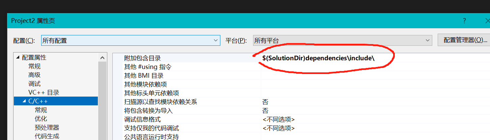
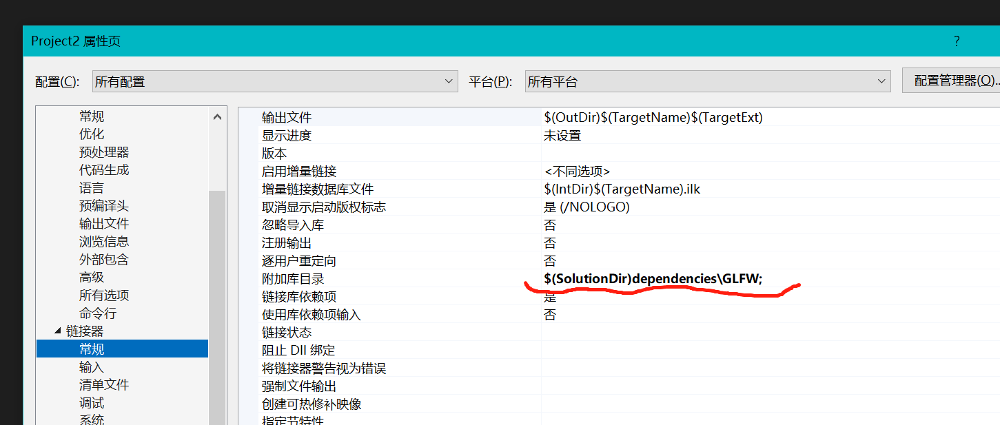
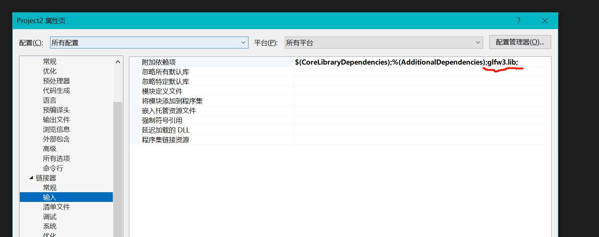
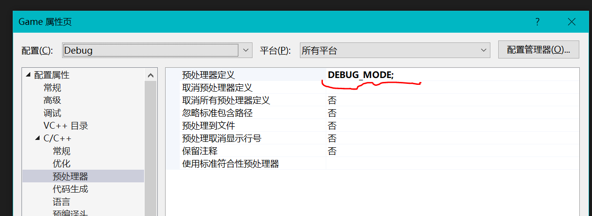

# C++学习手册

## C++与C的区别

C++是C Plus Plus”的简称，也常写作CPP，顾名思义，C++ 是在C语言的基础上增加新特性。

从语法上看，C语言是 C++ 的一部分，C语言代码几乎不用修改就能够以 C++ 的方式编译。

从语言类型的角度来说，C++ 支持面向过程编程、面向对象编程和泛型编程，而C语言仅支持面向过程编程。

C++在C语言的基础上扩展了**类（Class）**和**对象（Object）**这两个概念。

在C语言中，动态分配内存用 malloc() 函数，释放内存用 free() 函数。如下所示：

```c
int* p = (int*) malloc( sizeof(int) * 10 );  //分配10个int型的内存空间
free(p);  //释放内存
```

在C++中，这两个函数仍然可以使用，但是C++又新增了两个关键字，new 和 delete：new 用来动态分配内存，delete 用来释放内存。

用 new 和 delete 分配内存更加简单：

```c++
int* p = new int;  //分配1个int型的内存空间
delete p;  //释放内存

int* p = new int[10];  //分配10个int型的内存空间
delete[] p;
```

new 操作符会根据后面的数据类型来推断所需空间的大小。

**和 malloc() 一样，new 也是在堆区分配内存，必须手动释放，否则只能等到程序运行结束由操作系统回收。为了避免内存泄露，通常 new 和 delete、new[] 和 delete[] 操作符应该成对出现，并且不要和C语言中 malloc()、free() 一起混用。**


## 指针

指针是 C 语言最重要的概念之一，也是最难理解的概念之一。

指针是什么？首先，它是一个值，这个值代表一个内存地址，因此指针相当于指向某个内存地址的路标。C语言用变量来存储数据，用函数来定义一段可以重复使用的代码，它们最终都要放到内存中才能供 CPU 使用。

CPU 访问内存时需要的是地址，而不是变量名和函数名！变量名和函数名只是地址的一种助记符，当源文件被编译和链接成可执行程序后，它们都会被替换成地址。编译和链接过程的一项重要任务就是找到这些名称所对应的地址。

### 指针变量定义

数据在内存中的地址也称为**指针**，如果一个变量存储了一份数据的指针，我们就称它为**指针变量**。

在C语言中，允许用一个变量来存放指针，这种变量称为指针变量。指针变量的值就是某份数据的地址，这样的一份数据可以是数组、字符串、函数，也可以是另外的一个普通变量或指针变量。

*定义方法：*

```c
datatype *name;
datatype *name = value;
int* p1;  //定义方法一
int * p2;  //定义方法二
int *p3;  //定义方法三

```

星号`*`可以放在变量名与类型关键字之间的任何地方，该变量为指针变量。其类型表示该指针变量的数据类型，用来存储相对应的类型变量的内存地址。

为了代码清晰明了，我们常常使用定义方法一，它能更好的与普通变量区分。当然其实这个并没有绝对的标准。比如在一次性批量定义多个变量时，会采用第三种定义方法：

```c
int x, y, *px = &x, *py = &y;
```

指针变量可以被通过普通变量赋值，表示该指针变量内存地址指向普通变量。 

```c
int a = 100;
int* p_a = &a;
```

在普通变量名前上取地址符``&`` ，表示该变量的内存地址。和普通变量一样，指针变量也可以被多次写入，只要你想，随时都能够改变指针变量的值。

```c
//定义普通变量
float a = 99.5, b = 10.6;
char c = '@', d = '#';
//定义指针变量
float* p1 = &a;
char* p2 = &c;
//修改指针变量的值
p1 = &b;
p2 = &d;
```

值得注意的是，定义 指针变量时必须带`*`，后续给指针变量赋值时不能带`*`，因为后续能自动识别该变量为指针变量。

### 指针变量读取变量数据、修改变量数据

指针变量存储了数据的地址，通过指针变量也能够获得该地址上的数据。

```c
int a = 15;
int *p = &a;
if (*p == a) {
	printf("%d\n", *p);   // 15
}
```

通过在非定义的时候，在指针变量前加上``*``，表示取出该指针变量的值。这样取出来的值与原变量等价。

CPU 读写数据必须要知道数据在内存中的地址，普通变量和指针变量都是地址的助记符，虽然通过 *p 和 a 获取到的数据一样，但它们的运行过程稍有不同：a 只需要一次运算就能够取得数据，而 *p 要经过两次运算，多了一层“间接”。所以通过指针变量来取变量，性能不如直接使用原变量。


除了读取之外，指针变量还可以修改原变量数据：

```c
int a = 15, b = 99, c = 222;
int *p = &a;  //定义指针变量
*p = b;  //通过指针变量修改内存上的数据  等价于 a=99
c = *p;  //通过指针变量获取内存上的数据  等价于 c=a
printf("%d, %d, %d, %d\n", a, b, c, *p);  //99, 99, 99, 99
```


### 指针变量的运算

指针本质上就是一个无符号整数，代表了内存地址。它可以进行运算，但是规则并不是整数运算的规则。

指针变量的加法，并不是传统的在内存地址进行相应的加法，而是依旧指针变量的类型的字节单位来做加法的。

```c
short* j;
j = (short*)0x1234;
j = j + 1; // 0x1236
```

这里的指针j +1并不是 0x1235，那是因为short类型占据两个字节的宽度。所以相当于向高位移动两个字节，所以同样的，`j - 1`得到的结果是`0x1232`。

**指针只能与整数值进行加减运算，两个指针进行加法是非法的。**

### 关于 * 和 & 混用

一些题目中，总出这种脑残的题目，比如：`*&a`和`&*pa`分别是什么意思呢？

其中`*&a`，表示`*(&a)`，相当于普通变量取内存地址然后再从地址中取回普通变量的数据，绕来绕去，相当于回到了原点。

`&*pa`相当于`&(*pa)`

### 多级指针变量

如果一个指针指向的是另外一个指针，我们就称它为二级指针，或者指向指针的指针。


```c
int a =100;
int* p1 = &a;
int** p2 = &p1;
```

创建多级指针变量只需要添加多个``*``就可以。

其实实际开发中会经常使用一级指针和二级指针，但几乎用不到更高级的指针。

对于多级指针变量的读取，只需要在其前加上对应数量的`*`即可。


### 指针函数

C语言允许函数的返回值是一个指针（地址），我们将这样的函数称为指针函数。下面的例子定义了一个函数 strlong()，用来返回两个字符串中较长的一个：

```c
#include <stdio.h>
#include <string.h>

char* strlong(char* str1, char* str2){
    if(strlen(str1) >= strlen(str2)){
        return str1;
    }else{
        return str2;
    }
}
int main(){
    char str1[30], str2[30], *str;
    gets(str1);
    gets(str2);
    str = strlong(str1, str2);
    printf("Longer string: %s\n", str);
    return 0;
}
```

指针函数其效果也和普通的函数一样。用指针作为函数返回值时需要注意的一点是，函数运行结束后会销毁在它内部定义的所有局部数据，包括局部变量、局部数组和形式参数，函数返回的指针请尽量不要指向这些数据。

```c
int *func(){
    int n = 100;
    return &n;
}

int main(){
    int *p = func(), n;
    printf("c.biancheng.net\n");
    n = *p;
    printf("value = %d\n", n); // n将不会是100
    return 0;
}
```


### 函数指针

函数也能创建对应的指针，这种指针指向于函数，被称为函数指针。

函数指针它可以用来存储并调用特定类型函数的地址。函数指针的大小取决于所在的平台和编译器，通常它的大小与普通指针相同，即在32位系统上占用4个字节，在64位系统上占用8个字节。

函数指针在C++中有许多用途，它们可以提供一种动态选择和调用函数的机制，使代码更加灵活和可扩展。以下是函数指针常见的应用场景：

1. 回调函数：函数指针常用于实现回调机制，即将一个函数的地址传递给另一个函数，在特定事件发生时，调用这个函数来执行特定的任务。例如，在图形界面库中，可以通过函数指针注册一个回调函数，当用户点击按钮时，库会调用该函数来处理按钮点击事件。
2. 排序函数：函数指针可用于实现通用的排序算法，允许在运行时根据不同的比较条件来排序数据。
3. 函数选择：在某些情况下，需要根据运行时条件选择不同的函数执行。函数指针允许在运行时动态地选择要执行的函数，从而避免大量的if-else语句或switch语句。
4. 插件架构：函数指针常用于实现插件架构，允许动态加载和调用插件中的函数。
5. 多态：通过函数指针和虚函数，可以实现C++中的多态性，允许在运行时调用派生类的特定函数。
6. 状态机：函数指针可以用于实现状态机模式，根据当前状态调用不同的函数来处理特定的操作。

> 虽然函数指针在某些情况下很有用，但在现代C++中，更常见的做法是使用std::function和lambda表达式，这些功能提供了更高级、类型安全和灵活的函数封装方式。它们能够处理更复杂的场景，同时提供更好的代码可读性和维护性。

下面是一个简单的函数指针的例子：

```c
void print(int a) {
  printf("%d\n", a);
}

void (*print_ptr1)(int) = &print;  // 或者 void (*print_ptr)(int) = print;
auto print_ptr2 = print;  //auto print_ptr2 = &print; 

(*print_ptr1)(10);  // 或者print_ptr(10) ,效果等同与执行print(10);
print_ptr2(10);
```

上面示例中，变量`print_ptr1`和`print_ptr2`是函数指针，它指向函数`print()`的地址。函数`print()`的地址可以用`&print`获得(这里也可以不使用&)。注意，`(*print_ptr)`一定要写在圆括号里面，否则函数参数`(int)`的优先级高于`*`，整个式子就会变成`void* print_ptr(int)`。


函数指针的创建:

> 返回参数类型 (*函数指针名)(函数参数,...);  --创建一个空函数指针。
>
> 返回参数类型 (*函数指针名)(函数参数,...) = 函数();   --拷贝创建已知函数 的 函数指针。

**为了简单创建使用函数指针，推荐直接使用auto 创建。**

除了auto之外，还可以使用typedef来定义一种类型来简化编写：

```c++
typedef void (*print_ptr)(int);
print_ptr function = print;
function(10);
```


除此之外，函数指针也可以被用做函数的参数。

```c
void printInt(int a)
{
	std::cout << a << std::endl;
}

void forEachCallFunc(const std::vector<int>& values, void(*func)(int))
{
	for (const int& value : values)
	{
		func(value);
	}
}

int main()
{
    std::vector<int> values = { 1,3,5,7,2,1,8 };
	forEachCallFunc(values,printInt);
	std::cin.get();
}
```

上述forEachCallFunc函数接受两个参数，其中一个参数为函数指针。在调用函数时，传入满足条件函数即可实现动态调用。上面的例子实现下来 就类似于 Python中的map函数一样，对容器中的每个对象执行了特定的函数。


### 使用new来创建对象

C++中使用new来创建对象,意为在程序中分配一部分内存来存储。

C++中使用new创建对象或者数组，利用指针来进行控制。

```c++
int* pt = new int;
XXX* ps  = new XXX;
int* psome = new int[10];
```

使用new创建的对象将存储在堆内存中，相较于直接声明变量，like`int s = 1;`这种存储在栈内存中的对象，更方便管理。

使用new创建的对象能够方便管理，动态分配内存。

### 使用delete释放对象内存

当需要内存时，可以使用new来请求。当new创建的对象无用之后务必记住 使用delete来进行释放内存。

```c++
int* pt = new int;
...
delete pt;
```

当时请不要尝试去释放那些声明变量来的内存:

```c++
int i = 1;
int * pt = &i;
...
delete pt;  // 错误操作
```

对于new创建的数组，同样需要使用`delete[]`来释放，因为方括号告诉程序，应该释放整个数组，而不仅仅是指针指向的元素：

```c++
int* psome = new int[10];
delete[] psome;
```

总而言之,使用new 和delete时,应该遵循以下规则:

- 不要使用delete来释放不是new分配的内存。
- 不要使用delete释放同一个内存块两次。
- 如果使用new[]为数值分配内存，应该也应该使用delete[]来释放。
- 如果使用new为一个实体分配内存，则应该使用delete（没有方括号）来释放。
- 对空指针应用delete是安全的。


### 使用指针作为字符串

或许经常在一些类定义中看见使用指针作为char字符串属性：

```c++
class Student{
public:
    char* name;
    ...
};
```

使用指针作为字符串的属性有一些好处：

1. 动态内存分配：使用指针允许我们在运行时动态地为字符串分配内存，而不需要在编译时指定固定大小。这样可以避免固定大小字符串的限制，使字符串的长度可以根据实际需要进行调整。
2. 省内存：如果`name`属性不是指针，而是一个固定大小的字符数组（例如`char name[50];`），那么每个`Student`对象都会占用相同大小的内存，不管实际存储的字符串长度是多少。而使用指针可以根据字符串的实际长度来动态分配内存，从而节省内存空间。
3. 灵活性：指针允许我们轻松地对字符串进行操作，例如拷贝、连接、截取等。这样我们可以更方便地处理字符串的操作和逻辑。

**然而，需要注意的是，使用指针也会增加一些额外的责任**，如：

1. 内存管理：由于使用了动态内存分配，需要负责在合适的时候释放内存，以避免内存泄漏。
2. 空指针检查：需要确保指针指向有效的内存地址，否则在访问指针指向的数据时可能会导致程序崩溃。

**为了避免上述问题，通常在C++中可以使用`std::string`类代替指针来表示字符串属性，它是C++标准库中提供的字符串类，可以自动管理内存，更加安全和方便。例如：`std::string name;`。**


### 使用指针创建类对象

```c++
Student* pStu = new Student;
```

这句C++语句`Student* pStu = new Student;`创建了一个`Student`指针，并通过动态内存分配使用`new`关键字为该指针分配了一个`Student`对象的内存空间。

使用对象指针后，可以通过箭头`->`来访问对象的成员变量和成员函数。

```c++
pStu -> name = "小明";
pStu -> age = 15;
pStu -> score = 92.5f;
pStu -> say();
```

对象指针时候完后，记得需要手动执行delete，删除掉，已腾空内存。

```c++
delete pStu;  //删除对象
```


其中使用指针创建对象的主要好处是动态内存分配，以及对象的生存期控制：

1. 动态内存分配：通过使用指针和`new`操作符，对象的内存空间是在运行时动态分配的，而不是在编译时固定分配。这允许我们在程序运行时根据需要创建和销毁对象，避免了固定大小数组或对象的限制。
2. 控制对象生存期：当我们使用指针创建对象时，对象的生存期不再由其定义的作用域限制。这样，我们可以在需要的时候手动控制对象的释放，而不是仅限于定义的作用域内。例如，在需要时我们可以使用`delete`操作符来释放对象的内存，这样可以防止内存泄漏。
3. 对象共享：通过创建指针，可以实现多个指针指向同一个对象，从而实现对象的共享和数据的共享。这在某些情况下可以提高程序的效率和灵活性。

然而，需要注意的是，使用动态内存分配和指针也带来了一些额外的责任，例如：

1. 内存泄漏：需要在适当的时候手动释放通过`new`分配的内存，否则会导致内存泄漏，造成程序运行时内存消耗不断增加。
2. 空指针和野指针：需要避免使用未初始化的指针，以及在对象释放后继续使用指针（野指针）。

相比之下，使用栈上的对象（例如`Student stu;`）可以简化代码，并且不需要手动管理内存。这些对象的生存期由其定义的作用域自动管理，当超出作用域时会自动调用析构函数进行清理。这样可以减少程序出错的可能性，但是在某些情况下，需要动态创建对象或共享对象时，使用指针会更合适。综合考虑情况，我们需要根据具体的需求来选择适当的对象创建方式。

### 数组类型指针取值和赋值

前面简绍了关于指针的赋值和取值，我们通常在赋值上使用`*`调取值。
```c++
int value = 42;
int* ptr = &value; 
std::cout << "Value: " << *ptr << std::endl;
```

但其实对于数组类型的指针我们不需要使用`*`来调取值。

```c++
const char* names[] = { "Alice", "Bob", "Charlie", "David" }; // 字符串数组

// 打印字符串数组的各个字符串
for (int i = 0; i < 4; ++i) {
        std::cout << names[i] << std::endl; // 通过指针变量names访问字符串数组中的各个字符串
}

int* pIntArray = new int[5]; // 动态分配5个整数的内存空间，并将起始地址赋值给指针变量pIntArray
for (int i = 0; i < 5; ++i) {
    pIntArray[i] = i; // 通过指针变量pIntArray访问数组元素，并将值赋值给数组元素
}
```

1. 对于普通数组类型的指针（例如`int*`、`char*`等）：数组名本身就是一个指向数组首元素的指针，因此可以直接通过索引的方式访问数组元素，无需使用解引用操作符。这在前面提到的例子中已经展示过。
2. 对于指向动态分配的数组的指针（例如`int* pIntArray = new int[5];`）：在这种情况下，指针变量`pIntArray`是指向动态分配的数组的指针，仍然可以通过索引的方式访问数组元素，同样不需要使用解引用操作符。


### 智能指针

在传统C++语言中，创建一个实体，分为栈内存创建和堆内存创建以及常量创建。

其中常常使用new方法创建实体指针方式 在堆内存创建，堆内存创建的实体需要后续手动清理。

为了方便，C++提出了智能指针这个概念，它能实现了创建、自动清理功能。

智能指针在C++11中主要是 unique_ptr唯一指针、shared_ptr共享指针、weak_ptr弱指针。而在C++98中引入的auto_ptr已经被废弃，所以就不做赘述了。

> C++ 智能指针底层是采用**引用计数**的方式实现的。简单的理解，智能指针在申请堆内存空间的同时，会为其配备一个整形值（初始值为 1），每当有新对象使用此堆内存时，该整形值 +1；反之，每当使用此堆内存的对象被释放时，该整形值减 1。当堆空间对应的整形值为 0 时，即表明不再有对象使用它，该堆空间就会被释放掉。


#### 唯一指针(unique_ptr)

```c++
#include <memory>
...
std::unique_ptr<int> p1();  //不传入任何实参
std::unique_ptr<int> p2(nullptr);  //传入空指针 nullptr
std::unique_ptr<int> p3(new int);  //使用new创建
std::unique_ptr<int>  p4 = std::make_unique<int>();  //使用 std::make_unique<T> 模板函数创建
```

唯一指针作为智能指针的一种，unique_ptr 指针自然也具备“在适当时机自动释放堆内存空间”的能力。和 shared_ptr 指针最大的不同之处在于，unique_ptr 指针指向的堆内存无法同其它 unique_ptr 共享，也就是说，每个 unique_ptr 指针都独自拥有对其所指堆内存空间的所有权，无法将其再赋值给另外一个指针。

```c++
std::unique_ptr<XXX> p0;
std::unique_ptr<XXX> p1(new XXX());
p0 = p1 //编译错误，unique_ptr不能共享。
```

唯一指针的作用就是在作用域范围内存在，超过作用域范围，自动清理内存，相当于执行了delete操作。

```c++
int main(){
    {
        std::unique_ptr<XXX> sharedXXX(new XXX()); 
    }  //sharedXXX作用范围结束，sharedXXX指针被清理。
}
```


#### 共享指针(shared_ptr )

```c++
#include <memory>
...
std::shared_ptr<int> p1;             //不传入任何实参
std::shared_ptr<int> p2(nullptr);    //传入空指针 nullptr
std::shared_ptr<int> p3(new int(10));  //使用new创建
std::shared_ptr<int> p3 = std::make_shared<int>(10);  //使用 std::make_shared<T> 模板函数创建
```

和 unique_ptr不同之处在于，多个 shared_ptr 智能指针可以共同使用同一块堆内存。并且，由于该类型智能指针在实现上采用的是引用计数机制，即便有一个 shared_ptr 指针放弃了堆内存的“使用权”（引用计数减 1），也不会影响其他指向同一堆内存的 shared_ptr 指针（只有引用计数为 0 时，堆内存才会被自动释放）。

用通俗的话来讲就是，**共享指针允许有多个共享指针指向同一个指针，并且只有当所有同类共享指针都经过了作用域范围，指针才会失效。**

```c++
int main(){
    {
        std::shared_ptr<XXX> e0;
        {
            std::shared_ptr<XXX> sharedXXX = std::make_shared<XXX>(); // 等同于std::shared_ptr<XXX> sharedXXX(new XXX())
		   e0 = sharedXXX;
        }  //此时由于e0作用范围没有结束，所以sharedXXX指针依然存在。
    }  //e0作用范围结束，所以sharedXXX指针被即使清理，e0也被智能指针清理。
}
```


#### 弱指针(weak_ptr)

```c++
#include <memory>
...
std::weak_ptr<int> p1;             //不传入任何实参
std::weak_ptr<int> p2(nullptr);    //传入空指针 nullptr
std::weak_ptr<int> p3(new int(10));  //使用new创建
```

weak_ptr 指针更常用于指向某一 shared_ptr 指针拥有的堆内存，因为在构建weak_ptr 指针对象时，可以利用已有的 shared_ptr 指针为其初始化。例如：

```c++
std::shared_ptr<int> sp (new int);
std::weak_ptr<int> wp3 (sp);
```

弱指针的作用就是为共享指针做无引用计数的指针。

共享指针之间将会被一一关联，只有当程序中的每一个同类共享指针 都超出作用域范围时，指针才会被统一清理。而弱指针由于无引用计数，可以关联共享指针，并且不会被关联，主共享指针一旦超出作用域范围，即会被清理，不需要理会弱指针。

```c++
#include <memory>

int main(){
    {
        std::weak_ptr<XXX> e0;
        {
            std::shared_ptr<XXX> sharedXXX = std::make_shared<XXX>(); // 等同于std::shared_ptr<XXX> sharedXXX(new XXX())
		   e0 = sharedXXX;
        }  //sharedXXX被清理,e0指向一个无效实体.
    }
}
```


## 函数

C++的函数和其他语言基本一致，这里就不多赘述了。

### 入口函数

C 语言规定，`main()`是程序的入口函数，即所有的程序一定要包含一个`main()`函数。程序总是从这个函数开始执行，如果没有该函数，程序就无法启动。其他函数都是通过它引入程序的。

```c
int main(void) {
  printf("Hello World\n");
  return 0;
}
```

和其他函数的void返回不一样，C的入口函数返回的是一个int类型，一般最后的`return 0;`表示函数结束运行，返回`0`。

正常情况下，如果`main()`里面省略`return 0`这一行，编译也不会报错，因为编译器会自动加上，即`main()`的默认返回值为0。但这种情况仅限于再入口函数上。

C语言的函数定义需要在入口函数的前面，否则入口函数调用不到。


### 函数参数

C语言的函数参数与其它语言的函数不同，它只能作用、影响在函数内部，不能对参数变量在外部进行影响。

```c
void increment(int a) {
  a++;
}

int i = 10;
increment(i);

printf("%d\n", i); // 10
```

上面示例中，调用`increment(i)`以后，变量`i`本身不会发生变化，还是等于`10`。因为传入函数的是`i`的拷贝，而不是`i`本身，拷贝的变化，影响不到原始变量。这就叫做“传值引用”。要实现参数变化，最好把它作为返回值传出来。

```c
void Swap(int x, int y) {
  int temp;
  temp = x;
  x = y;
  y = temp;
}

int a = 1;
int b = 2;
Swap(a, b);// 无效
```

上面的写法不会产生交换变量值的效果，因为传入的变量是原始变量`a`和`b`的拷贝，不管函数内部怎么操作，都影响不了原始变量。

如果想要传入变量本身，只有一个办法，就是传入变量的地址。通过将俩个变量指针进行互换 ,来实现将其变量值互换。

```c
void Swap(int* x, int* y) {
  int temp;
  temp = *x;
  *x = *y;
  *y = temp;
}

int a = 1;
int b = 2;
Swap(&a, &b);
```

 当然，这种写法十分麻烦，我们通常使用引用


### 引用外部文件的函数 - extern

对于多文件的项目，源码文件会用到其他文件声明的函数。这时，当前文件里面，需要给出外部函数的原型，并用`extern`说明该函数的定义来自其他文件。

```c
// int foo(int arg1, char arg2);
extern int foo(int arg1, char arg2);  // 来自与项目的其他文件中定义的foo函数。

int main(void) {
  int a = foo(2, 3);
  // ...
  return 0;
}
```

当然函数原型默认就是`extern`，所以这里不加`extern`，效果是一样的。


### 静态说明符 - static

`static`用于函数内部声明变量时，表示该变量只需要初始化一次，不需要在每次调用时都进行初始化。也就是说，它的值在两次调用之间保持不变。

```c
void counter(void) {
  static int count = 1;  // 只初始化一次
  printf("%d\n", count);
  count++;
}
int main(void) {
  counter();  // 1
  counter();  // 2
  counter();  // 3
  counter();  // 4
}
```

注意，`static`修饰的变量初始化时，只能赋值为常量，不能赋值为变量。

```c
int i = 3;
static int j = i; // 错误
```

static 也可用与修饰函数本身。表示该函数只能在该文件中使用，无法在其他文件中调用，即使外部文件使用extern修饰符。

```c
static void Log(){
    ...
}
```

### 常量修饰符 - const

使用const修饰符修饰的函数参数，为常量参数。表示函数内部不能修改该参数。

```c
void Log(const int* a){
    *a++; //操作错误 
}
```

但是上面这种写法，只限制修改a所指向的值，而`a`本身的地址是可以修改的。

```c
void Log(const int* a){
    int x = 13;
    a = &x; //操作成功 
}
```

当需要将其限制修改内存地址，需要把`const`与参数类型 位置互调。但这样则可以修改值。

```c
void Log(int* const a){
    int x = 13;
    a = &x; //操作错误 
}
```
如果都想限制修改的话，则需要在参数类型前后都加上`const`修饰符。
```c
void f(const int* const p) {
  // ...
}
```
**关于const 在数据类型位置，总结一句话，在前则限制 指针参数指向的值，在后 则限制本身地址。前值后址。 前后都有则全限制**

`int const*`和`const int*`是相同的。 当指针标记的符号`*`在const上时，相当于const与数据类型位置反过来。


const还有一种用法就是在类中定义方法上使用：

```c++
class XXX{
private:
    int m_X, m_Y;
public:
    int getX() const{
        m_X=2; //const原因，所以这里会报错
        return m_X;
    }
    int getY() {
        return m_Y;
    }
}
```

在类方法中const置于函数的参数括号后。意为该方法只读，不支持修改类中的参数。所以这里的`m_X=2` 编译会报错。

**如果该方法不需要修改类的参数，你应该总是把它标记为const。**

为什么需要这么做？

当一个函数中参数是 该类的const引用，即表示 该引用不能被修改，如：

```c++
getXXXin_m_X(const XXX& e)
```

那么这引用只能调用 不修改其中内容的方法，如一些Getter之内。但编译器要识别调用的方法是否是不含修改的操作，就需要查看该方法上是否含有const修饰符。否则调用就会报错：

```c++
getXXXin_m_X(const XXX& e){
    std::cout << e.getY() << std::endl;  //由于XX类中getY()函数定义上并没有const修饰符，编译器不能确保该函数是否会对类进行修改，所以这里会报错。
    std::cout << e.getX() << std::endl;  //带有const的类方法，成功执行。
}
```

所以这就是为什么你应该总是把不需要做修改类方法标记为const。

**注意：在同类中，可以存在同名的非const修饰符的方法和使用const修饰符的方法**：

```c++
int getX() {
        return m_X;
}
int getX() const{
        return m_X;
}
```


### 常量表达式修饰符 - constexpr

`constexpr` 是 C++11 引入的一个关键字，用于指定某个值是**在编译时常量**，或者某个函数/方法在给定常量参数时能够在编译时计算其结果。

`constexpr` 的作用：

- 编译时计算：***`constexpr` 允许表达式在编译时被计算，而不是运行时。***
- 性能优化：由于 `constexpr` 保证了某些计算在编译时完成，这可以避免运行时的开销。
- 模板元编程和静态断言：`constexpr` 可以与模板元编程和静态断言一起使用，以在编译时进行更复杂的计算和验证。

使用`constexpr` 后该函数 or 对象的值将会在编译时进行计算，利用这一个特点，`constexpr` 常常用来优化size返回、size设定：

```c++
constexpr size_t size(size_t originSize){
    return originSize + 1;
}
...
size_t s = 5;
constexpr size_t k = 3;

int array[s]  // 编译报错
int array[k];  // 编译正常
int array[size(s)];  //编译正常
```


### 可变函数

C语言允许用户传入未定义的函数，只需要在函数参数中设置`...`，表示函数接受可变数量的参数。
```c
int printf(const char* format, ...);
```
注意，...符号必须放在参数序列的结尾，否则会报错。这点和Python一样。
头文件stdarg.h定义了一些宏，可以操作可变参数。

- va_list：一个数据类型，用来定义一个可变参数对象。它必须在操作可变参数时，首先使用。

- va_start：一个函数，用来初始化可变参数对象。它接受两个参数，第一个参数是可变参数对象，第二个参数是原始函数里面，可变参数之前的那个参数，用来为可变参数定位。

- va_arg：一个函数，用来取出当前那个可变参数，每次调用后，内部指针就会指向下一个可变参数。它接受两个参数，第一个是可变参数对象，第二个是当前可变参数的类型。

- va_end：一个函数，用来清理可变参数对象。


下面是一个例子。

```c
double average(int i, ...) {
  double total = 0;
  va_list ap;
  va_start(ap, i);
  for (int j = 1; j <= i; ++j) {
    total += va_arg(ap, double);
  }
  va_end(ap);
  return total / i;
}
```

上面示例中，`va_list ap`定义`ap`为可变参数对象，`va_start(ap, i)`将参数`i`后面的参数统一放入`ap`，`va_arg(ap, double)`用来从`ap`依次取出一个参数，并且指定该参数为 double 类型，`va_end(ap)`用来清理可变参数对象。


### Lambda函数

C++11 引入了 Lambda 表达式，它是一种匿名函数，允许你在需要函数对象的地方创建一个临时的函数对象。Lambda 表达式在 C++ 中的主要作用是简化代码、提高可读性，并且可以捕获外部作用域的变量。

Lambda 表达式的一般形式如下：

```c++
[ captures ] ( parameters ) -> return_type {
    // Lambda 函数体
}

```

其中：

- `captures` 是可选的捕获列表，用于捕获外部作用域中的变量。可以通过值传递或引用传递捕获变量，并在 Lambda 函数体中使用这些变量。
- `parameters` 是可选的参数列表，类似于普通函数的参数。可以没有参数，也可以有多个参数。
- `return_type` 是可选的返回类型，可以自动推导，也可以显式指定。

**和其他语言不一样的是，C++中的Lambda函数内部是获取不到外部的数据的，要想获取外部的数据，所以 设计上多了一个所谓的捕获列表，用于指定 Lambda 表达式在创建时要捕获的外部作用域中的变量。**

举个简单例子：

```c++
int main() {
    int x = 10;
    int y = 20;

    // Lambda 表达式捕获 x 和 y
    auto lambda = [x, &y]() {
        std::cout << "Captured x: " << x << std::endl;
        std::cout << "Captured y (by reference): " << y << std::endl;
    };
    
    x = 100;
    y = 200;
    // 调用 Lambda 表达式
    lambda();
    return 0;
}
```

上面的lambda函数是一个Lambda表达式创建的，其中[ ]包含的捕获列表提前获取了x实际对象、y引用对象，然后在函数内部中进行了对应的处理，这样就不需要额外的设置两个函数参数去使用时获取。

### function

`std::function` 是一个通用的函数封装类模板，定义在 `<functional>` 头文件中。

它允许你以一种类型安全的方式存储、复制、调用可调用对象（函数、函数指针、Lambda 表达式、成员函数等），并可以用于实现回调机制、通用的接口设计等场景。它在 C++ 11中能够更好地替代函数指针，并且提供更多的灵活性和类型安全性。它使得在函数封装和函数对象传递等场景中变得更加方便和易于维护。

`std::function` 的定义语法如下：

```cpp
std::function<return_type(parameters)> func;
```

其中，`return_type` 是函数的返回类型，`parameters` 是函数的参数列表。

#### 优点

`std::function` 的优点和使用场景：

1. 类型安全：`std::function` 提供了类型安全的函数封装，避免了在使用函数指针时可能出现的类型不匹配的问题。它可以自动进行类型检查，确保在运行时调用时传递正确的参数。
2. 通用性：`std::function` 可以封装各种可调用对象，包括普通函数、函数指针、Lambda 表达式、成员函数等。这使得它在实现通用的接口设计或函数回调机制时非常灵活。
3. 可替代性：`std::function` 可以完全取代函数指针，而且更强大。函数指针只能指向特定的函数签名，而 `std::function` 可以在运行时保存任意可调用对象，并在需要时进行调用。

示例：

```c++
#include <iostream>
#include <functional>
int add(int a, int b) {
    return a + b;
}
int main() {
    // 使用 std::function 封装普通函数
    std::function<int(int, int)> func = add;
    // 使用 Lambda 表达式
    std::function<int(int, int)> lambdaFunc = [](int x, int y) {
        return x * y;
    };
    // 调用封装的函数
    int result1 = func(2, 3);
    int result2 = lambdaFunc(4, 5);
    std::cout << "Result 1: " << result1 << std::endl;
    std::cout << "Result 2: " << result2 << std::endl;
    return 0;
}
```


### C++中的计时

在 C++ 中，你可能想要测量代码的执行时间，无论是为了性能分析，还是为了其他目的。C++ 提供了几种方法来进行计时：

**C++11 的 `<chrono>` 库**: 这是最现代和推荐的方法来在 C++ 中进行计时。

```c++
#include <iostream>
#include <chrono>

int main() {
    auto start = std::chrono::high_resolution_clock::now();
	...
    auto end = std::chrono::high_resolution_clock::now();
    // 得到代码运行时间
    std::chrono::duration<double> duration = end - start;
	//  duration下的count方法可以返回 秒。
    std::cout << "Elapsed time: " << duration.count() << " seconds" << std::endl;
}
```

`<chrono>` 库提供了多种时间单位，如 `std::chrono::milliseconds`、`std::chrono::microseconds` 等，这使得时间测量更加灵活。


**C 的 `clock()` 函数**: 这是一个传统的方法，使用 C 语言的 `clock()` 函数来测量 CPU 时间。

```c
#include <iostream>
#include <ctime>

int main() {
    clock_t start = clock();
    ...
    clock_t end = clock();
    double duration = static_cast<double>(end - start) / CLOCKS_PER_SEC;

    std::cout << "Elapsed time: " << duration << " seconds" << std::endl;
}
```

注意：`clock()` 函数测量的是 CPU 时间，而不是实际的墙钟时间。这意味着它测量的是程序在 CPU 上执行的时间，而不是程序从开始到结束的实际时间。

在大多数情况下，使用 C++11 的 `<chrono>` 库是最好的选择，因为它是标准的、跨平台的，并提供了高精度的计时功能。


我们可以将其计时操作封装为一个struct ，利用栈内存清理原理 和 析构函数，来方便调用计时操作。

```cpp
struct Timer
{
    std::chrono::timer_point<std::chrono::steady_clock> start, end;
    std::chrono::duration<float> duration;
    Timer()
    {
        std::cout << "代码计时开始! " << std::endl;
        start = std::chrono::high_resolution_clock::now();
    }
    ~Timer()
    {
        end = std::chrono::high_resolution_clock::now();
        duration =  end - start;
        std::cout << "代码计时结束! " << std::endl;
        std::cout << "代码运行花费时间: " << duration.count() * 1000.0f << "毫秒" << std::endl;
    }
}

int main()
{
    {
        Timer timer;
        ...
    }
}
```


## 类型

### 类型转换

在 C++ 中，有几种不同类型的类型转换方式，用于在不同数据类型之间进行转换。以下是常见的 C++ 类型转换方式：

1. **隐式类型转换（Implicit Type Conversion）**：也称为自动类型转换，是由编译器自动完成的类型转换。例如，将整数赋值给浮点数变量，或将一个字符赋值给整数类型变量等。这种类型转换通常用于保证数据不丢失或提高表达式的精度。

```c++
std::string s1 = "I'm actually char type"; // 右值实际上是char数组，隐式转换为string类型。
```


2. **显式类型转换（Explicit Type Conversion）**：也称为强制类型转换，是通过使用 C++ 中的类型转换运算符来实现的。有三种形式的显式类型转换：

   - `static_cast`：静态转换，用于基本数据类型之间的转换，以及一些类层次间的向上转型和向下转型。
   - `dynamic_cast`：动态转换，用于在继承关系中进行安全的向下转型，需要有虚函数的参与，用于运行时类型检查。
   - `const_cast`：用于添加或去除 `const` 修饰符，从而改变指针或引用的常量性。
   - `reinterpret_cast`：用于不同类型之间的二进制位模式的转换，通常用于低级操作和平台特定的需求。


### 类型双关

所谓类型双关，即 使用特殊编程手段，绕过类型系统，将其语言中的类型进行强转。 

下面是 C++绕过类型系统实现类型双关 的例子：

```c++
int a = 50;  //a在内存中为 32 00 00 00（int 4字节）值为50；
double b = a; //普通赋值并不会直接转换，而是经过隐式转换，b实际在内存中为00 00 00 00 00 00 49 40（double 8字节）值为50.000000000；
double c = *(double*)&a  //通过将其对象地址 强制类型转换为 相应指针，再解引用，从而转换为对应值。c在内存中为32 00 00 00 cc cc cc cc值为-925e+61；
```

普通的类型转换 将经过类型系统进行相应的数据转换操作，内存数据 将被篡改为 符合转换类型的数据。 （上方例子中 a 到b 内存则是由32 00 00 00到了00 00 00 00 00 00 49 40 ）

C++中实现类型双关操作 ：**取址 强转为 指针 再解引用**，这种方法原数据内存将不被改变。（上方例子中 a 到c 内存则是由32 00 00 00到了32 00 00 00 cc cc cc cc）【c在内存中表示不存在的占位】。

*总结：*

*类型系统的 转换，保证了值的不变（大概部分），但自然内存将被改变。*

*通过指针转换 绕过类型系统 ，保证了内存不变，但自然值将被改变。*


### Union - 成员共享内存的struct

`union` 是一种C++中特殊的数据结构，允许在**相同的内存位置**存储不同的数据类型。

与结构体（`struct`）不同，`union` 中的所有成员共享同一块内存，因此 **`union` 的大小等于其中最大成员的大小**。当某个成员被赋值后，其他成员的值将变得无效。

正是这个原因，`union` 主要用于需要在不同的数据类型之间节省内存空间的情况，同时也需要注意使用时的潜在问题。

以下是一个简单的 `union` 示例：

```c++
#include <iostream>

union MyUnion {
    int i;
    double d;
    char c;
};
int main() {
    MyUnion u;

    u.i = 42;
    std::cout << "i: " << u.i << std::endl;

    u.d = 3.14;
    std::cout << "d: " << u.d << std::endl;

    u.c = 'A';
    std::cout << "c: " << u.c << std::endl;

    std::cout << "After changing member:" << std::endl;
    std::cout << "i: " << u.i << std::endl;
    std::cout << "d: " << u.d << std::endl;
    std::cout << "c: " << u.c << std::endl;

    return 0;
}
```

输出结果:

> i: 42
> d: 3.14
> c: U
> After changing member:
> i: 1374389589
> d: 3.14
> c: U

上面结果中，对Union对象u 单一赋值时，马上输出对应成员的值都能显示被正常赋值。但当最后统一输出打印发现，里面的值除了 最大的值 和 最后赋值（或者修改）的值 以外，其他成员的值都被篡改。

int、double、char中类型大小最大的是 double（8字节）所以最终都不会被篡改，char最后修改，所以也不会被篡改，最终唯独里面int类型成员被修改。

> 为什么union的最大类型 的值 始终不变呢？那上面的例子讲：
>
> 正常win32中，`int` 的大小为 4 字节，`double` 的大小为 8 字节，`char` 的大小为 1 字节。得知`double`大于`int`和`char`所以处于内存中高字节部分，而低字节部分的`int`和`char`怎么修改都不会到达 那部分，所以这就表名了Union中的最大类型成员始终不变。

所以使用 union 需要注意以下几点：

1. 在 `union` 中的不同成员可以拥有不同的数据类型，但只能同时使用一个成员。
2. 当一个成员被赋值后，其他成员的值或将变得无效（主要是非最大空间成员），因此需要小心使用。
3. 在使用 `union` 时，要确保你清楚每次访问时要使用哪个成员，以避免出现未定义行为。
4. `union` 的大小等于最大成员的大小，这可能会导致内存浪费。
5. C++11 引入了对 `union` 的新特性，允许在 `union` 中定义成员函数，使其更加灵活。

当Union包含匿名struct时，分配规则方法将不一样。

 下面是Union 包含匿名struct案例：

```c++
union MyUnion
{
	struct
	{
		int i;
		int z;
	};

	struct
	{
		int a;
		int b;
		int c;
	};
};

int main()
{
	MyUnion u;
	u.a = 4;
	u.b = 9;
	u.c = 10;

	u.i = 5;
	u.z = 7;

	std::cout << "a = " << u.a << std::endl;  \\ a = 5
	std::cout << "b = " << u.b << std::endl;  \\ b = 7
	std::cout << "c = " << u.c << std::endl;  \\ c = 10
    
	std::cout << "i = " << u.i << std::endl;  \\ i = 5
	std::cout << "z = " << u.z << std::endl;  \\ z = 7
	std::cin.get();
}
```

根据Union的特性，上方的MyUnion在内存中大小为12字节（成员多的匿名struct 最大）。

分配按照最大类型分配，所以按 成员多的匿名struct的布局分配。

其中（同为int）前4字节 i，a 共同争夺，中间4字节z，b共同争夺，而剩余4字节 稳定留给 c。最终c始终不变。


总结：

union大小由最大元素决定。当最大元素为匿名struct时，union的成员值将按照该匿名类中成员按顺序分配。最终剩余空间无争夺的成员将始终不变。


### 静态转换 - static_cast

在C语言中，类型转换存在 隐式转换和显式转换。

隐式转换顾名思义，就是在用户不进行任何操作下，编译器自动转换某个对象类型为另外一个对象，常见情况有 char数组转换为string等等。

而显式转换，则需要在编码中主动进行类型转换。C中常常在对象中以（cast type）存在。其意思为强制转换类型。

而在C++中，提出了`static_cast` 是一种类型转换运算符，用于在相关类型之间进行转换。它是编译时类型转换，这意味着转换的有效性在编译时进行检查，而不是在运行时。

```c++
double d = 3.14;
int i = static_cast<int>(d);  // 将double转换为int

class Base {};
class Derived : public Base {};

Derived* derived = new Derived();
Base* base = static_cast<Base*>(derived);  // 派生类指针转换为基类指针 下转上 子转父
Derived derivedObj;
Base& baseRef = static_cast<Base&>(derivedObj);  //同上原理, 引用转换

enum Color { RED, GREEN, BLUE };
int colorValue = static_cast<int>(GREEN);  // 将枚举转换为int
```

`static_cast` 是C++中最常用的类型转换工具之一。但是它并不具有判断可行性能力，只是一种强制转换。其本身效果和C中的强制类型转换一样。

当用它将类型 转换为不相关的类型时，如从 `void*` 到其他指针类型，或者当基类 转 派生类这种不符合条件的转换时，使用它会编译出现报错。这时就需要使用具有判断能力的`dynamic_cast`动态类型转换函数了。


### 动态转换 - dynamic_cast

`dynamic_cast` 是 C++ 中的另一种类型转换运算符，主要用于处理基类和派生类之间的转换，特别是在多态情境下。

与 `static_cast` 不同，`dynamic_cast` 是运行时类型转换，这意味着它在运行时检查转换的有效性。

```c++
class Base { virtual void foo() {} };  // 注意：至少需要一个虚函数
class Derived : public Base {};

Base* basePtr = new Derived();
Derived* derivedPtr = dynamic_cast<Derived*>(basePtr);  // 成功的转换

Base anotherBase;
Base* basePtr2 = &anotherBase;
Derived* derivedPtr2 = dynamic_cast<Derived*>(basePtr2);  // 返回 nullptr，因为basePtr2不指向Derived对象
```

使用dynamic_cast能够对类型转换进行判断，对于基类转派生类等不正常的转换，使用dynamic_cast会让其返回空指针，以阻止程序编译错误。

这里有个需要注意的细节：**对于使用dynamic_cast，需要对其基类相应的方法使用virtual以便称为虚函数**，dynamic_cast会对基类的虚函数进行判断，如果派生类拥有基类不拥有的方法的话，就会对其反回null prt以示阻止操作。

虽然`dynamic_cast` 能应付很多类型转换场景，但是由于 `dynamic_cast` 在运行时进行类型检查，它比其他类型的转换（如 `static_cast`）有更大的性能开销。因此，应该谨慎使用它，并只在确实需要运行时类型检查的情况下使用。常规情况下的类型转换还是尽量使用静态转换 - static_cast。


## 引用

### 使用方法

引用时C++的一种比指针更加便捷的传递聚合类型数据的方式。引用可以看做是数据的一个别名，通过这个别名和原来的名字都能够找到这份数据。引用类似于 Windows 中的快捷方式，一个可执行程序可以有多个快捷方式，通过这些快捷方式和可执行程序本身都能够运行程序。

引用和指针不一样，其引用不占有内存地址，只是在IDE中出现，不会出现在编译后中。

引用的定义方式类似于指针，只是用`&`取代了`*`，语法格式为：

```c++
int a = 15
int& name = a;
std::cout << std::to_string(name)  // 15
```

引用必须在定义的同时初始化，并且以后也要从一而终，不能再引用其它数据，这有点类似于常量（const 变量）。

### 引用作为函数参数

在定义或声明函数时，我们可以将函数的形参指定为引用的形式，这样在调用函数时就会将实参和形参绑定在一起，让它们都指代同一份数据。

```c++
void swap(int& a, int& b) {
	int temp = a;
	a = b;
	b = temp;
}

int main() {
	int a = 10;
	int b = 20;
	swap(a, b);
	Log(std::to_string(a).c_str());  // 20
}
```

使用引用作为函数参数可以轻松通过函数修改变量。这种方法比在函数参数中使用指针方便。


## 固定大小多类型容器 - tuple

tuple是是 C++11 引入的一个非常有用的模板类，它允许你将多个可能不同类型的值组合成一个单一对象。可以将 `std::tuple` 看作一个固定大小的容器，其中每个元素都可以有不同的类型。

### 创建和初始化

```c++
#include <tuple>

std::tuple<int, double, std::string> t1(1, 3.14, "Hello");
std::tuple<int, double, std::string> t2 = std::make_tuple(2, 2.71, "World");  //使用make_tuple函数创建,可以使用auto做返回类型.
```

### 常用函数

使用 `std::get<index>` 函数零开始的索引来访问 `tuple` 的元素。通过此方法亦能修改指定元素。

使用 `std::tuple_size<>` 来获取 `tuple` 的大小。

`std::tie` 可以用来解包 `tuple` 的内容到单独的变量中。

```c++
int i = std::get<0>(t1);        // i = 1
double d = std::get<1>(t1);     // d = 3.14
std::string s = std::get<2>(t1); // s = "Hello"
std::get<2>(t1) = "KKKK";

int size = std::tuple_size<decltype(t1)>::value;  // size = 3

int a;
double b;
std::string c;
std::tie(a, b, c) = t1;
```

### 结构化绑定

在C++17标准下，Tuple支持结构化绑定。类似于ES6那种，在返回类型中可以使用`auto [参数1,参数2...]`这种方式进行快速解析，将其tuple内的参数直接分配并创建新的参数上去。这样对于一些只需要 用几次的那种 返回多参数的情况，不再需要再去额外创建一个struct or class。

```cpp
std::tuple<std::string, int> analyzeData(const std::string& a, int b)
{
	std::tuple<std::string, int> f(a, b);
	return f;
}

int main()
{
	auto [a,b] = analyzeData("fefe", 222);  // 使用结构化绑定，直接将其返回的tuple内的元素分配到新的对象上。
	std::cout << a << "   " << b << std::endl;
	return 0;
}
```

Visual Studio 默认使用的是C++11标准。如果需要使用结构化标准则必须将其项目解决方案 C++标准修改到C++17才行。


## 动态容器 - vector

vector 容器是 STL(标准模板库) 中最常用的容器之一，它和 array 容器非常类似，都可以看做是对C++普通数组的“升级版”。不同之处在于，array 实现的是静态数组（容量固定的数组），而 vector 实现的是一个动态数组，即可以进行元素的插入和删除，在此过程中，vector 会动态调整所占用的内存空间，整个过程无需人工干预。

vector 常被称为向量容器，因为该容器擅长在尾部插入或删除元素，在常量时间内就可以完成，时间复杂度为`O(1)`；

而对于在容器头部或者中部插入或删除元素，则花费时间要长一些（移动元素需要耗费时间），时间复杂度为线性阶`O(n)`。

vector 容器以类模板 vector<T>（ T 表示存储元素的类型）的形式定义在 <vector> 头文件中，并位于 std 命名空间中。

```c++
#include <vector>
...
std::vector<XXX> values;
...
XXX a = values[0]; 
```

### 添加对象及问题

vector可以使用`push_back()`函数向内添加对象.

```c++
std::vector<XXX> values;
values.push_back(XXX(1));
```

这种方式非常简单，不需要进行额外设置vector空间大小。

**但是，其实这种方式会影响程序性能。**

vector虽然不需要主动给出size大小，但其实是会在每次添加时进行扩容。这种扩容会将其内容进行额外的复制，从而额外产生不必要的内存占用。

并且vector使用`push_back()`函数添加对象，其实并不是引用对象添加 对象地址消息，而是将其（）内的对象copy 赋值一份到vector数组中。

所以，又是`push_back()`函数复制 又是 vector自动扩容，自然浪费了很多内存空间。比如下面操作，通过类中的拷贝构造函数得知，短短添加3个对象，结果操作中白白复制了6次对象：

```c++
values.push_back(XXX(1));
values.push_back(XXX(2));
values.push_back(XXX(3));
```


如何解决上面的复制问题呢? 答案就是 ***明确数组数量，并使用`emplace_back()`函数 通过调用类的构造器创建，而非外部复制赋值添加。***

```c++
std::vector<XXX> values; //vector并没有初始化设置空间大小的构造函数。
values.reserve(3);  //设置vector空间大小,防止vector触发自动扩容。
values.emplace_back(1);  //emplace_back函数,通过调用存储类的相应构造函数在vector容器中自主创建对象。
values.emplace_back(2); 
values.emplace_back(3); 
```

通过上面修改后，vector添加操作就再也没有复制操作进行了。


### 排序

Vector容器可以使用sort来进行排序。

```c++
#include <algorithm>
...
std::vector<int> values = {3, 8, 6, 33, 123, 55, 765, 12, 34, 53};
std::sort(values.begin(), values.end());
```

在 C++ 中，`std::sort` 是标准库中提供的排序算法，用于对容器中的元素进行排序。它位于头文件<algorithm>下。你可以使用 `std::sort` 来对数组、向量（`std::vector`）、列表（`std::list`）等容器中的元素进行排序。

第一个参数是要排序的容器的开始迭代器，第二个参数是容器的结束迭代器。

sort支持提供第三个参数 - lambda函数，要求返回bool值，用于定义排序规则。

```c++
std::vector<int> values = {3, 8, 6, 33, 123, 55, 765, 12, 34, 53};
std::sort(values.begin(), values.end(),[](int a, int b){
    return a > b;
});  //sort排序从大到小。
```

要求lambda函数 取用两个参数，如果返回true，则第一个参数排在两者前；如果返回false，则第一个参数排在两者后。


## 固定容器 - array

array是 C++11 引入的一个容器，它表示一个固定大小的数组。与内置数组相比，它提供了更多的功能和类型安全性，但它们在内存中的表示是相同的，因此没有额外的运行时开销。

### 特点

`std::array` 的特点：

1. **固定大小**：`std::array` 的大小在编译时是固定的，不能在运行时更改。
2. **连续存储**：与内置数组一样，`std::array` 中的元素在内存中是连续存储的。
3. **类型安全**：提供了范围检查的成员函数 `at()`。
4. **STL 兼容**：`std::array` 是完全兼容 STL 的，这意味着你可以在 `std::array` 上使用 STL 算法。

### 使用方法

```c++
#include <array>
...
   // 创建一个大小为 3 的 int 类型的 array
    std::array<int, 3> arr = {1, 2, 3};

    // 访问元素
    std::cout << arr[0] << std::endl;  // 输出: 1
    std::cout << arr.at(1) << std::endl;  // 输出: 2

    // 遍历 array
    for (int num : arr) {
        std::cout << num << " ";
    }
    std::cout << std::endl;  // 输出: 1 2 3 

    // 获取 array 的大小
    std::cout << "Size: " << arr.size() << std::endl; 
```

总的来说，`std::array` 是一个非常有用的容器，特别是当你知道数组的大小并且希望在编译时进行检查时。与内置数组相比，它提供了更多的功能和更好的类型安全性。


## 动态有序键值对容器 - map

`std::map` 是 C++ 标准库中的一个关联容器，用于存储键-值对 (在c++中存在专属于键值对的类型 - pair)。

### 特点

**有序容器**：`std::map` 中的元素按键的顺序自动排序。默认情况下，它使用 `<` 运算符进行排序。所以它是有序容器。

**唯一键**：每个键在 `std::map` 中只能出现一次。

**红黑树实现**：`std::map` 是基于**平衡二叉搜索树（通常是红黑树）**实现的，这确保了插入、删除和查找操作的对数时间复杂度。

### 使用方法

map有很多种方式初始化：

```cpp
std::map<std::string, int> ages;  //空值初始化
std::map<std::string, int> ages = {
    {"Alice", 30},
    {"Bob", 25},
    {"Charlie", 35}
};  //列表初始化
```

map使用它的insert方法进行向其中容器插入键值对(pair类型)：

```cpp
std::map<std::string, int> ages;
ages.insert(std::make_pair("Alice", 30));  // 使用std::make_pair函数创建一个pair对象
ages.insert({"Charlie", 35});  // 从 C++11 开始，也可以直接使用花括号
```

可以使用另一个 `map`（或 `std::multimap`）来初始化一个新的 `map`：

```c++
std::map<std::string, int> ages1 = {{"Alice", 30}, {"Bob", 25}};
std::map<std::string, int> ages2(ages1);  // 使用 ages1 初始化 ages2
```

从 C++11 开始，你还可以使用 `emplace` 方法直接在 `map` 中构造元素，而无需先创建键-值对：

```c++
std::map<std::string, int> ages;
ages.emplace("Alice", 30);
ages.emplace("Bob", 25);
```


## 类

### 类的定义

类是用户自定义的类型，如果程序中要用到类，必须提前说明，或者使用已存在的类（别人写好的类、标准库中的类等），C++语法本身并不提供现成的类的名称、结构和内容。

```c++
class Student{
public:
    //成员变量
    char *name;
    int age;
    float score;
    //成员函数
    void say(){
        cout<<name<<"的年龄是"<<age<<"，成绩是"<<score<<endl;
    }
};
```

1. 类定义在"class"关键字之后，方法和属性的默认修饰符是"private"。
2. 类定义在"struct"关键字之后，方法和属性的默认修饰符是"public"。

注意在类定义的最后有一个分号`;`，它是类定义的一部分，表示类定义结束了，不能省略。

类只是一个模板（Template），编译后不占用内存空间，所以在定义类时不能对成员变量进行初始化，因为没有地方存储数据。只有在创建对象以后才会给成员变量分配内存，这个时候就可以赋值了。

在创建对象时，class 关键字可要可不要，但是出于习惯我们通常会省略掉 class 关键字，例如：

```c++
class Student LiLei;  //正确
Student LiLei;  //同样正确
```

除了创建单个对象，还可以创建对象数组：

```c++
Student allStu[100];
```

该语句创建了一个 allStu 数组，它拥有100个元素，每个元素都是 Student 类型的对象。


### 构造方法成员初始化

C++中构造方法初始化成员参数的方法有很多，可能大伙最熟悉的是直接在构造方法中初始化：

```c++
class Student{
    std::string name;
    int age;
public:
    Student(){
        name = "default";
        age = 10;
    }
};
```

而在C++中最方便的初始化方法其实是：

```c++
class Student{
    std::string name;
    int age;
public:
    Student() : name("default"),age(10) {
        
    }
};
```

在构造方法请求参数括号后 使用`:`符号，按 成员参数名(值)来进行一一初始化。**注意这里的赋值顺序需要按照成员参数的顺序，否则编译器会报错。**

这种的构造器初始化的好处不仅仅只是为了便捷，最重要的是 不需要将初始化的值进行一次实例化，而是直接将值注入，提升了程序的性能。

举个例：

```c++
class Test{
public:
    Test(){
        std::cout << "This is default test!" << std::endl;
    }
    Test(std::string name){
        std::cout << "This is " << name << " test!" << std::endl;
    }
};
class Student{
    Test test;
public:
    Student(){
		test = Test("My");
    }
};
```

上面当调用Student空构造器函数后，看似会执行Test的有参构造器。但其实最终的输出是这样的：

```
This is default test!
This is My test!
```

因为Student中的test在初始化之前就触发了空参构造器，所以这种赋值会额外在内存中创建一个临时对象，浪费性能。

而使用上面的方式来初始化：

```c++
class Test{
public:
    Test(){
        std::cout << "This is default test!" << std::endl;
    }
    Test(std::string name){
        std::cout << "This is " << name << " test!" << std::endl;
    }
};
class Student{
    Test test;
public:
    Student() : test(Test("My")) { // 或者 test("My")
    }
};
```

这种输出就只会输出：

```
This is My test!
```


### 析构函数

析构函数是 C++ 类的一个特殊成员函数，它在对象的生命周期结束时自动被调用，常常用于执行任何必要的清理操作。

析构函数的主要目的是释放对象可能已分配的资源，如动态内存、文件句柄、数据库连接等。

析构函数的声明如下：

```cpp
class ClassName {
public:
    ~MyClass();
    // ...
};
```

析构函数在以下情况下特别重要：

1. **资源管理**：当类的对象中 持有如动态内存、文件、网络连接等资源时，析构函数确保在对象销毁时释放这些资源。
2. **与智能指针配合**：例如，`std::unique_ptr` 和 `std::shared_ptr` 使用析构函数来确保所指向的对象在适当的时候被删除。


### 拷贝构造函数

拷贝行为通常发生在同类的赋值上。如下：

```c++
int a = 13;
int b = a;  //b由a拷贝创建而来。

Person a = (XXX);
Person b = a;  //同类的复制赋值，会触发拷贝构造函数。
```

同类的拷贝赋值行为 就会 触发类中的拷贝构造函数。定义这个函数后便可以自定义同类拷贝时的操作。

拷贝构造函数的典型声明如下：

```cpp
class ClassName {
public:
    ClassName(const ClassName& other);
    // ...
};
```

其中，`other` 是要被复制的对象的引用。

注意事项：

1. **深拷贝与浅拷贝**：默认的拷贝构造函数执行浅拷贝，这可能不适用于具有动态分配内存或资源的类。在这种情况下，你需要提供自定义的拷贝构造函数来执行深拷贝。

2. **规则 of Three/Five**：如果你为类定义了拷贝构造函数、拷贝赋值运算符或析构函数，那么你通常也需要定义其他两个。这被称为 "Rule of Three"。在 C++11 及以后，这个规则扩展到五个，包括移动构造函数和移动赋值运算符，称为 "Rule of Five"。

3. **删除拷贝构造函数**：在某些情况下，可能不希望类的对象被拷贝赋值。那么，可以选择在类中删除拷贝构造函数：

   ```c++
   ClassName(const ClassName& other) = delete;
   ...
   // ClassName a
   ClassName b = a;  // Error
   ```

   

### 拷贝赋值运算符函数

与拷贝构造函数基本上含义一样，即拷贝同类函数，使用“ = ”赋值到另外一个同类对象上。

但**两者区别是 拷贝赋值运算符 只是 作用于已经定义的对象上，而 拷贝构造函数则是生成一个未定义的对象。**

```cpp
Person a = (XXX);
Person b = a;  //触发拷贝构造函数。
Person c;
c = a; //触发拷贝赋值运算符函数
```

拷贝赋值运算符函数的典型声明和定义如下：

```c++
class ClassName {
public:
    ClassName& operator=(const ClassName& other) {
        // 拷贝 other 的内容到 *this
        return *this;
    }
    // ...
};
```

同样如果不期望触发拷贝赋值运算符操作的话，可以在类中删除它：

```cpp
ClassName& operator=(const ClassName& other) = delete;
```


### 静态方法和静态成员变量

在 C++ 中，使用 `static` 关键字来声明一个静态成员函数。它是类的成员函数的一种特殊类型。静态方法属于整个类而不是类的实例，因此可以在不创建类的对象的情况下调用（前提该静态元素是在public访问修饰符下定义的）。

静态方法可以访问类的静态成员变量，但不能访问非静态成员变量，因为非静态成员变量是与类的实例相关联的。

非静态方法是可以访问类中的静态方法和静态变量的。

public的静态方法的调用方式是通过类名加作用域运算符 `::` 来调用，而不是通过类的对象来调用。这意味着静态方法不需要通过类的实例进行调用。

```c++
class MyClass {
public:
    static int staticVariable;
    static void staticMethod() {
        std::cout << "This is a static method." << std::endl;
    }
}
int main(){
    MyClass::staticVariable = 10;
    MyClass::staticMethod();
    return 0;
}
```

而位于非public下的静态成员（protected、private访问修饰符下），在外部不能直接访问，只能通过派生类、自身访问。

### 类的继承

C++的父类叫做基类，子类叫做派生类。当然叫做父类、子类都无关系，概率相同。

C++的类继承 是在派生类名后 使用`:`。但和大多数语言不同的是 C++的类继承带有访问修饰符。默认未声明的情况下，即private继承。

```c++
class Base {
...
};

class DerivedPublic : public Base {
    // public 继承，基类的 public 成员在派生类中保持 public 访问权限
};

class DerivedProtected : protected Base {
    // protected 继承，基类的 public 成员在派生类中变为 protected 访问权限
};

class DerivedPrivate : Base {
    // private 继承，默认继承方式, 基类的 public 成员在派生类中变为 private 访问权限
};
```

**所以为了保证继承的结构相似性，基本上都是使用的public继承，额外加上public访问修饰符。**


此外**C++支持多重继承**，这点和Python一样。

```c++
class Derived : public Base1, public Base2 {
    // Derived 类继承了 Base1 和 Base2
};
```

需要注意的是，多重继承可能会引入一些问题，例如 "**菱形继承**"（Diamond Inheritance）问题。即继承的基类中出现重复的继承关系，它在类的继承关系中形成了一个菱形的结构，导致了一些二义性和资源浪费的情况。

```c++
class A {
public:
    int x;
};

class B : public A {
public:
    int y;
};

class C : public A {
public:
    int z;
};

//基类B、C都继承于A类。相当于继承了两个A类。出现重复继承关系，即菱形继承。
class D : public B, public C {
public:
    int w;
};
```

1. 冗余数据：在类 `D` 中存在两份 `A` 类的成员，造成了冗余的数据存储。
2. 二义性：由于存在两份相同的成员 `x`，当在类 `D` 中访问 `x` 成员时，编译器无法确定是从 `B` 类部分还是 `C` 类部分访问，从而导致了二义性。

为了解决菱形继承问题，C++ 提供了**虚拟继承**（virtual inheritance）的概念。通过在继承时使用 `virtual` 关键字，将其设定为虚拟继承，可以消除菱形继承引起的二义性问题，并确保在继承体系中只有一个共享的基类子对象。

```C++
class A {
public:
    int x;
};

class B : public virtual A {
public:
    int y;
};

class C : public virtual A {
public:
    int z;
};

class D : public B, public C {
public:
    int w;
};
```

这样在类 `D` 中只会有一个共享的 `A` 类子对象。此时访问 `x` 成员时就不会出现二义性。虚拟继承确保了基类 `A` 在继承体系中只有一份共享的拷贝，从而避免了冗余数据的问题。就虚函数一样，虚拟继承也会生成一个虚拟表（vtable）来处理虚拟继承的问题，会造成内存需求上升。但正常情况开发下，这点性能损失可以忽略不计。


### 虚函数 和重写- virtual、override

C++中要实现继承子类中，重写父类的方法 ，即方法重载。就得将 对应父类方法进行虚函数设置：

在方法前加上修饰符 `virtual`，表名该函数为虚函数，子类可对其进行重写操作。

和其他语言，like Java相似，子类方法在进行重写操作时需要添加 override修饰符。C++的override修饰符置于方法（）后，它不是硬性要求，只是对其IDE进行识别。

```c++
class Person {
public:
    // 虚函数,该方法可被后代重写
    virtual void doSomething(){  
        std::cout << "Person" << std::endl;
    }; 
};
class Techer : public Person{
public:
    // override修饰符,IDE识别该方法为重写方法。非硬性要求。
    void doSomething() override {  
        std::cout << "Techer" << std::endl;
    }; 
};
```

使用虚函数，编译器会生成一个虚拟表（vtable）来处理虚函数的处理，会造成内存需求上升。但正常情况开发下，这点性能损失可以忽略不计。


### 单例模式

C++中的单例模式设计如下:

```c++
class Singleton
{
private:
    // 阻止直接创建
	Singleton()
	{
	}
	float IFloat()
	{
		return m_Xxx;
	}
	float m_Xxx = 0.5f;

public:
	static Singleton& getInstance()
	{
		static Singleton instance;  //将单例实体放置在获取方法中，而不是常规的private中，并没有实际影响。
		return instance;
	}
	// 移除赋值修饰符
	Singleton(const Singleton&) = delete;
    // 单例方式静态直接调用内部方法
	static float Float() { return getInstance().IFloat(); }
};

int main()
{
    Singleton& singleton = Singleton::getInstance();  //单例方式获取的是引用
    float s = Singleton::Float();
}
```


### 


## 接口-interface

**C++中没有像JAVA这种语言内置有Interface类型。在 C++ 中，你可以使用抽象类和纯虚函数来定义接口**。接口是一种规范，它定义了一组方法（成员函数）的名称和参数列表，但没有实际的实现。具体的类可以通过继承接口并实现其中的**纯虚函数**来实现接口的功能。所以纯虚函数构成的类即接口类。

所谓纯虚函数，就是函数声明 为 0的虚函数，like `virtual ReturnType functionName(XXX) = 0`。

下面是在 C++ 中编写接口的基本步骤：

1. 定义接口类：创建一个抽象类，其中包含一组纯虚函数，这些纯虚函数将组成接口的方法。在 C++ 中，通过在函数声明后面添加 `= 0` 来将其定义为纯虚函数。
2. 继承接口类：创建具体的类，并继承上述定义的接口类。在具体类中，必须实现接口类中的所有纯虚函数，否则具体类也将成为抽象类。

```c++
#include <iostream>

// 定义接口类
class Interface {
public:
    virtual void doSomething() = 0; // 纯虚函数，构成接口
    virtual void doAnotherThing() = 0; // 纯虚函数，构成接口
};

// 具体类A，实现了接口类Interface
class ClassA : public Interface {
public:
    void doSomething() override {
        std::cout << "ClassA: Doing something." << std::endl;
    }

    void doAnotherThing() override {
        std::cout << "ClassA: Doing another thing." << std::endl;
    }
};

// 具体类B，实现了接口类Interface
class ClassB : public Interface {
public:
    void doSomething() override {
        std::cout << "ClassB: Doing something." << std::endl;
    }

    void doAnotherThing() override {
        std::cout << "ClassB: Doing another thing." << std::endl;
    }
};

int main() {
    ClassA objA;
    ClassB objB;
    Interface* ptrA = &objA;
    Interface* ptrB = &objB;
    // 通过指向接口的指针调用具体类的方法，实现了多态
    ptrA->doSomething();
    ptrB->doAnotherThing();
    return 0;
}

```


## 命名空间-namespace

`namespace` 是一种用于组织代码和避免命名冲突的机制。它允许将一组相关的函数、类、变量等定义在一个逻辑上独立的命名空间中，从而将它们与其他代码隔离开来。从用在h头文件中。

通过使用 `namespace`，你可以在代码中创建一个新的命名空间，并在该命名空间中定义函数、类、常量等，这些定义将会放在这个命名空间中。这样可以避免在全局作用域中产生命名冲突，同时也提供了更好的代码组织和模块化。

```c++
namespace name {
    // 命名空间内的代码定义
    // 可以包含函数、类、常量等
}
```

### 使用案例

命名空间常常使用在h头文件中，用来将相关代码组织在一起：当你有一组相关的函数、类、常量等，可以将它们放在同一个命名空间中，使代码更加结构化和清晰。并且避免了调用多个库而导致函数冲突的情况。

```c++
// ModuleA.h
namespace ModuleA {
    void func();
}
// ModuleB.h
namespace ModuleB {
    void func();
}
// main.cpp
#include "ModuleA.h"
#include "ModuleB.h"
int main() {
    ModuleA::func();
    ModuleB::func();
    return 0;
}
```

namespace使用 命名空间名称+`::`+对应 变量和函数。

```c++
int main() {
    A::func();
    B::func();
    return 0;
}
```


### 使用using namespace

由于include导入了含有namespace定义的h头文件，在调用对应namespace的函数时，我们不得不在函数前加上 `命名空间名::` ，like `std::cout` 、`std::string`。
为了方便，可以使用using namespace 命名空间名，让c++编译器默认使用该namespace中的对应函数，从而不需要使用 前置"命名空间名::"调用对应函数了。
```c++
using namespace std;

int main(){
    cout << "Hello，world" << endl;
}
```
using 操作符 遵守作用域，如果将其定义在局部作用域下，那么范围将只作用在作用域下。


## C++内存区域

C++的内存区域主要有4个。

分别是：

1. 栈内存 （局部变量和函数调用的内存区域，C++自动管理）
2. 堆内存（`new`操作符在堆上手动分配内存，由程序员代码手动管理）
3. 全局/静态存储区（全局变量、静态变量和常量，在程序整个生命周期内都一直存在）
4. 常量存储区（存储字符串常量和其他常量数据，在程序整个生命周期内都一直存在）


### 栈内存（Stack Memory）

栈内存（Stack Memory）的特点：

- 栈内存是用于存储局部变量和函数调用的内存区域。
- 在程序运行时，每个线程都会维护一个称为"栈"的内存空间。
- 函数调用过程中，函数的局部变量和参数会被分配在栈上，并在函数调用结束时自动释放。
- 栈内存的分配和释放是由编译器自动完成的，它的速度很快，因为栈上的内存分配和释放遵循后进先出（LIFO）的原则，只需简单地移动指针即可完成。
- 栈的大小通常有限，一般在几MB到几GB之间，具体取决于系统和编译器设置。这意味着栈上分配的内存不适合存储大型对象或长期存活的对象。

在C++代码中，栈内存主要体现在以下几个方面：

1. 局部变量：在函数或代码块内部声明的变量都被视为局部变量，并且这些变量通常存储在栈上。当函数或代码块执行完毕时，栈上的局部变量会自动被销毁，其内存被释放。这种自动的内存管理确保了局部变量在其作用域内有效，且不会产生内存泄漏。

   ```c++
      #include <iostream>
      
      void myFunction() {
          int x = 10; // x是一个局部变量，存储在栈上
          std::cout << "x: " << x << std::endl;
      } // 在函数执行完毕后，x会被自动销毁
   ```

2. 函数调用和返回：函数调用过程中，函数的返回地址和局部变量等信息被保存在栈帧中。当函数执行完毕后，栈帧会被弹出，将控制权返回给调用函数。

   ```c++
   int main() {
       int sum = add(5, 3); // add函数调用时，sum和add函数的返回地址等信息被保存在栈帧中
       std::cout << "Sum: " << sum << std::endl; // 栈帧被弹出，控制权返回给main函数
   }
   ```

在这些场景中，栈内存的分配和释放是自动管理的，无需程序员手动干预，这样可以确保内存的正确使用和释放，避免了很多内存管理问题。然而，需要注意栈内存的有限性，特别是在处理递归或大型数据结构时，可能会导致栈溢出错误。


### 堆内存（Heap Memory）

堆内存（Heap Memory）的特点：

- 堆内存用于存储动态分配的数据，它的分配和释放是由程序员手动控制的。
- 堆内存提供了更大的内存空间，用于存储对象和数据结构，其大小受系统内存的限制。
- 在堆上分配内存需要使用特定的操作符，如`new`（在C++）或`malloc`（在C语言）来请求内存空间。
- 释放堆内存需要使用`delete`（在C++）或`free`（在C语言）来手动释放已分配的内存，以避免内存泄漏。
- 堆上的内存分配和释放比栈内存更慢，因为它需要更复杂的内存管理操作。但是堆内存允许对象的生存期在函数调用之外，因此可以在堆上存储长期生存的对象。

在C++代码中，栈内存主要体现在：

在C++中，我们可以使用`new`操作符来在堆上分配内存，使用`delete`操作符来释放已分配的内存。

```c++
#include <iostream>

int main() {
    // 在堆上动态分配一个整数
    int* pInt = new int;
    *pInt = 10;
    std::cout << "Value at pInt: " << *pInt << std::endl;

    // 在堆上动态分配一个整数数组
    int* pIntArray = new int[5];
    for (int i = 0; i < 5; ++i) {
        pIntArray[i] = i;
    }
    
    delete pInt;
    delete[] pIntArray;
}
```

需要注意的是，堆内存的分配和释放是比较慢的，因为它涉及到更复杂的内存管理。因此，在使用堆内存时，应该仔细考虑何时分配和释放内存，以避免不必要的内存分配和泄漏。

推荐在使用堆内存时，使用智能指针（如`std::unique_ptr`和`std::shared_ptr`）等RAII（资源获取即初始化）技术来自动管理内存，以确保在不再需要时自动释放内存，避免忘记手动释放内存的问题。


### 栈内存和堆内存总结

栈内存和堆内存是程序运行时内存分配的两个主要区域。**栈内存用于存储局部变量和函数调用的内存区域，其分配和释放由编译器自动管理，速度较快但容量有限。堆内存用于动态分配数据，其分配和释放由程序员手动控制，允许存储较大的对象和长期生存的对象，但速度较慢。正确地管理栈内存和堆内存对于程序的性能和稳定性至关重要。**


### 全局/静态存储区

- 全局存储区用于存储全局变量、静态变量和常量。
- 在程序的整个生命周期内都存在，即从程序启动到程序结束，这些变量的值保持不变。
- 全局变量和静态变量在程序开始运行时被初始化，而常量在编译时被确定。

```c++
#include <iostream>

// 全局变量
int globalVar = 10;

// 静态变量
static int staticVar = 20;

void func() {
    // 静态局部变量
    static int count = 0;
    count++;
    std::cout << "Count: " << count << std::endl;
}

int main() {
    // 常量
    const int constantVar = 30;

    std::cout << "Global Variable: " << globalVar << std::endl;
    std::cout << "Static Variable: " << staticVar << std::endl;
    std::cout << "Constant Variable: " << constantVar << std::endl;

    func(); // 调用func函数多次，静态局部变量的值会一直增加

    return 0;
}
```

### 常量存储区

- 常量存储区用于存储字符串常量和其他常量数据。
- 在程序的整个生命周期内都存在，其值在编译时就已经确定，不可更改。

```c++
#include <iostream>

int main() {
    const char* str = "Hello, World!"; // 字符串常量

    std::cout << str << std::endl;

    return 0;
}
```

### 全局/静态存储区与常量存储区 区别

全局/静态存储区 的内容 在程序运行前初始化为0，而常量存储区 的内容在编译时就已经确定，不可在运行时修改。


### 重载new操作符

`new`是一个关键字，和`sizeof`一样，我们无法修改其具体功能。`new`主要做三件事：分配空间、初始化对象、返回指针。调用`operator new`分配空间。

但其实new在堆内存中分配内存，实际上是调用的C语言中的 malloc函数。在很多情况下，我们可以重载new操作符，并加上分配堆内存大小Log操作，方便为某些操作做对应的优化。

```c++
void* operator new(size_t size)
{
    std::cout << "堆内存中分配了内存，大小为：" << size << "个字节\n";
    return malloc(size);
}
```

每当有操作调用new，在堆内存中分配内存时，它都会打印出分配的大小。当然使用智能指针也同样会触发new操作。

### 重载delete重载符

delete的本质也是调用了free函数。和重载new操作符一样。我们也可以重载delete操作符。

```c++
void operator delete(void* memory, size_t size)
{
    std::cout << "堆内存中释放了内存，大小为：" << size << "个字节\n";
    free(memory);
}
```

### 统计堆内存中的使用量

利用上重载new重载符和delete操作符后，可以编写一个struct or class，并利用静态static全局创建，来动态统计当前堆内存中的使用量：

```c++
struct AllocationMetrics
{
    uint32_t TotalAllocated = 0;
    uint32_t TotalFreed = 0;
    
    uint32_t CurrentUsage() { return TotalAllocated - TotalFreed; }
}
static AllocationMetrics s_AllocationMetrics;  // 创建AllocationMetrics全局对象

void* operator new(size_t size)
{
   s_AllocationMetrics.TotalAllocated += size;  //每次分配在堆内存中分配内存大小统计
    return malloc(size);
}
void* operator new[](std::size_t size) {
    s_AllocationMetrics.TotalAllocated += size;  
    return std::malloc(size);
}
void operator delete(void* memory, size_t size)
{
    s_AllocationMetrics.TotalFreed += size;  //每次清除堆内存大小统计
    free(memory);
}
void operator delete[](void* memory, std::size_t size) noexcept {
    s_AllocationMetrics.TotalFreed += size;
    std::free(memory);
}
static void printMemoryUsage()
{
    std::cout << "堆内存使用情况：" << s_AllocationMetrics.CurrentUsage() << "个字节\n";
}
```

创建了一个AllocationMetrics struct ，当每次调用 new 和delete 进行堆内存操作时都进行统计。调用printMemoryUsage函数即可打印当前堆内存情况。

```cpp
int main()
{
    printMemoryUsage();
    std::string string = "ZSSAER";
    printMemoryUsage();
    {
        std::unique_ptr<XXX> xxx = std::make_unique<XXX>();
        printMemoryUsage();
    }
    printMemoryUsage();
}
```


## 字符串

C的字符串其实是由单个字符构成，实现字符串的原理就是创建字符的数值。

```c
char str1[30] = {"XXX"};
char str2[] = "XXX";  //这种形式更加简洁，实际开发中常用
```

在C语言中，字符串总是以`'\0'`作为结尾，所以`'\0'`也被称为字符串结束标志，或者字符串结束符。（这个\0也会占字符大小，所以定义字符串的大小的时也要size+1）

> `'\0'`是 ASCII 码表中的第 0 个字符，英文称为 NUL，中文称为“空字符”。该字符既不能显示，也没有控制功能，输出该字符不会有任何效果，它在C语言中唯一的作用就是作为字符串结束标志。

上面创建的str1和str2字符串实际上 在结尾处都自动补充上来"\0"，它们实际上 是存储的是“XXX\0”。

字符串长度计算函数`strlen`实际是以`\0`为结尾来计算的，所以当字符串中中间包含`\0`时，那么只能计算`\0`前面的字符长度：

```c++
#include <stdio.h>
#include <stdlib.h>  
int main(){
    char str[] = "xx\0xxx";
    long len = strlen(str); \\ 2
}
```


### 创建方式

C++的字符串创建通常有下面几种:

1. 字符数组/字符串指针创建方式:
   你可以使用字符数组来创建字符串，数组以空字符 `\0` 结尾，表示字符串的结束。例如：
   
   ```cpp
   const char str1[] = "Hello, World!";
   ```
   `[]`中不包含大小时，会默认根据初始化的字符大小来设置。
   
   加入const的目的是保证字符串作为常量，确保字符串后续不能被修改。
   
   为了更好的动态内存分配和灵活性，实际上通常使用字符串指针创建。
   
   ```c++
   const char* str1 = "Hello, World!"
   ```
   
2. C++ 字符串类 `std::string`：
   C++ 标准库提供了 `std::string` 类，它封装了字符串的处理操作，并自动管理内存。你可以使用以下方式创建 `std::string` 对象：

   ```cpp
   std::string str2 = "Hello, World!";
   ```

3. 使用 `std::string` 构造函数：
   你可以使用 `std::string` 类的构造函数来创建字符串，接受不同类型的参数，例如：
   
   ```cpp
   std::string str3("Hello, World!"); // 从 C 风格字符串创建
   std::string str4(10, 'A'); // 重复字符 'A' 10 次
   ```


4. 使用字符串连接运算符 `+`：
   你可以通过连接两个字符串来创建一个新的字符串，使用 `+` 运算符来实现：

   ```cpp
   std::string str5 = "Hello, ";
   std::string str6 = "World!";
   std::string result = str5 + str6;
   ```


5. 使用字符串字面量：
   在 C++11 及以上版本中，你可以使用原始字符串字面量来创建字符串，它以 `R` 开头，并使用括号括起来，方便处理包含多行和转义字符的字符串：
   
   ```cpp
   std::string str7 = R"(This is a raw string literal \n Hello)";
	```

无论你选择哪种方式，实际上字符串都会在字符串尾部加上结束符 `\0` ，这是 C 风格字符串的要求。

```c++
const char* str = "XXX";
char* str1 = "xxx";
```

上述两个字符串看看起来都是一样的，第一个是使用字符串指针创建的字符串常量，而第二个则只是由字符串指针创建的字符串。

顾名思义，str这个字符串常量定义后肯定不能被后续修改。但是对于str1这个字符串呢？

其实str1看起来并未被标记为常量，是能被后续修改的，但记住 使用指针创建的字符串只是指向一段字符串的，**你依然不能后续修改它**。由于缺少const标记，一些IDE不会显示后续修改操作错误。但是某些C++编译器则会出现异常。所以通常情况下都是使用的const char*创建方式。


**所有的字符串，都是通过在堆内存中进行分配内存大小实现的，而左值的对象是通过 对其的指针。**所以创建字符串都相当于调用new操作，在堆内存中分配了内存空间。所以字符串使用都会造成程序运行效率变低。

但在C++11中，使用`std::string`创建小于等于15字符的字符串，在Release编译模式下，会自动开启一种叫SSO小字符串优化操作，会将小字符串直接在栈缓存中直接创建，而不再在堆内存中创建。所以对于16以下字符大小的字符串不需要特别在意其对程序的运行效率影响。


## 库的 静态链接 / 动态链接

和其他语言一样，编写C++项目也会面临使用很多第三方的库。所谓库，就是写好的现有的，成熟的，可以复用的代码。**现实中每个程序都要依赖很多基础的底层库，不可能每个人的代码都从零开始，因此库的存在意义非同寻常**。

本质上来说库是一种可执行代码的二进制形式，可以被操作系统载入内存执行。库有两种：静态库（.a、.lib）和动态库（.so、.dll）。

所谓静态、动态是指链接。将一个程序编译成可执行程序的步骤：


简而言之，库的使用有两种（即库的连接方式）：

1. 静态链接：使用静态库（.a、.lib），在是因为在链接阶段，会将汇编生成的目标文件（.o）与引用到的库（.a、.lib）一起链接打包到可执行文件中。因此对应的链接方式称为静态链接。 **使用的库也会被打包在一个可执行文件中，运行不需要外置dll文件。**
2. 动态链接：使用动态库（.so、.dll），动态库在程序编译时并不会被连接到目标代码中，而是在程序运行是才被载入。

两种链接方式的优缺点：

1. 静态链接：通常这种方式打包生成的可执行文件往往比较大，空间浪费。但是由于不需要动态获取外置库内容，所以程序运行效率高于动态链接。

   

2. 动态链接：**不同的应用程序如果调用相同的库，那么在内存里只需要有一份该共享库的实例**，规避了空间浪费问题。动态库在程序运行是才被载入，也解决了静态库对程序的更新、部署和发布页会带来麻烦。用户只需要更新动态库即可，**增量更新**。

   

### 静态链接方法

以使用GLFW(一个OpenGL的开源库)为例，官网下载对应的二进制包。

我们要使用的是 将其中 include文件夹（内含h头文件，表示该库可以调用内容），一个lib二进制文件夹（内含lib静态库文件，库种核心文件）。

结构如下：

```
include\
	GLFW\
		glfw3.h
GLFW\
	glfw3.lib
	glfw3dll.lib
	glfw3.dll
```


在解决方案文件夹下创建一个dependencies文件夹，用于放置第三方库文件，将上面两个文件夹放置进去。


VS设置解决方案属性中，在“C/C++”选项中，将include文件导入附加包含目录中:



注意这里使用$(SolutionDir)，避免使用绝对地址。以免其他电脑使用项目配置出错。

将包含h头文件的目录配置进包含目录中后，这时IDE就能顺利识别到该库的h文件了，便可以在自己项目中include使用了。

```c++
#include <iostream>
#include <GLFW/glfw3.h>

int main() {
	int g = glfwInit();
	std::cout << g << std::endl;
	std::cin.get();
	return 0;
}
```

这里由于include文件下还有一级GLFW文件夹，所以导入的是`GLFW/glfw3.h`。为什么，不再C++附加包含目录中直接配置到include下面的GLFW文件夹呢？

因为在程序中不一定只会包含这一个第三方库，所以只导入include，后续单独加上各种库的文件夹，这种方式更符合规范。


按Ctrl+F7编译，VS提示成功后，执行生成操作时，会弹出错误。这是因为h头部文件只是一个声明库 中可调用函数的文件，不包含其中函数的内部操作代码部分（相当于一个只是Java中的接口）。相当于第三方库函数调用内容是空的，在链接时自然会提示报错。

我们需要在将库的核心 静态库文件导入进来。在VS设置解决方案属性中，在“连接器”选项下的“常规”选项中，在附加库目录中 添加lib二进制文件夹：



然后到"输入"选项卡中，在附加依赖性 中添加 使用的lib文件：



这里由于在附加库目录中添加了文件夹地址，所以这里直接输入文件名即可被链接器寻找到。

这时，再重新执行生成操作，就会发现被成功的链接上了。生成的可执行文件由于静态链接的原因 也变大了不少。

自此便成功使用静态链接方法使用了第三方GLFW的静态库（.lib、.a）。


### 动态链接方法

所谓动态链接，即在程序运行过程中加载外部动态dll库。所以dll文件需要放置在可执行文件旁，这种方式常用于大型项目中。

步骤基本上静态类似。

类似的添加C++ 附加包含目录，以便寻找h头文件。

类似的添加链接器中的 附加依赖项。但不同的是需要添加对于的动态库文件，而不是静态库文件，GLFW中动态库文件是`glfw3dll.lib`，不然编译链接将依然按照静态链接处理。

生成解决方案后，动态链接的项目不能直接运行，这时运行的话会提示程序找不到XXX.dll文件。我们需要额外的将其动态库文件dll放置在生成的可执行文件旁才可以运行。


如果时动态库也是一个自己的项目，需要不断更新修改的话，那么相当于每次都需要再把最新的动态库Dll文件拷贝过来。

为了简便流程，我们可以在主项目中设置生成后自动复制动态库操作。

打开主项目的属性页。打开“生成事件”下的“生成后事件”选项卡，在其命名行中 加入以下内容：

```bash
xcopy /y /d "动态库项目地址\$(IntDir)动态库名.dll" "$(OutDir)"

xcopy /y /d "..\MathLibrary\$(IntDir)MathLibrary.dll" "$(OutDir)"  // 复制相对路径下上级文件夹下的MathLibrary下的对应编辑生成地址中的MathLibrary.dll到本项目输出目录下
```

这里的动态库项目地址如果也在同一个仓库中,可以就近使用相对路径"../"方式。“$(IntDir)”函数将自动寻找编译生成的地址。


## 模板(Template)

C++中的Template类似于C#、Java语言中的泛型。但是它不至于泛型限制的作用，功能更加强大，可以用来在程序编译中生成对应的代码。

C++ 模板（Template）是一种通用的编程机制，允许在编译时根据类型参数生成通用的代码。通过使用模板，可以实现一次编写多次使用的代码，从而提高代码的重用性和灵活性。C++ 模板使得模板元编程成为可能，这是一种使用模板在编译时执行计算的技术，从而产生更高效的代码。

### 模板的使用

C++ 中的模板主要分为两种类型：

1. **函数模板（Function Template）**：函数模板允许定义通用的函数，其中的某些类型或值是参数化的。函数模板使用 `template` 关键字来声明，并使用一个或多个模板参数来表示参数化的类型或值。

   ```c++
   template <typename T>
   T max(T a, T b) {
       return (a > b) ? a : b;
   }
   
   ...
   max(12,13);  //根据函数参数，编译器自动将其T设定为int类型
   max(12.3,13.5);  //根据函数参数，编译器自动将其T设定为double类型
   max<float>(12.3f,13.5f)  //手动设置T为float类型，函数参数必须要求float类型。
   ```

   其中<typename T>  中的typename 可替换为class。T即泛型的变量名，可根据实际自由更改命名。位于模板下方的函数使用模板中的泛指自动 将其函数标记为函数模板。

2. **类模板（Class Template）**：类模板允许定义通用的类，其中的某些成员或成员函数是参数化的。类模板也使用 `template` 关键字来声明，并使用一个或多个模板参数来表示参数化的类型或值。

   ```c++
   template <typename T>
   class Stack {
   private:
       T arr[100];
       int top;
   
   public:
       Stack() : top(-1) {}
       void push(T val) { arr[++top] = val; }
       T pop() { return arr[top--]; }
       bool isEmpty() const { return top == -1; }
   };
   
   ```

   上述代码定义了一个类模板 `Stack`，它是一个栈结构，其中的元素类型是模板参数 `T`。在使用时，可以根据不同的类型来实例化不同类型的栈对象。

模板中的泛型不只是可以定义一个，可以定义更多：

```c++
template <typename T, typename N, int O>  //T和N都接受任何类型元素，而O只能接受int类型元素。
T function(T a, N b, O c)
{
    ...
}
```

对于指定了类型的元素，相当起到了替换作用。

C++ 模板还可以与 STL 容器和算法一起使用。标准模板库（STL）提供了许多通用容器，如 `std::vector`、`std::map` 等，可以处理任何数据类型。


### 可变函数模板

可变模板参数是 C++11 引入的一个功能，允许模板接受任意数量和类型的参数。这为模板编程提供了更大的灵活性，特别是在需要处理不确定数量的类型时。

```c++
template<typename... Args>
void myFunction(Args... args);
```

可变模板参数使用省略号 `...` 来表示。   虽然使用可变模板参数，但是仍然需要在 参数类型定义中和 参数使用时添加"..."。


递归使用：

和可变函数原因，一般可变函数模板单独出现，至少还有一个参数。**可变函数模板，常用作构建递归函数，并且还要 重载一个函数的模板函数 。**：

```c++
// 当递归到只有一个参数的时候
template<typename T>
void print(T t) {
    std::cout << t << std::endl;
}


template<typename T, typename... Args>
void print(T t, Args... args) {
    std::cout << t << std::endl;
    print(args...);
}

int main() {
    print(1, 2.2, "three", '4');
}
```

上面函数模板是一个万用类型打印函数。

通常可变函数模板中，要有一个常规参数，用作处理单独事物。而可变函数是不能用来直接处理的，只能用来递归。递归还需要再重载一个无可变参数的模板，用以最后递归 的调用。


**结合 `sizeof...` 运算符**使用:

C++11 还引入了 `sizeof...` 运算符，它可以用来直接计算可变模板参数的数量：

```c++
template<typename... Args>
void printCount(Args... args) {
    std::cout << sizeof...(Args) << std::endl;  // 计算类型数量
    std::cout << sizeof...(args) << std::endl;  // 计算参数数量
}

int main() {
    printCount(1, 2.2, "three", '4');  // 输出 4 两次
    return 0;
}
```


## 预处理

C++ 预处理（Preprocessor）是 C++ 编译过程中的一个重要阶段，它在实际编译之前对源代码进行一系列文本替换和宏展开等处理。预处理器的主要任务是处理以井号 `#` 开头的预处理指令，并根据这些指令对源代码进行修改和处理，生成预处理后的代码。其中我们常用的开头编写的 #include就是一个预处理命名。

这些预处理指令是由编译器在编译之前处理的，所以称为预处理。它的优先级高于 普通编写的代码。

预处理器的工作是在实际的编译过程之前进行的，它会对整个源代码进行处理，并生成一个新的经过宏展开和文本替换的临时代码文件。这个临时文件会被传递给编译器进行后续的编译和生成目标代码。 

预处理器常见的指令包括：

- `#include`：用于包含其他头文件。
- `#define`：用于定义宏。
- `#ifdef`、`#ifndef`、`#else`、`#endif`：用于条件编译。
- `#ifdef`、`#ifndef`、`#else`、`#elif`、`#endif`：用于条件编译。
- `#pragma`：用于给编译器传递特定的编译指令。

预处理器还支持宏替换、宏展开等功能。宏是一种简单的文本替换，可以用 `#define` 定义宏，并在代码中使用。预处理器会在编译之前将宏展开为其对应的文本，从而实现宏的替换功能。


### #define 

对于反复使用的代码，可以使用`#define`预处理命名来 用指定语句 代替。

```c++
#define CIN_GET std::cin.get()
#define LOG(X) std::cout << X << std::endl

...
int i = 1;
LOG(i);  // as std::cout << i << std::endl
CIN_GET;  // as std::cin.get()
```

> #define 宏名 代替语句

使用define来代替一些语句的方式，是C++ 宏的一种常用的形式。


对于多行的语句，显然 #define 不能直接接受换行内容。

只需要在每个换行前 加上反斜杠符号 `\`(Enter换行的转义)，预处理器就能将其归纳为一个预处理语句下的内容了。

```c++
#define MAIN int main() { \
    std::cin.get();\
}
```


### #ifdef

`#ifdef` 是预处理指令之一，用于条件编译，需要于`#endif`一起使用。它的作用是在编译阶段根据条件来判断是否包含或排除某些代码块，从而实现根据不同情况选择性地编译特定的代码片段。

```c++
#ifdef 宏名
// 条件为真时要编译的代码
#endif
```

预处理将会自动寻找相关宏名，它们可以是在文件中使用#define定义的，也可以是在编译器的命令行参数或者IDE的预处理器中定义的。如果宏名存在或者返回 真则 执行后续内容，否则不执行后续，跳转到#endif下。

VS中预处理器定义 设置在 解决方案设置下。

下面是一段简单的例子:

```c++
#include <iostream>

#ifdef DEBUG_MODE
#define NOW_MODE std::cout << "In debug mode now." << std::endl
#else
#define NOW_MODE std::cout << "In release mode now." << std::endl
#endif

int main() {
    NOW_MODE;
    std::cin.get();
    return 0;
}
```

上面的DEBUG_MODE 需要在 IDE中的预处理器定义 中在DEBUG模式下设置。 上面当程序编译位于不同模式下，NOW_MODE宏都会有不同的定义。



另外预处理语句同样 也可以位于普通代码的内部，并非限制于文件头部位置。

```c++
int main() {
#ifdef DEBUG_MODE
    std::cout << "Debug mode is enabled." << std::endl;
#else
    std::cout << "Debug mode is disabled." << std::endl;
#endif
    return 0;
}
```

同样类似于`#ifdef`的条件预处理语句还有 如 `#ifndef`、`#else`、`#elif`、`#endif` 等，使用方法大差不差。

### # if

上面简绍的`#ifdef` 有个缺陷，就是只能接受宏名，不能判断对应的参数。

而`#if`则更加合理。

```c++
#if DEBUG_MODE == 1
#define NOW_MODE std::cout << "In debug mode now." << std::endl
#else
#define NOW_MODE std::cout << "In release mode now." << std::endl
#endif
```

这里在 IDE中的预处理器定义 中在DEBUG模式下设置 `DEBUG_MODE=1`即可（中间不能有空格）。

`#if`能判断值，让人更加理解，而`#ifdef`只能单纯判断宏的存在与否。


## 线程-Thread

在C++ 11之前，C++ 标准库并没有提供线程支持。

但从 C++11 开始，标准库引入了 `<thread>` 头文件，为多线程编程提供了原生支持。这使得在 C++ 中创建和管理线程变得相对简单。

### 创建线程

使用 `std::thread` 类可以创建一个新的线程。你只需提供一个函数或可调用对象，它将在新线程中执行。

```cpp
#include <iostream>
#include <thread>

void myFunction() {
    std::cout << "Hello from thread!" << std::endl;
}

int main() {
    std::thread t(myFunction);  // 对象名(线程操作函数 or 可调用对象)
    t.join();  // 等待线程完成
    return 0;
}
```

thread除了提供已经有的函数以外，可以提供lambda函数。


### 运行线程 和 结束线程

和Java等语言那种需要手动调用start方法来 启动线程操作 不一样。

C++ 中创建的Thread线程对象是自动启动的，不需要手动调用方法启动。

**在结束方面，也会Java等语言不同。C++中 Thread需要额外声明它的结束，否则运行完毕的Thread将不会被内存清理，就如同在堆内存中创建对象需要 delete一样。**

**通常需要附加上 join（同步结束） 、 detach（异步结束），这取决于对该线程的运行要求。**


### 等待线程（同步） - join

用于现代CPU都是多核心多线程，所以现代程序 默认情况下不同线程操作是同时运行的，各自不会等待，称之为异步。

当某些场景需要等待某个线程运行完成，才进行接下来的操作，称之为线程同步。这种场景通常用于金融交易、购票等等。

Thread对象可以使用join函数，请求主线程 等待 其线程完成。

```c++
...
int main() {
    std::thread t(myFunction);
    t.join();  // 主线程堵塞，等待t中线程完成操作。t中线程 后才能继续主线程操作。
    return 0;
}
```


### 异步线程 - detach

`detach()`: 允许线程独立运行，不需要主线程等待其完成。虽然线程被创建出来默认 就是异步运行的，但你依然需要对其使用它，以示运行完毕后清理该线程。

```c++
...
int main() {
    std::thread t(myFunction);
    t.detach();  // 异步结束清理线程
    return 0;
}
```


### 线程标识符

每个线程都有一个唯一的标识符，可以使用 `std::thread::id` 类型和 `std::thread::get_id()` 函数来获取。


### async异步

`std::async` 是 C++11 标准库中的一个功能，它位于future库，下它允许你异步地执行函数，并可能在另一个线程上运行它。这为并发编程提供了一个简单而强大的工具，特别是当你想并行执行某些任务并获取结果时。

使用 `std::async` 启动一个异步任务非常简单。你只需传递要执行的函数和其参数：

```c++
#include <iostream>
#include <future>

int compute() {
    return 42;  // Some computation
}

int main() {
    std::future<int> result = std::async(compute);
    int value = result.get();  // Blocks until the result is ready
    std::cout << "Computed value: " << value << std::endl;
}
```

**返回值**:`std::async` 返回一个 `std::future` 对象，`std::future` 是 C++11 标准库中的一个模板类，它表示一个异步操作的未来结果。

调用 `std::future::get()` 会阻塞，直到结果准备好。

**启动策略**: `std::async` 可以接受一个可选的启动策略参数，该参数决定任务是立即启动还是延迟启动：

- `std::launch::async`: 任务在一个新线程上异步启动。
- `std::launch::deferred`: 任务被延迟，直到你调用 `std::future::get()` 或 `std::future::wait()` 时才执行，并在当前线程上执行。

如果你不主动提供启动策略，那么 `std::async` 可以自由选择策略。但多半会选择`std::launch::deferred`策略，所以相当于不会执行异步操作。

```c++
std::future<int> result = std::async(std::launch::async, compute);
```

**异常处理**: 如果异步任务抛出一个异常，该异常会被存储并在调用 `std::future::get()` 时重新抛出。所以使用get必要的时候,使用try - catch.

```c++
int compute() {
    throw std::runtime_error("An error occurred!");
    return 42;
}

int main() {
    std::future<int> result = std::async(compute);
    try {
        int value = result.get();
    } catch (const std::exception& e) {
        std::cerr << "Exception: " << e.what() << std::endl;
    }
}
```


## IO流

### 读取流

#### 字符读取

在 C++ 中，读取字符文件通常使用 `<fstream>` 库，该库提供了 `ifstream` 类来支持文件输入操作。以下是使用 `ifstream` 读取文件的基本步骤：

1. **打开文件**

   创建一个 `ifstream` 对象并使用 `open` 方法打开文件。你也可以在构造函数中直接提供文件名来打开文件。

   ```cPP
   std::ifstream file("filename.txt");
   ```

   其中接受的参数是文件存储位置+文件名，如果没有存储位置则表示读取当前CPP文件下指定文件。

2. **检查文件是否成功打开**

   ifstream对象的``is_open``函数可以检测文件是否成功打开，如果返回false则表示文件打开错误。

   ```cpp
   if (!file.is_open()) {
       std::cerr << "Failed to open the file." << std::endl;
       return 1;  // or handle the error appropriately
   }
   ```

3. **读取文件**

   读取文件类似于cin，分为行读取，单词读取（以空格分割读取）和字符读取。

   ```cpp
   // getline读取一行字符
   std::string line;
   while (std::getline(file, line)) {
       std::cout << line << std::endl;
   }
   // >>读取单词
   std::string word;
   while (file >> word) {
       std::cout << word << std::endl;
   }
   
   char ch;
   // get函数读取字符
   while (file.get(ch)) {
       std::cout << ch;
   }
   ```

4. **关闭文件**

   和其他语言一样，使用IO流操作后都需要进行关闭操作。

   ```c++
   file.close();
   ```

   当然如果是在块中使用，当你完成文件操作后，文件会在 `ifstream` 对象的析构函数中自动关闭。

完整示例：

```c++
#include <iostream>
#include <fstream>
#include <string>

int main() {
    std::ifstream file("filename.txt");
    if (!file.is_open()) {
        std::cerr << "Failed to open the file." << std::endl;
        return 1;
    }

    std::string line;
    while (std::getline(file, line)) {
        std::cout << line << std::endl;
    }

    file.close();
    return 0;
}
```


#### 字节读取

在 C++ 中，如果想按字节（或二进制模式）读取文件，可以使用 `<fstream>` 库的 `ifstream` 类，并在打开文件时指定 `std::ios::binary` 标志。按字节读取文件通常用于处理二进制文件，如图像、音频或其他非文本文件。

1. **以二进制模式打开文件**

   ```c++
   std::ifstream file("filename.bin", std::ios::binary);
   ```

2. **检查文件是否成功打开**

   检查操作和字符读取一样，使用`is_open()`方法

3. **按字节读取文件**

   读取字节操作主要分为：**读取单个字节**、**读取多个字节**：
   
   ```cpp
   char byte;
   while (file.read(&byte, sizeof(byte))) {
       // Process the byte
       std::cout << byte;
   }
   
   // 定义一个可以存储1024字节的数组,作为读取缓冲区
   const size_t bufferSize = 1024;  
   char buffer[bufferSize];
   
   // 一次读取多个字节到一个缓冲区中
   while (file.read(buffer, sizeof(buffer))) {
       for (size_t i = 0; i < file.gcount(); ++i) {
           // 处理缓冲区中的每个字节
           std::cout << buffer[i];
       }
   }
   ```
   
   两者都是使用的 `read`方法，接受两个参数。第一个为 读取存放字符or字符串，第二个为 需要读取的大小。此外该函数还具有判断读取是否为空的效果。
   
   
   
   当你从文件中一次读取多个字节，你通常使用一个缓冲区。缓冲区是一个数组或容器，用于临时存储从文件中读取的数据。使用缓冲区的好处是，与一次读取一个字节相比，它可以更高效地读取大量数据，因为文件操作（特别是磁盘访问）通常比内存操作要慢得多。
   
   注意：`read` 方法可能不会填满整个缓冲区，特别是当文件的末尾接近时。你可以使用 `gcount` 方法来确定实际已经读取了多少字节。一旦数据被读入缓冲区，你可以遍历缓冲区并处理每个字节。例如，打印每个字节：
   
   ```cpp
   for (size_t i = 0; i < file.gcount(); ++i) {
       std::cout << buffer[i];
   }
   ```
   
   
   
### 输出流

#### 文件输出

C++中主要使用`std::ofstream`做文本字符输出。`std::ofstream` 是 C++ 标准库中的一个类，用于写入文件。它是 `std::ostream` 的一个特化，专门用于文件输出。以下是关于 `std::ofstream` 的详细介绍：

1. 打开已有文件、创建文件

   使用 `std::ofstream`，你可以创建一个新文件或写入现有文件。

   ```cpp
   #include <fstream>
   
   int main() {
       std::ofstream file("output.txt");
       file << "Hello, File!" << std::endl;
       file.close();
   }
   ```

ofstream接受第二个参数，用来指定模式，它拥有多种模式：

- `std::ios::out`: 输出模式，默认模式。
- `std::ios::app`: 追加模式，写操作从文件末尾开始。
- `std::ios::ate`: 打开文件并移动到文件末尾。
- `std::ios::trunc`: 如果文件已存在，则先截断文件。
- `std::ios::binary`: 二进制模式。

```cpp
// 以追加模式打开文件
std::ofstream file("output.txt", std::ios::app);
```
2. 写入操作

   使用插入操作符 `<<` 将数据写入文件，就像使用 `std::cout` 一样。

   ```cpp
   int age = 25;
   file << "Age: " << age << std::endl;
   ```

   对于二进制文件的输出，使用write方法。它允许你直接写入原始字节，而不进行任何格式化或转换。

   ```c++
   ostream& write(const char* buffer, std::streamsize count);
   ```

   参数：

   - `buffer`: 一个指向要写入数据的字符数组的指针。
   - `count`: 要写入的字节数。

   假设你有一个简单的数据结构，并且你想将其写入一个二进制文件:

   ```c++
   struct Data {
       int id;
       double value;
   };
   
   int main() {
       Data data = {123, 456.789};
   
       std::ofstream file("data.bin", std::ios::binary);
       file.write(reinterpret_cast<const char*>(&data), sizeof(data));
       file.close();
   
       return 0;
   }
   ```

   注意：使用 `reinterpret_cast` 将 需要保存的数据结构的指针转换为 `const char*`，以满足 `write()` 方法的参数要求。

   将程序的数据外置保存为文件，这种操作叫做序列化操作。


2. **其他有用的方法**:

   - `tellp()`: 返回当前的写位置。

   - `seekp(pos)`: 将写位置移动到指定的位置。

   - `flush()`: 刷新缓冲区，确保所有数据都被写入文件。

     通常写入文件只有在文件对象被关闭后才会被保存。但当希望确保数据立即被写入磁盘时，可以使用 `flush()`。但在不需要立即写入数据的情况下，过度使用它可能会导致性能问题，因为刷新操作可能相对较慢。

     ```c++
     #include <fstream>
     
     int main() {
         std::ofstream file("output.txt");
         file << "Writing some data...";
         file.flush();  // 确保文件写入立即完成
         // ... more code ...
         file.close();
         return 0;
     }
     ```

     当然其实常用的`std::endl`换行操作，不仅仅是一个换行符。当你将 `std::endl` 写入一个输出流时，它也会调用 `flush()`。

     但要注意，频繁地使用 `std::endl` 可能会导致性能下降，因为每次都会触发缓冲区的刷新。如果不需要立即刷新缓冲区，只需要简单的换行操作，在输出文本使用 `'\n'` 通常是更好的选择。

     

3. **错误处理**

   文件写出不一定总是顺利，使用 `fail()`, `bad()`, 和 `good()` 方法可以检查流的状态。例如，如果写操作失败，`fail()` 会返回 `true`。

   ```cpp
   if (file.fail()) {
       // Handle write error
   }
   ```


### 复制操作

复制操作，简而言之，就是 打开旧文件，读取数据，关闭旧文件，创建新文件，写入数据，关闭新文件。

以下是使用 C++ 复制文件的简单代码：

```cpp
#include <iostream>
#include <fstream>

bool copyFile(const std::string& sourcePath, const std::string& destPath) {
    // 通过二进制模式打开 旧文件
    std::ifstream source(sourcePath, std::ios::binary);
    // 通过二进制模式创建 新文件
    std::ofstream dest(destPath, std::ios::binary);

    if (!source.is_open() || !dest.is_open()) {
        return false;  // 文件打开失败
    }

    // 使用缓冲区按块复制文件
    const size_t bufferSize = 1024;  // 例如，1024字节 , 1KB
    char buffer[bufferSize];

    while (source.read(buffer, bufferSize)) {
        dest.write(buffer, source.gcount());
    }

    // 处理最后一个不完整的块（如果有的话）
    dest.write(buffer, source.gcount());

    source.close();
    dest.close();
    return true;
}

int main() {
    if (copyFile("source.txt", "destination.txt")) {
        std::cout << "File copied successfully!" << std::endl;
    } else {
        std::cerr << "Error copying file." << std::endl;
    }
    return 0;
}
```

**说明**:

- **二进制模式**: 在打开文件时，我们使用了 `std::ios::binary` 标志。这确保文件以二进制模式进行读写，这对于非文本文件（如图像或可执行文件）尤为重要。即使是文本文件，使用二进制模式也是一个好主意，因为它可以确保文件的内容不会被修改（例如，换行符的转换）。
- **按块复制**: 使用缓冲区按块读取和写入文件比逐字节复制更高效。这是因为文件操作（特别是磁盘访问）通常比内存操作要慢得多。
- **错误处理**: 在实际应用中，你可能需要更详细的错误处理，例如检查文件是否存在、是否有足够的磁盘空间等。上述示例提供了基本的错误处理，但在生产环境中可能需要更多的细节。


### 序列化操作

序列化是一个过程，其中数据结构或对象的状态被转换为一个可以存储或传输的格式。序列化后的数据可以随后被重新构建（或反序列化）为原始数据结构或对象。序列化常用于以下场景：

- 数据持久性：将对象保存到文件或数据库中。
- 远程过程调用：例如，在网络上发送对象。
- 分布式计算：将数据发送到另一个进程或机器进行处理。
- 深拷贝：创建对象的完整副本。


在 C++ 中，没有内置的序列化机制，但有多种方法可以实现序列化：

1. **手动序列化**: 你可以为每个类或数据结构编写自己的序列化和反序列化函数。这通常涉及利用IO流将每个成员变量转换为字节流，并在反序列化时执行相反的操作。

```c++
struct Data {
    int id;
    std::string name;

    // 序列化操作,将数据输出为外置文件.
    void serialize(std::ofstream& os) const {
        os.write(reinterpret_cast<const char*>(&id), sizeof(id));
        size_t length = name.size();
        os.write(reinterpret_cast<const char*>(&length), sizeof(length));
        os.write(name.c_str(), length);
    }

    // 反序列化操作,读取外置文件数据为数据.
    void deserialize(std::ifstream& is) {
        is.read(reinterpret_cast<char*>(&id), sizeof(id));
        size_t length;
        is.read(reinterpret_cast<char*>(&length), sizeof(length));
        char* buffer = new char[length];
        is.read(buffer, length);
        name.assign(buffer, length);
        delete[] buffer;
    }
};
```
2. **使用库**: 相比于手动序列化操作，使用 第三方C++ 库提供序列化功能，这些库通常更灵活、更安全，并处理许多边缘情况。
   - **Boost.Serialization**: 这是一个非常强大的库，支持多种数据格式（如二进制、XML 和文本）和复杂的数据结构。
   - **Cereal**: 这是一个现代、轻量级的 C++11 序列化库。
   - **protobuf (Google Protocol Buffers)**: 这是一个高效的序列化库，特别适用于网络通信和数据存储。
3. **注意事项**:
   - **版本控制**: 如果数据结构在不同的软件版本之间发生变化，你需要确保旧版本的数据可以在新版本的软件中被正确反序列化。
   - **安全性**: 当反序列化来自不受信任的源的数据时，需要特别小心，因为恶意的或损坏的数据可能导致未定义的行为或安全漏洞。
   - **性能**: 序列化和反序列化可能是计算密集型的，特别是对于大型或复杂的数据结构。


## 左值、右值

C++中引入了一个 左右值 概念。它们描述了对象在内存中的位置和身份。

理解这个概念对于深入了解 C++ 的内存管理和新的 C++11/14/17 中引入的移动语义特别重要。

直接用代码解释：

```cpp
int A = 12; 
12 = 16; //Error,12本身是编译器中的固定值不能被赋值
```

简单来说 =号 （赋值符）左边的对象即 左值，右边的对象即右值。上述A对象即 左值，12为右值。

左值通常为可赋值的元素，而右值不能被赋值。当然这些只是片面解释。


### 左值 (Lvalue)

1. **定义**：**左值是一个可以定位到存储位置的表达式，是实际存储位置的元素。换句话说，左值有一个可以访问的内存地址。**
2. **名称的来源**：**左值的名称来源于它可以出现在赋值操作的左边或右边**（也就是说出现左值 不仅只能在赋值符左边）。
3. **示例**：变量通常是左值，因为它们代表一个具体的内存位置。

```c++
int x = 10;  // x 是左值
x = 20;      // x 可以出现在赋值操作的左边
```


### 右值 (Rvalue)

1. **定义**：**右值是一个不代表存储位置的表达式，因此不能为其分配值。它是一个临时的、无名的值，或者说是一个即将被销毁的值。**
2. **名称的来源**：**右值的名称来源于它只能出现在赋值操作的右边。**
3. **示例**：字面量、临时对象或返回值都是右值。

```cpp
int c = 13; // 13是右值
int b = c; // c是实际明确的元素，c是左值
int y = c + b;  // 赋值的整体是 (c + b),它将作为一个临时值, 即c+b 是右值
```


### 右值引用

在 C++11 及以后的版本中，为了优化资源管理和提高性能，引入了右值引用和移动语义的概念。

常规的引用都是其`左值引用`，引用的是存储 在内存中的对象。

```c++
int a = 2；
int& b = a；  // 这是常规的"引用",也就是"左值引用"
```

而右值引用，使用`类型&&`表示。顾名思义就是 对临时的、未定义的值的引用。

```c++
int&& rvalueRef = 10 + 20;  // 10 + 20 是一个右值
```

下面是解释：

```c++
void printName(std::string& name)
{
  ...
}
```

上述函数中参数明确了定义了一个string左值引用，它支持接受一个string对象，注意这里没有加上const修饰符。

```cpp
std:string a = "Zssaer";
printName(a);
```

上面printName接收了一个定义了的string对象a。但如果当我们直接让其接受未定义的一个字符串呢？

```cpp
printName(std::string("Ryan Kity"));  // 编译报错。显示printName不接受临时元素。
```

为了避开隐式转换的关系，特别使用了string构造函数，但上述操作依然编译报错，表示printName函数无法接受未定义的临时元素。

C++中为了让其函数接受临时元素的右值，有两者方法：

1. 在接受左值引用参数前加上const修饰符，这是最常见的操作。

   表示该值不能被修改，这种设计决策的背后是一个安全性的考虑：临时值是短暂的，它们在表达式结束后就会被销毁。如果允许非 `const` 引用绑定到临时值，并在函数内部修改它，那么这可能会导致意外的行为，因为你实际上正在修改一个即将被销毁的值。

   但是这种方式其实会额外触发接受函数的 `拷贝构造函数`，额外增加程序内存开销，这个问题将会在后面移动语义中出现。

   ```cpp
   void func(const int& x) {
       // ...
   }
   
   int main() {
       int a = 12;
       func(a);
       func(42);  // 42 是一个临时值
       return 0;
   }
   ```

2. 使用右值引用。

   ```cpp
   void func(int&& x) {
       // ...
   }
   int main() {
       func(42);  // 42 是一个临时值
       int a = 12;
       func(a);  // 编译错误,函数不在支持定义了的对象.
       return 0;
   }
   ```

   上述函数支持了临时值，但对于定义了的左值便不再支持了。


### 移动语义

移动语义是C++11引入的重要特性之一。它是左右值知识点的重要点，也是难点。

它允许资源从一个对象“移动”到另一个对象，而不是传统的复制。理解它能够有效的优化函数的定义、赋值操作。

下面是一段典型的A包含B 代码：

```c++
class EntityA
{
private:
	std::string name;

public:
	EntityA(const std::string& string)  //构造函数
		: name(string)
	{
		printf("Created!\n");
	}

	EntityA(const EntityA& other)  // 拷贝构造函数
		: name(other.name)
	{
		printf("Copied!\n");
	}

	void sayMyName()
	{
		printf(name.c_str());
		printf("\n");
	}
};

class EntityB
{
private:
	EntityA m_a;

public:
	EntityB(const EntityA& a)
		: m_a(a)
	{
	}

	void printName()
	{
		m_a.sayMyName();
	}
};

int main()
{
	EntityB entity_b(EntityA("Zssaer"));
	entity_b.printName();
	std::cin.get();
}
```

上述中 EntityB 类 包含了一个EntityA，EntityA中包含了一个name字符串成员。

我们使用`EntityB entity_b(EntityA("Zssaer"));`创建 EntityB对象。最后输出：

```
Created!
Copied!
Zssaer
```

这里不仅调用了EntityA本身的构造函数，还调用了拷贝构造函数。相当于整个流程是这样的：

```c++
EntityA entity_a("Zssaer");  //调用EntityA构造函数
EntityB entity_b();
entity_b.m_a = entity_a;  //调用EntityA拷贝构造函数
```

整个流程中，我们临时创建entity_a对象，然后又拷贝赋值到entity_b，相当于白白浪费掉了entity_a对象。

对于合理的节约空间，其实entity_b中m_a 应该直接使用临时创建的entity_a对象，而不是再去复制创建一个新的。

这便是移动语义的存在含义：**移动直接使用右值，而不是拷贝值。**


要知道移动代替拷贝，我们需要在EntityA类中创建 **移动构造函数**，它和拷贝构造函数很相似，它的作用是移动临时的右值 构建一个对象。

PS : 移动构造函数就是本身的右值引用函数.

```c++
EntityA(EntityA&& other) noexcept
{
		printf("Move!\n");
}
```

这样EntityA类就实现了右值的移动创建。

然后需要在EntityB中实现右值的**移动**创建，因为它们是包含的：

```c++
EntityB(EntityA&& a)
		: m_a((EntityA&&)a)  //: m_a(std::move(a))
{
}
```

上方初始化中，一定要将其a强行转换（**也可以使用std::move 将其转换为右值引用**）为 右值引用类型，不然依旧会以左值的方式调用拷贝构造函数。因为右值引用在函数体内定义后，就默认变为了左值引用了，在初始化中依然需要再次定义为右值引用，这样才能调用EntityA的移动构造函数。

这样便将其临时创建的EntityA对象直接以Move的方式，而不是Copy方式，定义到了EntityB中的m_a中了。


**总结：简而言之，移动语义就是将其临时的右值直接应用到 左值中，而不是再额外Copy。 主要的操作方式是使用 移动构造函数。**

移动语义的主要优势是性能提升。例如，当你返回一个大型 `std::vector` 或 `std::string` 时，使用移动语义可以避免不必要的数据复制。此外，它还使得某些资源管理模式，如独占所有权模式，变得更加简单和高效。


### 三法则、五法则

如果类定义了 拷贝构造函数（copy ctor）、拷贝赋值运算符（copy operator=）或析构函数（dtor），通常也需要考虑合理定义其他两个，这被称为 **"Rule of Three/三法则"**。

在 C++11 及以后，这个规则扩展到五个，包括移动构造函数（move ctor）和移动赋值运算符（move operator=），称为**"Rule of Five/五法则"**。

如果在没有特殊需求情况下，往往直接delete掉其他like “copy ctor”、“operator=”操作。这时良好的且优秀的C++代码的体现。


