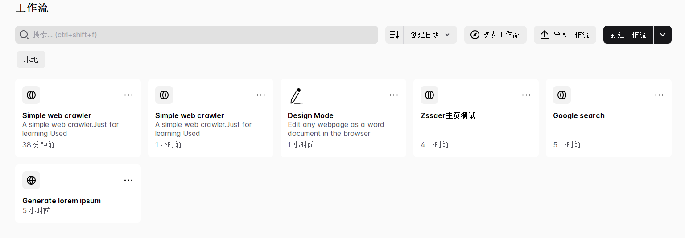

# Automa-Web前端自动化可视化工具

Automa是一个开源的前端浏览器自动化Chrome工具，基于Vue框架编写。

即使你不会写代码，也能按照自己的需求，完成一系列自动化操作。利用它，你可以将一些重复性的任务实现自动化、并且它可以进行界面截图、抓取网站数据、你还可以自定义时间何时去执行自动化任务等。从前端测试，到自动填写表格、执行重复性任务、截取屏幕截图到抓取网站数据，Automa十分方便。

GitHub地址：https://github.com/Kholid060/automa

Chrome扩展下载地址：https://chrome.google.com/webstore/detail/automa/infppggnoaenmfagbfknfkancpbljcca

## 使用方法

在Chrome安装完Automa之后，点击右上方的Automa图标，弹出工具栏。

点击其中小房子图标进入Automa主界面。默认状态下，界面为英文，最新版本中，可以点击右侧设置图标，设置中文语言。

Automa界面中主要有三个大界面，工作流，集合，日志。

工作流：用于管理创建的工作流，在里面进行编辑相关自动化流程。

集合：用于将多个工作流进行按顺序的执行。

日志：管理工作流的执行状况以及其运行时的属性。

在工作流界面中，默认拥有两个自带的Demo，可以进行先试着学习。

比如我们新建一个工作流`test_baidu_flow`。

创建项目后，会进入到工作流编辑页面，该界面是用于构建自动化流程；左侧区域是操作区域，右侧区域是主流程构建区域

在组织任务流前，需要包含了一个「 触发器」组件，它是作为任务的「 启动节点 」，类似Selenium在操作网页前，需要实例化一个操作对象一样，双击它，可以查看到它的具体配置，对于所有的模块都可以这样。默认执行方式为 人工方式。我们也可以去定义任务的触发策略，比如按指定时间、周期性等。

自动化任务或者可以理解为自动化“脚本”定义好之后，是直接保存在当前浏览器插件中的，如果怕数据丢失，我们也可以将创建好的自动化任务，导出到外部，**Autom**支持将任务导出成`JSON`、`TXT`格式的文件。

对于其中主要使用方法，查看官方文档：https://docs.automa.site/。