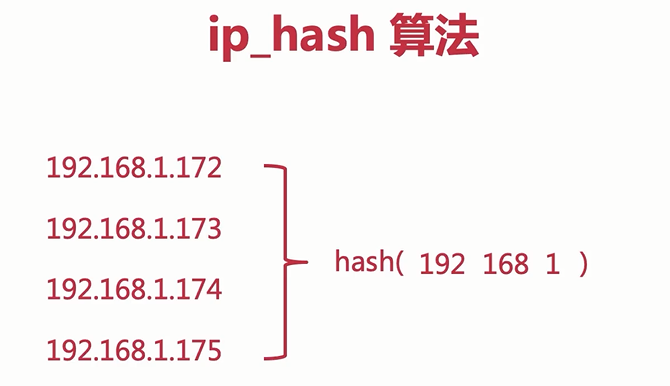

# 后端服务配置Nginx操作

## 前言

一般情况下，后端接口的部署，主要看项目的形式，如果就是普通的 SSM 项目，那就提前准备好 Tomcat ，在 Tomcat 中部署项目，如果是 Spring Boot 项目，可以通过命令直接启动 jar，如果是微服务项目，存在多个 jar 的话，可以结合 Docker 来部署，无论是那种形式，对于后端开发者来说，都需要去了解并学习使用，因为一个合格的后端程序员应当学会自己部署项目，而不是单单只会写项目，把它交给运维来发布。

## 常规后端部署

后端项目可以在一个非 80 端口上部署，部署成功之后，因为这个后端项目只是提供接口，所以我们并不会直接去访问它。产品开发时可以这样搞，但是产品部署后需要进行后端地址重定向，这个过程则是通过 Nginx 请求转发进行操作的。

比如说，后端是一个 Spring Boot 工程，那么我可以通过 Docker 部署，当然也可以直接通过命令来启动，直接通过命令来启动 jar ，如下：

```java
nohup java -jar jinlu.jar > vhr.log &
```

这里加&，则会运行后可以继续输入后续shell内容，否则进入jar内容界面，需要再额外使用`ctrl+c`按键退出。

后端启动成功之后，我们需要继续将其地址转发，安装并且去配置一个 Nginx，通过 Nginx 来转发请求。

我们在 nginx.conf 中做出如下配置：

首先配置其上游服务器（后端服务器的负载均衡配置）：

```
upstream zssaerBackEnd.com{
  server 127.0.0.1:8088 weight=2;
}
```

在这里主要是配置单个服务端的地址，如果你的服务端是集群化部署，那么这里就会有多个服务端地址，然后可以通过权重或者 ip hash 等方式进行其请求分发。

随后我们可以在server中进行配置相应的转发规则了。

```
http {
    include mime.types;
    server_tokens off;

    ## 配置反向代理的参数
    server {
        listen    80;

        ## 1. 用户访问 http://ip:port，触发反向代理
        location /backend {
            proxy_pass  http://zssaerBackEnd.com;
            proxy_redirect     off;
            proxy_set_header   Host             $host;
            proxy_set_header   X-Real-IP        $remote_addr;
            proxy_set_header   X-Forwarded-For  $proxy_add_x_forwarded_for;
        }

        ## 2.用户访问 http://ip:port/README.md，触发反向代理
        location /README.md {
            proxy_set_header  X-Real-IP  $remote_addr;
            proxy_set_header X-Forwarded-For $proxy_add_x_forwarded_for;
            proxy_pass https://github.com/zssaer/blog/blob/master/README.md;
        }
    }
}
```

上面我们总共设置了两个反向代理，一个为 用户访问当前服务器的域名下的 /backend地址后，自动转发到其后台服务器上了，而另外一个则是访问服务器域名的README.md后自动转发到`https://github.com/zssaer/blog/blob/master/README.md`下，实现重定向。

其中的相关配置：

 `proxy_set_header XXX $xxx` ： 它的作用就是将其原Http请求的Header中的XXX字段同时转发到其请求上。

[X-Forwarded-For](https://www.baidu.com/s?wd=X-Forwarded-For&tn=SE_PcZhidaonwhc_ngpagmjz&rsv_dl=gh_pc_zhidao)是用于记录代理信息的，每经过一级代理(匿名代理除外)，代理服务器都会把这次请求的来源IP追加在X-Forwarded-For中。

其中X-Forwarded-For:简称XFF头，它代表客户端，也就是HTTP的请求端真实的IP，只有在通过了HTTP 代理或者负载均衡服务器时才会添加该项。 它不是RFC中定义的标准请求头信息，在squid缓存代理服务器开发文档中可以找到该项的详细介绍。标准格式如下：X-Forwarded-For: client1, proxy1, proxy2。


## 更多配置

其中还有一些Nginx配置以及说明：


### nginx访问控制

```text
deny 127.0.0.1;     #全局定义限制，location里的是局部定义的。如果两者冲突，以location这种精确地优先

location ~ .*admin\.php$ {
	...
	allow 127.0.0.1;  只允许127.0.0.1的访问，其他均拒绝
	deny all;
}
```

其中`deny` 用作与 限制访问，用作拒接某个地址下的请求。在location中为反向代理局部使用，在外部使用则为全局。主要情况以局部优先。

`allow`的作用为 允许某个地址下的请求。


### 负载均衡

```text
http {
    upstream XXX {
        ip_hash;
        server 192.168.10.13:80;
        server 192.168.10.14:80  down;
        server 192.168.10.15:8009  max_fails=3  fail_timeout=20s;
        server 192.168.10.16:8080;
    }
    server {
        location / {
            proxy_pass  XXX;
        }
    }
}
```

其中均衡负载中需要配置对应的上游服务器配置 `upstream`。

其中`ip_hash`是根据用户请求过来的ip，然后映射成hash值，然后分配到一个特定的服务器里面；

使用ip_hash这种负载均衡以后，可以保证用户在**同一IP**下的每一次会话都只会发送到同一台特定的Tomcat服务器里面，它的session不会跨到其他的tomcat服务器里面去的；从而不需要额外在考虑Session共享。



上面是`ip_hash`的大概算法，也就是说ip_hash算法是取ip地址的前三段数字进行hash映射，如果只有最后一段不一样，那么也会发送到同一个Tomcat服务器里面的。

注意：

**一旦使用了ip_hash配置后，当我们需要移除一台服务器的时候，不能直接删除这个配置项，而是需要在这台服务器配置后面加上关键字`down`，表示不可用；**

**如果直接移除配置项，会导致hash算法发生更改，后续所有的请求都会发生混乱；**


另外 其中`max_fails`和`fail_timeout`是用作连接控制的，需要同时使用。

由于Nginx基于连接探测，如果发现后端异常，在单位周期为`fail_timeout`设置的时间，中达到`max_fails`次数，这个周期次数内，如果后端同一个节点不可用，那么接将把节点标记为不可用，并等待下一个周期（同样时常为`fail_timeout`）再一次去请求，判断是否连接是否成功。

如果成功，将恢复之前的轮询方式，如果不可用将在下一个周期(`fail_timeout`)再试一次。


其他更多说明，见下配置：

```nginx
// nginx.conf文件内容，
user  nginx; #设置nginx服务的系统使用用户
worker_processes  1; #工作进程数

error_log  /var/log/nginx/error.log warn; #nginx的错误日志
pid        /var/run/nginx.pid; #nginx启动时候的pid

events {
    worker_connections  1024; #每个进程允许的最大连接数
}

http { #http请求配置，一个http可以包含多个server

    #定义 Content-Type
    include       /etc/nginx/mime.types;
    default_type  application/octet-stream;

    #日志格式 此处main与access_log中的main对应
    #$remote_addr：客户端地址
    #$remote_user：http客户端请求nginx认证的用户名，默认不开启认证模块，不会记录
    #$timelocal：nginx的时间
    #$request：请求method + 路由 + http协议版本
    #status：http reponse 状态码
    #body_bytes_sent：response body的大小
    #$http_referer：referer头信息参数，表示上级页面
    #$http_user_agent：user-agent头信息参数，客户端信息
    #$http_x_forwarded_for：x-forwarded-for头信息参数
    log_format  main  '$http_user_agent' '$remote_addr - $remote_user [$time_local] "$request" '
                      '$status $body_bytes_sent "$http_referer" '
                      '"$http_user_agent" "$http_x_forwarded_for"';

    #访问日志，后面的main表示使用log_format中的main格式记录到access.log中
    access_log  /var/log/nginx/access.log  main;

    #nginx的一大优势，高效率文件传输
    sendfile        on;
    #tcp_nopush     on;

    #客户端与服务端的超时时间，单位秒
    keepalive_timeout  65;

    #gzip  on;
    server { #http服务，一个server可以配置多个location
        listen       80; #服务监听端口
        server_name  localhost; #主机名、域名
    
        #charset koi8-r;
        #access_log  /var/log/nginx/host.access.log  main;
    
        location / {
            root   /usr/share/nginx/html; #页面存放目录
            index  index.html index.htm; #默认页面
        }
    
        #error_page  404              /404.html;
    
        # 将500 502 503 504的错误页面重定向到 /50x.html
        error_page   500 502 503 504  /50x.html;
        location = /50x.html { #匹配error_page指定的页面路径
            root   /usr/share/nginx/html; #页面存放的目录
        }
    
        # proxy the PHP scripts to Apache listening on 127.0.0.1:80
        #
        #location ~ \.php$ {
        #    proxy_pass   http://127.0.0.1;
        #}
    
        # pass the PHP scripts to FastCGI server listening on 127.0.0.1:9000
        #
        #location ~ \.php$ {
        #    root           html;
        #    fastcgi_pass   127.0.0.1:9000;
        #    fastcgi_index  index.php;
        #    fastcgi_param  SCRIPT_FILENAME  /scripts$fastcgi_script_name;
        #    include        fastcgi_params;
        #}
    
        # deny access to .htaccess files, if Apache's document root
        # concurs with nginx's one
        #
        #location ~ /\.ht {
        #    deny  all;
        #}
    }
    include /etc/nginx/conf.d/*.conf;
}
```


