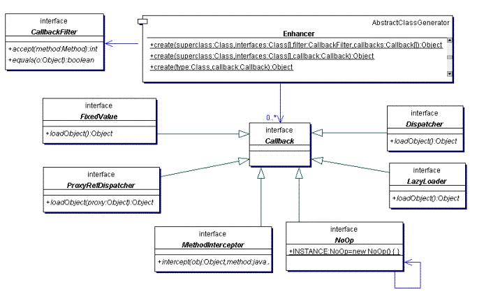

# CGLIB

## 简介

CGLIB是一个强大、高性能和高质量的第三方代码生成库。该库被Spring、Mybatis、Hibernate等第三方框架广泛应用，用以提供方法拦截操作。CGLIB属于开源项目，其CGLIB源码地址为：https://github.com/cglib/cglib

CGLIB代理主要通过对字节码的操作，为对象引入间接级别，以控制对象的访问。

CGLIB向比与基于Java反射的JDK动态代理来说，CGLIB功能更加强大。JDK动态代理有个缺陷就是只能对接口进行代理，无法对单独普通类进行代理，而CGLIB则可以解决这一问题。

## 构成框架

作为开源项目，其内部结构必然会使用其他不少其他开源框架，CGLIB也不例外。

CGLIB底层使用了***ASM***来进行操控字节码，用来生成新的类。类似的情况比如`Groovy`动态语言或者`BeanShell`都是利用ASM生成字节码。

ASM是一种通用Java字节码操作和分析框架。它使用类似于SAX解析器来实现高效能处理，所以自然CGLIB也是注重高性能的。

## 原理

CGLIB代理，就是动态生成一个要代理类的子类，子类重写要代理的类的***所有不是final的方法***。在子类中采用**方法拦截**的技术拦截所有父类方法的调用，顺势织入横切逻辑。它比使用基于java反射的JDK动态代理要快，并且不需要局限于代理类是否实现接口。

同时缺点也暴露出来，由于只是重写了不是final的方法，所以代理的类的final方法，则无法进行代理实现。

## 教程

这里先批评以下CGLIB的开发者，一个开源项目目前居然还缺少详细的官方文档和实例...

### 依赖导入


```xml
<dependency>
    <groupId>cglib</groupId>
    <artifactId>cglib</artifactId>
    <version>3.3.0</version>
</dependency>
```

### 库的分类

- **net.sf.cglib.core**: 底层字节码处理类，他们大部分与ASM有关系。
- **net.sf.cglib.transform**: 编译期或运行期类和类文件的转换
- **net.sf.cglib.proxy**: 实现创建代理和方法拦截器的类
- **net.sf.cglib.reflect**: 实现快速反射和C#风格代理的类
- **net.sf.cglib.util**: 集合排序等工具类
- **net.sf.cglib.beans**: JavaBean相关的工具类

###  Enhancer创建动态代理

使用CGLIB中的Enhancer来创建动态代理。

Enhancer是一个CGLIB中非常重要的类，它允许为非接口类型创建一个JAVA代理，Enhancer动态的创建给定类的子类，和JDK动态代理不一样的是不管代理的类是实现接口还是普通的类它都能正常工作。然后通过 回调 来进行拦截代理类的方法进行处理。

#### Callback-回调

在利用Enhancer前，我们先介绍回调，



Enhancer几乎所有的类都基于回调这个接口。

当Enhancer代理类执行方法，即是使用Enhancer进行方法代理，Enhancer在进行处理时，这个过程称之为回调。

#### MethodInterceptor-方法拦截器

MethodInterceptor 翻译过来就是方法拦截器，它基础于`Callback`，说明它也属于回调。

我们先要创建一个 代理类方法拦截器，实现`net.sf.cglib.proxy.MethodInterceptor`接口，用作代理类的方法拦截处理，它的用法其实和JDK动态代理的`java.lang.reflect.InvocationHandler`一样。

其中MethodInterceptor接口中只有一个方法`intercept`:

```java
public Object intercept(Object obj, java.lang.reflect.Method method, Object[] args,
                               MethodProxy proxy) throws Throwable;
```

它接受4个参数:

> obj – 代理的原类对象
> 方法 – 拦截实现的方法
> args – 方法中的参数组
> proxy – 用于调用 父类代理； 可以根据需要多次调用，既做到多次代理。

这里面的proxy对象是MethodProxy类，不同于JDK动态代理InvocationHandler中的proxy，它拥有一个`invokeSuper`方法，能调用原始（父类）的方法，类似于Method类的Invoke方法调用。

所以代理类方法拦截器例子如下：

```java
/**
 * @description: 代理类方法拦截器
 * @author: Zhaotianyi
 * @time: 2021/10/20 10:31
 */
public class ProxyInterceptor implements MethodInterceptor {

    /**
     * 当对基于代理的方法回调时，拦截其方法，进行自定义处理
     * @param obj 代理对象
     * @param method 拦截的方法
     * @param args 拦截的方法的参数
     * @param proxy 代理
     * @return
     * @throws Throwable
     */
    @Override
    public Object intercept(Object obj, Method method, Object[] args, MethodProxy proxy) throws Throwable {
        Object result = null;
        System.out.println("method invoke before...");
        result = proxy.invokeSuper(obj, args);
        System.out.println("method invoke after...");
        return result;
    }
}
```

上面除了在调用方法代理使用了MethodProxy的invokeSuper方法之外，其余的基本和JDK动态代理的InvocationHandler的实现类编写方法一样。

#### Enhancer代理

有了代理类方法拦截器 后，我们就可利用`net.sf.cglib.proxy.Enhancer`类来创建动态代理了。

其中Enhancer类概念和原本JDK动态代理的Proxy类几乎一样，创建Enhancer类来进行代理类，但和Proxy不同的是，Enhancer既能够代理普通的class，也能够代理接口。

Enhancer创建一个被代理对象的子类并且拦截所有的方法调用（包括从Object中继承的toString和hashCode方法）。**注意：Enhancer不能够拦截final方法**

```java
public class ProxyMain {
    public static void main(String[] args) {
        // 创建Enhancer类,用作实现Student类的代理
        Enhancer enhancer = new Enhancer();
        enhancer.setSuperclass(Student.class);
        enhancer.setCallback(new ProxyInterceptor());

        // 创建Enhancer代理,来代理Student类
        Student o = (Student) enhancer.create();
    }
}
```

其中创建Enhancer后需要设置两个参数，一个为Superclass：代理的类，一个为Callback：回调对象。

最后需要调用其对象的create方法，即建立一个代理类出来。其代理类的所有非final参数、方法都会被其拦截，返回至MethodInterceptor中进行自定义处理。

当然直接使用Enhancer中的静态Create方法，输入两个参数也可以进行快速创建一个代理类出来。

```java
Student o = (Student) Enhancer.create(Student.class, new ProxyInterceptor(new Student()));
```

当我们直接打印一下对象，看看会出现什么？

结果如下：

```
method invoke before...
method invoke before...
method invoke after...
method invoke after...
com.test2.bean.Student$$EnhancerByCGLIB$$72d6b74c@2957fcb0
```

控制台产生两次代理拦截处理，而且为什么为什么还会有EnhancerByCGLIB字段，这时大伙可能会产生疑惑。

其实都知道直接打印对象的话，其实调用的是对象的`toString`方法，而在默认的toString方法中：

```java
public String toString() {
    return getClass().getName() + "@" + Integer.toHexString(hashCode());
}
```

其中`getName()`也会调用一次内部方法，所以自然会产生两次拦截。而不同的是`getClass()`默认是属于final类型的，前面说了Enhancer的特性，所以自然不能被拦截，自然会暴露出原Enhancer类型出来。


当然，上面的操作需要先创建代理方法拦截类还要在运行下创建Enhancer代理，对于工程中必然显得代码重复了，所以可以直接精简为一个工具类：

```java
/**
 * Enhancer代理生成工具
 * @version 1.0
 * @since JDK1.7
 */
public class ProxyUtil implements MethodInterceptor {

	//代理的类对象
	private Object obj;
    
	/**
     * 创建代理类
     * @param target 代理的类对象
     * @return
     */
	public Object createProxy(Object target) {
		this.obj = target;
		Enhancer enhancer = new Enhancer();
		//设置代理目标
		enhancer.setSuperclass(this.obj.getClass());
		//设置单一回调对象，在调用中拦截对目标方法的调用
		enhancer.setCallback(this);
		//设置类加载器
		enhancer.setClassLoader(this.obj.getClass().getClassLoader());
		
		return enhancer.create();
	}
	/**
	 * 
	 * 方法描述 当对基于代理的方法回调时，在调用原方法之前会调用该方法
	 * 拦截对目标方法的调用
	 *
	 * @param obj 代理对象
	 * @param method 拦截的方法
	 * @param args 拦截的方法的参数
	 * @param proxy 代理
	 * @return
	 * @throws Throwable
	 */
	@Override
	public Object intercept(Object obj, Method method, Object[] args,
			MethodProxy proxy) throws Throwable {
		Object result = null;
        
		result = proxy.invokeSuper(obj, args);
        
		return result;
	}

}
```

使用:

```java
ProxyUtil proxyUtil = new ProxyUtil();
XXX xxx = (XXX)proxyUtil.createProxy(new XXX());
```


#### CallbackFilter-回调过滤器

有些时候我们可能只想对特定的方法进行拦截，对其他的方法直接放行，不做任何操作。这种情况下我们这需要在Enhancer上绑定一个CallbackFilter。

CallbackFilter是一个net.sf.cglib.proxy下的一个接口，该接口主要作用允许您在代理的方法中控制回调规则，起着过滤作用。

其CallbackFilter接口中含有两个方法，其中accept方法用于将其代理方法进行过滤然后分别回调。

例如，我们实现一个CallbackFilter接口类：

```java
    /**
     * PersistenceService代理类方法回调过滤器
     *
     */
    public class PersistenceServiceCallbackFilter implements CallbackFilter {

        //SAVE方法 回调组的序号
        private static final int SAVE = 0;

        //LOAD方法 回调组的回调序号
        private static final int LOAD = 1;

        /**
         * 代理方法过滤，控制回调
         * @method 代理类的方法
         * @return 回调组的序号
         */
        public int accept(Method method) {
            String name = method.getName();
            if ("save".equals(name)) {
                return SAVE;
            }
            // 对于其他方法
            return LOAD;
        }
    }
```

上面是一个简单的自定义回调过滤器，它执行了过滤操作，将其 save方法进行返回 0 ，其余的方法返回 1。

回调过滤器的Accept 方法将代理方法映射到回调。返回值是特定方法的回调数组中的索引。

随后在其Enhancer绑定回调过滤器：

```java
Enhancer enhancer = new Enhancer();
enhancer.setSuperclass(PersistenceServiceImpl.class);

CallbackFilter callbackFilter = new PersistenceServiceCallbackFilter();
// 绑定回调过滤器
enhancer.setCallbackFilter(callbackFilter);

AuthorizationService authorizationService = ...
Callback saveCallback = new AuthorizationInterceptor(authorizationService);
Callback loadCallback = NoOp.INSTANCE;
// 设置回调数组
Callback[] callbacks = new Callback[]{saveCallback, loadCallback };
enhancer.setCallbacks(callbacks);
...
return (PersistenceServiceImpl)enhancer.create();
```

enhancer.setCallbacks方法设置了回调数组，这个回调数组的索引就是这个上面Accept 方法返回索引对应。

`NoOp`的回调行为 表示返回原类方法执行，即放行。

所以当代理类执行save方法后，就会被回调到AuthorizationInterceptor上。如果执行其他方法，那么就会直接放行执行。


#### CallbackHelper

使用CallbackFilter进行方法回调过滤，那么Enhancer就还需要自己手动设置回调数组，如果回调有一两个还好，如果有很多需要进行过滤的话，那么不但不好设置回调数组，还容易搞混索引。

能否只写过滤规则直接跳转到XX回调，不写回调数组呢？

可以！CGLIB提供了一个快速过滤类 - CallbackHelper。

`net.sf.cglib.proxy.CallbackHelper`类实现了CallbackFilter接口，它在创建后自动将其回调数组进行排序，用户使用它只需要关注过滤规则和回调，不需要关注回调数组的排序索引。

CallbackHelper的构造方法需要两个参数:

> Class superclass：代理的类
>
> Class[] interfaces：代理的类的实现的接口组，如果没有的话，可以传入`new Class[0]`

CallbackHelper需要重写它的`getCallback(Method method)`方法，当代理类每次执行一个方法时，其代理方法都会通过getCallback这个方法中，在其进行过滤设置回调。

所以将其过滤条件放置在getCallback方法内：

```java
CallbackHelper helper = new CallbackHelper(Student.class, new Class[0]) {
            @Override
            protected Object getCallback(Method method) {
			   // 如果方法名为sout的话,将其方法返回至ProxyInterceptor处理
                if (method.getName() == "sout") {
                    return new ProxyInterceptor();
                } else {
                    // 否则直接将其方法回调给默认实现,即正常执行
                    return NoOp.INSTANCE;
                }
            }
        };
// 创建Enhancer代理,来代理Student类
Enhancer enhancer = new Enhancer();
enhancer.setSuperclass(Student.class);
// 设置要使用的代理方法回调数组
enhancer.setCallbacks(helper.getCallbacks());
// 设置要代理方法回调过滤器
enhancer.setCallbackFilter(helper);
Student o = (Student)enhancer.create();
```

Enhancer在设置回调数组时，只需使用CallbackHelper.getCallbacks()即可获取对应的回调数组。所以使用CallbackHelper会比一般的自定义CallbackFilter使用简便。


#### 更多回调行为

上面我们只介绍了两种回调行为 MethodInterceptor方法拦截 和 NoOp放行，CGLIB还提供了很多其他回调行为接口：

- `net.sf.cglib.proxy.FixedValue` : 直接强行返回指定内容，在一些场景下可以提升处理性能。例如：		

```java
Enhancer enhancer = new Enhancer();
//设置代理目标
enhancer.setSuperclass(hello.getClass());
//设置单一回调对象，在调用中拦截对目标方法的调用
enhancer.setCallback(new FixedValue() {
	@Override
	public Object loadObject() throws Exception {
		// TODO Auto-generated method stub
		return "FixedValue";
	}
});
Object obj = enhancer.create();
```

上述行为，不管代理类其调用方法内容如何，都会返回“FixedValue”这个字节串，并且调用方法内其他不执行。


- `net.sf.cglib.proxy.LazyLoader`：当实际的对象需要延迟装载时，可以使用LazyLoader回调。一旦实际对象被装载，它将被每一个调用代理对象的方法使用;
- `net.sf.cglib.proxy.Dispatcher`：Dispathcer回调和LazyLoader回调有相同的特点，不同的是，当代理方法被调用时，装载对象的方法也总要被调用;
- `net.sf.cglib.proxy.ProxyRefDispatcher`：ProxyRefDispatcher回调和Dispatcher一样，不同的是，它可以把代理对象作为装载对象方法的一个参数传递;


### Bean操作

CGLIB除了可以用Enhancer来实现动态代理外，其`net.sf.cglib.beans`包中还可对其JAVA Bean进行操作，配合JAVA-Reflection（反射机制）同样可以做到动态制作类、创建类。

#### 创建Bean

使用`net.sf.cglib.beans.BeanGenerator`类可以进行创建Bean对象操作。

```java
BeanGenerator beanGenerator = new BeanGenerator();
beanGenerator.addProperty("name",String.class);
Object o1 = beanGenerator.create();

Method m1 = o1.getClass().getMethod("setName",String.class);
m1.invoke(o1,"zxx");

Method m2 = o1.getClass().getMethod("getName");
System.out.println(m2.invoke(o1));
```

使用CGLIB的BeanGenerator动态的创建了一个Bean对象，使用addProperty方法可以添加一个属性，在添加属性的同时BeanGenerator会自动生成其Getting、Setting方法。

使用其BeanGenerator的create的方法进行Bean实例化，配合Java反射可以进行对Bean的操作。

#### 创建只读 Bean

使用`net.sf.cglib.beans.ImmutableBean`类可以进行根据现有的Bean对象，创建一个对应的只读Bean对象。

```java
Student student = new Student();
student.setName("zzz");
// 创建一个student实例的对应只读Bean
Student o = (Student) ImmutableBean.create(student);
student.setName("ooo");
System.out.println(o.getName()); //只读Bean对象的值会自动改变

o.setName("kkk"); // 抛出IllegalStateException,不可直接修改只读Bean
```

ImmutableBean的对象虽然可以强制为对应设置的Bean类型，但是无法直接进行修改设置，其属性随原Bean改变而改变。

#### 利用BeanMap实现对象与Map的转换

利用`net.sf.cglib.beans.BeanMap`类可实现将Bean对象转换为Map对象，其中Bean对象中的属性全部以Key-Value方式放置在Map中。

```java
BeanGenerator beanGenerator = new BeanGenerator();
beanGenerator.addProperty("name",String.class);
beanGenerator.addProperty("age",Integer.class);
Object o1 = beanGenerator.create();

Method m1 = o1.getClass().getMethod("setName",String.class);
m1.invoke(o1,"zxx");
Method m2 = o1.getClass().getMethod("setAge",Integer.class);
m2.invoke(o1,23);
// 为o1对象创建BeanMap
BeanMap beanMap = BeanMap.create(o1);
Integer age = (Integer) beanMap.get("age");
```

BeanMap基于Map类型，拥有Map的存储功能，自然也可以用containsKey、containsValue、keySet等功能。

在Java中bean与map的转换有很多种方式，比如通过ObjectMapper先将bean转换为json，再将json转换为map 或者 通过Java反射等，但是这些方法都没有使用CGLIB中的BeanMap来的快，因为这种方式效率极高，它跟第其它方式的区别就是因为它使用了缓存，所以优先考虑使用BeanMap。

#### 利用Mixin实现多个对象整合为单个对象

Mixin能够将多个Bean对象整合为一个Bean对象，这个Bean对象拥有它们所有方法。

但前提就是这些Bean对象必须是实现接口的，Mixin通过接口来对对象进行整合的。

```java
interface Interface1 {
    String one();
}

interface Interface2 {
    String two();
}

interface MixinInterface extends Interface1, Interface2 {
    String one(String ok);
    String three();
}

static class Class1 implements Interface1 {
    @Override
    public String one() {
        return "one";
    }
}

static class Class2 implements MixinInterface {
    @Override
    public String three() {
        return "three";
    }

    @Override
    public String one() {
        return "no 22one";
    }

    @Override
    public String one(String ok) {
        return "no one";
    }

    @Override
    public String two() {
        return "two";
    }
    public static void main(String[] args) {
        Mixin mixin = Mixin.create(new Class[]{Interface1.class,MixinInterface.class},
                new Object[]{new Class1(), new Class2()});
        MixinInterface mixinInterface = (MixinInterface) mixin;
        System.out.println(mixinInterface.two());
    }
}

```

Mixin.create方法接受两个参数：第一为接口类组，第二为对象组。其中接口组与对象组一一对应，引索对应。

其实Mixin这个工具几乎不怎么被使用，因为它依据与接口进行创建，很多时候可以通过纯Java的方式实现，没有必要使用Minix类。


### 类操作

CGLIB可以进行对类进行操作，获取到类中的各个属性、方法代理、接口创建等功能，在某些方面上比JDK的反射更强大。

#### 利用InterfaceMaker动态创建接口

利用`net.sf.cglib.proxy.InterfaceMaker`可以动态创建Interface接口，并且可以自定义接口内容。

```java
// 创建一个Signature方法认证类
Signature signature = new Signature("hello", Type.INT_TYPE, new Type[]{Type.getType(String.class)});
InterfaceMaker maker = new InterfaceMaker();

maker.add(signature,new Type[0]);
Class aClass = maker.create();
```

上述的InterfaceMaker创建的接口中含有了一个方法，为Integer hello(String XXX)。

InterfaceMaker类的add方法用于向自定义接口添加方法，它有很多选择，它可以直接接受一个Method类等。

上面我们使用了传入Signature类，它的定义起来更简单方便，它还需要一个抛出的exceptions数组，用于方法存在的exceptions抛出声明，当然这儿可以直接创建一个空数组，来表示这个方法没有异常抛出。

对于Signature方法认证类，它实际是一个Method的简单描述类：（这个类是`net.sf.cglib.core.Signature`,不是SpringAOP中的Signature）

Signature的有两个构造方法：

```java
/**
* @param name 方法名
* @param desc 简介
*/
public Signature(String name, String desc)
/**
* @param name 方法名
* @param returnType 返回类型数组
* @param argumentTypes 参数类型数组
*/    
public Signature(String name, Type returnType, Type[] argumentTypes)
```

其中我们常用第二个，它直接提供了返回类型和参数类型的选择，在创建方法时这些都可以根据自己的类型来进行调用。

由于接口仅仅只用做在编译时期进行类型检查，因此在一个运行的应用中动态的创建接口其实没有什么用。

但是InterfaceMaker可以用来自动生成代码，为以后的开发做准备。


#### 利用MethodDelegate对方法进行代理

CGLIB可以通过一个***只含有一个方法的接口***  使用MethodDelegate来 代理对象中某一个方法，最终让该接口的那个方法来代理对象中指定的方法。

```
interface ProxyMethod{
    String getValueFromProxy();
}

...
BeanGenerator beanGenerator = new BeanGenerator();
// 创建一个Bean 内部拥有 value属性
beanGenerator.addProperty("value",String.class);
Object o = beanGenerator.create();
Method method = o.getClass().getMethod("setValue", String.class);
method.invoke(o,"zty");

// 将其ProxyMethod接口的方法代理 o对象中getValue方法
ProxyMethod delegate = (ProxyMethod)MethodDelegate.create(o, "getValue", ProxyMethod.class);
System.out.println(delegate.getValueFromProxy());  // 结果为 "zty"
```

Method.create方法接受3个参数:

> 1. 第二个参数为即将被代理的方法
>
> 2. 第一个参数必须是一个无参数构造的bean。因此MethodDelegate.create并不是你想象的那么有用
>
> 3. 第三个参数为只含有一个方法的接口。当这个接口中的方法被调用的时候，将会调用第一个参数所指向bean的第二个参数方法

MethodDelegate虽然用接口可以代理方法,但是拥有很多缺点:

> 1. 为每一个代理类创建了一个新的类，这样可能会占用大量的永久代堆内存
> 2. 你不能代理需要参数的方法
> 3. 如果你定义的接口中的方法需要参数，那么代理将不会工作，并且也不会抛出异常；如果你的接口中方法需要其他的返回类型，那么将抛出IllegalArgumentException
>

所以大部分时间不建议使用MethodDelegate代理方法。


#### FastClass - 另一种Class类

CGLIB中的FastClass类是比JDK中Class类更好（它们声称的）。相比于传统的Class类，FastClass引出了一个index下标的新概念。

通过create方法创建一个对应的FastClass类，它通过数组存储类中的所有method,constructor等class信息，用户通过向数组下标index寻找对应的方法或者构造器等，用方法签名转化为对应index方法，用模板方式解决Java语法不支持问题，同时改善Java反射性能。

传统的Class类使用Java反射机制来确定方法等，而FastClass则是通过使用index快速确定对应的方法等，从而达到高效率。

```java
FastClass fastClass = FastClass.create(Student.class);
FastMethod fastMethod = fastClass.getMethod("getName",new Class[0]);

Student student = new Student();
student.setName("zty");
System.out.println(fastMethod.invoke(student,new Object[0]));  // 输出"zty"
```

FastClass的使用反射和普通的Class类似，获取到的FastMethod方法、FastConstructor构造方法，需要参数也相同。

**注意：FastMethod中的invoke方法是调用的FastClass中的invoke方法，它也没有无参的方法，所以当参的情况下，需要传入一个空的对象数组。**

FastClass的实现逻辑，是生成增强类实现invoke方法，invoke方法中，用switch语义将被增强类的所有方法调用枚举出来。用户使用FastClass.invoke方法，传入方法签名和被调用实例，从而达到不使用反射就能实现不确定方法的调用。

**但是！FastClass 这一工具在提出来的时候Java反射并没有进行足够的优化，所以或许FastClass会更效率，但是从JDK7开始到目前的Java新版本的JVM拥有*inflation*这个概率， 当一个反射方法调用次数少于15次时，会使用调用native方法。大于15次之后则使用ASM生成新的类类处理反射调用。所以在JDK7后面的版本使用FastClass反而比Class慢，所以不推荐使用！**


### 使用警告

使用所有的 CGLIB类进行操作都会生成字节代码，这会导致额外的类被存储在 JVM 内存的一个特殊区域，如果操作过多，容易造成永久堆满，触发OutOfMemory异常。

或许这样说来，大伙可能会放弃使用CGLIB，但是，如果您明智而谨慎地使用 cglib，您可以用它做一些令人惊奇的事情，利大于弊，因此，节制地使用 CGLIB进行操作。

