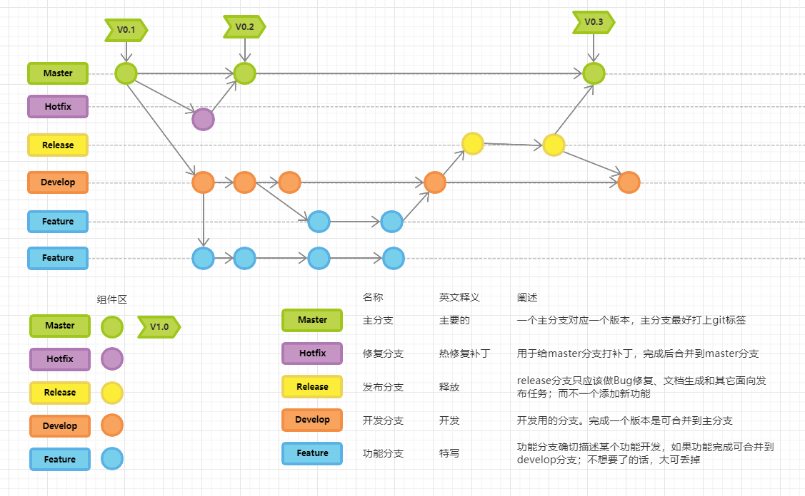

# 编写代码的核心思想

下面介绍当下编写代码的核心思想以及方法：

## 数据转换使用Converter（转换器）

大部分时候我们使用 bean 拷贝使用的是 `BeanUtils` 这个类来完成，然而一些稍微复杂的实体转换，我们还需要进行其他操作，比如图片路径转换等，这个时候我们只能手动的 get set ,如果这个过程写在业务层逻辑的话，就会让代码结构不清晰。

因此建议在引入 对应的`Converter` 这个角色来专门负责数据的传递与转换，名称通常可以使用后缀XXXCoverter。

下面是一个简单的Demo，仅供参考，以实际项目为准:

1. 在Core包中创建RespCoverter接口作为Coverter基础接口，接口名支持泛型,并添加covert方法用作转换返回。

   ```java
   /**
    * 转换器接口
    */
   }
   ```

2. 在api包中创建对应Resp类的Converter类，重写covert方法逻辑。

   ```java
   @Component
   public class ArticleCoverter implements RespCoverter<Article> {
       @Autowired
       PathComponent pathComponent;
   
       @Override
       public Object covert(Article t) {
           ArticleResp art = new ArticleResp();
           BeanUtils.copyProperties(t, art);
           // 判断是否设置时间时间
           if(!ValidateUtil.isEmpty(art.getEventTime())) {
               Date date=new Date();
               if (date.compareTo(art.getEventTime()) == 1) {
                   art.setIsEvent(IsEnum.YES.getCode());
               } else {
                   art.setIsEvent(IsEnum.NO.getCode());
               }
           }
           art.setImageAccess(pathComponent.getAccessUrl(art.getImage()));
           return art;
       }
   }
   ```

3. 在控制层中进行转换使用，成功返回对应Resp类。

   ```java
   public class ArticleController {
       @Resource
       private ArticleCoverter articleCoverter;
       
       @GetMapping
       public Result list(ArticlePageReq req) {
           ...
           List<ArticleResp> articleLt = new ArrayList<ArticleResp>();
           for (Article article : list) {
           	articleLt.add((ArticleResp) articleCoverter.covert(article));
           }
           ...
       }
   }    
   ```


## 控制层不堆积大量操作

**不在项目控制层中进行大量操作，特别是MybatisPlus或者通用Mapper查询拼接操作，这些逻辑应该放置在业务逻辑层。**

对于一些常用的SQL逻辑处理，比如做一个查询时往往要 set 一些查询条件或者对查询结果进行一些简单的判断，我们可以将SQL直接在Mapper文件进行编写好，直接调用即可，这样不仅主业务逻辑代码不会被干扰，还能提高一定的代码复用率。


## 常用方法封装

对于 过长的业务逻辑 或者 反复在同个类中调用的业务逻辑代码，我们需要将其封装成多个方法。

假设我们一个方法要完成一种逻辑 要 分成三大步，而每一个步骤又分成几个小步骤，那我们就可以将这个方法拆分成三个方法。

对于封装的方法，我们也可以使用lambda 匿名函数来精简：

```java
public User getUser(Consumer<User> consumer){
    User user=new User();
    consumer.accept(user);
    user=userMapper.getUser(user);
    return user;
}

public void doSomething1(){
    User user=getUser(user->{user.setId(1L)});
}

public void doSomething2(){
    User user=getUser(user->{user.setName("xxx")});
}
```

函数式编程的想象空间很大，使用的得当必定会简化你的代码，提高代码复用率。但是在多线程中使用函数式要留意数据的可见性问题。


## 类和方法命名规则

不管是项目类命名还是方法命名都有规定，具体规则各个公司团队有自己的要求，但其实大多都一样。

对于类基本的一些命名规范：

- 模板方法模式的类一般以 `template` 结尾
- 工厂模式一般以 `factory` 结尾
- 代理模式一般以 `proxy` 结尾，代理方法一般命名为`invoke()`
- 执行命令的方法一般叫`execute()` ，命令类一般以 `Command` 结尾
- 观察者模式中，监听器一般以`listener` 结尾
- 建造者一般以 `builder` 结尾
- 适配器 `Adapter` 结尾

还有一些常用的‘拟物’的 结尾名词：

- 处理器/执行器

  > 
  > Resolver
  > Processor
  > Handler
  > Executor
  > Performer
  > Runner
  > 

- 管理器控制器

  > Controller
  > Manager
  > Ordinator
  > Leader
  > Master


-  解码器/转换器

  > Encoder/Decoder
  > Transformer
  > Converter


- 映射器

  > Mapper
  >
  > Mapping


- 选择器

  > Chooser
  > Selector

## 代码提交以及版本控制要求

目前项目中不管是开发还是后续迭代都会涉及使用Git或则SVN，自然在代码提交 的说明需要进行规范化。

正确代码提交日志格式可以帮助开发人员及时的缕清代码的修改历史，从而快速的定位问题，而且不仅自己能够清楚，还需要其他人能够轻松明白修改了说明。

### Git Commit message

Git Commit message的 Angular规范中定义的 commit message 格式有3个内容：

- Header部分：有3个字段： type(必需), scope(可选), subject(必需)
- Body 部分：是对本次 commit 的详细描述，可以分成多行。
- Footer部分：不常用，可为空 包括不兼容变动、关闭issue。

其中，Header 是必需的，Body 和 Footer 可以省略。都是不管是哪一个部分，任何一行都不得超过72个字符（或100个字符）。

#### Header

**（1）type**

`type`：用于说明 commit 的类别，只允许使用下面7个标识。

> feat：新功能（feature）
>
> fix：修补bug
>
> docs：文档（documentation）
>
> style： 格式（不影响代码运行的变动）
>
> refactor：重构（即不是新增功能，也不是修改bug的代码变动）
>
> test：增加测试
>
> chore：构建过程或辅助工具的变动

如果`type`为`feat`和`fix`，则该 commit 将肯定出现在 Change log 之中。其他情况（`docs`、`chore`、`style`、`refactor`、`test`）由你决定，要不要放入 Change log，建议是不要。

**（2）scope**

`scope`用于说明 commit 影响的范围，比如数据层、控制层、视图层等等，视项目不同而不同。

**（3）subject**

`subject`是 commit 目的的简短描述，不超过50个字符。

> - 以动词开头，使用第一人称现在时，比如`change`，而不是`changed`或`changes`
> - 第一个字母小写
> - 结尾不加句号（`.`）

#### Body

Body 部分是对本次 commit 的详细描述，可以分成多行。下面是一个范例。

```bash
More detailed explanatory text, if necessary.  Wrap it to 
about 72 characters or so. 

Further paragraphs come after blank lines.

- Bullet points are okay, too
- Use a hanging indent
```

Body内容有两个注意点。

（1）使用第一人称现在时，比如使用`change`而不是`changed`或`changes`。

（2）应该说明代码变动的动机，以及与以前行为的对比。

#### Footer

Footer 部分只用于两种情况。

**（1）不兼容变动**

如果当前代码与上一个版本不兼容，则 Footer 部分以`BREAKING CHANGE`开头，后面是对变动的描述、以及变动理由和迁移方法。

```bash
BREAKING CHANGE: isolate scope bindings definition has changed.

    To migrate the code follow the example below:

    Before:

    scope: {
      myAttr: 'attribute',
    }

    After:

    scope: {
      myAttr: '@',
    }

    The removed `inject` wasn't generaly useful for directives so there should be no code using it.
```

**（2）关闭 Issue**

如果当前 commit 针对某个issue，那么可以在 Footer 部分关闭这个 issue 。

```bash
Closes #234
```

也可以一次关闭多个 issue 。

```bash
Closes #123, #245, #992
```


对于团队而言，我们可以使用gitflow，它是一个很不错的开发流程。可以很大程度上管理好我们的分支代码，避免团队的人由于误操作而导致某个重要分支出现问题。



对于这个流程,我们可以使用Idea上的"Git Flow Integration"这款插件, 开发新功能选择 start Feature 拉取分支，修复bug 选择 Start Bugfix 拉取分支，等等。此外还有 push on finish等功能。

