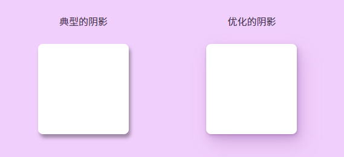
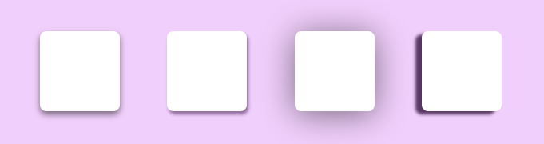
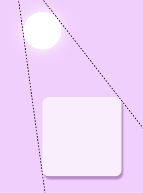
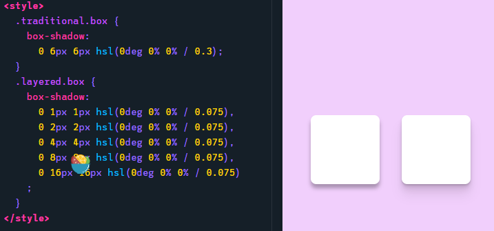
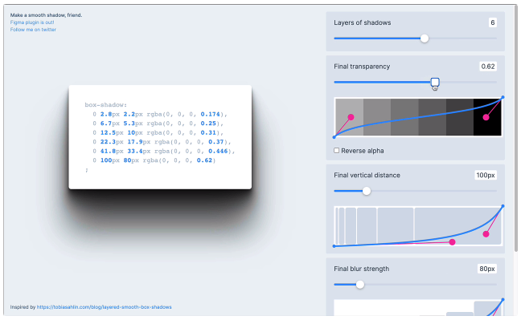
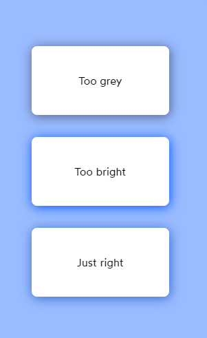
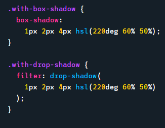
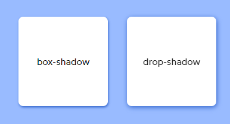
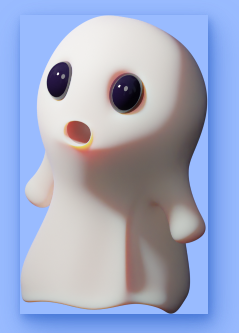

# CSS 设计美丽逼真的阴影

## 为什么使用阴影?

最好的网站和网络应用程序都具有一种切实的“真实”效果。要达到这种效果需要很多因素，但阴影是一个关键因素。

然而，当我们环顾周边的网页设计，很明显，大多数阴影并没有他们想象的那么丰富。网页上覆盖着模糊的灰色盒子，看起来并不像是阴影。

通过在头部和对话框上使用不同的阴影，我们创建了这样一种印象: 对话框比头部更接近我们。我们的注意力往往被吸引到离我们最近的元素上，因此通过提升对话框，我们使用户更有可能首先关注它。我们可以利用海拔作为引导注意力的工具。

当我使用阴影的时候，我们是带着这些目的之一来做的。要么我想增加某个特定元素的突出性，要么我想让我的应用程序感觉更实际、更逼真,而不是无脑的进行添加那些无意义的阴影。

但是，为了实现这些目标，我们首先需要对页面中的阴影采取整体的设计。

## 创建一致的环境

作者在很长一段时间，也没有正确地使用阴影😬。

当我想要一个元素有一个阴影时，我们通常情况下会添加一个 box-shadow 属性并对其属性进行修改，直到我喜欢结果的外观。

所以这里有个问题: 通过像这样单独创建每个阴影，最终会得到一堆不协调的阴影。

如果我们的目标是创造深度的错觉，我们需要每一个阴影来匹配。否则，它看起来就像一堆模糊的边框:

在自然界中，阴影是从光源投射出来的。阴影的方向取决于光线的位置,而一般来说，我们会为页面上的所有元素选择一个单独的光源。通常情况下，光源位于上方，并且稍微偏左:

如果 CSS 有一个真正的照明系统，我们会为一个或多个灯指定一个位置。但是遗憾的是，CSS 没有这样的东西。

所以我们只有通过指定水平偏移和垂直偏移来改变阴影位置。例如，在上图中，产生的阴影有4px 的垂直偏移和2px 的水平偏移。

**制作内聚阴影的第一个技巧: 页面上的每个阴影应该具有相同的比例。这将使它看起来好像每个元素都是从相同的非常远的光源照明，就像行星围绕太阳一样。但是不同位置的组件的阴影位置应该要进行不一样的调整。**

接下来，我们再来谈谈海拔的问题。我们怎样才能制造出一个元素给用户一种升高的错觉呢？

我们需要一前一后地调整box-shadow中所有4个变量来创建一个有凝聚力的观感。

通过上图来看前两个数字——**水平偏移距和垂直偏移距同时并列，垂直偏移距总是水平偏移距的2倍。**

当元素升得更高时，还会发生另外两件事:

- 模糊半径变得更加更大.
- 阴影变得更加模糊了.

(为了更加真实，还需要增加卡片的大小。)

## 技巧

### Layering 分层

现代的3 d 插图工具，比如 Blender，可以通过使用一种被称为光线追踪的技术来产生真实的阴影和光线。

在光线追踪中，数百束光线从相机源中射出，在场景中的表面反射数百次。这是一个计算代价高昂的技术; 它可能需要分钟到小时才能生成一个图像！

但是网页设计者则没有那种耐心，因此盒子阴影算法更加原始。它创建了一个我们的元素形状的盒子，并应用了一个基本的模糊算法。因此，我们的阴影永远不会看起来像照片一样真实，但是我们可以通过一个漂亮的技术来改进: 分层。

我们可以不使用单一的盒子阴影，而是将一把阴影叠加在一起，使用略有不同的偏移和半径,这就是分层:

上图左边为单一的阴影，而右边为多个阴影组成的分层。

这种技术在 Tobias Ahlin 的博客文章“光滑和锐利的阴影分层”中有详细的描述https://tobiasahlin.com/blog/layered-smooth-box-shadows/

分层阴影可以使阴影拥有多个层次不同的取值，从而更加倾向真实光照效果。

可以使用https://shadows.brumm.af/来进行生成分层阴影，它是非常棒的网页工具！ 

**注意:分层阴影会带来渲染性能影响**

分层的阴影无疑是好的，但它们也是有代价的。如果我们设置5个阴影，我们的设备还要做5倍的工作！这在现代硬件上并不是什么大问题，但是在老式的廉价移动设备上，它会降低渲染速度。此外，尝试动画一个分层的阴影可能是一个坏主意。

### Color-matched shadows 色彩匹配的阴影

到目前为止，我们所有使用的阴影都使用了半透明的黑色颜色，像 hsl (0deg 0% 0%/0.4)。这实际上并不理想。

当我们在背景颜色上叠加黑色时，不仅使其变暗，还使其饱和度大大降低。

在不同的底色背景下,以及不同的元素背景下,元素的阴影不应该都是一种颜色。

通过匹配色相和降低饱和度/明度，我们可以创建一个真实的阴影。

## 投影效果

在本教程中，我们一直在使用 box-shadow 属性。Box-shadow 是一个很好的全面工具，但它不是 CSS 中唯一的 shadow 选项。

看看` filter: drop-shadow`:

语法看起来几乎相同，但它产生的阴影是不同的。这是因为 filter 属性实际上是一个与 SVG 过滤器相关的 CSS 挂钩。投影使用的是 SVG 高斯模糊，这是一个不同的模糊算法。

这两者之间还有一些重要的区别，但现在我想把重点放在阴影的能力上: `filter`它勾勒出元素的形状,从而给SVG多边形图片进行投影,而原始的`box-shadow`则没法。

这对图片有用，但是它对 HTML 元素也有用！

还有一个小提示: 与 box-shadow 不同的是，filter 属性在 Chrome 以及其他浏览器中是硬件加速的。这意味着它是由 GPU 而不是 CPU 管理的。因此，性能往往更好，尤其是当动画。只要确保设置 `will-change:transform `，以避免一些 Safari 故障错误。

