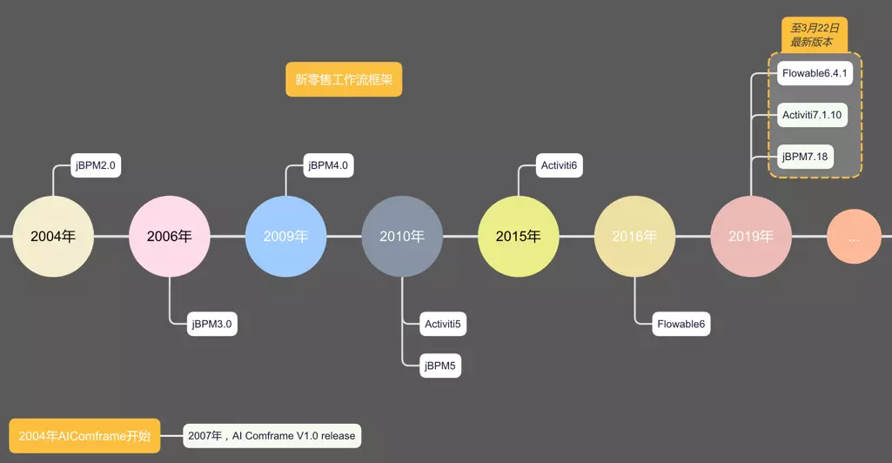
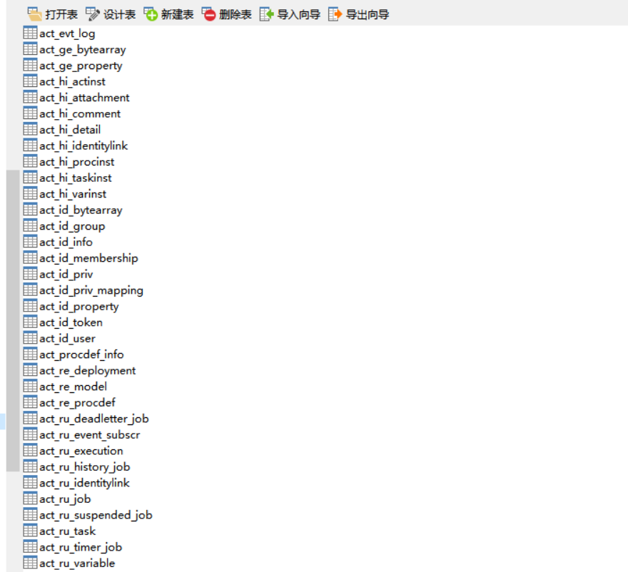
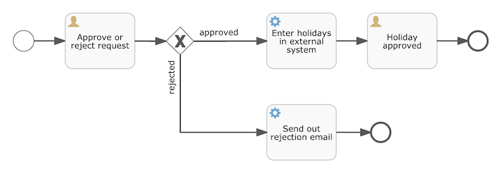

# Flowable业务流程引擎

## 前言

当我们要做一个系统，这个系统中有个审核流程，这个流程中，要求用户提交申请，然后管理员审核，最后得到结果。

对于这中事务情况，想必也能够通过使用普通的事务来进行操作整个逻辑。但是对于大型逻辑来说，这明显不能够单单只是用普通的事务来进行操作处理。

这时我们推荐使用一款业务流程引擎 - Flowable，业务流程引擎目前市面上很多，比如大名鼎鼎的Activiti 、Flowable、camunda等等。

Flowable是一个使用Java编写的轻量级业务流程引擎。Flowable流程引擎可用于部署BPMN 2.0流程定义（用于定义流程的行业XML标准）， 创建这些流程定义的流程实例，进行查询，访问运行中或历史的流程实例与相关数据，等等。这个章节将用一个可以在你自己的开发环境中使用的例子，逐步介绍各种概念与API。

为什么推荐使用Flowable？因为Flowable时Activiti原班人马打造的Activiti升级版，它修复了Activiti的上古错误问题。目前时最受欢迎和关注的新型业务流程引擎，未来Flowable一定会是业务流程引擎的趋势。




## 教程

我们将构建的例子是一个简单的文章审核流程：

- 用户(user)发布一篇文章
- 管理经理(manager)批准或驳回文章
- 我们会模拟将申请注册到某个外部系统，并给用户反馈。

### 创建流程引擎

添加Flowable的SpringBootStarter依赖：

```xml
<dependency>
    <groupId>org.flowable</groupId>
    <artifactId>flowable-spring-boot-starter</artifactId>
    <version>6.7.2</version>
</dependency>
```


加入依赖后，设置对应Mysql的JDBC配置以及它的配置：

```yaml
flowable:
  async-executor-activate: false
  database-schema-update: true
```

上面的配置很显然，就是关于每次启动项目是否自动更新，我们选择是。（**这里需要注意的是 目前这些最新版本的Flowable对SpringBoot最新版本自动更新不兼容，只能兼任到spring-boot的2.2.0.RELEASE**）

完成后，启动项目，等待一会后，数据库中会多处很多表。



这些表都是Flowable框架需要的表，它分别存储了它的工作流中的相关数据。

它们表名规则为：

- ACT_RE_* ：’ RE ’表示repository（存储）。RepositoryService接口操作的表。带此前缀的表包含的是静态信息，如，流程定义，流程的资源（图片，规则等）。
- ACT_RU_* ：’ RU ’表示runtime。这是运行时的表存储着流程变量，用户任务，变量，职责（job）等运行时的数据。flowable只存储实例执行期间的运行时数据，当流程实例结束时，将删除这些记录。这就保证了这些运行时的表小且快。
- ACT_ID_* : ’ ID ’表示identity(组织机构)。这些表包含标识的信息，如用户，用户组，等等。
- ACT_HI_* : ’ HI ’表示history。就是这些表包含着历史的相关数据，如结束的流程实例，变量，任务，等等。
- ACT_GE_* : 普通数据，各种情况都使用的数据。

| 表分类               | 表名                         | 表说明                   |
| -------------------- | ---------------------------- | ------------------------ |
| 一般数据(2)          | ACT_GE_BYTEARRAY             | 通用的流程定义和流程资源 |
| ACT_GE_PROPERTY      | 系统相关属性                 |                          |
| 流程历史记录(8)      | ACT_HI_ACTINST               | 历史的流程实例           |
| ACT_HI_ATTACHMENT    | 历史的流程附件               |                          |
| ACT_HI_COMMENT       | 历史的说明性信息             |                          |
| ACT_HI_DETAIL        | 历史的流程运行中的细节信息   |                          |
| ACT_HI_IDENTITYLINK  | 历史的流程运行过程中用户关系 |                          |
| ACT_HI_PROCINST      | 历史的流程实例               |                          |
| ACT_HI_TASKINST      | 历史的任务实例               |                          |
| ACT_HI_VARINST       | 历史的流程运行中的变量信息   |                          |
| 用户用户组表(9)      | ACT_ID_BYTEARRAY             | 二进制数据表             |
| ACT_ID_GROUP         | 用户组信息表                 |                          |
| ACT_ID_INFO          | 用户信息详情表               |                          |
| ACT_ID_MEMBERSHIP    | 人与组关系表                 |                          |
| ACT_ID_PRIV          | 权限表                       |                          |
| ACT_ID_PRIV_MAPPING  | 用户或组权限关系表           |                          |
| ACT_ID_PROPERTY      | 属性表                       |                          |
| ACT_ID_TOKEN         | 系统登录日志表               |                          |
| ACT_ID_USER          | 用户表                       |                          |
| 流程定义表(3)        | ACT_RE_DEPLOYMENT            | 部署单元信息             |
| ACT_RE_MODEL         | 模型信息                     |                          |
| ACT_RE_PROCDEF       | 已部署的流程定义             |                          |
| 运行实例表(10)       | ACT_RU_DEADLETTER_JOB        | 正在运行的任务表         |
| ACT_RU_EVENT_SUBSCR  | 运行时事件                   |                          |
| ACT_RU_EXECUTION     | 运行时流程执行实例           |                          |
| ACT_RU_HISTORY_JOB   | 历史作业表                   |                          |
| ACT_RU_IDENTITYLINK  | 运行时用户关系信息           |                          |
| ACT_RU_JOB           | 运行时作业表                 |                          |
| ACT_RU_SUSPENDED_JOB | 暂停作业表                   |                          |
| ACT_RU_TASK          | 运行时任务表                 |                          |
| ACT_RU_TIMER_JOB     | 定时作业表                   |                          |
| ACT_RU_VARIABLE      | 运行时变量表                 |                          |
| 其他表(2)            | ACT_EVT_LOG                  | 事件日志表               |
| ACT_PROCDEF_INFO     | 流程定义信息                 |                          |


### 部署流程定义

要构建的流程是一个非常简单的审核流程。Flowable引擎需要流程定义为BPMN 2.0格式，这是一个业界广泛接受的XML标准。

在Flowable术语中，我们将其称为一个流程定义(process definition)。一个流程定义可以启动多个流程实例(process instance)。流程定义可以看做是重复执行流程的蓝图。 在这个例子中，流程定义定义了请假的各个步骤，而一个流程实例对应某个雇员提出的一个请假申请。

BPMN 2.0存储为XML，并包含可视化的部分：使用标准方式定义了每个步骤类型（人工任务，自动服务调用，等等）如何呈现，以及如何互相连接。这样BPMN 2.0标准使技术人员与业务人员能用双方都能理解的方式交流业务流程。

用图片描述大概生成的流程为：



流程定义的说明：

- 我们假定启动流程需要提供一些信息，例如用户ID、帖子的ID、帖子标题。当然，这些可以单独建模为流程中的第一步。 但是如果将它们作为流程的“输入信息”，就能保证只有在实际请求时才会建立一个流程实例。否则（将提交作为流程的第一步），用户可能在提交之前改变主意并取消，但流程实例已经创建了。 在某些场景中，就可能影响重要的指标（例如启动了多少申请，但还未完成），取决于业务目标。
- 左侧的圆圈叫做**启动事件(start event)**。这是一个流程实例的起点。
- 第一个矩形是一个**用户任务(user task)**。这是流程中人类用户操作的步骤。在这个例子中，经理需要批准或驳回申请。
- 取决于经理的决定，**排他网关(exclusive gateway)** (带叉的菱形)会将流程实例路由至批准或驳回路径。
- 如果批准，则需要将申请注册至某个外部系统，通知给用户，最终结束。
- 如果驳回，则也通知用户，最终结束。

一般来说，这样的流程定义使用可视化建模工具建立，但是其实手动编写流程也很简单。

BPMN 2.0 XML文件通常以bpmn20 xml来做后缀。

在src/main/resources文件夹下创建为`processes.bpmn20.xml`文件：

```xml
<?xml version="1.0" encoding="utf-8" ?>

<definitions xmlns="http://www.omg.org/spec/BPMN/20100524/MODEL"
             xmlns:xsi="http://www.w3.org/2001/XMLSchema-instance"
             xmlns:xsd="http://www.w3.org/2001/XMLSchema"
             xmlns:bpmndi="http://www.omg.org/spec/BPMN/20100524/DI"
             xmlns:omgdc="http://www.omg.org/spec/DD/20100524/DC"
             xmlns:omgdi="http://www.omg.org/spec/DD/20100524/DI"
             xmlns:flowable="http://flowable.org/bpmn"
             typeLanguage="http://www.w3.org/2001/XMLSchema"
             expressionLanguage="http://www.w3.org/1999/XPath"
             targetNamespace="http://www.flowable.org/processdef">

    <process id="holiday-request" name="Holiday Request" isExecutable="true">
        <!--开始事件：流程实例的起点-->
        <startEvent id="startEvent"/>
        <!--顺序流：执行时会从一个活动流向另一个活动-->
        <sequenceFlow sourceRef="startEvent" targetRef="approveTask"/>

        <userTask id="postTask" name="Post request" flowable:assignee="${userId}"/>

        <!--用户任务：需要人工来进行操作-->
        <userTask id="approveTask" name="Approve or reject request" flowable:candidateGroups="managers"/>
        <sequenceFlow sourceRef="approveTask" targetRef="decision"/>

        <!--排他网关-->
        <exclusiveGateway id="decision"/>
        <sequenceFlow sourceRef="decision" targetRef="externalSystemCall">
            <!--顺序流条件：以表达式(expression)的形式定义了条件(condition) -->
            <conditionExpression xsi:type="tFormalExpression">
                <!--条件表达式：是${approved == true}的简写-->
                <![CDATA[
                  ${approved}
                ]]>
            </conditionExpression>
        </sequenceFlow>
        <sequenceFlow sourceRef="decision" targetRef="sendRejectionMail">
            <conditionExpression xsi:type="tFormalExpression">
                <![CDATA[
                  ${!approved}
                ]]>
            </conditionExpression>
        </sequenceFlow>

        <!--服务任务，一个自动活动，它会调用一些服务-->
        <serviceTask id="externalSystemCall" name="Enter holidays in external system"
                     flowable:class="com.test.ipp.demo.process.SendPassedNotice"/>
        <sequenceFlow sourceRef="externalSystemCall" targetRef="approveEnd"/>

        <serviceTask id="sendRejectionMail" name="Send out rejection email"
                     flowable:class="com.test.ipp.demo.process.SendNoPassedNotice"/>
        <sequenceFlow sourceRef="sendRejectionMail" targetRef="approveEnd"/>

        <!--结束事件-->
        <endEvent id="approveEnd"/>
    </process>

</definitions>
```

我们可以发现 我们总共使用了下面这些标签:

* `definitions`: 这个标签类似于Html拥有，用作声明当前文件为bpmn文件。通常直接Copy来即可。
* `process`:用做定义一个流程，一个bpmn文件中的Body的作用，里面的内容就是流程操作。
* `startEvent`: 开始标签，表示流程开始。
* `sequenceFlow`: 箭头标签，相当于上面的箭头，用作一个操作到另一个操作。
* `userTask`: 用户标签，它表示一个停滞操作，表示需要用户进行操作才能自行继续，就相当于 管理员审核这个操作 。
* `exclusiveGateway`: 排他网关标签，相当于一个Switch语句，用作判断，通常将其 流程变量 中 的一个参数作为 判断源。
* `serviceTask`: 服务标签，执行到这一步时，自动执行某个类的操作。可以用它实现 自动化。
* `endEvent`: 结束标签，运行到这 表示该流程结束。

再详细解析下：

- 每一个步骤（在BPMN 2.0术语中称作**活动(activity)**）都有一个id属性，为其提供一个在XML文件中唯一的标识符。所有的活动都可以设置一个名字，以提高流程图的可读性。
- 活动之间通过**顺序流(sequence flow)**连接，在流程图中是一个有向箭头。在执行流程实例时，执行(execution)会从启动事件沿着顺序流流向下一个活动。
- 离开**排他网关(带有X的菱形)**的顺序流很特别：都以表达式(expression)的形式定义了条件(condition) 。当流程实例的执行到达这个网关时，会计算条件，并使用第一个计算为true的顺序流。这就是排他的含义：**只选择一个。**当然如果需要不同的路由策略，可以使用其他类型的网关。
- 这里用作条件的表达式为approved，这是approved，这是{approved == true}的简写。变量’approved’被称作流程变量(process variable)。流程变量是持久化的数据，与流程实例存储在一起，并可以在流程实例的生命周期中使用。在这个例子里，我们需要在特定的地方（当经理用户任务提交时，或者以Flowable的术语来说，完成(complete)时）设置这个流程变量，因为这不是流程实例启动时就能获取的数据。


现在我们已经有了流程BPMN 2.0 XML文件，接下来需要将它部署(deploy)到引擎中。部署一个流程定义意味着：

- 流程引擎会将XML文件存储在数据库中，这样可以在需要的时候获取它。
- 流程定义转换为内部的、可执行的对象模型，这样使用它就可以启动流程实例。

当然这一步，如果再上面配置中我们配置了自动更新的话，我们不需要做，当然没有配置自动更新的话需要手动来部署到引擎中。

```java
@Autowired
private ProcessEngine processEngine;

...
//创建RepositoryService实例
RepositoryService repositoryService=processEngine.getRepositoryService();
//加载流程
 Deployment deployment=repositoryService.createDeployment()
                .addClasspathResource("holiday-request.bpmn20.xml")
                .deploy();
```


### 创建一个流程

到这一步，这里我们便可以开始创建一个流程了。

在例子中，这便是创建一个申请 审核文章，我们在文章发布后接着进行这步操作即可。

```java
@GetMapping("post")
public void createNewPost(Integer userId,Integer postId, String postTitle) {
    // 使用RuntimeService启动一个流程实例
    RuntimeService runtimeService = processEngine.getRuntimeService();
    Map<String, Object> variables = new HashMap<String, Object>();
    variables.put("userId", userId);
    variables.put("postId", postId);
    variables.put("postTitle", postTitle);
    variables.put("approved", Boolean.valueOf("false"));
    runtimeService.startProcessInstanceByKey("holiday-request", variables);
}
```

我们使用RuntimeService启动一个流程实例。收集的数据作为一个java.util.Map实例传递，其中的键就是之后用于获取变量的标识符。这个流程实例使用key启动(还有其它方式)。这个key就是BPMN 2.0 XML文件中设置的id属性，在这个例子里设置的是holiday-request。

在流程实例启动后，会创建一个**执行(execution)**，并将其放在启动事件上。从这里开始，这个执行会沿着顺序流移动到经理审批的用户任务，并执行用户任务行为。这个行为将在数据库中创建一个任务，该任务可以之后使用查询找到。用户任务是一个等待状态(wait state)，引擎会停止执行，返回API调用处。


### 查询等待的事务

上面那个 流程 运行后 这个任务就在 下一个 UserTask停了下来，这边需要管理员来手动来审核才能继续。

对于管理员我们 需要查询 我们需要审核的文章列表。

```java
@GetMapping("queryPendingReviewList")
public void queryPendingReviewList() {
    //通过TaskService查询 manager 组的任务
    TaskService taskService = processEngine.getTaskService();
    List<Task> taskList = taskService.createTaskQuery().taskCandidateGroup("managers").list();
    System.out.println("You have " + taskList.size() + " tasks:");
    for (int i = 0; i < taskList.size(); i++) {
        Task task = taskList.get(i);
        Map<String, Object> variables = taskService.getVariables(task.getId());
        System.out.println((i + 1) + ") " + task.getId() + ":" + variables.get("postTitle"));
    }
}
```

这里要获得实际的任务列表，需要通过TaskService创建一个TaskQuery。这个查询配置为只返回’managers’组的任务，然后使用集合下标获取特定流程实例的变量,在控制台输出（实际情况下使用RestFul 返回Json）。


### 处理事务

当管理员审核完一个帖子后，在实际开发中，通常由用户提交一个表单。表单中的数据作为流程变量传递。在这里，我们在完成任务时传递带有’approved’变量（这个名字很重要，因为之后会在顺序流的条件中使用）的map来模拟：

```java
@GetMapping("reviewPassed")
public void reviewPassed(String approved, String taskId) {
    TaskService taskService = processEngine.getTaskService();
    Task task = taskService.createTaskQuery().taskId(taskId).list().get(0);
    Map<String, Object> variables = task.getProcessVariables();
    //经理完成任务
    variables.put("approved", Boolean.valueOf(approved));
    //任务完成，并会在离开排他网关的两条路径中，基于’approved ’流程变量选择一条
    taskService.complete(task.getId(), variables);
}
```


