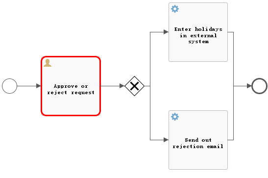

# Flowable业务流程引擎

## 前言

当我们要做一个系统，这个系统中有个审核流程，这个流程中，要求用户提交申请，然后管理员审核，最后得到结果。

对于这中事务情况，想必也能够通过使用普通的事务来进行操作整个逻辑。但是对于大型逻辑来说，这明显不能够单单只是用普通的事务来进行操作处理。

这时我们推荐使用一款业务流程引擎 - Flowable，业务流程引擎目前市面上很多，比如大名鼎鼎的Activiti 、Flowable、camunda等等。

Flowable是一个使用Java编写的轻量级业务流程引擎。Flowable流程引擎可用于部署BPMN 2.0流程定义（用于定义流程的行业XML标准）， 创建这些流程定义的流程实例，进行查询，访问运行中或历史的流程实例与相关数据，等等。这个章节将用一个可以在你自己的开发环境中使用的例子，逐步介绍各种概念与API。

为什么推荐使用Flowable？因为Flowable时Activiti原班人马打造的Activiti升级版，它修复了Activiti的上古错误问题。目前时最受欢迎和关注的新型业务流程引擎，未来Flowable一定会是业务流程引擎的趋势。


## 教程

我们将构建的例子是一个简单的文章审核流程：

- 用户(user)发布一篇文章
- 管理经理(manager)批准或驳回文章
- 我们会模拟将申请注册到某个外部系统，并给用户反馈。

### 创建流程引擎

添加Flowable的SpringBootStarter依赖：

```xml
<dependency>
    <groupId>org.flowable</groupId>
    <artifactId>flowable-spring-boot-starter</artifactId>
    <version>6.7.2</version>
</dependency>
```


加入依赖后，设置对应Mysql的JDBC配置以及它的配置：

```yaml
flowable:
  async-executor-activate: false
  database-schema-update: true
```

上面的配置很显然，就是关于每次启动项目是否自动更新，我们选择是。（**这里需要注意的是 目前这些最新版本的Flowable对SpringBoot最新版本自动更新不兼容，只能兼任到spring-boot的2.2.0.RELEASE**）

完成后，启动项目，等待一会后，数据库中会多处很多表。


这些表都是Flowable框架需要的表，它分别存储了它的工作流中的相关数据。

它们表名规则为：

- ACT_RE_* ：’ RE ’表示repository（存储）。RepositoryService接口操作的表。带此前缀的表包含的是静态信息，如，流程定义，流程的资源（图片，规则等）。
- ACT_RU_* ：’ RU ’表示runtime。这是运行时的表存储着流程变量，用户任务，变量，职责（job）等运行时的数据。flowable只存储实例执行期间的运行时数据，当流程实例结束时，将删除这些记录。这就保证了这些运行时的表小且快。
- ACT_ID_* : ’ ID ’表示identity(组织机构)。这些表包含标识的信息，如用户，用户组，等等。
- ACT_HI_* : ’ HI ’表示history。就是这些表包含着历史的相关数据，如结束的流程实例，变量，任务，等等。
- ACT_GE_* : 普通数据，各种情况都使用的数据。

| 表分类               | 表名                         | 表说明                   |
| -------------------- | ---------------------------- | ------------------------ |
| 一般数据(2)          | ACT_GE_BYTEARRAY             | 通用的流程定义和流程资源 |
| ACT_GE_PROPERTY      | 系统相关属性                 |                          |
| 流程历史记录(8)      | ACT_HI_ACTINST               | 历史的流程实例           |
| ACT_HI_ATTACHMENT    | 历史的流程附件               |                          |
| ACT_HI_COMMENT       | 历史的说明性信息             |                          |
| ACT_HI_DETAIL        | 历史的流程运行中的细节信息   |                          |
| ACT_HI_IDENTITYLINK  | 历史的流程运行过程中用户关系 |                          |
| ACT_HI_PROCINST      | 历史的流程实例               |                          |
| ACT_HI_TASKINST      | 历史的任务实例               |                          |
| ACT_HI_VARINST       | 历史的流程运行中的变量信息   |                          |
| 用户用户组表(9)      | ACT_ID_BYTEARRAY             | 二进制数据表             |
| ACT_ID_GROUP         | 用户组信息表                 |                          |
| ACT_ID_INFO          | 用户信息详情表               |                          |
| ACT_ID_MEMBERSHIP    | 人与组关系表                 |                          |
| ACT_ID_PRIV          | 权限表                       |                          |
| ACT_ID_PRIV_MAPPING  | 用户或组权限关系表           |                          |
| ACT_ID_PROPERTY      | 属性表                       |                          |
| ACT_ID_TOKEN         | 系统登录日志表               |                          |
| ACT_ID_USER          | 用户表                       |                          |
| 流程定义表(3)        | ACT_RE_DEPLOYMENT            | 部署单元信息             |
| ACT_RE_MODEL         | 模型信息                     |                          |
| ACT_RE_PROCDEF       | 已部署的流程定义             |                          |
| 运行实例表(10)       | ACT_RU_DEADLETTER_JOB        | 正在运行的任务表         |
| ACT_RU_EVENT_SUBSCR  | 运行时事件                   |                          |
| ACT_RU_EXECUTION     | 运行时流程执行实例           |                          |
| ACT_RU_HISTORY_JOB   | 历史作业表                   |                          |
| ACT_RU_IDENTITYLINK  | 运行时用户关系信息           |                          |
| ACT_RU_JOB           | 运行时作业表                 |                          |
| ACT_RU_SUSPENDED_JOB | 暂停作业表                   |                          |
| ACT_RU_TASK          | 运行时任务表                 |                          |
| ACT_RU_TIMER_JOB     | 定时作业表                   |                          |
| ACT_RU_VARIABLE      | 运行时变量表                 |                          |
| 其他表(2)            | ACT_EVT_LOG                  | 事件日志表               |
| ACT_PROCDEF_INFO     | 流程定义信息                 |                          |


### 部署流程定义

要构建的流程是一个非常简单的审核流程。Flowable引擎需要流程定义为BPMN 2.0格式，这是一个业界广泛接受的XML标准。

在Flowable术语中，我们将其称为一个流程定义(process definition)。一个流程定义可以启动多个流程实例(process instance)。流程定义可以看做是重复执行流程的蓝图。 在这个例子中，流程定义定义了请假的各个步骤，而一个流程实例对应某个雇员提出的一个请假申请。

BPMN 2.0存储为XML，并包含可视化的部分：使用标准方式定义了每个步骤类型（人工任务，自动服务调用，等等）如何呈现，以及如何互相连接。这样BPMN 2.0标准使技术人员与业务人员能用双方都能理解的方式交流业务流程。

用图片描述大概生成的流程为：


流程定义的说明：

- 我们假定启动流程需要提供一些信息，例如用户ID、帖子的ID、帖子标题。当然，这些可以单独建模为流程中的第一步。 但是如果将它们作为流程的“输入信息”，就能保证只有在实际请求时才会建立一个流程实例。否则（将提交作为流程的第一步），用户可能在提交之前改变主意并取消，但流程实例已经创建了。 在某些场景中，就可能影响重要的指标（例如启动了多少申请，但还未完成），取决于业务目标。
- 左侧的圆圈叫做**启动事件(start event)**。这是一个流程实例的起点。
- 第一个矩形是一个**用户任务(user task)**。这是流程中人类用户操作的步骤。在这个例子中，经理需要批准或驳回申请。
- 取决于经理的决定，**排他网关(exclusive gateway)** (带叉的菱形)会将流程实例路由至批准或驳回路径。
- 如果批准，则需要将申请注册至某个外部系统，通知给用户，最终结束。
- 如果驳回，则也通知用户，最终结束。

一般来说，这样的流程定义使用可视化建模工具建立，但是其实手动编写流程也很简单。

BPMN 2.0 XML文件通常以bpmn20 xml来做后缀。

在src/main/resources文件夹下创建为`processes.bpmn20.xml`文件：

```xml
<?xml version="1.0" encoding="utf-8" ?>

<definitions xmlns="http://www.omg.org/spec/BPMN/20100524/MODEL"
             xmlns:xsi="http://www.w3.org/2001/XMLSchema-instance"
             xmlns:xsd="http://www.w3.org/2001/XMLSchema"
             xmlns:bpmndi="http://www.omg.org/spec/BPMN/20100524/DI"
             xmlns:omgdc="http://www.omg.org/spec/DD/20100524/DC"
             xmlns:omgdi="http://www.omg.org/spec/DD/20100524/DI"
             xmlns:flowable="http://flowable.org/bpmn"
             typeLanguage="http://www.w3.org/2001/XMLSchema"
             expressionLanguage="http://www.w3.org/1999/XPath"
             targetNamespace="http://www.flowable.org/processdef">

    <process id="holiday-request" name="Holiday Request" isExecutable="true">
        <!--开始事件：流程实例的起点-->
        <startEvent id="startEvent"/>
        <!--顺序流：执行时会从一个活动流向另一个活动-->
        <sequenceFlow sourceRef="startEvent" targetRef="approveTask"/>

        <userTask id="postTask" name="Post request" flowable:assignee="${userId}"/>

        <!--用户任务：需要人工来进行操作-->
        <userTask id="approveTask" name="Approve or reject request" flowable:candidateGroups="managers"/>
        <sequenceFlow sourceRef="approveTask" targetRef="decision"/>

        <!--排他网关-->
        <exclusiveGateway id="decision"/>
        <sequenceFlow sourceRef="decision" targetRef="externalSystemCall">
            <!--顺序流条件：以表达式(expression)的形式定义了条件(condition) -->
            <conditionExpression xsi:type="tFormalExpression">
                <!--条件表达式：是${approved == true}的简写-->
                <![CDATA[
                  ${approved}
                ]]>
            </conditionExpression>
        </sequenceFlow>
        <sequenceFlow sourceRef="decision" targetRef="sendRejectionMail">
            <conditionExpression xsi:type="tFormalExpression">
                <![CDATA[
                  ${!approved}
                ]]>
            </conditionExpression>
        </sequenceFlow>

        <!--服务任务，一个自动活动，它会调用一些服务-->
        <serviceTask id="externalSystemCall" name="Enter holidays in external system"
                     flowable:class="com.test.ipp.demo.process.SendPassedNotice"/>
        <sequenceFlow sourceRef="externalSystemCall" targetRef="approveEnd"/>

        <serviceTask id="sendRejectionMail" name="Send out rejection email"
                     flowable:class="com.test.ipp.demo.process.SendNoPassedNotice"/>
        <sequenceFlow sourceRef="sendRejectionMail" targetRef="approveEnd"/>

        <!--结束事件-->
        <endEvent id="approveEnd"/>
    </process>

</definitions>
```

我们可以发现 我们总共使用了下面这些标签:

* `definitions`: 这个标签类似于Html拥有，用作声明当前文件为bpmn文件。通常直接Copy来即可。
* `process`:用做定义一个流程，一个bpmn文件中的Body的作用，里面的内容就是流程操作。
* `startEvent`: 开始标签，表示流程开始。
* `sequenceFlow`: 箭头标签，相当于上面的箭头，用作一个操作到另一个操作。
* `userTask`: 用户标签，它表示一个停滞操作，表示需要用户进行操作才能自行继续，就相当于 管理员审核这个操作 。
* `exclusiveGateway`: 排他网关标签，相当于一个Switch语句，用作判断，通常将其 流程变量 中 的一个参数作为 判断源。
* `serviceTask`: 服务标签，执行到这一步时，自动执行某个类的操作。可以用它实现 自动化。
* `endEvent`: 结束标签，运行到这 表示该流程结束。

再详细解析下：

- 每一个步骤（在BPMN 2.0术语中称作**活动(activity)**）都有一个id属性，为其提供一个在XML文件中唯一的标识符。所有的活动都可以设置一个名字，以提高流程图的可读性。
- 活动之间通过**顺序流(sequence flow)**连接，在流程图中是一个有向箭头。在执行流程实例时，执行(execution)会从启动事件沿着顺序流流向下一个活动。
- 离开**排他网关(带有X的菱形)**的顺序流很特别：都以表达式(expression)的形式定义了条件(condition) 。当流程实例的执行到达这个网关时，会计算条件，并使用第一个计算为true的顺序流。这就是排他的含义：**只选择一个。**当然如果需要不同的路由策略，可以使用其他类型的网关。
- 这里用作条件的表达式为approved，这是approved，这是{approved == true}的简写。变量’approved’被称作流程变量(process variable)。流程变量是持久化的数据，与流程实例存储在一起，并可以在流程实例的生命周期中使用。在这个例子里，我们需要在特定的地方（当经理用户任务提交时，或者以Flowable的术语来说，完成(complete)时）设置这个流程变量，因为这不是流程实例启动时就能获取的数据。


现在我们已经有了流程BPMN 2.0 XML文件，接下来需要将它部署(deploy)到引擎中。部署一个流程定义意味着：

- 流程引擎会将XML文件存储在数据库中，这样可以在需要的时候获取它。
- 流程定义转换为内部的、可执行的对象模型，这样使用它就可以启动流程实例。

当然这一步，如果再上面配置中我们配置了自动更新的话，我们不需要做，当然没有配置自动更新的话需要手动来部署到引擎中。

```java
@Autowired
private ProcessEngine processEngine;

...
//创建RepositoryService实例
RepositoryService repositoryService=processEngine.getRepositoryService();
//加载流程
 Deployment deployment=repositoryService.createDeployment()
                .addClasspathResource("holiday-request.bpmn20.xml")
                .deploy();
```


### 创建一个流程

到这一步，这里我们便可以开始创建一个流程了。

在例子中，这便是创建一个申请 审核文章，我们在文章发布后接着进行这步操作即可。

```java
@GetMapping("post")
public void createNewPost(Integer userId,Integer postId, String postTitle) {
    // 使用RuntimeService启动一个流程实例
    RuntimeService runtimeService = processEngine.getRuntimeService();
    Map<String, Object> variables = new HashMap<String, Object>();
    variables.put("userId", userId);
    variables.put("postId", postId);
    variables.put("postTitle", postTitle);
    variables.put("approved", Boolean.valueOf("false"));
    runtimeService.startProcessInstanceByKey("holiday-request", variables);
}
```

我们使用RuntimeService启动一个流程实例。收集的数据作为一个java.util.Map实例传递，其中的键就是之后用于获取变量的标识符。这个流程实例使用key启动(还有其它方式)。这个key就是BPMN 2.0 XML文件中设置的id属性，在这个例子里设置的是holiday-request。

在流程实例启动后，会创建一个**执行(execution)**，并将其放在启动事件上。从这里开始，这个执行会沿着顺序流移动到经理审批的用户任务，并执行用户任务行为。这个行为将在数据库中创建一个任务，该任务可以之后使用查询找到。用户任务是一个等待状态(wait state)，引擎会停止执行，返回API调用处。


### 查询等待的事务

上面那个 流程 运行后 这个任务就在 下一个 UserTask停了下来，这边需要管理员来手动来审核才能继续。

对于管理员我们 需要查询 我们需要审核的文章列表。

```java
@GetMapping("queryPendingReviewList")
public void queryPendingReviewList() {
    //通过TaskService查询 manager 组的任务
    TaskService taskService = processEngine.getTaskService();
    List<Task> taskList = taskService.createTaskQuery().taskCandidateGroup("managers").list();
    System.out.println("You have " + taskList.size() + " tasks:");
    for (int i = 0; i < taskList.size(); i++) {
        Task task = taskList.get(i);
        Map<String, Object> variables = taskService.getVariables(task.getId());
        System.out.println((i + 1) + ") " + task.getId() + ":" + variables.get("postTitle"));
    }
}
```

这里要获得实际的任务列表，需要通过TaskService创建一个TaskQuery。这个查询配置为只返回’managers’组的任务，然后使用集合下标获取特定流程实例的变量,在控制台输出（实际情况下使用RestFul 返回Json）。


### 处理事务

当管理员审核完一个帖子后，在实际开发中，通常由用户提交一个表单。表单中的数据作为流程变量传递。在这里，我们在完成任务时传递带有’approved’变量（这个名字很重要，因为之后会在顺序流的条件中使用）的map来模拟：

```java
@GetMapping("reviewPassed")
public void reviewPassed(String approved, String taskId) {
    TaskService taskService = processEngine.getTaskService();
    Task task = taskService.createTaskQuery().taskId(taskId).list().get(0);
    Map<String, Object> variables = task.getProcessVariables();
    //经理完成任务
    variables.put("approved", Boolean.valueOf(approved));
    //任务完成，并会在离开排他网关的两条路径中，基于’approved ’流程变量选择一条
    taskService.complete(task.getId(), variables);
}
```

当TaskService给指定task 发出complete指令后，则完成userTask步骤，由箭头继续下个步骤；

由于下一步是一个exclusiveGateway指令，属于自动属性，它的定义中判断了`approved`属性，决定下一步的流程方向；

```xml
<exclusiveGateway id="decision"/>
        <sequenceFlow sourceRef="decision" targetRef="externalSystemCall">
            <!--顺序流条件：以表达式(expression)的形式定义了条件(condition) -->
            <conditionExpression xsi:type="tFormalExpression">
                <!--条件表达式：是${approved == true}的简写-->
                <![CDATA[
                  ${approved}
                ]]>
            </conditionExpression>
        </sequenceFlow>
        <sequenceFlow sourceRef="decision" targetRef="sendRejectionMail">
            <conditionExpression xsi:type="tFormalExpression">
                <![CDATA[
                  ${!approved}
                ]]>
            </conditionExpression>
        </sequenceFlow>
```

上方定义中`conditionExpression`顺序流条件定义 导向到 `externalSystemCall`、`sendRejectionMail`两个 `serviceTask`服务标签中。


服务标签定义了一个类，用作自动执行该类的作用。

要创建一个这样的一个类，需要实现JavaDelegate接口，实现execute方法，这个方法可以写很多业务逻辑，比如这里我们只是是在控制台打印输出一些内容：

```java
public class CallExternalSystemDelegate implements JavaDelegate {
    public void execute(DelegateExecution delegateExecution) {
        System.out.println("Calling the external system for employee "
                + delegateExecution.getVariable("employee"));
    }
}
```

DelegateExecution参数 可以获取到流程的相关参数信息。

这样一个简单的审核流程就完成了。


### 使用历史数据

对应审核系统来说，那么自然审核流程的查看自然也非常重要。

比如说点击一个请求，会遍历出它的所有审核流程信息，包括什么时间审核通过、哪位审核员审核的等等信息。

选择使用Flowable这样的流程引擎的原因之一，是它可以自动存储所有流程实例的审计数据或历史数据。这些数据可以用于创建报告，深入展现组织运行的情况，瓶颈在哪里，等等...

从ProcessEngine获取HistoryService，并创建历史活动(historical activities)的查询。

```java
 	   //获取HistoryService实例
        HistoryService historyService=processEngine.getHistoryService();
        //添加查询条件
        List<HistoricActivityInstance> activities =
                historyService.createHistoricActivityInstanceQuery()
                        //选择特定实例
                        .processInstanceId(processInstance.getId())
                        //选择已完成的
                        .finished()
                        //根据实例完成时间升序排列
                        .orderByHistoricActivityInstanceEndTime().asc()
                        .list();
		// 使用stream过滤掉没有名称的活动
        List<HistoricActivityInstance> activites = allActivites.stream().filter(a -> a.getActivityName() != null).collect(Collectors.toList());
		
        for (HistoricActivityInstance activity : activites) {
            System.out.print("\n" + activity.getActivityId() + ":" + activity.getActivityName() + ":处理时间-" + DateUtils.format(activity.getEndTime(), DateUtils.DATE_TIME_PATTERN));
        }
```


### 生成实时流程进行图

Flowable可以在正在进行的流程中 生成一幅流程进行图。

要使用Flowable生成实时流程进行图的话，就需要引入一个bpmn处理依赖。

```xml
<dependency>
    <groupId>org.flowable</groupId>
    <artifactId>flowable-bpmn-layout</artifactId>
    <version>6.7.2</version>
</dependency>
```

这个依赖包等级需要与你的Flowable一样，否则项目运行就要出错。

下面就是代码：

```java
@GetMapping("/{processId}")
public void genProcessDiagram(HttpServletResponse httpServletResponse,
                              @PathVariable("processId") String processId) throws Exception {
    RuntimeService runtimeService = processEngine.getRuntimeService();
    ProcessInstance pi = runtimeService.createProcessInstanceQuery().processInstanceId(processId).singleResult();

    //流程走完的不显示图
    if (pi == null) {
        return;
    }
    TaskService taskService = processEngine.getTaskService();
    Task task = taskService.createTaskQuery().processInstanceId(pi.getId()).singleResult();
    //使用流程实例ID，查询正在执行的执行对象表，返回流程实例对象
    String InstanceId = task.getProcessInstanceId();
    List<Execution> executions = runtimeService
            .createExecutionQuery()
            .processInstanceId(InstanceId)
            .list();

    //得到正在执行的Activity的Id
    List<String> activityIds = new ArrayList<>();
    List<String> flows = new ArrayList<>();
    for (Execution exe : executions) {
        List<String> ids = runtimeService.getActiveActivityIds(exe.getId());
        activityIds.addAll(ids);
    }

    //获取流程图
    RepositoryService repositoryService = processEngine.getRepositoryService();
    BpmnModel bpmnModel = repositoryService.getBpmnModel(pi.getProcessDefinitionId());
    ProcessEngineConfiguration engconf = processEngine.getProcessEngineConfiguration();
    ProcessDiagramGenerator diagramGenerator = engconf.getProcessDiagramGenerator();

    BpmnAutoLayout bpmnAutoLayout = new BpmnAutoLayout(bpmnModel);
    bpmnAutoLayout.setTaskHeight(120);
    bpmnAutoLayout.setTaskWidth(120);
    bpmnAutoLayout.execute();

    InputStream in = diagramGenerator.generateDiagram(bpmnModel, "png",
            activityIds, flows, "宋体", "宋体", "宋体", null, 1.0, true);
    OutputStream out = null;
    byte[] buf = new byte[1024];
    int legth = 0;
    try {
        out = httpServletResponse.getOutputStream();
        while ((legth = in.read(buf)) != -1) {
            out.write(buf, 0, legth);
        }
    } finally {
        if (in != null) {
            in.close();
        }
        if (out != null) {
            out.close();
        }
    }
}
```

请求需要一个流程ID，生成的图片大概如下：




## BPMN详解

上面教程中，我们创建了一个简单的审核流程BPMN文件，它只是使用了几个元素来构成，下面详解BPMN的更多内容。

### BPMN简介

BPMN是业务流程模型和标记法（BPMN, Business Process Model and Notation）的常用缩写，是一套图形化表示法，它主要是用于以业务流程模型详细说明各种业务流程。

它最初由业务流程管理倡议组织（BPMI, Business Process Management Initiative）开发，名称为"Business Process Modeling Notation"，即“业务流程建模标记法”。BPMI于2005年与对象管理组织（OMG, Object Management Group）合并。2011年1月OMG发布2.0版本，同时改为现在的名称。所以说现在使用的是BPMN2.0。在实际BPMN文件中后缀名标记为`.bpmn20.xml`。

### 基础要素

BPMN包含四种要素。

* **流对象（Flow Object）**:

  - 事件（Events）

  - 活动（Activities）

  - 网关（Gateways）

* **连接对象（Connecting Objects）:**

  - 顺序流（Sequence Flow）
  - 消息流（Message Flow）
  - 关联（Association）

- **泳道（Swimlanes）：**
  - 池（Pool）
  - 道（Lane）

- **附加工件（Artifacts/Artefacts）:**
  - 数据对象（Data Object）
  - 组（Group）
  - 注释（Annotation）

上面的基础对象元件中，其实大部分时间，我们只需要关注这4个基本对象：

- 事件（Event）：用来表明流程的生命周期中发生了什么。常见的主要是 开始事件、结束事件
- 活动（Activity）：活动（Activities）是业务流程定义的核心元素，中文称为“活动”、“节点”、“步骤”。一个活动可以是流程的基本处理单元（如人工任务、服务任务），也可以是一个组合单元（如外部子流程、嵌套子流程）。 上面教程中，我们的审核步骤就是一个 活动,属于人工任务活动。
- 网关（Gateway）：用来控制流程的流向。
- 流向/顺序流（Flow）：是连接两个流程节点的连线。


### 流程根元素

一个BPMN 2.0 XML流程的根是definitions元素。 在命名状态，子元素会包含真正的业务流程定义。 

每个process子元素 可以拥有一个id（必填）和 name（可选）。下面是一个空的BPMN 2.0业务流程 。

```xml
<definitions id="myProcesses"
  xmlns:xsi="http://www.w3.org/2001/XMLSchema-instance"
  xsi:schemaLocation="http://schema.omg.org/spec/BPMN/2.0 BPMN20.xsd"
  xmlns="http://schema.omg.org/spec/BPMN/2.0"
  typeLanguage="http://www.w3.org/2001/XMLSchema"
  expressionLanguage="http://www.w3.org/1999/XPath"
  targetNamespace="http://jbpm.org/example/bpmn2">

  <process id="My business processs" name="myBusinessProcess">
```

### BPMN结构


#### 事件

事件包含 启动事件、结束事件、中间事件，还有一类边界事件，属于中间中间事件的一种。

**启动事件（startEvent）**:（有的译为开始时间）是流程的起点。启动事件的类型（例如流程在消息到达时启动，在指定的时间间隔后启动，等等），定义了流程如何启动，并显示为启动事件中的小图标。 启动事件随时捕获：启动事件（保持）等候，直到特定的触发器被触发。


##### 空启动事件

空”启动事件（none Start Event），指的是未指定启动流程实例触发器的启动事件。引擎将无法预知何时启动流程实例。

```xml
<startEvent id="start" name="my start event" />
```

空启动事件用于流程实例通过调用下列startProcessInstanceByXXX API方法启动的情况。上面教程中的审核流程中也是空启动事件。

```java
ProcessInstance processInstance = runtimeService.startProcessInstanceByXXX();
```

空启动事件用空心圆圈表示，中间没有图标（也就是说，没有触发器）: 空启动事件通常是用户手动来进行启动。


##### 定时启动事件

定时器启动事件（timer start event）能在指定时间创建流程实例。

在流程只需要启动一次，或者流程需要在特定的时间间隔重复启动时，可以使用定时器启动事件。

示例：流程会启动4次，间隔5分钟，从2011年3月11日，12:13开始

```xml
<startEvent id="theStart">
  <timerEventDefinition>
    <timeCycle>R4/2011-03-11T12:13/PT5M</timeCycle>
  </timerEventDefinition>
</startEvent>
```

又比如 流程会在设定的时间启动一次 

```xml
<startEvent id="theStart">
  <timerEventDefinition>
    <timeDate>2011-03-11T12:13:14</timeDate>
  </timerEventDefinition>
</startEvent>
```

**注意**：定时器启动事件，在流程部署的同时就开始计时。不需要调用startProcessInstanceByXXX就会在时间启动。调用startProcessInstanceByXXX时会在定时启动之外额外启动一个流程。 当部署带有定时器启动事件的流程的更新版本时，上一版本的定时器作业会被移除。

定时器启动事件，用其中有一个钟表图标的圆圈来表示。


##### 消息启动事件

消息启动事件（message start event）使用具名消息启动流程实例。消息名用于选择正确的启动事件。

当部署具有一个或多个消息启动事件的流程定义时，会做如下判断：

\>> 给定流程定义中，消息启动事件的名字必须是唯一的。一个流程定义不得包含多个同名的消息启动事件。如果流程定义中有两个或多个消息启动事件引用同一个消息，或者两个或多个消息启动事件引用了具有相同消息名字的消息，则Flowable会在部署这个流程定义时抛出异常。

\>> 在所有已部署的流程定义中，消息启动事件的名字必须是唯一的。如果在流程定义中，一个或多个消息启动事件引用了已经部署的另一流程定义中消息启动事件的消息名，则Flowable会在部署这个流程定义时抛出异常。

\>> 流程版本：在部署流程定义的新版本时，会取消上一版本的消息订阅，即使新版本中并没有这个消息事件）。

```xml
<definitions id="definitions"
  xmlns="http://www.omg.org/spec/BPMN/20100524/MODEL"
  xmlns:flowable="http://flowable.org/bpmn"
  targetNamespace="Examples"
  xmlns:tns="Examples">

  <message id="newInvoice" name="newInvoiceMessage" />

  <process id="invoiceProcess">

    <startEvent id="messageStart" >
    	<messageEventDefinition messageRef="tns:newInvoice" />
    </startEvent>
    ...
  </process>

</definitions>
```

消息启动事件用其中有一个消息事件标志的圆圈表示。这个标志并未填充，用以表示捕获（接收）行为。


##### 错误启动事件

错误启动事件（error start event），可用于触发事件子流程（Event Sub-Process）。错误启动事件不能用于启动流程实例。

错误启动事件总是中断。

```xml
<startEvent id="messageStart" >
	<errorEventDefinition errorRef="someError" />
</startEvent>
```

错误启动事件用其中有一个错误事件标志的圆圈表示。这个标志并未填充，用以表示捕获（接收）行为。


##### 结束事件

结束事件（end event）标志着流程或子流程中一个分支的结束。

结束事件总是抛出（型）事件。这意味着当流程执行到达结束事件时，会抛出一个结果。结果的类型由事件内部的黑色图标表示。在XML表示中，类型由子元素声明给出。

错误事件与 启动事件 的外观区别就是，**错误事件使用粗圆圈表示，而启动事件是用细圆圈表示的。**

它一样有 "空"结束事件，就是意味着当到达这个事件时，没有特别指定抛出的结果，除了结束当前执行分支之外，不会多做任何事情。这里就不多做简绍了。

##### 错误结束事件

当流程执行到达错误结束事件（error end event）时，结束执行的当前分支，并抛出错误。

这个错误可以由匹配的错误启动事件捕获。如果找不到匹配的错误边界事件，将会抛出异常。

错误结束事件事件用内部有一个错误图标的标准结束事件（粗圆圈）表示。


```xml
<endEvent id="myErrorEndEvent">
  <errorEventDefinition errorRef="myError" />
</endEvent>
```

errorRef属性可以引用在流程外定义的error元素：

```xml
<error id="myError" errorCode="123" />
...
<process id="myProcess">
...
```

##### 终止结束事件

当到达终止结束事件（terminate end event）时，当前的流程实例或子流程会被终止。也就是说，当执行到达终止结束事件时，会判断第一个范围 scope（流程或子流程）并终止它。在BPMN 2.0中，子流程可以是嵌入式子流程，调用活动，事件子流程，或事务子流程。有一条通用规则：当存在多实例的调用过程或嵌入式子流程时，只会终止一个实例，其他的实例与流程实例不会受影响。

可以添加一个可选属性terminateAll。当其为true时，无论该终止结束事件在流程定义中的位置，也无论它是否在子流程（甚至是嵌套子流程）中，都会终止（根）流程实例。

终止结束事件用内部有一个全黑圆的标准结束事件（粗圆圈）表示。


```java
<endEvent id="myEndEvent >
  <terminateEventDefinition flowable:terminateAll="true"></terminateEventDefinition>
</endEvent>
```


##### 边界事件

边界事件（boundary event）是捕获型事件，它依附在活动（activity）上。

边界事件永远不会抛出。这意味着当活动运行时，事件将监听特定类型的触发器。当捕获到事件时，会终止活动，并沿该事件的出口顺序流继续。

```xml
<boundaryEvent id="xxx" attachedToRef="xxx">
	<XXXEventDefinition/>
</boundaryEvent>
```

边界事件 由attachedToRef属性定义的，对该事件所依附的活动的引用。

##### 定时器边界事件

定时器边界事件（timer boundary event）的行为像是跑表与闹钟。

当执行到达边界事件所依附的活动时，将启动定时器。当定时器触发时（例如在特定时间间隔后），可以中断活动，并沿着边界事件的出口顺序流继续执行。

定时器边界事件用内部有一个定时器图标的标准边界事件（圆圈）表示。


定时器边界事件与一般边界事件一样定义。其中类型子元素为timerEventDefinition元素。

```xml
<boundaryEvent id="escalationTimer" cancelActivity="true" attachedToRef="firstLineSupport">
  <timerEventDefinition>
    <timeDuration>PT4H</timeDuration>
  </timerEventDefinition>
</boundaryEvent>
```


### 顺序流

顺序流（sequence flow）是流程中两个元素间的连接器。

在流程执行过程中，一个元素被访问后，会沿着其所有出口顺序流继续执行。这意味着BPMN 2.0的默认是并行执行的：两个出口顺序流就会创建两个独立的、并行的执行路径。

#### 条件顺序流

在顺序流上可以定义条件（conditional sequence flow）。

当离开BPMN 2.0活动时，默认行为是计算其每个出口顺序流上的条件。当条件计算为true时，选择该出口顺序流。

如果该方法选择了多条顺序流，则会生成多个执行，流程会以并行方式继续。

不同类型的网关，会用不同的方式处理带有条件的顺序流。

```xml
<sequenceFlow id="flow" sourceRef="theStart" targetRef="theTask">
  <conditionExpression xsi:type="tFormalExpression">
    <![CDATA[${order.price > 100 && order.price < 250}]]>
  </conditionExpression>
</sequenceFlow>
```

目前conditionalExpressions只能使用UEL。使用的表达式需要能解析为boolean值，否则当计算条件时会抛出异常。

#### 默认顺序流

只有当没有其他顺序流可以选择时，才会选择默认顺序流作为活动的出口顺序流。流程会忽略默认顺序流上的条件。

所有的BPMN 2.0任务与网关都可以使用默认顺序流（default sequence flow）。

默认顺序流用起点带有“斜线”标记的一般顺序流表示。

```xml
<exclusiveGateway id="exclusiveGw" name="Exclusive Gateway" default="flow2" />

<sequenceFlow id="flow1" sourceRef="exclusiveGw" targetRef="task1">
    <conditionExpression xsi:type="tFormalExpression">${conditionA}</conditionExpression>
</sequenceFlow>

<sequenceFlow id="flow2" sourceRef="exclusiveGw" targetRef="task2"/>

<sequenceFlow id="flow3" sourceRef="exclusiveGw" targetRef="task3">
    <conditionExpression xsi:type="tFormalExpression">${conditionB}</conditionExpression>
</sequenceFlow>
```


### 网关

网关（gateway）用于控制执行的流向（或者按BPMN 2.0的用词：执行的“标志（token）”）。

网关可以消费（consuming）与生成（generating）标志。

网关用其中带有图标的菱形表示。该图标显示了网关的类型。


**一般情况下，在网关下会选择所有条件计算为true的顺序流，并行执行。**

#### 排他网关

排他网关（exclusive gateway）（也叫异或网关 XOR gateway，或者更专业的，基于数据的排他网关 exclusive data-based gateway），用于对流程中的决策建模。当执行到达这个网关时，会按照所有出口顺序流定义的顺序对它们进行计算。选择第一个条件计算为true的顺序流（当没有设置条件时，认为顺序流为true）继续流程。排他网关是我们大部分情况使用的判断。

**注意:使用排他网关时，只会选择一条顺序流。当多条顺序流的条件都计算为true时，会且仅会选择在XML中最先定义的顺序流继续流程。如果没有可选的顺序流，会抛出异常。**

排他网关用内部带有’X’图标的标准网关（菱形）表示，'X’图标代表异或的含义。

**请注意内部没有图标的网关默认为排他网关。BPMN 2.0规范不允许在同一个流程中混合使用有及没有X的菱形标志。**

例如：

```xml
<exclusiveGateway id="exclusiveGw" name="Exclusive Gateway" />

<sequenceFlow id="flow2" sourceRef="exclusiveGw" targetRef="theTask1">
  <conditionExpression xsi:type="tFormalExpression">${input == 1}</conditionExpression>
</sequenceFlow>

<sequenceFlow id="flow3" sourceRef="exclusiveGw" targetRef="theTask2">
  <conditionExpression xsi:type="tFormalExpression">${input == 2}</conditionExpression>
</sequenceFlow>

<sequenceFlow id="flow4" sourceRef="exclusiveGw" targetRef="theTask3">
  <conditionExpression xsi:type="tFormalExpression">${input == 3}</conditionExpression>
</sequenceFlow>
```


#### 并行网关

并行网关可以建模流程中的并行执行。定义并行网关只需要一行XML：

```xml
<parallelGateway id="myParallelGateway" />
```

在流程模型中引入并行的最简单的网关，就是并行网关（parallel gateway）。它可以将执行分支（fork）为多条路径，也可以合并（join）多条入口路径的执行。

- 分支：所有的出口顺序流都并行执行，为每一条顺序流创建一个并行执行。
- 合并：所有到达并行网关的并行执行都会在网关处等待，直到每一条入口顺序流都到达了有个执行。然后流程经过该合并网关继续，也就是需要等待同步。

**与其他网关类型有一个重要区别：并行网关不计算条件。如果连接到并行网关的顺序流上定义了条件，会直接忽略该条件。**

并行网关，用内部带有’加号’图标的网关（菱形）表示，代表与（AND）的含义。


并行网关不需要“平衡”（也就是说，前后对应的两个并行网关，其入口/出口顺序流的数量不需要一致）,也就是不一定顺序流最终返回到一起。每个并行网关都会简单地等待所有入口顺序流，并为每一条出口顺序流创建并行执行，而不受流程模型中的其他结构影响。

例如:


#### 包容网关

包容网关（inclusive gateway）看做排他网关与并行网关的组合。

它与排他网关一样，可以在包容网关的出口顺序流上定义条件，包容网关会计算条件。

然而主要的区别是，包容网关与并行网关一样，也可以同时选择多于一条出口顺序流，就像Switch命令。

```xml
<inclusiveGateway id="fork" />
<sequenceFlow sourceRef="fork" targetRef="receivePayment" >
  <conditionExpression xsi:type="tFormalExpression">${paymentReceived == false}</conditionExpression>
</sequenceFlow>
<sequenceFlow sourceRef="fork" targetRef="shipOrder" >
  <conditionExpression xsi:type="tFormalExpression">${shipOrder == true}</conditionExpression>
</sequenceFlow>
```


包容网关的汇聚行为比并行网关更复杂。所有到达包容网关的并行执行，都会在网关等待，直到所有“可以到达”包容网关的执行都“到达”包容网关。


### 任务

任务表示工作需要被外部实体完成， 比如人工或自动服务。

任务被描绘成一个圆角矩形，一般内部包含文字。 

任务的类型（用户任务，服务任务，脚本任务，等等）显示在矩形的左上角，用小图标区别。 根据任务的类型， 引擎会执行不同的功能。

#### 用户任务

“用户任务（user task）”，也叫人工任务，见名知意，是用于在业务流程中对需要人工执行的任务进行建模。

当流程执行到达用户任务时，会为指派至该任务的用户或组的任务列表创建一个新任务。


也可以为用户任务添加描述（description）。事实上任何BPMN 2.0元素都可以有描述。描述由documentation元素定义。

```xml
<userTask id="theTask" name="Schedule meeting" >
  <documentation>
      Schedule an engineering meeting for next week with the new hire.
  </documentation>
```

用户任务可以设置一个到期日期。
每个任务都可以使用一个字段标志该任务的到期日期（due date）。可以使用查询API，查询在给定日期前或后到期的任务。

可以在任务定义中使用扩展指定表达式，以在任务创建时设定到期日期。

该表达式必须解析为java.util.Date，java.util.String (ISO8601格式)，ISO8601时间长度（例如PT50M），或者null。

例如，可以使用在流程里前一个表单中输入的日期，或者由前一个服务任务计算出的日期。如果使用的是时间长度，则到期日期基于当前时间加上给定长度计算。例如当dueDate使用“PT30M”时，任务在从现在起30分钟后到期。

```xml
<userTask id="theTask" name="Important task" flowable:dueDate="${dateVariable}"/>
```

任务的到期日期也可以使用TaskService，或者在TaskListener中使用传递的DelegateTask修改。

- 用户指派：
  用户任务可以直接指派（assign）给用户。可以定义humanPerformer子元素来实现。humanPerformer需要resourceAssignmentExpression来实际定义用户。目前，只支持formalExpressions。


