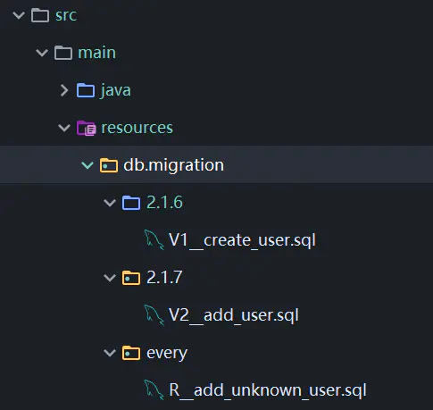
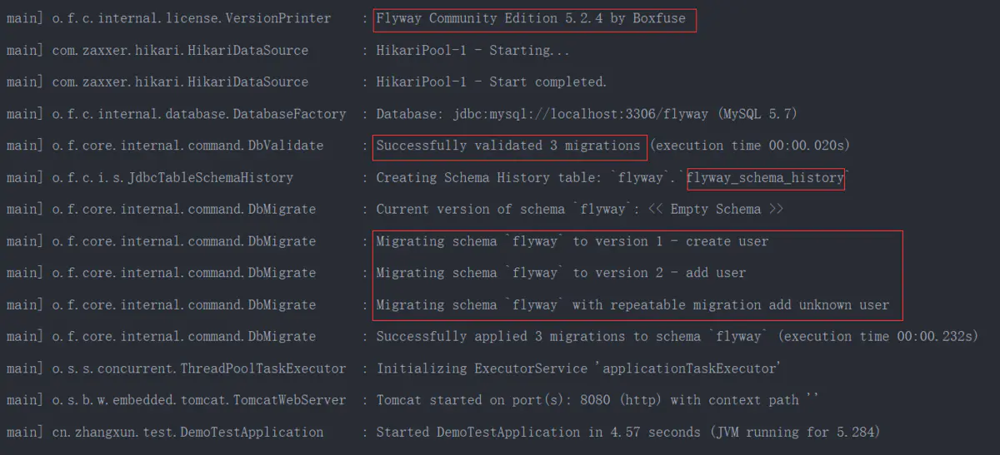
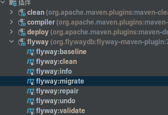

# Flyway-数据库变更做版本控制

## 引言

在多人开发的项目中，我们都习惯了使用SVN或者Git来对代码做版本控制，主要的目的就是为了解决多人开发代码冲突和版本回退的问题。

但是对于项目的数据库来说，使用Git或者SVN来进行处理这样十分的不合理。但是数据库又是经常进行修改的地方，经常会出现下面这样情况：

> 自己写的SQL忘了在所有环境执行；
>
> 别人写的SQL我们不能确定是否都在所有环境执行过了；
>
> 有人修改了已经执行过的SQL，期望再次执行；
>
> 需要新增环境做数据迁移；
>
> 每次发版需要手动控制先发DB版本，再发布应用版本；

那如何实现对数据库进行版本控制？

在项目中使用Flyway，这些问题都能得到很好的解决。

Flyway是一款可以在您的任何实例中轻松可靠地管理您的数据版本的插件。

它适用于Windows、macOS、Linux、Docker 和 Java

它支持的Maven 和 Gradle 构建工具

它支持的数据库：

Oracle、SQL Server、DB2、MySQL、Aurora MySQL、MariaDB、Percona XtraDB Cluster、PostgreSQL、Aurora PostgreSQL、Redshift、CockroachDB、SAP HANA、Sybase ASE、Informix、H2、HSQLDB、Derby、SQLite、Firebird


## 使用教程

### 建立数据库

项目开始前我们需要先建立一个项目的数据库，**记住只需要建立一个空的数据库即可，先不要建表。**（因为使用Flyway的项目如果数据库有内容运行会报错）


### 建立工程项目

我们按正常Web流程来，建立起Maven项目后，配置好项目的数据库连接，以Mysql为例：

```xml-dtd
spring:
  datasource:
    url: jdbc:mysql://localhost:3306/sys?useUnicode=true&characterEncoding=utf8&serverTimezone=Asia/Shanghai
    username: zssaer
    password: 2222
    driver-class-name: com.mysql.cj.jdbc.Driver
```

随后导入FlyWay的Maven依赖：

```xml
        <dependency>
            <groupId>org.flywaydb</groupId>
            <artifactId>flyway-core</artifactId>
            <version>7.12.0</version>
        </dependency>
```


### 配置Flyway

一般情况下flyway不需要配置,当然对于特殊情况也可以进行自定义配置。

导入Flyway依赖后，在SpringBoot配置文件中配置Flyway：

```properties
#当迁移时发现目标schema非空，而且带有没有元数据的表时，是否自动执行基准迁移，默认false.
spring.flyway.baseline-on-migrate
#开始执行基准迁移时对现有的schema的版本打标签，默认值为1.
spring.flyway.baseline-version
#检查迁移脚本的位置是否存在，默认false.
spring.flyway.check-location
#当发现校验错误时是否自动调用clean，默认false.
spring.flyway.clean-on-validation-error
#是否开启flywary，默认true.
spring.flyway.enabled
#设置迁移时的编码，默认UTF-8.
spring.flyway.encoding
#当读取元数据表时是否忽略错误的迁移，默认false.
spring.flyway.ignore-failed-future-migration
#当初始化好连接时要执行的SQL.
spring.flyway.init-sqls
#迁移脚本的位置，默认db/migration.
spring.flyway.locations
#是否允许无序的迁移，默认false.
spring.flyway.out-of-order
#目标数据库的密码.
spring.flyway.password
#设定需要flywary迁移的schema，大小写敏感，默认为连接默认的schema.
spring.flyway.schemas
#迁移文件的前缀，默认为V.
spring.flyway.sql-migration-prefix
#迁移脚本的文件名分隔符，默认__
spring.flyway.sql-migration-separator
#迁移脚本的后缀，默认为.sql
spring.flyway.sql-migration-suffix
#使用的元数据表名，默认为schema_version
spring.flyway.tableflyway
#迁移时使用的目标版本，默认为latest version
spring.flyway.target
#迁移时使用的JDBC URL，如果没有指定的话，将使用配置的主数据源
spring.flyway.url
#迁移数据库的用户名
spring.flyway.user
#迁移时是否校验，默认为true
spring.flyway.validate-on-migrate 
```


### 创建SQL版本管理文件夹

默认的FlyWay SQL管理文件夹在项目文件下的resources/db/migration文件夹下，用于存储项目的Sql文件，不管Sql文件是在文件夹外部，还是在版本文件夹也没关系，一样可以识别到：



但是此处的SQL文件 命名需要遵从一定的规范，否则运行的时候flyway会报错。命名规则主要有两种：

1. 仅需要被执行一次的SQL命名以大写的"V"开头，后面跟上"0~9"数字的组合,数字之间可以用“.”或者下划线"_"分割开，然后再以两个下划线分割，其后跟文件名称，最后以.sql结尾。比如，`V2.1.5__create_user_ddl.sql`、`V4.1_2__add_user_dml.sql`。
2. 可重复运行的SQL，则以大写的“R”开头，后面再以两个下划线分割，其后跟文件名称，最后以.sql结尾。。比如，`R__truncate_user_dml.sql`。


**简而言之,使用V开头的Sql文件是项目第一次运行时 进行运行操作的，后续即使在该文件进行修改，也不再进行操作。**

**而使用R开头的Sql文件是项目运行后 进行判断操作，如果里面有语句没有运行操作过的话，就进行操作。如果都运行过的话就不会进行再次操作。**


**V开头的SQL执行优先级要比R开头的SQL优先级高。**

我们一般将其 表创建和表修改操作的SQL文件以V类文件，而数据插入删除用R类文件。


### 运行项目并执行SQL

当我们将其对应的SQL版本文件放置到项目下后，我们运行项目，就会发现FlyWay自动将其Sql文件运行了，数据库也多了对应的数据。



我们还会发现数据库还会多了一个叫`flyway_schema_history`的数据库:


这个数据库使用来记录执行的SQl操作的情况的。


## 高级使用

上面的都是基于简单的方法使用，每次想要migration都需要运行整个springboot项目，并且只能执行migrate一种命令。

FlyWay还给我们通过了高级的Maven使用：

在Maven中配置：

```xml
			<plugin>
                <groupId>org.flywaydb</groupId>
                <artifactId>flyway-maven-plugin</artifactId>
                <version>5.2.4</version>
                <configuration>
                    <url>jdbc:mysql://localhost:3306/flyway?useUnicode=true&amp;characterEncoding=utf8&amp;serverTimezone=GMT</url>
                    <user>root</user>
                    <password>root</password>
                    <driver>com.mysql.cj.jdbc.Driver</driver>
                </configuration>
            </plugin>
```

然后更新maven插件列表，就可以看到flyway的全部命令了。



其中命名效果如下:

> baseline
>
> 对已经存在数据库Schema结构的数据库一种解决方案。实现在非空数据库新建MetaData表，并把Migrations应用到该数据库；也可以在已有表结构的数据库中实现添加Metadata表。
>
> clean
>
> 清除掉对应数据库Schema中所有的对象，包括表结构，视图，存储过程等，clean操作在dev 和 test阶段很好用，但在生产环境务必禁用。
>
> info
>
> 用于打印所有的Migrations的详细和状态信息，也是通过MetaData和Migrations完成的，可以快速定位当前的数据库版本。
>
> repair
>
> repair操作能够修复metaData表，该操作在metadata出现错误时很有用。
>
> undo
>
> 撤销操作，社区版不支持。
>
> validate
>
> 验证已经apply的Migrations是否有变更，默认开启的，原理是对比MetaData表与本地Migrations的checkNum值，如果值相同则验证通过，否则失败。

至于`flyway:migrate`则是和上面的项目运行效果一样的。

下面是一些下操作经验分享：

对于已经有数据的数据库，必须先baseline，然后才能migrate；

clean操作是删除数据库的所有内容，包括baseline之前的内容；

尽量不要修改已经执行过的SQL，即便是R开头的可反复执行的SQL，它们会不利于数据迁移；


**对于任何后续更新操作错误，可以先使用repair`操作清空 `flyway_schema_history`数据库记录，再执行`flyway:migrate 操作**

