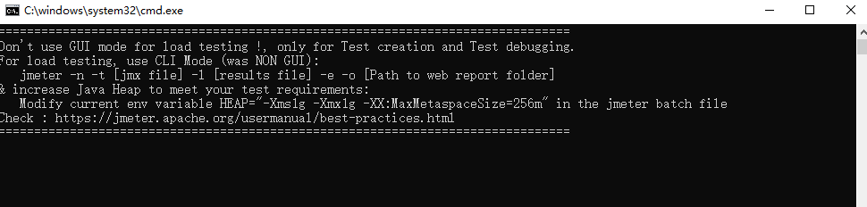
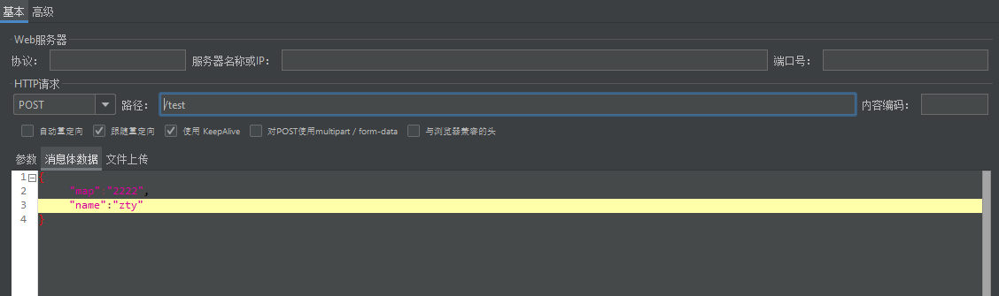
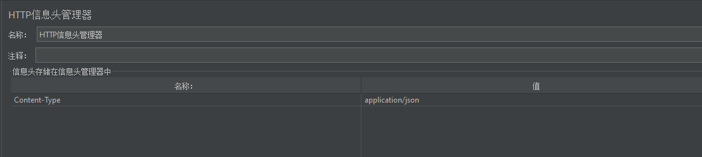

# 压力测试工具-JMeter

上面介绍了[Sentinel框架](http://zssaer.cn/2021/08/20/sentinel/)后，为了测试并发等功能，需要使用工具才行。

这儿简绍Apache JMeter -基于Java开发的压力测试工具。


进行Http多线程测试操作:

由于JMeter是基于JAVA编写,所以首先确保操作系统拥有JAVA运行环境才行。

## 运行Jmeter

前往官网下载JMeter：[http://jmeter.apache.org/download_jmeter.cgi](http://jmeter.apache.org/download_jmeter.cgi)，最新版本已经支持中文语言。

下载后解压，打开bin\jmeter.bat文件，会弹出二个窗口，一个为Shell，一个为JMeter的GUI应用。



***注意：在Shell上明确的提到了测试，不要使用GUI直接进行正常测试，GUI只是用来创建测试文件和测试Debug的。***

所以需要先在GUI上创建对应的测试，然后简单试一下是否能成功，成功后在Shell上使用命令来进行执行测试。

至于为什么这样规定，JMeter官方是这样回答的：

> GUI下会本身会消耗大量JVM内存资源，并且调用资源不平衡，所以在GUI下直接进行测试的话，测试就会变得不稳定，得出来响应结果不真实，在大型测试环境下甚至会崩溃。

我们先看GUI，JMeter默认为英文界面，但是内置含有简体中文，需要手动切换。通过 【Options】->【Choose Language】变更为简体中文。


## 创建测试

下面开始创建测试

在`测试计划`右击选择添加/线程/线程组


线程组右边的线程属性,线程数表示启动多少线程(相当于用户数量),Ramp-UP时间代表隔多长时间执行，0代表同时并发。而循环次数不言而喻就是反复循环测试次数。

设置好后再在`线程组`上右击添加/配置与元件/HTTP请求默认值,来进行配置每个HTTP请求的默认值。


之所以使用`HTTP请求的默认值`,就是为了方便大规模接口测试,可以先将Http地址确认下来。

然后再在`HTTP请求的默认值`中设置基本地址和端口:


设置好基本值后,然后再在`线程组`上右击选择添加/取样器/HTTP请求,设置测试请求。


设置其HTTP请求的需要测试的路径和请求方法。由于已经设置了HTTP请求的默认值,所以这儿的服务器IP\端口这些都不需要再次填写


如果是POST请求的话，除了使用其参数之外还可以使用Json来进行为载体。

只需要将其切换为“消息体数据”后添加Json：



因为采用Json为请求内容，所以Http请求头就应该新增Json的标识：

在`HTTP请求`上右击,点击添加/配置元件HTTP信息头管理器，用来在请求头部中新增内容，Json的话就应该新增Content-Type:application/json。



当然对于需要认证的接口，我们可以在头部添加Token内容。


在`HTTP请求`上右击,点击添加/断言/响应断言,来为该请求测试设置断言,来进行每次测试的判断,判断是否成功还是失败。


设置其断言判断,由于网页的请求采取Rest方式,不管是Json还是什么,都是以文本,所以这儿测试字段 设置为`响应文本`,然后再在选择判断条件,以及设置相关判断参数.


我们再在`线程组`上右击,点击监听器/察看结果树,来测试返回结果


好了,最后点击上方工具栏中的第一个绿色箭头 启动整个测试.最后在`察看结果树`便可以看见结果,由于我们对请求设置了断言,所以其中成功和失败一目了然:


我们可以在设置一个汇总报告，用来将其测试数据的测试结果进行明确展示和导出。

在线程组上右键 【添加】-->【监听器】-->【汇总报告】即可。

这便是简易的JMeter的创建Http压力测试的方法教程。


## 进行测试

前面我们提过，执行测试计划不能用GUI，需要用命令行来执行。

首先需要在Jmeter GUI上将我们创建的测试导出为jmx格式。

点击文件\保存测试计划 即可保存。

我们打开一个新的Shell窗口，将其定位到Jmeter下的bin文件夹下，输入下面命令来进行测试：

```bash
jmeter -n -t [jmx file] -l [results file] -e -o [Path to web report folder]
```

举个例子：

```shell
jmeter -n -t test/RedisLock.jmx -l testplan/result/result.txt -e -o testplan/webreport
```

`test/RedisLock.jmx` 为提供的测试计划文件
`testplan/result/result.txt` 为测试结果文件保存的路径和文件名
`testplan/webreport` 为web报告保存路径。