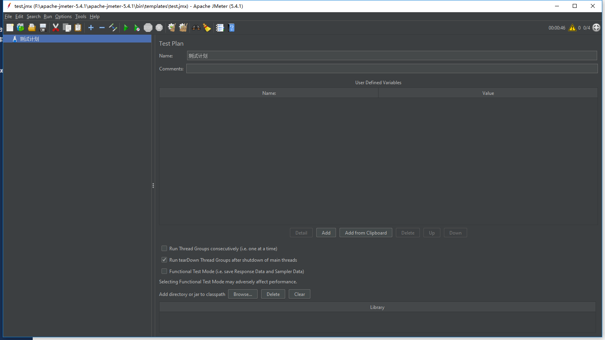
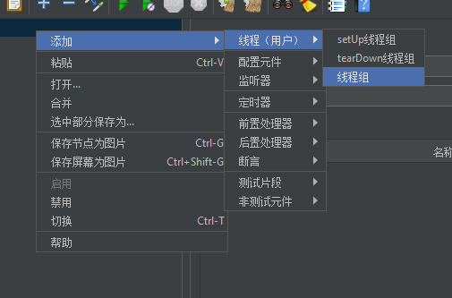
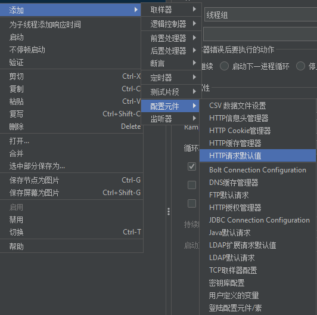
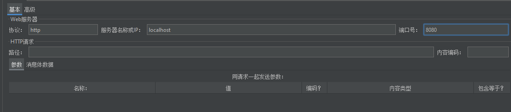
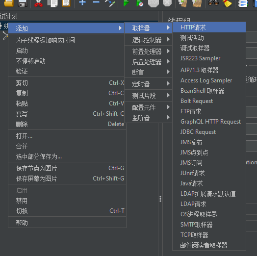
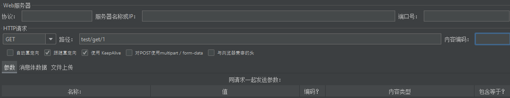
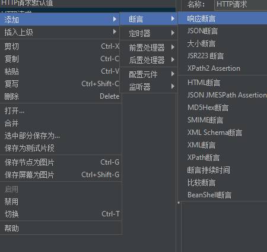
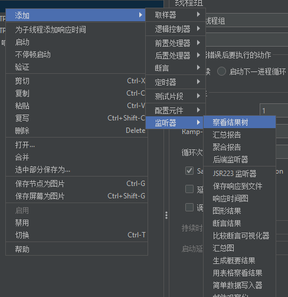

# 压力测试工具-JMeter

上面介绍了Sentinel框架后，为了测试并发等功能，需要使用工具才行。

这儿简绍Apache JMeter -基于Java开发的压力测试工具。

进行Http多线程测试操作:

由于JMeter是基于JAVA编写,所以首先确保操作系统拥有JAVA运行环境才行。

前往官网下载JMeter：[http://jmeter.apache.org/download_jmeter.cgi](http://jmeter.apache.org/download_jmeter.cgi)，最新版本已经支持中文语言。

下载后解压，打开bin\ApacheJMeter.jar文件，运行JMeter。

在`测试计划`右击选择添加/线程/线程组

线程组右边的线程属性,线程数表示启动多少线程(相当于用户数量),Ramp-UP时间代表隔多长时间执行，0代表同时并发。而循环次数不言而喻就是反复循环测试次数。

设置好后再在`线程组`上右击添加/配置与元件/HTTP请求默认值,来进行配置每个HTTP请求的默认值。

之所以使用`HTTP请求的默认值`,就是为了方便大规模接口测试,可以先将Http地址确认下来。

然后再在`HTTP请求的默认值`中设置基本地址和端口:

设置好基本值后,然后再在`线程组`上右击选择添加/取样器/HTTP请求,设置测试请求。

设置其HTTP请求的需要测试的路径和请求方法。由于已经设置了HTTP请求的默认值,所以这儿的服务器IP\端口这些都不需要再次填写

在`HTTP请求`上右击,点击添加/断言/响应断言,来为该请求测试设置断言,来进行每次测试的判断,判断是否成功还是失败。

设置其断言判断,由于网页的请求采取Rest方式,不管是Json还是什么,都是以文本,所以这儿测试字段 设置为`响应文本`,然后再在选择判断条件,以及设置相关判断参数.

我们再在`线程组`上右击,点击监听器/察看结果树,来测试返回结果

好了,最后点击上方工具栏中的第一个绿色箭头 启动整个测试.最后在`察看结果树`便可以看见结果,由于我们对请求设置了断言,所以其中成功和失败一目了然:

这便是简易的JMeter的Http压力测试的方法教程。