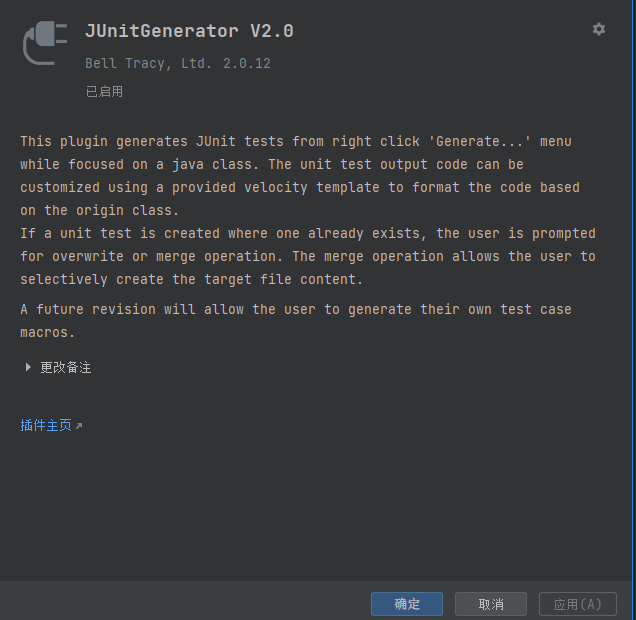
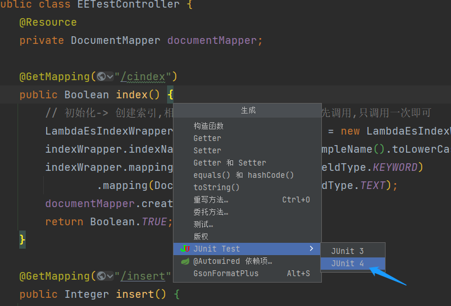
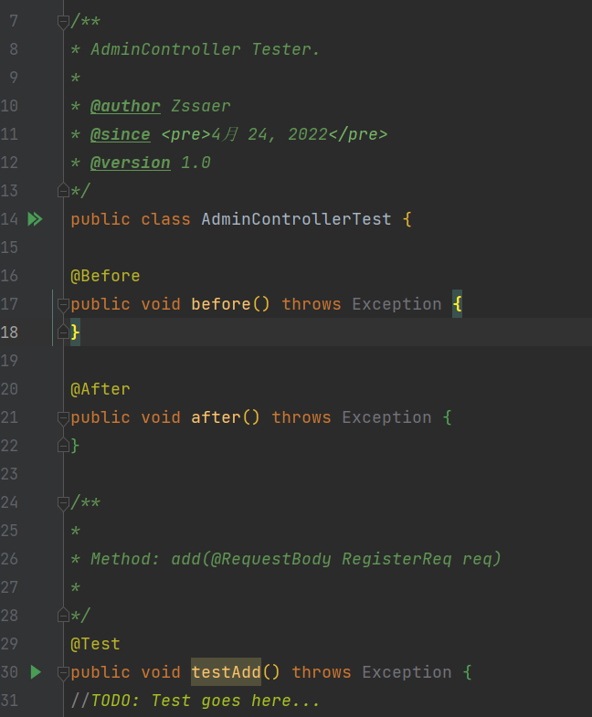

# JUnit测试

## 前言

JUnit是一个Java语言的单元测试框架。它由肯特·贝克和埃里希·伽玛（Erich Gamma）建立，逐渐成为源于Kent Beck的sUnit的xUnit家族中为最成功的一个。 JUnit有它自己的JUnit扩展生态圈。

JUnit是目前Java环境下最常用的单元测试框架，几乎项目中缺少不了。目前JUnit已经发展了5个版本了，其中JUnit4被广泛使用。


本文详细的记录了SpringBoot如何结合Junit写**测试用例，如何执行，打包执行，忽略执行**等操作，SpringBoot内置了Junit测试组件，使用很方便，不用再单独引入其他测试组件。

## POM依赖包

目前JUnit已经在SpringBoot中被官方Test架包收入，只需要导入SpringBoot官方的Test-starter包即可。

```xml
	<dependency>
		<groupId>org.springframework.boot</groupId>
		<artifactId>spring-boot-starter-test</artifactId>
         <version>xxx</version>
		<scope>test</scope>
	</dependency>
```

其中<scope>中限的了该依赖包被限制用于项目中的test文件夹下。

**注意：这里需要说明的是不同的SpringBoot的版本下的test包分别使用不同的JUnit版本。其中SpringBoot 2.2.x版本以下的引入的是Junit4的测试版本，2.2.x及以上引入的是Junit5的版本。JUnit 4和JUnit 5之间有大的变化，所以使用方法没法兼容。这里我们主要说明JUnit4的版本，其中最后一个spring-boot-starter-test是2.1.9.RELEASE。**

使用spingbootTest单元测试的时候，注意以下版本号，避免不必要的异常错误。

## 快速创建单元测试文件

有了JUnit依赖自然就可以写单元测试文件了，它们一般位于项目的src下的test文件夹下。

这里我们不使用手动方式来进行创建单元测试，因为这样对于一些项目动辄数百个模块来说是相当的低效率。

我们选择使用第三方插件来进行批量生成对应的单元测试文件。

这样的自动化生成创建有很多选择，这里使用Idea的明星插件 -《JUnitGenerator》V2.0。



安装后，我们在项目中单元随便选个需要测试的模块类，按`alt`+`Insert`，Idea弹出生成下拉框，选择`JUnit Test` 后点击JUnit4，创建一个对应的JUnit4测试文件。



JUnitGenerator便会自动在项目的src下的test文件夹下自动生成对应的测试文件，并且在test文件夹下创建对应相同的结构树目录。



这里需要注意JUnitGenerator生成的文件会根据系统的字节编码来设置，中文系统下会默认为GBK编码，只需要选择将文件编码设置回项目编码即可。

后续测试操作，我们根据这个测试文档来进行编辑即可。

## SpringBoot下测试文件配置

上面的测试文档虽然被自动生成下来了，但是并不能代表它能在SpringBoot下进行测试运行。

所以为了确保测试文件在SpringBoot中正常运行，所以需要在测试文件类上添加以下注解：

```java
@RunWith(SpringRunner.class)
@SpringBootTest
public class XXXTest {
	...
}
```

其中@SpringBootTest这个注解在SpringBoot 2.2.x以下版本还需要指定一个项目启动类，通常还需要在test下创建一个项目启动类来进行连接。但是在2.2.x及以上只需要**一个**注解即可，它会自动设置到main下的项目启动类上。

## JUnit注释

上面创建了JUnit测试文件了，里面出现了一些杂七杂八的注解，为了后续编写测试文件，务必需要了解下JUnit的注解。

- @Test：将一个方法标记为测试方法；
- @Before：每一个测试方法调用前必执行的方法；
- @After：每一个测试方法调用后必执行的方法；
- @BeforeClass：所有测试方法调用前执行一次，在测试类没有实例化之前就已被加载，需用[static](https://so.csdn.net/so/search?q=static&spm=1001.2101.3001.7020)修饰；
- @AfterClass：所有测试方法调用后执行一次，在测试类没有实例化之前就已被加载，需用static修饰；
- @Ignore：暂不执行该方法；

这些注解均使用在方法上面，它们拥有不同的执行顺序。

直接运行整个测试类的话，顺序分别是：

@BeforeClass -> @Before -> @Test -> @After -> @AfterClass;

单个运行一个测试方法的话，顺序分别是：

@Before -> @Test -> @After;


## SpringBoot单元测试写法

现在正式开始写单元测试了，但是对于单元测试，SpringBoot中需要测试Dao层、Service层、Controller层。

### Dao层测试

对于Dao层的测试来说，我们通常用来测试里面所实现的新的SQL操作能否成功。

比如在Mybatis中，某个mapper文件中新增了一个自定义操作，如

```xml
  <select id="selectAll" resultMap="BaseResultMap">
    SELECT * FROM user
  </select>
```

自然在Mapper类也多了一个selectAll这个方法，这时我们就可以写一个测试它的测试。

```java
@RunWith(SpringRunner.class)
@MybatisTest
@AutoConfigureTestDatabase(replace = AutoConfigureTestDatabase.Replace.NONE)
public class UserDaoTest {
	@Autowired
	private UserDao userDao;
	
	@Test
	@Rollback
	public void findAllTest(){
		...
		Assert.assertFalse(userDao.selectAll().isEmpty());
	}
}
```

其中@SpringBootTest被替换为了@MybatisTest，这样的话就可以直接在测试时跳过启动多余的整个系统了，而是直接测试Mybatis的操作。

**注意：使用@MybatisTest 默认会使用虚拟的数据源替代你配置的，如果想使用你配置的数据源操作真正的数据库则还需要加上`@AutoConfigureTestDatabase(replace = AutoConfigureTestDatabase.Replace.NONE)`注解。**这里的Replace.NONE表示不替换数据源配置。

这里方法上的@Rollback则是表示仅仅只是测试，不直接进行保存，测试完成后回滚数据库操作。

### Service层测试

在日常的开发中，我们一般会定义一个service层，用于实现业务逻辑，并且针对service层会有与之对应的齐全的覆盖率高的单元测试。

这是因为主要的核心业务逻辑都在`service`层里，所以service层的单元测试比较常见。

在测试用例中直接注入真实的Repository，这时就可以使用@SpringBootTest 注解中的 SpringBootTest.WebEnvironment.`RANDOM_PORT` 选项，RANDOM_PORT表示项目以随机端口启动。

```java
@RunWith(SpringRunner.class)
@SpringBootTest(webEnvironment = SpringBootTest.WebEnvironment.RANDOM_PORT)
public class TestServiceNoMock {
	@Resource
    private UserService userService;
    
    @Test
    @Transactional
    public void testGetById() throws Exception {
        Long id = 1L;
        User user = userService.findById(id);
        Assert.assertNotNull(user);
        Assert.assertEquals("Jone", user.getName());
    }
}
```

在测试环境下，使用@Transactional会默认的Rollback，所以不用担心数据提交上去。


## Mockito

在这之前，需要简单了解下Mockito，它是一款Java测试对象伪造框架，可以创建出一个任意类型的伪造对象，并且继承伪造对象所有方法以及将方法操作进行修改。用于在测试中将其他层面的操作进行屏蔽掉，更好的进行测试。

```java
// 使用Mockito.mock(类名.class) 生成出对应的伪造对象
List mockList = Mockito.mock(ArrayList.class);
// 伪造对象拥有原类所有的方法,但是其继承的方法都没实际意义
mockList.add("one");
// Mockito.verify(伪造对象).伪造对象的方法  : 表示检查伪造类是否之前发生了某些行为
// 如果之前使用了该方法，则通过，否则拦截抛出错误。
Mockito.verify(mockList).add("one");
assertEquals(0, mockList.size());
// Mockito.when(伪造对象.方法).thenReturn(yyyy)
// 表示指定伪造对象当执行了这个方法的时候，返回 thenReturn 的值
// 相当于给该方法设置预期的返回值。
// 注意对于 static 和 final 方法没法这样做。
Mockito.when(mockList.size()).thenReturn(100);
assertEquals(100, mockList.size());
```

上面Mockito.when这种设置返回预期，这种做法又叫`Stud打桩`。

打桩支持迭代风格的返回值，意思就是当对应的方法多次使用后返回不同的值。

```java
// 第一种方式 ，都是等价的
when(i.next()).thenReturn("Hello").thenReturn("World");
// 第二种方式，都是等价的
when(i.next()).thenReturn("Hello", "World");
// 第三种方式，都是等价的
when(i.next()).thenReturn("Hello"); when(i.next()).thenReturn("World");
```

上面当i第一次执行next方法，返回一个“Hello”字符串，第二次执行则会返回一个“World”字符串。

### BDDMockito

上面Mockito使用的是原始Mockito，而在目前Mockito拥有一个全新版本 - BDDMockito。

其中BDD是Behavier Driven Development（行为驱动开发）的缩写，它属于敏捷开发的一种开发模式。

Mockito 中的传统模拟是使用*when(obj)*执行的。*then\*()*在排列步骤中。

而BDDMockito为各种\**Mockito\*方法提供 它的BDD 别名，因此在BDDMockito中使用\*given\*（而不是\*when\*）编写Stud打桩 步骤，同样，我们可以使用\*then\*（而不是\*verify\*）编写 Assert 步骤。

```java
// 相当于when(xxx.ddd).xxx
BDDMockito.given(phoneBookRepository.contains(momContactName))
  .willReturn(false);
// verify(xxx).ddd
 BDDMockito.then(phoneBookRepository)
  .should()
  .add("one"); 
```

### MockBean

对于一些注入类的情况下，比如在Service、Controller中就会存在大量注入元素。

对于这类的模拟对象，只需要将其注入注解`@Autowried`，替换为`@MockBean`即可，该对象就成为了模拟对象。


### Controller层测试

再次回到Controller层的测试中来。

正常情况下`controller`层只是做转发，调用`service`层接口而已。所以对于Controller层的测试则是十分少见的。

但是还是建议使用单元测试简单的将`controller`的方法跑一下，看看转发和数据转换的代码是否能正常工作。

在`Spring Boot`里对`controller`层进行单元测试非常简单，只需要配合几个Mockito注解和一点点辅助代码即可搞定。

```java
//由 Junit 4 启动 Mockito，不使用Springboot框架
@RunWith(MockitoJUnitRunner.class)
@AutoConfigureRestDocs
public class TestSpringBootTestController {
   	
    private MockMvc mvc;
    
    @MockBean
    private UserService userService;
    
    @InjectMocks
  	// Mock 要注入的类
  	UserController userController;
    
    @Before
  	public void setUp()   {
    	mvc = MockMvcBuilders.standaloneSetup(userController)
        	//指定 Exception 处理器
        	.setControllerAdvice(new UserExceptionAdvice())
        	//.addFilters(new UserFilter())  //你也可以指定 filter , interceptor 之类的, 看 StandaloneMockMvcBuilder 源码
        	.build();
  	}
    
    @Test
    public void testGetById() throws Exception {
        Long userId = 55L;
        //模拟实现
        BDDMockito.given(this.userService.findById(userId))
                .willReturn(new User(55L, "MockBean", 55, "TestWebMvcTestController@qq.com"));
         /**
     	* MockMvc 类提供的基础方法分为以下 6 种：
	     * Perform：执行一个 RequestBuilder 请求，会自动执行 SpringMVC 流程并映射到相应的 Controller 进行处理。
	     * get/post/put/delete：声明发送一个 HTTP 请求的方式，根据 URI 模板和 URI 变量值得到一个 HTTP 请求，支持 GET、POST、PUT、DELETE 等 HTTP 方法。
    	 * param：添加请求参数，发送 JSON 数据时将不能使用这种方式，而应该采用 @ResponseBody 注解。
	     * andExpect：添加 ResultMatcher 验证规则，通过对返回的数据进行判断来验证 Controller 执行结果是否正确。
    	 * andDo：添加 ResultHandler 结果处理器，比如调试时打印结果到控制台。
	     * andReturn：最后返回相应的 MvcResult，然后执行自定义验证或做异步处理。
    	 *
	     * @throws Exception
    	 */
        this.mvc.perform(
            MockMvcRequestBuilders.get("/user").param(userId.toString)
            	.accept(MediaType.APPLICATION_JSON))
            	.andExpect(status().isOk()
        );
    }

}
```

这里先使用BDDMockito的given将其 模拟对象userService的findById(55L)方法返回为 一个User对象。

随后使用了MockMvc这个类，类似于*TestRestTemplate* 类，它可以进行模拟一个Http请求。

这里的如果数据库使用的是Druid的话，这里的@SpringBootTest注解还需要加上RANDOM_PORT随机端口参数，否则将会报出NPE空指针异常。

这里为了方便快捷，我们选择使用MockitoJUnitRunner的方法，也就是直接使用Mockito来进行测试，不加载Springboot框架，减少大量时间！


对于Post请求的话，可以这样做：

```java
	@Test
    void test() throws Exception {
        User param = new User();
        param.setUserId(1111);
        

        MvcResult mvcResult = mockMvc.perform(
                MockMvcRequestBuilders.post("/xxx/test")
                        .contentType(MediaType.APPLICATION_JSON)
                        .content(JSON.toJSONString(param)))
                .andReturn();
        
        System.out.println(mvcResult.getResponse().getContentAsString());
    }
```

post下的content是以jSON的方式传入进去的，所以这里使用Json转化器来进行将数据转为Json传入。

返回结果为mvcResult类，使用getResponse().getContentAsString()获取为返回文本数据。


下面是一些常见的测试写法：

1. 得到MvcResult自定义验证，进行断言测试

   ```java
   MvcResult result = mockMvc.perform(get("/user/{id}", 1))//执行请求  
           .andReturn(); //返回MvcResult  
   Assert.assertNotNull(result.getModelAndView().getModel().get("user")); //自定义断言
   ```

2. 测试普通Controller

   ```java
   mockMvc.perform(get("/user/{id}", 1)) //执行请求  
               .andExpect(model().attributeExists("user")) //验证存储模型数据  
               .andExpect(view().name("user/view")) //验证viewName  
               .andExpect(forwardedUrl("/WEB-INF/jsp/user/view.jsp"))//验证视图渲染时forward到的jsp  
               .andExpect(status().isOk())//验证状态码  
               .andDo(print()); //输出MvcResult到控制台
   ```

3. 文件上传

   ```java
   byte[] bytes = new byte[] {1, 2};  
   mockMvc.perform(fileUpload("/user/{id}/icon", 1L).file("icon", bytes)) //执行文件上传  
           .andExpect(model().attribute("icon", bytes)) //验证属性相等性  
           .andExpect(view().name("success")); //验证视图
   ```

4. Json请求/响应认证

   ```java
   String requestBody = "{\"id\":1, \"name\":\"zhang\"}";  
       mockMvc.perform(post("/user")  
               .contentType(MediaType.APPLICATION_JSON).content(requestBody)  
               .accept(MediaType.APPLICATION_JSON)) //执行请求  
               .andExpect(content().contentType(MediaType.APPLICATION_JSON)) //验证响应contentType  
               .andExpect(jsonPath("$.id").value(1)); //使用Json path验证JSON 请参考http://goessner.net/articles/JsonPath/  
       String errorBody = "{id:1, name:zhang}";  
       MvcResult result = mockMvc.perform(post("/user")  
               .contentType(MediaType.APPLICATION_JSON).content(errorBody)  
               .accept(MediaType.APPLICATION_JSON)) //执行请求  
               .andExpect(status().isBadRequest()) //400错误请求  
               .andReturn();  
       Assert.assertTrue(HttpMessageNotReadableException.class.isAssignableFrom(result.getResolvedException().getClass()));//错误的请求内容体
   ```


