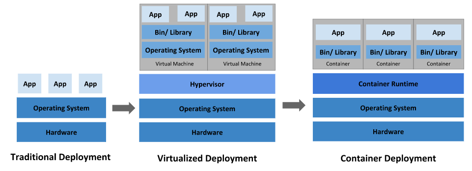

# Kubernetes

Kubernetes，简称K8s是一个可移植的、可扩展的开源平台，用于管理容器化的工作负载和服务，可促进声明式配置和自动化。

## Kubernetes概述

**Kubernetes** 这个名字源于希腊语，意为“舵手”或“飞行员”。k8s 这个缩写是因为 k 和 s 之间有八个字符的关系。

Google 在 2014 年开源了 Kubernetes 项目。Kubernetes 建立在 [Google 在大规模运行生产工作负载方面拥有十几年的经验](https://research.google/pubs/pub43438) 的基础上，结合了社区中最好的想法和实践。（PS：这样比起来国内的Alibaba、ByteDance、Tencent都是弟弟 :happy:）

为什么 Kubernetes 如此有用？可以看看多年来发展的服务部署的几个阶段：

 

**传统部署时代：**

早期，各个组织机构在物理服务器上运行应用程序。无法为物理服务器中的应用程序定义资源边界，这会导致资源分配问题。 例如，如果在物理服务器上运行多个应用程序，则可能会出现一个应用程序占用大部分资源的情况， 结果可能导致其他应用程序的性能下降。 一种解决方案是在不同的物理服务器上运行每个应用程序，但是由于资源利用不足而无法扩展， 并且维护许多物理服务器的成本很高。

**虚拟化部署时代：**

作为解决方案，引入了虚拟化。虚拟化技术允许你在单个物理服务器的 CPU 上运行多个虚拟机（VM）。 虚拟化允许应用程序在 VM 之间隔离，并提供一定程度的安全，因为一个应用程序的信息 不能被另一应用程序随意访问。

虚拟化技术能够更好地利用物理服务器上的资源，并且因为可轻松地添加或更新应用程序 而可以实现更好的可伸缩性，降低硬件成本等等。

每个 VM 是一台完整的计算机，在虚拟化硬件之上运行所有组件，包括其自己的操作系统。

**容器部署时代：**

容器类似于 VM，但是它们具有被放宽的隔离属性，可以在应用程序之间共享操作系统（OS）。 因此，容器被认为是轻量级的。容器与 VM 类似，具有自己的文件系统、CPU、内存、进程空间等。 由于它们与基础架构分离，因此可以跨云和 OS 发行版本进行移植。

容器因具有许多优势而变得流行起来。下面列出的是容器的一些好处：

- 敏捷应用程序的创建和部署：与使用 VM 镜像相比，提高了容器镜像创建的简便性和效率。
- 持续开发、集成和部署：通过快速简单的回滚（由于镜像不可变性），支持可靠且频繁的 容器镜像构建和部署。
- 关注开发与运维的分离：在构建/发布时而不是在部署时创建应用程序容器镜像， 从而将应用程序与基础架构分离。
- 可观察性：不仅可以显示操作系统级别的信息和指标，还可以显示应用程序的运行状况和其他指标信号。
- 跨开发、测试和生产的环境一致性：在便携式计算机上与在云中相同地运行。
- 跨云和操作系统发行版本的可移植性：可在 Ubuntu、RHEL、CoreOS、本地、 Google Kubernetes Engine 和其他任何地方运行。
- 以应用程序为中心的管理：提高抽象级别，从在虚拟硬件上运行 OS 到使用逻辑资源在 OS 上运行应用程序。
- 松散耦合、分布式、弹性、解放的微服务：应用程序被分解成较小的独立部分， 并且可以动态部署和管理 - 而不是在一台大型单机上整体运行。
- 资源隔离：可预测的应用程序性能。
- 资源利用：高效率和高密度。

在生产环境中，你需要管理运行应用程序的容器，并确保不会停机。 例如，如果一个容器发生故障，则需要启动另一个容器。

Kubernetes 为你提供了一个可弹性运行分布式系统的框架。 Kubernetes 会满足你的扩展要求、故障转移、部署模式等。 例如，Kubernetes 可以轻松管理系统的 Canary 部署。

它可以实现：

- **服务发现和负载均衡**

  Kubernetes 可以使用 DNS 名称或自己的 IP 地址公开容器，如果进入容器的流量很大， Kubernetes 可以负载均衡并分配网络流量，从而使部署稳定。

- **存储编排**

  Kubernetes 允许你自动挂载你选择的存储系统，例如本地存储、公共云提供商等。

- **自动部署和回滚**

  你可以使用 Kubernetes 描述已部署容器的所需状态，它可以以受控的速率将实际状态 更改为期望状态。例如，你可以自动化 Kubernetes 来为你的部署创建新容器， 删除现有容器并将它们的所有资源用于新容器。

...还有许多功能

## Kubernetes 基础知识

