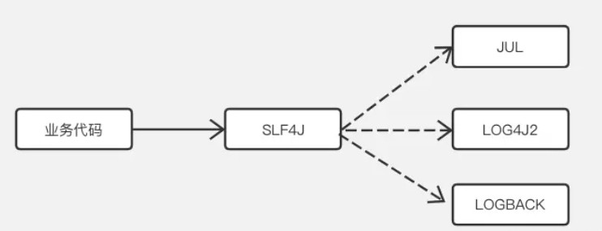

# Java中的Log配置详解

## 前言

平时开发时总会热衷于具体的业务代码和框架代码，但是对于Log配置却不以为然，认为这玩意就随意Copy一下之前的就行，Log日志方面不是很重要的。这种认知一直伴随我很久很久，但是慢慢地在一些项目中，我开始渐渐发现，这玩意还真的不能随便配置，一不小心就会导致整个项目的控制台输出报错，一不小心就会搞一个冲突出来。所以可见Java的Log配置学习是多么重要呀！

## 各个Log框架的区别

好多程序○，搞不清楚什么Log4J，什么LogBack，比如像我，只知道一些项目动不动就引入一个Log4J2，什么SLF4J，什么BABALA。

这些依赖看起来好像都是日志的玩意，但要是仔细说，它们具体是干什么的，有什么区别，基本上这时候都不懂了。

原来在Java环境中，要实现一个日志打印、日志记录需要靠两个技术来实现。***一个是日志实现框架，一个是日志实现门面。***

**日志实现框架** ： 主要负责实现日志的打印、日志的实现。它本身是不能用来单独来实现整个日志功能的。

**日志实现门面**：又称日志实现的接口，用来给日志实现框架提供接口和方法的。它本身不能实现日志的功能。


其中在日志实现框架中，目前出名的有 LOG4J、LOG4J2、LOGBACK。

而在日志实现门面中，目前出名的有SLF4J（全称The Simple Logging Facade for Java）、JCL（又被称为Commons Logging）。

要在Java中实现日志功能，那么就至少需要一个日志实现框架和一个日志实现门面，比如LOG4J2+SLF4J，或者LOGBACK+Commons Logging等等。

他们在项目中就类似这样来进行依赖的：



如上图所示：SLF4J作为日志打印实现的适配层，业务代码不需要关心具体使用哪一种日志系统，且如何打印日志。

## 各个Log框架的选择

其中日志实现框架中，Log4J2是目前最广外使用的一个实现框架。它是Log4J的完全升级版，在Log4J停止更新后，开源团队打造了新的Log4J，意在延续它在Java界中的地位。在2021年11月的时候突然爆发了一次Java日志漏洞大事件，也就是这个东西造成的，美媒甚至号称90%的Java应用都存在风险，可见Log4J2在目前Java界中的使用率之广。但好在开源的好处，后面陆陆续续的得到了修复。它拥有更为简单的配置，和更为强大的参数格式化，以及更好的异步性能，但考虑到前车之鉴，所以目前不无脑推荐使用Log4J2。

LogBack是一款旨在作为流行的 log4j 项目的继承者，它的特点就是通用、稳定，在Log4J2大漏洞爆发后，一部分项目开始陆陆续续转移到LogBack来，当然其实后面LogBack也曝光发现存在漏洞，而且它的性能也远远不及Log4J2。

**综上所述，目前其实Java界中没有一款完全推荐使用的日志实现框架，都或多或少存在不同的问题，几乎每段时间都会蹦出一两个Bug，不能满足完全安全，使用哪一款完全靠自己选择。其实我认为后续及时更新维护才是对项目安全的最大负责，而不是在项目搭建时选择中选一款万金油框架来一了百了。**

而在日志实现门面中，SLF4J是在国内常用的，一方面是因为一些人的怀旧，另一是性能问题（这个有待考究），但是有一点不好就是，SLF4J配合Log4J需要额外的导入桥接包。 而在国外乃至SpringBoot官方，目前统一都是使用的Commons Logging，它能自动匹配到Log4J2。当然它在国外火的原因这也和它是Apache项目或多或少有关系。

**综上所述，在日志门面框架选择上，其实也是没有完全推荐的，都是可以使用的。一般日志实现门面上，很少出现严重的BUG。**

## 实战配置

下面简绍各个日志的项目配置。

### Log4J2+SLF4J

由于Log4J2在SpringBoot原生的Commons Logging中默认实现的，所以Log4J2+Commons Logging是只需要导入Log4J2的依赖即可，不需要导入桥接包。

而Log4J2在SLF4J中并没有默认实现，所以需要导入第三方桥接包才能正常使用。

```
<dependency>
	<groupId>org.apache.logging.log4j</groupId>
 	<artifactId>log4j-core</artifactId>
	<version>2.17.1</version>
</dependency>

<!-- log4j-slf4j实现包(其中已包含slf4j) -->
<dependency>
	<groupId>org.apache.logging.log4j</groupId>
	<artifactId>log4j-slf4j-impl</artifactId>
	<version>2.17.1</version>
</dependency>
```

这个log4j-slf4j-impl内部已经包含了SLF4J了，所以不需要再次导入它的依赖。

和所有的Log一样，需要搭建一个配置文件，用作设置Log的配置。

其中Log4J2同时支持 XML/JSON/YML/Properties 四种形式的配置文件，不过最主流的还是 XML 的方式，最直观。

它的Xml通用如下：

```xml
<?xml version="1.0" encoding="UTF-8"?>
<!--日志级别以及优先级排序: OFF > FATAL > ERROR > WARN > INFO > DEBUG > TRACE > ALL -->
<!--Configuration后面的status，这个用于设置log4j2自身内部的信息输出，可以不设置，当设置成trace时，你会看到log4j2内部各种详细输出-->
<!--monitorInterval：Log4j能够自动检测修改配置 文件和重新配置本身，可设置一个非零的间隔秒数来检测配置变更 -->
<Configuration status="WARN" monitorInterval="60">
    <!-- 自定义一些变量 -->
    <Properties>
        <!-- 变量定义 -->
        <Property name="log_base_dir">/app_data/logs/my_app</Property>
        <!-- Appender在将日志数据写入目标位置之前，一般会将日志数据通过Layout进行格式化。PatternLayout可以使用与C语言printf函数类似
        的转换模式来指定输出格式。常见的配置如下：
        - %d{yyyy-MM-dd HH:mm:ss.SSS} : 日志生成时间，输出格式为“年-月-日 时:分:秒.毫秒”
        - %p : 日志输出格式
        - %c : logger的名称
        - %m : 日志内容，即 logger.info("message")
        - %n : 换行符
        - %T : 线程号
        - %L : 日志输出所在行数
        - %M : 日志输出所在方法名 -->
        <Property name="log_pattern">[%d{yyyy-MM-dd HH:mm:ss.SSS}][%-5p][%T][%c.%M:%L] %msg%xEx%n</Property>
        <!-- 单个日志文件最大大小，单位可以是KB, MB or GB -->
        <Property name="max_single_file_size">1MB</Property>
    </Properties>

    <!-- 使用Appenders元素可以将日志事件数据写到各种目标位置（目前可以为控制台、文件、多种数据库API、远程套接字服务器、Apache Flume、
    JMS、远程UNIX Syslog daemon），其内的每个Appender都必须要有一个name属性作为唯一标识，该标识的值在Logger中通过AppenderRef来引
    用，从而将该Appender配置到该Logger中 -->
    <Appenders>
        <!-- Console Appender常用于将日志输出到System.out，一般用在开发环境 -->
        <Console name="Console" target="SYSTEM_OUT">
            <!-- 只接受程序中DEBUG级别的日志进行处理-->
            <ThresholdFilter level="DEBUG" onMatch="ACCEPT" onMismatch="DENY"/>
            <!-- 在大多数情况下，Appender将格式化LogEvent的责任委托给Layout -->
            <PatternLayout pattern="${log_pattern}"/>
        </Console>

        <!-- RollingFile Appender会将日志输出到fileName属性指定的文件中，且需要指定TriggeringPolicy和RolloverStrategy。其中
        TriggeringPolicy决定是否生成新的日志文件，RolloverStrategy决定如何生成新的日志文件。如果没有配置RolloverStrategy，则会
        使用DefaultRolloverStrategy。从2.5开始，可以在DefaultRolloverStrategy中配置一个自定义的删除动作。从2.8开始，如果没有指定
        文件名，则会使用DirectWriteRolloverStrategy来代替DefaultRolloverStrategy -->
        <!-- 这个RollingFile Appender会打印出所有的DEBUG及以下级别（DEBUG、INFO、ERROR、FATAL、OFF）的信息 -->
        <RollingFile name="DebugLogRollingFile" fileName="${log_base_dir}/my_app_debug.log"
                     filePattern="${log_base_dir}/$${date:yyyy_MM_dd}/my_app_debug_%d{yyyy_MM_dd_HH}_%i.log.gz">
            <ThresholdFilter level="DEBUG" onMatch="ACCEPT" onMismatch="DENY"/>
            <PatternLayout pattern="${log_pattern}" charset="UTF-8"/>
            <!-- Policies表示一个CompositeTriggeringPolicy，可以组合多个TriggeringPolicy，只要内部的任意一个TriggeringPolicy
            满足触发条件，都会滚动日志 -->
            <Policies>
                <!-- TimeBasedTriggeringPolicy用于按时间滚动日志。只要filePattern属性值中的日期/时间模式（pattern）不再应用于当
                前文件时就进行日志滚动。这种规则通过interval和modulate属性来配置。interval属性指定一个整数，用于基于日期/时间模式中
                的最小的时间单位数滚动一次。例如，filePattern值为/app_data/logs/my_app/$${date:yyyy_MM_dd}/my_app_%d{yyyy_
                MM_dd_HH}_%i.log，这里使用小时作为最小的时间单位时，假如interval参数值为4，则表示每4小时滚动一次。默认值为1。
                modulate表示是否调整interval属性值以便下次滚动发生在interval边界处。如果时间最小单位为小时，当前时间为早上3点，间隔
                为4小时，则第一次滚动将发生在早上4点时（而不是早上7点），后续滚动将发生在早上8点、中午12点、下午4点等时刻 -->
                <TimeBasedTriggeringPolicy interval="1" modulate="false"/>
                <!-- SizeBasedTriggeringPolicy用于按文件大小滚动日志。每当日志文件超过size指定的大小（一般不超过几十MB，否则使用软
                件打开导出的日志时很不方便），则这size大小的日志会自动存入按filePattern属性指定建立的文件夹下面并进行压缩存档 -->
                <SizeBasedTriggeringPolicy size="${max_single_file_size}"/>
            </Policies>
            <!-- DefaultRolloverStrategy可以同时接受RollingFileAppender中filePattern属性值中日期/时间和整数计数器（%i）的
            pattern，当日期/时间满足条件时，则会使用当前的日期/时间生成新的日志文件，如果filePattern属性值中含有一个整数计数器%i，则
            在每次滚动时该整数都会增加，如果filePattern属性值中同时包含了日期/时间和整数计数器（%i），计数器会在日期/时间不变时而满足
            其他滚动触发条件时（文件大小）开始自增，直到日期/时间发生变化时，计数器会重新自增。以.gz、.zip、.bz2、deflate、pack200
            或xz结尾的filePattern值，会在日志文件归档时以后缀对应的格式进行压缩。min属性指定计数器的最小值，默认为1。max属性指定计数
            器的最大值，一旦计数器达到了最大值，最早的归档将会在每次滚动时被删除，默认值为7。fileIndex属性如果设置为max（默认），则具
            有更大索引的文件比具有更小索引的文件内容更新，如果设置为min，文件将重命名且计数器将遵循Fixed Window策略，这两种情况均有可
            能导致批量的文件重命名，自2.8版本开始，如果fileIndex属性设置为nomax，则min和max属性值都将会被忽略，文件编号将每次递增1，
            每次滚动都会递增到更大的值，且没有最大文件编号的限制 -->
            <!--<DefaultRolloverStrategy max="100" min="1" fileIndex = "nomax"/>-->
            <DefaultRolloverStrategy fileIndex="nomax">
                <!-- Log4j 2.5引入了删除动作（Delete元素）。在滚动删除旧的日志文件时，相比使用DefaultRolloverStrategy的max属
                性，该功能可以让用户拥有更多的删除控制。删除动作可以让用户配置若干个条件来删除相对于基准目录的文件。该功能可以删除非日
                志文件，使用时一定要小心。可以通过testMode属性来测试配置是否会错删文件。basePath属性值用于指定删除文件的基准目录，必
                须显式指定。maxDepth属性指定扫描目录的最大层级，0表示仅能访问基准目录（安全限制不能访问的情况除外），
                Integer.MAX_VALUE值表示可以访问所有层级。默认值为1，表示仅扫描基准目录下的文件。testMode属性值如果设置为true，文件
                不会实际删除，而是在status logger打印一条INFO级别的消息，可以使用该功能来测试是否会错删目标文件，默认为false。-->

                <!-- 这里的Delete元素配置了每次滚动都会删除基准目录下匹配“*/my_app_debug_*.log.gz”日志文件，只要9分钟以前的日志文
                件总大小超过2MB，或9分钟以前的日志文件文件总数超过2个就按时间顺序删除较早的日志文件。该元素可以防止日志文件所在分区的
                磁盘空间被占满。特别需要注意的是，只有在发生日志滚动时才会尝试进行删除，否则即使满足了删除条件，但如果没有新的滚动日志
                生成的话也不会发生删除操作。 -->
                <Delete basePath="${log_base_dir}" maxDepth="2">
                    <!-- Delete元素里可以指定若干个PathCondition类型的元素。如果指定了不止一个条件，则这些条件都需要在删除之前接受
                    某个路径。这些条件可以嵌套，只有外部条件接受某个路径之后，其内部条件才会决定是否接受该路径。如果这些条件没有嵌套，
                    则它们的执行顺序是任意的。这些条件也可以通过使用IfAll, IfAny和IfNot等组合条件进行AND、OR和NOT等逻辑运算。用户
                    也可以创建自定义条件或使用内置条件：
                    - IfFileName：接受匹配正则表达式或glob的文件路径；
                    - IfLastModified：接受比指定时段早或一样早的文件；
                    - IfAccumulatedFileCount：在遍历文件树时文件总数超过文件数上限后接受路径；
                    - IfAccumulatedFileSize：在遍历文件树时文件总大小超过上限后接受路径；
                    - IfAll：如果所有内嵌条件都接受了某个路径才会接受该路径，相当于AND逻辑，其内嵌条件的执行顺序是任意的；
                    - IfAny：如果任意一个内嵌条件接受了某个目录就接受该目录，相当于OR逻辑，其内嵌条件的执行顺序是任意的；
                    - IfNot：如果内嵌条件不接受某个路径就接收该路径，相当于NOT逻辑。-->

                    <!-- IfFileName可以通过glob（使用受限的模式语言,比正则更简单）或regex属性（正则）来匹配相对路径（相对于Delete
                    的basePath属性指定的基准目录）-->
                    <!-- 当外部的条件满足时才会计算内部的条件，内部的同级条件的计算顺序是任意的。 -->
                    <IfFileName glob="*/my_app_debug_*.log.gz">
                        <!-- IfLastModified可以通过age属性值来指定接受最后修改时间为指定时间或早于指定时间的路径，该属性的值可参考
                        org.apache.logging.log4j.core.appender.rolling.action.Duration.parse(CharSequence text)方法的文档 -->
                        <!-- 这里的IfLastModified指定删除达到或超过60天内的文件 -->
                        <IfLastModified age="9m">
                            <!-- 这里的IfAny内嵌了两个PathCondition，表示满足任意一个条件即可 -->
                            <IfAny>
                                <!-- IfAccumulatedFileSize可通过exceeds属性值指定一个文件总大小上限值。如果文件数超过了该上限值
                                则删除文件 -->
                                <IfAccumulatedFileSize exceeds="2MB"/>
                                <!-- IfAccumulatedFileCount可通过exceeds属性值指定一个文件总数上限值。如果文件数超过了该上限值
                                则删除文件 -->
                                <IfAccumulatedFileCount exceeds="2"/>
                            </IfAny>
                        </IfLastModified>
                    </IfFileName>
                </Delete>
            </DefaultRolloverStrategy>
        </RollingFile>

        <RollingFile name="InfoLogRollingFile" fileName="${log_base_dir}/my_app_info.log"
                     filePattern="${log_base_dir}/$${date:yyyy_MM_dd}/my_app_info_%d{yyyy_MM_dd_HH}_%i.log.gz">
            <ThresholdFilter level="INFO" onMatch="ACCEPT" onMismatch="DENY"/>
            <PatternLayout pattern="${log_pattern}"/>
            <Policies>
                <TimeBasedTriggeringPolicy/>
                <SizeBasedTriggeringPolicy size="${max_single_file_size}"/>
            </Policies>
            <DefaultRolloverStrategy fileIndex="nomax">
                <Delete basePath="${log_base_dir}" maxDepth="2">
                    <IfFileName glob="*/my_app_info_*.log.gz">
                        <!-- 这里表示匹配“*/my_app_info_*.log.gz”模式的日志文件的删除策略如下：
                        - 只要日志文件总数量超过5个就删除按时间顺序最早的日志文件
                        - 只要日志文件总大小超过10MB就会删除按时间顺序最早的日志文件
                        - 只要日志文件最近修改时间为9分钟前或更早就会删除按时间顺序最早的日志文件 -->
                        <IfAny>
                            <IfAccumulatedFileSize exceeds="8MB"/>
                            <IfAccumulatedFileCount exceeds="5"/>
                            <IfLastModified age="9m"/>
                        </IfAny>
                    </IfFileName>
                </Delete>
            </DefaultRolloverStrategy>
        </RollingFile>

        <RollingFile name="WarnLogRollingFile" fileName="${log_base_dir}/my_app_warn.log"
                     filePattern="${log_base_dir}/$${date:yyyy_MM_dd}/my_app_warn_%d{yyyy_MM_dd_HH}_%i.log.gz">
            <ThresholdFilter level="WARN" onMatch="ACCEPT" onMismatch="DENY"/>
            <PatternLayout pattern="${log_pattern}"/>
            <Policies>
                <TimeBasedTriggeringPolicy/>
                <SizeBasedTriggeringPolicy size="${max_single_file_size}"/>
            </Policies>
            <DefaultRolloverStrategy fileIndex="nomax">
                <Delete basePath="${log_base_dir}" maxDepth="2">
                    <IfFileName glob="*/my_app_warn_*.log.gz">
                        <IfAny>
                            <IfAccumulatedFileSize exceeds="3GB"/>
                            <IfAccumulatedFileCount exceeds="3000"/>
                            <IfLastModified age="30d"/>
                        </IfAny>
                    </IfFileName>
                </Delete>
            </DefaultRolloverStrategy>
        </RollingFile>

        <RollingFile name="ErrorLogRollingFile" fileName="${log_base_dir}/my_app_error.log"
                     filePattern="${log_base_dir}/$${date:yyyy_MM_dd}/my_app_error_%d{yyyy_MM_dd_HH}_%i.log.gz">
            <ThresholdFilter level="ERROR" onMatch="ACCEPT" onMismatch="DENY"/>
            <PatternLayout pattern="${log_pattern}"/>
            <Policies>
                <TimeBasedTriggeringPolicy/>
                <SizeBasedTriggeringPolicy size="${max_single_file_size}"/>
            </Policies>
            <DefaultRolloverStrategy fileIndex="nomax">
                <Delete basePath="${log_base_dir}" maxDepth="2">
                    <IfFileName glob="*/my_app_error_*.log.gz">
                            <IfAny>
                            <IfAccumulatedFileSize exceeds="3GB"/>
                            <IfAccumulatedFileCount exceeds="3000"/>
                            <IfLastModified age="30d"/>
                        </IfAny>
                    </IfFileName>
                </Delete>
            </DefaultRolloverStrategy>
        </RollingFile>

        <!-- 记录druid的SQL语句 -->
        <RollingFile name="DruidSqlRollingFile" fileName="${log_base_dir}/druid.log"
                     filePattern="${log_base_dir}/$${date:yyyy_MM_dd}/druid_%d{yyyy_MM_dd_HH}_%i.log.gz">
            <PatternLayout pattern="${log_pattern}"/>
            <Policies>
                <TimeBasedTriggeringPolicy/>
                <SizeBasedTriggeringPolicy size="${max_single_file_size}"/>
            </Policies>
            <DefaultRolloverStrategy fileIndex="nomax">
                <Delete basePath="${log_base_dir}" maxDepth="2" testMode="true">
                    <IfFileName glob="*/druid_*.log.gz">
                        <IfAny>
                            <IfAccumulatedFileSize exceeds="3GB"/>
                            <IfAccumulatedFileCount exceeds="3000"/>
                            <IfLastModified age="30d"/>
                        </IfAny>
                    </IfFileName>
                </Delete>
            </DefaultRolloverStrategy>
        </RollingFile>
    </Appenders>

    <!--定义logger，只有定义了logger并引入的appender，appender才会生效-->
    <Loggers>
        <!-- 当Logger在配置文件中声明时，就创建了一个LoggerConfig对象，两者一一对应，LoggerConfig包含一些Filter、这些
        Filters用于过滤传递给任意Appender的LogEvent，它还包含一些Appender的引用。Logger本身执行无指向的动作，它仅含有一
        个与LoggerConfig关联的名称（通过name属性指定），root Logger具有固定的默认名称，其他Logger需要指定各自的name属性
        值。LoggerConfig会被分配一个日志级别，通过level属性来指定。内建的日志级别按优先级从高到底排序有：OFF > FATAL >
        ERROR > WARN > INFO > DEBUG > TRACE > ALL，Log4j 2 也支持自定义的日志级别。
        -->
        <Root level="ALL">
            <AppenderRef ref="Console"/>
            <AppenderRef ref="InfoLogRollingFile"/>
            <AppenderRef ref="WarnLogRollingFile"/>
            <AppenderRef ref="DebugLogRollingFile"/>
            <AppenderRef ref="ErrorLogRollingFile"/>
        </Root>

        <!-- 每个LoggerConfig的日志级别如果没有显式配置，则会继承其父级LoggerConfig的日志级别，而root LoggerConfig如果没
        有配置日志级别，则会为其分配一个默认的ERROR级别 -->
        <!-- 某个Logger所允许的每条日志打印请求都会传递给其LoggerConfig中的所有Appender，也会传递给该LoggerConfig的parent
        LoggerConfig中的Appender，这种现象称为相加性（Additivity）。也就是说，Appender会从LoggerConfig的继承中继承相加性。这种特
        性可以用来汇整某几个logger的输出，可以在声明Logger的配置文件中设置additivity="false"来禁用这种叠加继承 -->
        <!--记录druid-sql的记录-->
        <Logger name="druid.sql.Statement" level="debug" additivity="false">
            <appender-ref ref="DruidSqlRollingFile"/>
        </Logger>

        <!--过滤掉spring和mybatis的一些无用的DEBUG信息-->
        <Logger name="org.springframework" level="INFO"/>
        <Logger name="org.mybatis" level="INFO"/>

        <!--log4j2 自带过滤日志-->
        <Logger name="org.apache.catalina.startup.DigesterFactory" level="error"/>
        <Logger name="org.apache.catalina.util.LifecycleBase" level="error"/>
        <Logger name="org.apache.coyote.http11.Http11NioProtocol" level="warn"/>
        <Logger name="org.apache.sshd.common.util.SecurityUtils" level="warn"/>
        <Logger name="org.apache.tomcat.util.net.NioSelectorPool" level="warn"/>
        <Logger name="org.crsh.plugin" level="warn"/>
        <Logger name="org.crsh.ssh" level="warn"/>
        <Logger name="org.eclipse.jetty.util.component.AbstractLifeCycle" level="error"/>
        <Logger name="org.hibernate.validator.internal.util.Version" level="warn"/>
        <Logger name="org.springframework.boot.actuate.autoconfigure.CrshAutoConfiguration" level="warn"/>
        <Logger name="org.springframework.boot.actuate.endpoint.jmx" level="warn"/>
        <Logger name="org.thymeleaf" level="warn"/>
    </Loggers>
</Configuration>
```


