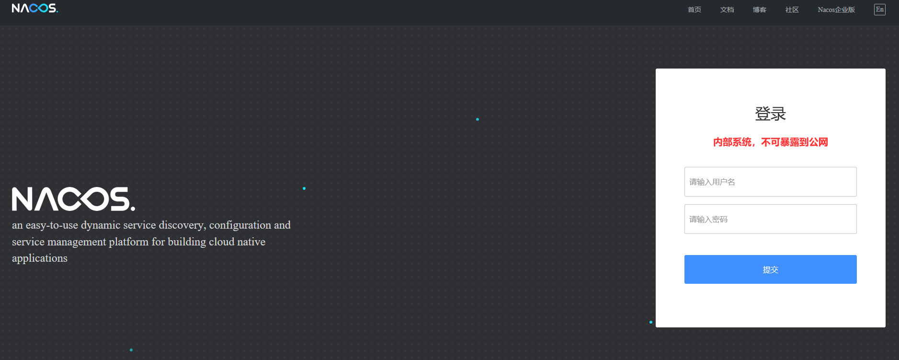
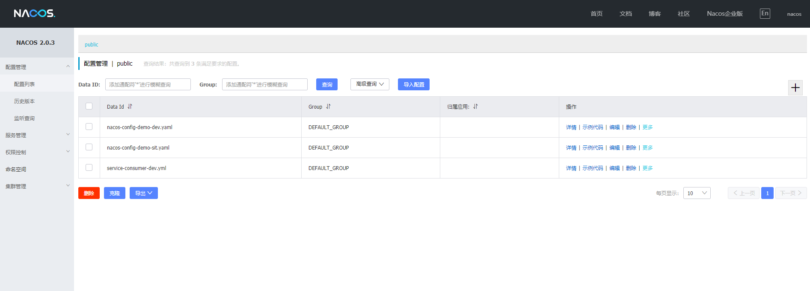
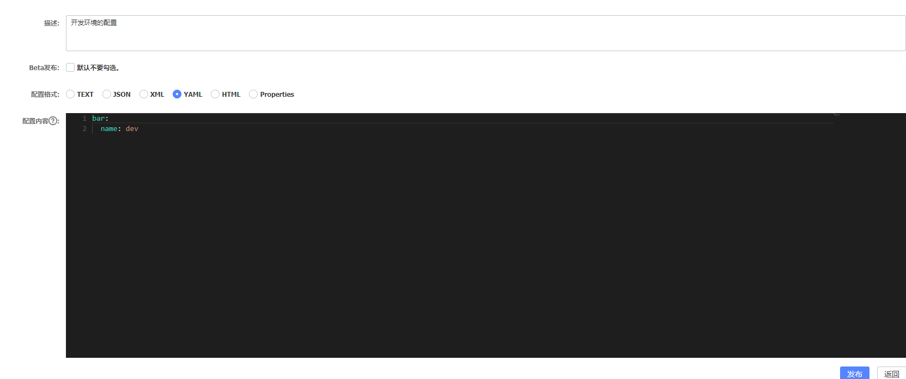
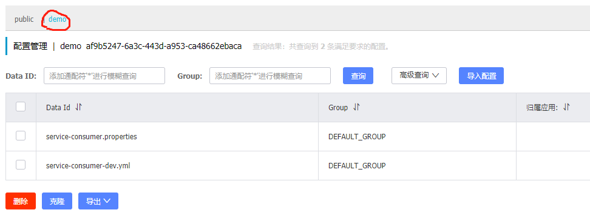

# Nacos

Nacos英文全称Dynamic Naming and Configuration Service,是SpringCloud Alibaba中的一个重要组件。主要功能是面向集群管理服务。

其中Na为naming/nameServer即注册中心,co为configuration即注册中心，service是指该注册/配置中心都是以服务为核心。


对标产品的是Netflix的Eureka，但与Eureka不同的是，Nacos支持AC、AC两种模式，而且在Eureka2.X后，Eureka不在开源，所以目前使用Nacos更为普遍，在学习Nacos之前建议去了解下Eureka。

Nacos支持注册中心和配置中心两种功能,可同时使用。

Nacos不同于其他产品，推荐在Docker中搭建，而不是外部服务器。

## Nacos基础框架与概念


**服务注册中心 (Service Registry)**

服务注册中心，它是服务，其实例及元数据的数据库。服务实例在启动时注册到服务注册表，并在关闭时注销。服务和路由器的客户端查询服务注册表以查找服务的可用实例。服务注册中心可能会调用服务实例的健康检查 API 来验证它是否能够处理请求。

**服务 (Service)**

服务是指一个或一组软件功能（例如特定信息的检索或一组操作的执行），其目的是不同的客户端可以为不同的目的重用（例如通过跨进程的网络调用）。Nacos 支持主流的服务生态，如 Kubernetes Service、gRPC|Dubbo RPC Service 或者 Spring Cloud RESTful Service。

**配置 (Configuration)**

在系统开发过程中通常会将一些需要变更的参数、变量等从代码中分离出来独立管理，以独立的配置文件的形式存在。目的是让静态的系统工件或者交付物（如 WAR，JAR 包等）更好地和实际的物理运行环境进行适配。配置管理一般包含在系统部署的过程中，由系统管理员或者运维人员完成这个步骤。配置变更是调整系统运行时的行为的有效手段之一。

**配置管理 (Configuration Management)**

在数据中心中，系统中所有配置的编辑、存储、分发、变更管理、历史版本管理、变更审计等所有与配置相关的活动统称为配置管理。


## Docker中安装Nacos

- 获取镜像

```shell
docker pull nacos/nacos-server
```

* 创建并启动镜像

```shell
docker run -d --name nacos -p 8848:8848 -e PREFER_HOST_MODE=hostname -e MODE=standalone nacos/nacos-server
```

**上面使用的是单机模式,单机模式仅限于学习开发使用,正常开发不使用这个模式。**

打开`http://NacosIP地址:8848/nacos/` 进入Nacos页面：



默认用户名密码都为`nacos`。


## 部署集群项目

不同于Eureka项目那样,因为少了Server注册中心项目,所以直接编写Provide和Customer项目即可。

Provide项目和Customer项目Maven依赖都一样：

```xml
<dependency>
    <groupId>org.springframework.boot</groupId>
    <artifactId>spring-boot-starter-web</artifactId>
</dependency>

<dependency>
    <groupId>com.alibaba.cloud</groupId>
    <artifactId>spring-cloud-starter-alibaba-nacos-discovery</artifactId>
</dependency>
```

和Eureka一样，需要在每个项目的启动类上添加@EnableDiscoveryClient注释：

```java
@SpringBootApplication
@ServletComponentScan
@EnableDiscoveryClient
public class Application {
    public static void main(String[] args) {
        SpringApplication.run(Application.class, args);
    }
}
```

配置配置文件：

```xml-dtd
spring:
  application:
    name: service-provider
  cloud:
    nacos:
      discovery:
		# Nacos服务器地址
        server-addr: 192.168.0.101:8848

server:
  port: 8084
```

运行后即可看见服务器：



具体集群开发和Eureka集群开发也是一样的。


## 配置中心管理

Nacos支持配置中心管理，可以管理多个配置文件。

Java项目一般都会有多个Profile配置，用于区分开发环境，测试环境，准生产环境，生成环境等，每个环境对应一个properties文件（或是yml/yaml文件），然后通过设置 spring.profiles.active 的值来决定使用哪个配置文件。

这回首先要在nacos中配置相关的配置，打开Nacos配置界面，依次创建2个Data ID

- nacos-config-demo-dev.yaml 开发环境的配置
- nacos-config-demo-test.yaml 测试环境的配置

其中nacos-config-demo为配置文件前缀名,而dev/test为状态,其项目主配置(bootstrap.yml)的spring.profiles.active用作控制项目的运行环境。




在使用Nacos配置中心服务时，服务项目中还需要添加Nacos Config的Maven依赖:

```xml
<dependency>
    <groupId>com.alibaba.cloud</groupId>
    <artifactId>spring-cloud-starter-alibaba-nacos-config</artifactId>
</dependency>
```

**编写主配置文件,使用Nacos配置中心，这是项目主配置名必须要使用bootstrap.yml**

原因是因为Spring Cloud 构建于 Spring Boot 之上，在 Spring Boot 中有两种上下文，一种是 bootstrap, 另外一种是 application, bootstrap 是应用程序的父上下文，也就是说 bootstrap 加载优先于 applicaton。bootstrap 主要用于从额外的资源来加载配置信息，还可以在本地外部配置文件中解密属性。这两个上下文共用一个环境，它是任何Spring应用程序的外部属性的来源。bootstrap 里面的属性会优先加载，它们默认也不能被本地相同配置覆盖。

```xml-dtd
spring:
  application:
    name: nacos-config-demo-provider
  profiles:
    active:  dev
  cloud:
    nacos:
      discovery:
		# nacos的服务器地址
        server-addr: ${NACOS_SERVER:cdh1:8848}
      config:
		# nacos的服务器地址
        server-addr: ${NACOS_SERVER:cdh1:8848}
		# 命名空间地址 -- 如果没配置默认为Public
		namespace: af9b5247-6a3c-443d-a953-ca48662ebaca
		#文件名 -- 如果没有配置则默认为 ${spring.appliction.name}
        prefix: nacos-config-demo
		#指定分组信息 -- 如果没有配置则默认为DEFAULT_GROUP
        group: DEFAULT_GROUP
		#指定文件后缀 -- 如果没有配置则默认为properties
        file-extension: yml
server:
  port: 18083
```

注意Yaml的配置时的缩进，Yaml文件对缩进是敏感的。

**如果Nacos中配置文件采用Yaml文件的话,那么这里的`file-extension`配置中就应该是`yml`,而不应该使用`yaml`**

对用的Nacos配置文件Data ID的格式如下:`${prefix}-${spring.profile.active}.${file-extension}`

测试配置获取：

创建一个测试的Controller类，用作测试是否获取到Nacos上的存储的配置文件。

```java
@RestController
@RequestMapping("/config")
// 打开Nacos配置动态刷新功能
@RefreshScope
public class ConfigGetController {
    @Value("${name}")
    private String name;

    //获取配置的内容
    @RequestMapping(value = "/name", method = RequestMethod.GET)
    public String getBar() {
        return "bar is :"+name;
    }
}
```

其中`@RefreshScope`为Nacos动态刷新功能,配置后项目的配置文件会实现动态刷新效果,可以实时在Nacos上进行编辑对于环境的配置文件，而不必要重新启动服务器。


**多个配置文件管理**

对于许多单独服务器的配置来说,我们我可以使用Nacos来统一管理:

```xml-dtd
spring:
  application:
    name: nacos-config-demo-provider
  profiles:
    active: dev
  cloud:
    nacos:
      discovery:
        server-addr: ${NACOS_SERVER:cdh1:8848}
      config:
        server-addr: ${NACOS_SERVER:cdh1:8848}
		# 主配置文件前缀
        prefix: nacos-config-demo
        group: DEFAULT_GROUP
        file-extension: yaml
		# 额外配置扩展
        ext-config:
          - data-id: crazymaker-db-dev.yml
            group: DEFAULT_GROUP
            refresh: true
          - data-id: crazymaker-redis-dev.yml
            group: DEFAULT_GROUP
            refresh: true
          - data-id: crazymaker-common-dev.yml
            group: DEFAULT_GROUP
            refresh: true
          - data-id: some.properties
            group: DEFAULT_GROUP
            refresh: true

```


**对于多个服务项目的配置**

多个服务项目配置文件就非常多,为了区分每个服务项目的配置文件,通常在Nacos上创建配置文件时,创建多个命名空间:


默认不配置命名空间的配置文件就会存储在公共的空间``public``中。

命名空间在配置列表中以上方选项卡进行切换，所以需要切换后在进行配置对于项目的配置文件。



配置项目主配置中的`namespace`，在项目主配置文件中命名空间ID来进行区分，而不是命名空间名称。

```xml-dtd
spring:
  application:
    name: service-consumer
  cloud:
    nacos:
      discovery:
        server-addr: 192.168.0.101:8848
      config:
        server-addr: 192.168.0.101:8848
        group: DEFAULT_GROUP
        namespace: af9b5247-6a3c-443d-a953-ca48662ebaca
        file-extension: yml
```


## Nacos集群搭建

集群顾名思义多台服务器同享数据，实现高访问量可行性的前提，Nacos作为服务发现中心也必须要实现集群。

前面我们使用的都是standalone单机模式。Nacos服务器并没有进行集群，在单机模式时nacos使用嵌入式数据库实现内部配置数据的存储（当然也可以手动修改为外部数据库进行存储）。

而在正常集群项目中，Nacos需要进行集群配置，并且数据需要进行外部数据库存储。为了在单机上模拟Nacos集群搭建，没必要启动三台服务器，创建三个Docker容器就可以。

进入每个nacos容器的conf目录，编辑application.properties文件，增加外部数据库配置：

```properties
# 指定数据源为Mysql
spring.datasource.platform=mysql

# 数据库实例数量
db.num=1
db.url.0=jdbc:mysql://localhost:3306/nacos?characterEncoding=utf8&connectTimeout=1000&socketTimeout=3000&autoReconnect=true
db.user=root
db.password=123456
```

复制代码同样的步骤进入nacos1和nacos2操作一遍，唯一需要单独修改的就是application.properties文件中的`server.port`配置，假设默认nacos的server.port=8848，那么nacos1修改成8847，nacos2修改成8846。

数据库配置信息好了后，我们需要将对应的数据库和表进行初始化，数据库脚本在conf目录下的nacos-mysql.sql中，执行即可。

最后一步需要配置一份集群节点信息，配置文件在conf目录下的cluster.conf.example文件，我们进行重命名成cluster.conf。 然后编辑cluster.conf文件，增加3个节点的信息，格式为IP:PORT，三个目录都一致即可。

```
127.0.0.1:8848
127.0.0.1:8847
127.0.0.1:8846
```

启动的话直接到bin目录下，执行./startup.sh就可以了，默认就是集群模式，不需要加任何参数。


