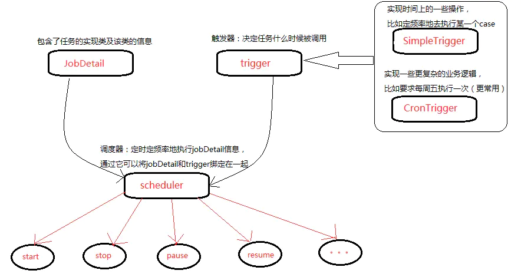

# QuartZ-定时任务调度工具

## 简介


Quartz是一款Java开源定时任务调度项目，Quartz可以用来创建简单或为运行十个，百个，甚至是好几万个Jobs这样复杂的定时任务程序。适合作用于JAVA定时任务中。

它的主要功能就是定时创建一个实现org.quartz.Job接口的java类。Job接口包含唯一的方法：execute，它来执行定时任务中的任务。当调度程序确定该是通知你的作业的时候，Quartz框架将调用你Job实现类（作业类）上的execute()方法并允许做它该做的事情。无需报告任何东西给调度器或调用任何特定的东西。如果配置你的作业在随后再次被调用，Quartz框架将在恰当的时间再次调用它，从而达到反复作业的效果。

## 特性

Quartz框架的核心是调度器。调度器负责管理Quartz应用运行时环境。调度器不是靠自己做所有的工作，而是依赖框架内一些非常重要的部件。Quartz不仅仅是线程和线程管理。为确保可伸缩性，Quartz采用了基于**多线程**的架构。

Quartz应用支持集群配置，是水平集群还是垂直集群取决于你自己的需要。集群提供以下好处：

·伸缩性

·高可用性

·负载均衡

Quartz可以借助关系数据库和JDBC作业存储支持集群。

## 结构体系

Quartz的结构体系如下：



Quartz的重要组成:

- Job

  它是一个接口,只有一个方法`void execute(JobExecutionContext context)`，开发者可以实现该接口定义运行任务，相当于TimerTask下面的run()方法。它拥有一个参数`JobExecutionContext`，`JobExecutionContext`提供了调度上下文的各种信息可以使用它来获取JobDetail中JobDataMap来获取任务参数等。
  
- JobDetail

  JobDetail包含了任务的Job实现类，用作任务的实现，也包含了该任务的名称和组名，也可以从用作参数的保存(JobData)。

- Trigger

  任务的触发器,表明job任务什么时候被调用,描述触发的job执行时的时间触发规则；主要有SimpleTrigger和CronTrigger两个子类。

  当仅触发一次或者以固定时间间隔周期执行时，使用SimpleTrigger；CronTrigger通过cron表达式，定义出各种复杂时间规则的调度方案。

- Scheduler

  Quartz的调度器，代表Quartz的一个独立运行容器。Trigger和JobDetail可以注册到Scheduler中，两者在Scheduler中拥有各自的组及名称，组及名称是Scheduler查找定位容器中某一对象的依据，所以**Trigger的组及名称必须唯一，JobDetail的组和名称也必须唯一。（但可以和Trigger的组和名称相同，因为它们是不同类型的）。**

  

  Scheduler可以将Trigger绑定到某一JobDetail中，这样当Trigger触发时，对应的Job就被执行。

  一个Job可以对应多个Trigger，但一个Trigger只能对应一个Job。


## 使用教程

本文使用`spring-boot-starter-quartz`依赖包，它是SpringBoot官方与Quartz的整合依赖包，比起原版Quartz依赖包更加适合SpringBoot的整合。

```xml
<dependency>
    <groupId>org.springframework.boot</groupId>
    <artifactId>spring-boot-starter-quartz</artifactId>
    <version>2.5.3</version>
</dependency>
```

### 一：创建Job实现类，用作设置 定时任务的任务执行内容。

  ```java
  /**
   * @description: XXX定时任务执行逻辑
   * @author: Zhaotianyi
   * @time: 2021/10/12 14:24
   */
  public class XxxJob extends QuartzJobBean {
      private static final Logger log = LoggerFactory.getLogger(SayHelloJobLogic.class);
  
      @Override
      public void executeInternal(JobExecutionContext jobExecutionContext) throws JobExecutionException {
          //写你自己的逻辑
          JobDetail jobDetail = jobExecutionContext.getJobDetail();
          JobDataMap jobDataMap = jobDetail.getJobDataMap();
          ...
          JobKey key = jobDetail.getKey();
          log.info(key.getName()+" 定时任务执行完毕!");
      }
  }
  ```

*注意：由于本文使用的是`spring-boot-starter-quartz`依赖包，所以Job实现类可以继承其QuartzJobBean,而不是实现`Job`接口，其中`executeInternal`方法也与原本的`execute`方法效果一致。*

### 二：创建一个定时任务定义类，用作快速创建定时任务。

```java
/**
 * @description: 定时任务类
 * @author: Zhaotianyi
 * @time: 2021/10/12 14:24
 */
public class TaskDefine {
    /**
     * 定时任务 的名字和分组名 JobKey,{@link org.quartz.JobKey}
     */
    @NotNull(message = "定时任务的 名字 和 组名 坚决不为空")
    private JobKey jobKey;
    /**
     * 定时任务 的描述(可以定时任务本身的描述,也可以是触发器的)
     * {@link org.quartz.JobDetail} description ; {@link org.quartz.Trigger} description
     */
    private String description;
    /**
     * 定时任务 的执行cron (Trigger的CronScheduleBuilder 的cronExpression)
     * 定义执行时间条件
     * {@link org.quartz.Trigger} CronScheduleBuilder {@link org.quartz.CronScheduleBuilder}
     */
    @NotEmpty(message = "定时任务的执行cron 不能为空")
    private String cronExpression;
    /**
     * 定时任务 的传输数据
     * 用作传输任务参数给Job类
     * {@link org.quartz.JobDataMap}
     */
    private Map<?, ?> jobDataMap;
    /**
     * 定时任务 的 具体执行逻辑类/Job
     * {@link org.quartz.Job}
     */
    @NotNull(message = "定时任务的具体执行逻辑类 坚决不能为空")
    private Class<? extends Job> jobClass;

    public TaskDefine() {
    }

    public TaskDefine(JobKey jobKey, String description, String cronExpression, Map<?, ?> jobDataMap, Class<? extends Job> jobClass) {
        this.jobKey = jobKey;
        this.description = description;
        this.cronExpression = cronExpression;
        this.jobDataMap = jobDataMap;
        this.jobClass = jobClass;
    }
    // Getting/Setting方法
    ...
}
```

### 三：创建Quartz定时任务服务接口，定义创建、启动、暂停、恢复、删除、修改定时任务方法。

```java
/**
 * @description: 定时任务服务
 * @author: Zhaotianyi
 * @time: 2021/10/12 14:15
 */
public interface QuartzJobService {
    /**
     * 创建和启动 定时任务
     */
    void scheduleJob(TaskDefine define) throws SchedulerException;
    /**
     * 暂停Job
     */
    void pauseJob(JobKey jobKey) throws SchedulerException;
    /**
     * 恢复Job
     */
    void resumeJob(JobKey jobKey) throws SchedulerException;
    /**
     * 删除Job
     */
    void deleteJob(JobKey jobKey) throws SchedulerException;
    /**
     * 修改现存在的Job触发器 的cron表达式
     */
    boolean modifyJobCron(TaskDefine define);
}
```

### 四：实现Quartz定时服务接口。

```java
/**
 * @description: 定时任务实现服务类
 * @author: Zhaotianyi
 * @time: 2021/10/14 10:16:55
 */
@Service
public class QuartzJobServiceImpl implements QuartzJobService {
    private static final Logger logger = LoggerFactory.getLogger(QuartzJobServiceImpl.class);

    private final Scheduler scheduler;

    public QuartzJobServiceImpl(@Autowired SchedulerFactoryBean schedulerFactoryBean) {
        scheduler = schedulerFactoryBean.getScheduler();
    }

    /**
     * 创建和启动 定时任务
     * {@link org.quartz.Scheduler#scheduleJob(JobDetail, Trigger)}
     *
     * @param define 定时任务定义类
     * @throws SchedulerException 定时任务错误
     */
    @Override
    public void scheduleJob(TaskDefine define) throws SchedulerException {
        //1.定时任务 的 名字和组名
        JobKey jobKey = define.getJobKey();
        //2.定时任务 的 元数据
        JobDataMap jobDataMap = getJobDataMap(define.getJobDataMap());
        //3.定时任务 的 描述
        String description = define.getDescription();
        //4.定时任务 的 逻辑实现类
        Class<? extends Job> jobClass = define.getJobClass();
        //5.定时任务 的 cron表达式
        String cron = define.getCronExpression();

        //用1-5获取的数据 来 组装 定时任务Job
        JobDetail jobDetail = getJobDetail(jobKey, description, jobDataMap, jobClass);
        //用1-5获取的数据 来 组装 定时任务触发器
        Trigger trigger = getTrigger(jobKey, description, jobDataMap, cron);
        scheduler.scheduleJob(jobDetail, trigger);
    }

    /**
     * 暂停Job
     * {@link org.quartz.Scheduler#pauseJob(JobKey)}
     */
    @Override
    public void pauseJob(JobKey jobKey) throws SchedulerException {
        scheduler.pauseJob(jobKey);
    }

    /**
     * 恢复Job
     * {@link org.quartz.Scheduler#resumeJob(JobKey)}
     */
    @Override
    public void resumeJob(JobKey jobKey) throws SchedulerException {
        scheduler.resumeJob(jobKey);
    }

    /**
     * 删除Job
     * {@link org.quartz.Scheduler#deleteJob(JobKey)}
     */
    @Override
    public void deleteJob(JobKey jobKey) throws SchedulerException {
        scheduler.deleteJob(jobKey);
    }

    /**
     * 修改现存在的Job触发器内容
     */
    @Override
    public boolean modifyJobCron(TaskDefine define) {
        String cronExpression = define.getCronExpression();
        //1.如果cron表达式的格式不正确,则返回修改失败
        if (!CronExpression.isValidExpression(cronExpression)) return false;
        JobKey jobKey = define.getJobKey();
        TriggerKey triggerKey = new TriggerKey(jobKey.getName(), jobKey.getGroup());
        try {
            CronTrigger cronTrigger = (CronTrigger) scheduler.getTrigger(triggerKey);
            JobDataMap jobDataMap = getJobDataMap(define.getJobDataMap());
            if (cronTrigger == null) return false;
            //2.如果cron发生变化了,则按新cron触发 进行重新启动定时任务
            if (!cronTrigger.getCronExpression().equalsIgnoreCase(cronExpression)) {
                CronTrigger trigger = TriggerBuilder.newTrigger()
                        .withIdentity(triggerKey)
                        .withSchedule(CronScheduleBuilder.cronSchedule(cronExpression))
                        .usingJobData(jobDataMap)
                        .build();
                scheduler.rescheduleJob(triggerKey, trigger);
            }
        } catch (SchedulerException e) {
            logger.error("printStackTrace", e);
            return false;
        }
        return true;
    }


    /**
     * 获取定时任务中元数据
     */
    public JobDataMap getJobDataMap(Map<?, ?> map) {
        return map == null ? new JobDataMap() : new JobDataMap(map);
    }

    /**
     * 获取定时任务的定义
     * JobDetail是任务的定义,Job是任务的执行逻辑
     *
     * @param jobKey      定时任务的名称 组名
     * @param description 定时任务的 描述
     * @param jobDataMap  定时任务的 元数据
     * @param jobClass    {@link org.quartz.Job} 定时任务的 真正执行逻辑定义类
     */
    public JobDetail getJobDetail(JobKey jobKey, String description, JobDataMap jobDataMap, Class<? extends Job> jobClass) {
        return JobBuilder.newJob(jobClass)
                .withIdentity(jobKey)
                .withDescription(description)
                .setJobData(jobDataMap)
                .usingJobData(jobDataMap)
                .requestRecovery()
                .storeDurably()
                .build();
    }

    /**
     * 获取Trigger (Job的触发器,执行规则)
     *
     * @param jobKey         定时任务的名称 组名
     * @param description    定时任务的 描述
     * @param jobDataMap     定时任务的 元数据
     * @param cronExpression 定时任务的 执行cron表达式
     */
    public Trigger getTrigger(JobKey jobKey, String description, JobDataMap jobDataMap, String cronExpression) {
        return TriggerBuilder.newTrigger()
                .withIdentity(jobKey.getName(), jobKey.getGroup())
                .withDescription(description)
                .withSchedule(CronScheduleBuilder.cronSchedule(cronExpression))
                .usingJobData(jobDataMap)
                .build();
    }
}
```


### 使用定时服务

最后：我们只需要在需要开启定时服务的服务中使用即可：

```java
/**
 * Created by zty on 2021/08/26.
 */
@Service
@Transactional
public class XXXServiceImpl implements XXXService {
	@Resource
    private QuartzJobService quartzJobService;
    
    @Override
    public String xxx(XxxReq req) throws SchedulerException {
    	...
    	//定义定时任务
        TaskDefine task = new TaskDefine(JobKey.jobKey(req.getname + " Job", "GroupOne"),
                "这是一个" + loginName + "的定时注册任务",       //定时任务 的描述
                cron,           //定时任务 的cron表达式
                data,			// 定时任务的参数数据
                XxxJob.class //定时任务 的具体执行逻辑
        );
        // 调度器设置定时任务
        quartzJobService.scheduleJob(task);
        ...
    }
    
    @Override
    public String xxx(XxxReq req) throws SchedulerException {
        ...
        // 暂停指定定时任务    
        quartzJobService.pauseJob(JobKey.jobKey(req.getname + " Job", "GroupOne"));
    }
    
    ...
    
    @Override
    public String xxx(XxxReq req) throws SchedulerException {
        ...
        // 修改现存在的Job触发器内容
        TaskDefine task = new TaskDefine(JobKey.jobKey(req.getname + " Job", "GroupOne"),
                "这是一个" + loginName + "的定时注册任务",       //定时任务 的描述
                newCron,           //定时任务 的cron表达式
                data,			// 定时任务的参数数据
                XxxJob.class //定时任务 的具体执行逻辑
        );
        quartzJobService.modifyJobCron(task);
    }
}
```

从上例使用，我们可以看出，要定义一个任务，需要干几件事：

1. 创建一个org.quartz.Job的实现类，并实现实现自己的业务逻辑。比如上面的DoNothingJob。
2. 定义一个JobDetail，引用这个实现类。
3. 定义一个trigger，用来定义触发条件。
4. 将其JobDetail，trigger加入schedule调度器中。

上面的使用中，我们定义了`TaskDefine`定时任务定义类,这样每次创建定时任务时只需要创建一个`TaskDefine`并传入服务类即可,服务类自动将其定义JobDetail、trigger，减少编写代码的重复，加快开发速度。


## 关于Cron

Cron是Linux中一个定时执行工具,而在其Quartz中的Cron是一种Cron表达式,是一个字符串，字符串以5或6个空格隔开，分为6或7个域，每一个域代表一个含义。一般来说难以理解以及换算，

Cron表达式对特殊字符的大小写不敏感，对代表星期的缩写英文大小写也不敏感。

有Cron表达式一些例子：

| 表示式                   | 说明                                                         |
| ------------------------ | ------------------------------------------------------------ |
| 0 0 12 * * ?             | 每天12点运行                                                 |
| 0 15 10 ? * *            | 每天10:15运行                                                |
| 0 15 10 * * ?            | 每天10:15运行                                                |
| 0 15 10 * * ? *          | 每天10:15运行                                                |
| 0 15 10 * * ? 2008       | 在2008年的每天10：15运行                                     |
| 0 * 14 * * ?             | 每天14点到15点之间每分钟运行一次，开始于14:00，结束于14:59。 |
| 0 0/5 14 * * ?           | 每天14点到15点每5分钟运行一次，开始于14:00，结束于14:55。    |
| 0 0/5 14,18 * * ?        | 每天14点到15点每5分钟运行一次，此外每天18点到19点每5钟也运行一次。 |
| 0 0-5 14 * * ?           | 每天14:00点到14:05，每分钟运行一次。                         |
| 0 10,44 14 ? 3 WED       | 3月每周三的14:10分到14:44，每分钟运行一次。                  |
| 0 15 10 ? * MON-FRI      | 每周一，二，三，四，五的10:15分运行。                        |
| 0 15 10 15 * ?           | 每月15日10:15分运行。                                        |
| 0 15 10 L * ?            | 每月最后一天10:15分运行。                                    |
| 0 15 10 ? * 6L           | 每月最后一个星期五10:15分运行。                              |
| 0 15 10 ? * 6L 2007-2009 | 在2007,2008,2009年每个月的最后一个星期五的10:15分运行。      |
| 0 15 10 ? * 6#3          | 每月第三个星期五的10:15分运行。                              |

为了方便计算出准确的Cron表达式，我们通常使用https://cron.qqe2.com/在线Cron表达式生成。

### 日期时间转化为Cron

对于用户要求自定义设置时间来设置定时任务来说，可以创建一个简易的Cron生成工具类`CronUtils`：

```java
/**
 * @description: Cron生成工具类
 * @author: Zhaotianyi
 * @time: 2021/10/12 16:25
 */
public class CronUtils {
    private static final SimpleDateFormat sdf = new SimpleDateFormat("ss mm HH dd MM ? yyyy");

    /***
     *  功能描述：格式化日期Cron
     * @param date 日期
     */
    private static String formatDateByPattern(Date date) {
        String formatTimeStr = null;
        if (Objects.nonNull(date)) {
            formatTimeStr = sdf.format(date);
        }
        return formatTimeStr;
    }

    /***
     *  功能描述：格式化日期Cron
     * @param localDateTime 日期
     */
    private static String formatDateByPattern(LocalDateTime localDateTime) {
        String formatTimeStr = null;
        if (Objects.nonNull(localDateTime)) {
            formatTimeStr = localDateTime.format(DateTimeFormatter.ofPattern("ss mm HH dd MM ? yyyy"));
        }
        return formatTimeStr;
    }

    /***
     * Data转换至Conrn
     * convert Date to cron, eg "0 07 10 15 1 ? 2016"
     * @param date  : 时间点
     */
    public static String getCron(Date date) {
        return formatDateByPattern(date);
    }

    /***
     * LocalDateTime转换至Conrn
     * convert Date to cron, eg "0 07 10 15 1 ? 2016"
     * @param localDateTime  : 时间点
     */
    public static String getCron(LocalDateTime localDateTime) {
        return formatDateByPattern(localDateTime);
    }
}

```

通过`CronUtils`工具类的`getCron`方法即可以实现日期转化为Cron表达式。


## 详细内容

### Job并发

定时任务Job是有可能并发执行的，比如一个任务要执行10秒中，而调度算法是每秒中触发1次，那么就有可能多个任务被并发执行。

有时候我们并不想任务并发执行，比如有个任务要去”获得数据库中所有未发送邮件的名单“，如果是并发执行，就需要一个数据库锁去避免一个数据被多次处理。这个时候一个使用`@DisallowConcurrentExecution`解决这个问题。表示该Job为异步过程,不允许同步运行，运行时其他任务进入等待。

```java
public class XxxJob implements Job {
    @DisallowConcurrentExecution
    public void execute(JobExecutionContext context) throws JobExecutionException {
        ...
    }
}
```

注意，**@DisallowConcurrentExecution是对JobDetail实例生效**，也就是如果你定义两个JobDetail，引用同一个Job类，是可以并发执行的。

### Job异常

Job.execute()方法是不允许抛出除JobExecutionException之外的所有异常的（包括RuntimeException)，所以编码的时候，最好是try-catch住所有的Throwable，小心处理。

### 关于Scheduler

Scheduler就是Quartz的大脑，所有定时任务都是由它来设施和存储的。

Scheduler包含一个两个重要组件: **JobStore**和**ThreadPool**。

- JobStore是会来存储运行时信息的，包括Trigger,Schduler,JobDetail，业务锁等。它有多种实现RAMJob(内存实现)，JobStoreTX(JDBC，事务由Quartz管理），JobStoreCMT(JDBC，使用容器事务)，ClusteredJobStore(集群实现)、TerracottaJobStore([什么是Terractta](http://yale.iteye.com/blog/1541612))。
- ThreadPool顾名思义就是线程池，Quartz有自己的线程池实现。所有任务的都会由线程池执行。


### JobDataMap

JobDataMap中可以包含不限量的（序列化的）数据对象，在job实例执行的时候，可以使用其中的数据；JobDataMap是Java Map接口的一个实现，额外增加了一些便于存取基本类型的数据的方法。

如果你Quartz使用的是持久化的存储机制，在决定JobDataMap中存放什么数据的时候需要小心，因为JobDataMap中存储的对象都会被序列化。

通常我们在Job实现类中获取JobDataMap时使用Map 中Get方法获取对应需求的数据，这样会显得有些麻烦：

```java
  public class DumbJob implements Job {
        public void execute(JobExecutionContext context) throws JobExecutionException{
            JobDataMap dataMap = context.getMergedJobDataMap();
			
            //String jobSays = (String) jobDataMap.get("jobSays");
            String jobSays = dataMap.getString("jobSays");
            ArrayList state = (ArrayList)dataMap.get("myStateData");
            ...
        }
    }
```

Quartz的默认Job其实只需要你将其Key定义在Job为参数,并设置Setting方法，默认JobFactory在job被实例化的时候会自动调用这些set方法，从而自动装载到参数上去，这样你就不需要在execute()方法中显式地从map中取数据了。

```java
public class DumbJob implements Job {

    private String jobSays;
    private ArrayList state;
    
    public void execute(JobExecutionContext context) throws JobExecutionException{
        JobDataMap dataMap = context.getMergedJobDataMap();
		...
    }
    
    public void setJobSays(String jobSays) {
        this.jobSays = jobSays;
    }
    
    public void setState(ArrayList state) {
        this.state = state;
    }
    
}
```

其中在Job执行时，JobExecutionContext 中的`JobDataMap` 为我们提供了很多的便利，使用`getMergedJobDataMap`方法直接可以获取到它。

它是`JobDetail`中的JobDataMap和`Trigger`中的JobDataMap的并集，但是如果存在相同的数据，则后者会覆盖前者的值。

### Trigger

所有类型的trigger都有TriggerKey这个属性，表示trigger的身份；其中TriggerKey和JobKey的结构一样，由`名称`和`组名`组成或者单个`名称`组成。

除此之外，trigger还有很多其它的公共属性。这些属性，在构建trigger的时候可以通过TriggerBuilder设置。

- 优先级(priority)

  如果你的trigger很多(或者Quartz线程池的工作线程太少)，Quartz可能没有足够的资源同时触发所有的trigger；这种情况下，你可能希望控制哪些trigger优先使用Quartz的工作线程，要达到该目的，可以在trigger上设置`priority`属性。比如，你有N个trigger需要同时触发，但只有Z个工作线程，优先级最高的Z个trigger会被首先触发。如果没有为trigger设置优先级，trigger使用默认优先级，值为5；`priority`属性的值可以是任意整数，正数、负数都可以。

  注意：只有同时触发的trigger之间才会比较优先级。10:59触发的trigger总是在11:00触发的trigger之前执行。

- 错过触发(misfire)

  rigger还有一个重要的属性misfire；如果scheduler关闭了，或者Quartz线程池中没有可用的线程来执行job，此时持久性的trigger就会错过(miss)其触发时间，即错过触发(misfire)。不同类型的trigger，有不同的misfire机制。它们默认都使用“智能机制(smart policy)”，即根据trigger的类型和配置动态调整行为。

### Quartz持久化

Quartz提供两种基本定时任务存储。第一种类型叫做RAMJobStore，第二种类型叫做JDBCJobStore。

RamJobStore：顾名思义就是内存持久化存储定时任务，在默认情况下Quartz将任务调度的运行信息保存在内存中，这种方法提供了最佳的性能，但是定时任务实现持久化存储，当程序路途停止或系统崩溃时，所有运行的定时任务都会丢失。

JDBCJobStore：就是通过Java中的JDBC将其数据保存至数据库中，比起内存存储，这种方式会下降性能，但是如果您在主键上构建具有索引的数据库表。在相当现代的一套具有体面的LAN（在调度程序和数据库之间）的机器上，检索和更新触发triggers的时间通常将小于10毫秒。


这里我们实现其Quartz 与Mysql持久化：

因为需要把quartz的数据保存到数据库，所以要建立相关的数据库。这个可以从下载到的quartz包里面找到对应的sql脚本，目前可以支持MySQL，DB2，Oracle等主流的数据库，自己可以根据项目需要选择合适的脚本运行。

1.前往Quartz官方下载完整源码：http://www.quartz-scheduler.org/downloads/

其中SQL文件具体存放在**Quartz的jar包:org/quartz/impl/jdbcjobstore路径下**。

2.将其对应数据库的SQL文件导入数据库中。

> 其中各个表的作用（Mysql为例）：
>
> 1.qrtz_blob_triggers : 以Blob 类型存储的触发器。
>  2.qrtz_calendars：存放日历信息， quartz可配置一个日历来指定一个时间范围。
>  3.qrtz_cron_triggers：存放cron类型的触发器。
>  4.qrtz_fired_triggers：存放已触发的触发器。
>  5.qrtz_job_details：存放一个jobDetail信息。
>  6.qrtz_job_listeners：job监听器。
>  7.qrtz_locks： 存储程序的悲观锁的信息(假如使用了悲观锁)。
>  8.qrtz_paused_trigger_graps：存放暂停掉的触发器。
>  9.qrtz_scheduler_state：调度器状态。
>  10.qrtz_simple_triggers：简单触发器的信息。
>  11.qrtz_trigger_listeners：触发器监听器。
>  12.qrtz_triggers：触发器的基本信息。

3.配置Quartz修改属性：

```yaml
spring:
      
  quartz:
    properties:
      org:
        quartz:
          # 调度器 相关配置
          scheduler:
            instanceName: clusteredScheduler  #调度标识名 集群中每一个实例都必须使用相同的名称
            instanceId: AUTO  #调度器实例编号自动生成，每个实例不能不能相同
          # JobStore 相关配置  
          jobStore:
            class: org.quartz.impl.jdbcjobstore.JobStoreTX
            driverDelegateClass: org.quartz.impl.jdbcjobstore.StdJDBCDelegate
            tablePrefix: QRTZ_  # Quartz 表名前缀,`QRTZ_`是Quartz官方默认前缀
            isClustered: true  # 是否为集群模式
            clusterCheckinInterval: 10000  #分布式节点有效性检查时间间隔，单位：毫秒,默认值是15000
            useProperties: false
          # 线程池相关配置  
          threadPool:
            class: org.quartz.simpl.SimpleThreadPool  # 线程池类型
            threadCount: 10  # 线程池大小。默认为 10
            threadPriority: 5  # 线程优先级
            threadsInheritContextClassLoaderOfInitializingThread: true
    # 数据库存储类型
    job-store-type: jdbc
    jdbc:
      initialize-schema: never # 是否自动使用 SQL 初始化 Quartz 表结构。这里设置成 never ，我们手动创建表结构。
```


## SpringBoot-Quartz集成

在上面的教程中，我们通通使用了`spring-boot-starter-quartz`依赖包来使用Quartz，这个依赖包是SpringBoot2.0后Spring官方推出的Quartz整合包。

在SpringBoot2.X后我们可以直接使用`spring-boot-starter-quartz`来代替之前的`quartz`和`quartz-jobs`两个依赖包。

并且还有以下特点：

- 无需手动QuartzConfiguration配置类

  在之前我们需要手动配置`QuartzConfiguration`配置类来完成了`Quartz`需要的一系列配置，如：`JobFactory`、`SchedulerFactoryBean`等，在我们添加`spring-boot-starter-quartz`依赖后就不需要主动声明工厂类，因为`spring-boot-starter-quartz`已经为我们自动化配置好了。

- 修改了配置方法

  之前的`org.quartz.properties`配置,在使用`spring-boot-starter-quartz`依赖后，需要放置在`spring.quartz.properties`下。

