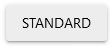

# Quasar-Vue.js的第三方UI框架

## 前言


[Quasar](https://github.com/quasarframework)是一款专门为Vue.js设计的一款的UI框架，该项目在GitHub上目前是Vue.js Start数量最多的UI框架。

在国内目前还未有大名气，但是Quasar是在国外非常火的Vue框架。

官方介绍中这么描述Quasar特点：

- 它基于Vue.js
- 拥有开箱即用的提供给**网站**和**应用程序**的最先进的UI（遵循《Material指南》）
- 开箱即用的对桌面和**移动浏览器**（包括iOS Safari！）的最佳支持
- 通过与我们自己的CLI紧密集成，对每种构建模式（SPA、SSR、PWA、移动应用程序、桌面应用程序和浏览器扩展）提供了一流的支持，并提供了最佳的开发人员体验
- 易于自定义（CSS）和可扩展（JS）
- 这是最注重性能的框架
- 自动tree shaking
- 在我们的论坛和Discord聊天基础上的很棒的社区
- 具有包括新功能在内的定期发布周期
- 获得快速修复并听取社区的要求
- 处理整个开发经验（甚至包括创建应用程序的图标和启动画面）

Quasar配备了40多种开箱即用的语言包，其中包括了中文。 最重要的是，如果缺少您的语言包，则只需5分钟即可添加。

Quasar官方文档为：https://quasar.dev/，但是目前官方尚未拥有中文文档，需要结合翻译工具和一定英语阅读水平。


## 安装

目前Quasar共支持4种安装模式：Quasar CLI脚手架安装、独立安装、Vite插件安装、Vue CLI安装

### **Quasar CLI 脚手架安装**

Quasar CLI脚手架是Quasar框架的独特产品，它拥有自动安装Quasar功能，只需要在NPM或者Yarn安装Quasar CLI即可。**一切都将开箱即用**。

**前提：确保Node环境版本 >=12.22.1 并且 NPM > 6.14，注意不要使用不稳定的Node 13或者15。**

```bash
$ yarn global add @quasar/cli
# or
$ npm install -g @quasar/cli
```

安装完毕后，启动脚手架安装即可。

```bash
$ quasar create 项目名称
```


安装完成，我们还需要在其package.json文件中添加相关QuasarCLI的快速启动脚本。

```js
// package.json
"scripts": {
  "dev": "quasar dev",
  "build": "quasar build",
  "build:pwa": "quasar build -m pwa"
}
```


### **独立模式安装**

如果您想将Quasar嵌入到您现有的网站项目中，并以渐进的方式进行整合，那么请选择独立模块安装。

这里这种方式并不推荐，因为这会变得很麻烦，可以自行查看：https://quasar.dev/start/umd


### **基于Vite插件安装**

作为Vue作者Evan You最新开发的打包工具Vite，作者称其实未来的Vue官方打包工具，自然Quasar在V2版本推出了相关的Vite插件。

但是目前主要是由社区来进行开发的，所以可能会出现相关未知问题，官方并不推荐这种方法用作实际开发中。此外官方声明了，未来将会发布基于Quasar CLI + Vite的方法。

首先插件一个Vite项目，这里关于Vite如何进行安装，自行查看[Vite官方文档](https://vitejs.dev/guide/#scaffolding-your-first-vite-project)

```bash
$ yarn create vite my-vue-app --template vue

# 或者使用 NPM
$ npm init vite@latest my-vue-app --template vue
```

安装成功后，再安装Quasar的Vite插件。

```bash
$ yarn add quasar @quasar/extras
$ yarn add -D @quasar/vite-plugin sass@1.32.0
```

这里的`@quasar/extras`组件不是必须的，包含一些MD图标内容。

随后使用NPM、Yarn安装项目依赖包即可。

配置方面，我们需要修改项目的main.js文件:

```js
// FILE: main.js
import { createApp } from 'vue'
import { Quasar } from 'quasar'
import quasarLang from 'quasar/lang/zh-CN'

// Import icon libraries
import '@quasar/extras/material-icons/material-icons.css'

// Import Quasar css
import 'quasar/src/css/index.sass'

// Assumes your root component is App.vue
// and placed in same folder as main.js
import App from './App.vue'

const myApp = createApp(App)

myApp.use(Quasar, {
  plugins: {}, // import Quasar plugins and add here
  lang: quasarLang,
})

// Assumes you have a <div id="app"></div> in your index.html
myApp.mount('#app')
```

还需要修改Vite.config.js文件:

```js
// FILE: vite.config.js
import { defineConfig } from 'vite'
import vue from '@vitejs/plugin-vue'
import { quasar, transformAssetUrls } from '@quasar/vite-plugin'

// https://vitejs.dev/config/
export default defineConfig({
  plugins: [
    vue({
      template: { transformAssetUrls }
    }),

    quasar({
      sassVariables: 'src/quasar-variables.sass'
    })
  ]
})
```

在src文件夹下新建一个`quasar-variables.sass`文件，用作存储UI框架的配饰，以及还需爱在项目根目录下还需要创建一个`quasar.conf.js`文件，用作导入使用的相关组件。

```css
// FILE (create it): src/quasar-variables.sass
$primary   : #1976D2
$secondary : #26A69A
$accent    : #9C27B0

$dark      : #1D1D1D

$positive  : #21BA45
$negative  : #C10015
$info      : #31CCEC
$warning   : #F2C037
```

```js
// FILE quasar.conf.js
framework: {
  plugins: [ 'QLayout', 'QHeader','QDrawer',' QToolbar','QToolbarTitle','QAvatar',
  'QTabs','QRouteTab','QPageContainer','QFooter', ...
 ]
}
```


### Vue CLI插件安装

使用VueCli创建安装，基于WebPack打包。

在创建项目之前需要先查看当前本地全局安装的Vue-CLI版本。

``` bash
vue --version
```

如果已安装过Vue CLI 2.x.x，你需要使用以下命令卸载它：

```bash
$ npm uninstall -g vue-cli
# 或（取决于您安装的方式）
$ yarn global remove vue-cli
```

需要安装Vue-CLI (v4+)以上的版本才可以:

```bash
$ npm install -g @vue/cli 
```

在使用Vue-CLI创建项目后，使用命名安装Quasar即可:

```bash
$ vue add quasar
```


## 布局

Quasar提供了对页面的布局的解决方法和组件，利用它们会使得网页设计布局变得不再繁琐和复杂。

### 间隔

其中Quasar提供了CSS类来帮助您为DOM元素或组件提供间距设置。里面所有选项都以`q-`为前缀，然后细分为类型（T），方向（D）和大小（S）。

例如：

```html
<!-- 所有方向的内边距都为Sm大小 -->
<div class="q-pa-sm">...</div>

<!-- 组件顶部的外边距为Md大小, 组件右边外边距为Sm大小 -->
<q-card class="q-mt-md q-mr-sm">...</q-card>
```

可以看见间隔的Css类 是由`q-xx-xx`组成了，其组成方法为：

```
q-[p|m][t|r|b|l|a|x|y]-[none|auto|xs|sm|md|lg|xl]
    T       D                   S

T - 间隔类型
  - 可选值: p (padding), m (margin)

D - 方向
  - 可选值:
      t (top), r (right), b (bottom), l (left),
      a (all), x (both left & right), y (both top & bottom)

S - 大小
  - 可选值:
      none,
      auto (只能对明确方向的外边距使用，如: q-ml-*, q-mr-*, q-mx-*),
      xs (extra small),
      sm (small),
      md (medium),
      lg (large),
      xl (extra large)
```

当然还有删除间隔相关的Css类：

| `no-margin`  | 删除所有应用的margin  |
| ------------ | --------------------- |
| `no-padding` | 删除所有应用的padding |


### Flexbox

Flexbox是目前绝大多数现代网站使用的一种布局形式，它主要使用了左右（X轴）或上下（Y轴）来进行组件布局排序。

而Quasar提供了许多CSS类，以辅助您使用Flexbox来创建网站页面。

实现需要了解其Flexbox，可以先阅读我的[Flexbox文章](https://zssaer.cn/2021/09/23/Flexbox/)。

Quasar Flex CSS类适用于容器（Container, 父元素）或容器项（item, 子元素）。

#### 父元素

对于父元素应用Flexbox，我们可以直接设置其方向，即可变为Flexbox布局。

| 类名             | 说明                                                        |
| ---------------- | ----------------------------------------------------------- |
| `row`            | Flex行（X轴方向）                                           |
| `row inline`     | 内联Flex行                                                  |
| `column`         | Flex列（Y轴方向）                                           |
| `column inline`  | 内联Flex列                                                  |
| `row reverse`    | 将`flex-direction`设置为`row-reverse`的Flex行（反向X轴）    |
| `column reverse` | 将`flex-direction`设置为`column-reverse`的Flex列（反向Y轴） |

```html
<div class="row">
  <div>First column</div>
  <div>Second column</div>
  <div>Third column</div>
</div>
```

除了设置方向外，还有设置换行（Flexbox布局默认自动换行）

| 类名           | 说明                                           |
| :------------- | :--------------------------------------------- |
| `wrap`         | 如有必要元素进行换行（默认为“on”，不需要指定） |
| `no-wrap`      | 元素强制不换行，即将元素压缩大小               |
| `reverse-wrap` | 如有必要逆向换行                               |

Flexbox设置对其方式也是非常必要的。

| 类名              | 说明                     |
| :---------------- | :----------------------- |
| `justify-start`   | 元素沿着方向从头排序     |
| `justify-end`     | 元素沿着方向从尾部排序   |
| `justify-center`  | 元素位置默认置中排序     |
| `justify-between` | 元素位置分别左 中 右排序 |
| ...               |                          |

总而言之，一切在Flexbox中有的配置属性在Quasar都可以用一段css类来实现。


#### 子元素

子元素这里重点讲述 大小分配。

Quasar使用一个12分的列来分配子行的大小。 以下是可用的CSS辅助类的一些示例：

```html
<div class="row">
  <div class="col-8">two thirds</div>
  <div class="col-2">one sixth</div>
  <div class="col-auto">auto size based on content and available space</div>
  <div class="col">fills remaining available space</div>
</div>
```

使用`col-x`来进行对每份的比例来进行划分宽度(或者高度)。

其中：

CSS辅助类`col-auto`使单元格只填充需要渲染的空间。 另一方面，`col`试图填充所有可用的空间，同时如果需要也可以缩小。

CSS辅助类`col-grow`使单元格至少填充需要渲染的空间，并有可能在有更多空间可用时增长，也就是填充完剩余的所有空间。

CSS辅助类`col-shrink`使单元格最多填充需要呈现的空间，并且当没有足够的可用空间时有可能收缩。

对于直接`col`这种形式的话,就按照实际情况来进行分配空间:

```html
<div class="row">
  <div class="col">1</div>
  <div class="col">1</div>
  <div class="col">1</div>
  <!--
     我们有3个子列，所以以上示例相当于
     对每个子列使用`col-4`
  -->
</div>

<div class="row">
  <div class="col-3">1</div>
  <div class="col-6">2</div>
  <div class="col-3">1</div>
</div>
```


当其中col的分配数量在每行（或者列）超过了12的话，超出部分元素将会换行进行展示。


#### 响应式设计

对于Flexbox的子元素大小分配，可以采用响应式来进行分配，使得区分PC端和移动端的分配比例，网站适配各个设备。

Quasar实现响应式很简单，只需要记住5个标记，它们对应的是5个不同的尺寸的窗口大小：

| 标记 | 最大窗口宽度 | 描述/应用时间                                   |
| :--- | :----------- | :---------------------------------------------- |
| `xs` | 599px        | 特小尺寸窗口(大部分手机所在的大小)              |
| `sm` | 1023px       | 小尺寸窗口(ipad、某些全面屏手机所在的大小)      |
| `md` | 1439px       | 中尺寸窗口(ipad pro、1920*1080的PC端所在的大小) |
| `lg` | 1919px       | 大尺寸窗口                                      |
| `xl` | Infinite     | 超大尺寸的窗口                                  |

然后结合前面的大小分配，即可实现自适应大小分配：

```html
<div class="row">
  <div class="col-xs-12 col-sm-6 col-md-4">
    col
  </div>
  <div class="col-xs-12 col-sm-6 col-md-4">
    col
  </div>
  <div class="col-xs-12 col-sm-6 col-md-4">
    col
  </div>
</div>
```

当然响应式不需要对所有窗口尺寸进行做配置，Quasar允许只对特定窗口做自适应配置，其他窗口使用默认大小分配。

```html
<template>
  <div class="q-pa-md">

    <div class="row">
      <!-- 1080尺寸PC端占比8份,其余则默认为整列 -->  
      <div class="col-12 col-md-8">.col-12 .col-md-8</div>
      <div class="col-12 col-md-4">.col-12 .col-md-4</div>
    </div>

    <div class="row">
      <!-- 1080尺寸PC端占平分,其余则默认为整列 -->  
      <div class="col-12 col-md">.col-12 .col-md</div>
      <div class="col-12 col-md">.col-12 .col-md</div>
      <div class="col-12 col-md">.col-12 .col-md</div>
    </div>

  </div>
</template>
```

#### Gutter

当直接子元素没有使用`col-*`或`offset-*`类指定宽度时，在父元素上使用`q-gutter-{size}`可以用来进行设置其子元素之间间隔。

这里的{size}提供了（`-none`、`-xs`、`-sm`、`-md`、`-lg`、`-xl`）,当然这些不是指尺寸大小,而是指元素之间的gutter尺寸。

```html
<template>
  <div class="q-pa-md" style="max-width: 500px">
    <p>q-gutter-xs</p>
    <div class="q-gutter-xs">
      <q-btn color="brown" label="Button" v-for="n in 7" :key="`xs-${n}`" />
    </div>
</template>
```

当然`q-gutter-{size}`只能在子元素为声明其`col-*`或`offset-*`时使用，如果子元素已经说明了，则应当使用`q-col-gutter-{size}`

```html
<div class="row q-col-gutter-xs">
      <div class="col-4" v-for="n in 5" :key="`xs-${n}`">
        <div class="my-content">&nbsp;</div>
      </div>
</div>
```

不管是`q-gutter-{size}`还是`q-col-gutter-{size}`,都是对上下左右(XY轴)进行设置间隔的，若要只对某个轴进行设置间隔的话，可以使用`q-(col)-gutter-{方向}-{size}`来进行单独设置:

```html
<template>
  <div class="q-pa-md" style="max-width: 500px">
    <div class="q-gutter-y-md">
      <q-btn color="teal" label="Button" v-for="n in 10" :key="n" />
    </div>
  </div>
</template>
```


但Gutter设置间隔有个缺点：会将其设置的元素的父元素都设置为 负的上边距 和 负的左边距，影响其父类的边距设置。

官方解决的办法就是推荐在其应用外层加入一个容器，设置为overflow-auto 或 row 类。

```html
      <div class="offset-1 col-3 column justify-between">
        <p>Styling on wrapper - .row</p>
        <div>
          <div class="bg-yellow q-pa-sm">Yellow block</div>
          <div class="bg-red-4 row">
            <div class="row q-gutter-lg">
              <div class="q-pa-md bg-green-3" v-for="n in 4" :key="n">C</div>
            </div>
          </div>
        </div>
      </div>
```

`q-gutter-*`类不会改变子元素的内部尺寸，因此您可以直接在子元素上使用`background`或`border`


### QLayout全局布局

Quasar拥有一个网页布局组件，QLayout。

QLayout，用于管理整个窗口布局并使用导航栏或侧滑菜单等元素包装页面内容。 多个页面可以共享同一个QLayout，因此代码是可重用的，这是它们的关键点之一。

**QLayout不是强制性的**，但它确实可以帮助您更好地构建网站/应用程序，可为您带来简化网站/应用布局设计的极大好处。

实现在Quasar使用组件前，需要先在quasar.conf.js进行声明下，以表示项目引用该组件。

```
framework: {
  plugins: [ 'QLayout',
 ]
}
```

```html
<q-layout>
...
</q-layout>
```

QLayout拥有一个独特的一个布局概率，使您可以通过简单地更改短字符串符号来轻松地以某些方式构造布局以使其工作。

> 当然这主要是应用于拥有 页眉（如导航栏）或者左右侧拉栏 、页尾的功能。

“QLayout”拥有一个`view`属性，它使用字符串表示。 该字符串必须恰好包含9个字符： XXX XXX XXX 

其中X代表选择范围也代表其位置的情况，它们的选择范围如下：


实际指定操作为从左到右拼接：

- 选择3个字符定义页眉行 状态
- 一个空格
- 选择3个字符定义中间行 状态
- 一个空格
- 然后3个字符定义页脚行 状态

当某个位置选择对应的英文的话，则代表对应位置就覆盖在顶部显示,如下所示。


上图由于左侧全部是l(不管大小都算)，所以左侧侧拉栏则为固定在左边，而右侧的r只有两个区域，所以右侧侧拉栏只在选择的r两区域固定。

而上面的大小写代表其元素固定。 例如，使用包含了一个“L”（大写字母而不是小写字母）将使布局左侧（左侧滑菜单）处于固定位置，即滑动主页面滚动条的内容，其中左侧滑菜单内容不动。 同样适用于“H”（页眉），“F”（页脚），最后是“R”（右侧/右侧滑菜单）。

**注意：即使不使用它们（页眉、左右菜单、页脚），也要指定QLayout的所有部分。 例如，即使您不使用页脚或右侧侧滑菜单，也请在QLayout的`view`属性中指定它们。**


当然在一般情况下，使用QLayout是管理的一整个页面。但是，您也可以使用 QLayout 来作为容器(具有特定的高度和宽度)来将它设置在页面中的某个位置。甚至设置在一个Dialog中。

当QLayout设置为内部容器时，需要设置它的**CSS高度（或最小高度）**，否则会不起作用。

```html
<template>
  <div class="q-pa-md">
    <q-layout view="lhh LpR lff" container style="height: 500px" class="shadow-2 rounded-borders">
    ...
    </q-layout>
  </div>
   ...
</template>   
```


#### QPageContainer下的嵌套路由

现在网页界面通常由嵌套在多个级别的组件组成。 URL的段对应于嵌套组件的某种结构也很常见，例如：


我们打开两个页面（profile、posts）就会发现，其实两个页面都是基于User这个布局来进行，切换页面时User内容不会被重新加载，而是中间的内容进行单独加装。这个就是路由的另外一个功能（前一个功能是跳转切换）-嵌套路由。

如果之前了解过Vue-Router的，可能会知道，Vue-Router的嵌套路由的实现是使用`<router-view></router-view>`

而Quasar也是这样的，只不过在Quarsar中，在使用QLayout做整个页面布局时，**它还提供了一个`QPageContainer`这个组件，它的作用就是做页面的主要内容展示的**，所以在它的内部时加入嵌套路由的好方法。

```html
<!-- /src/layouts/User.vue -->
<template>
  <q-layout>
    ...

    <!-- 这是页面被注入的地方 -->
    <q-page-container>
      <router-view></router-view>
    </q-page-container>

    ...
  </q-layout>
</template>
```

对于其嵌套路由的组件，Quasar也提供了一个`Qpage`这个组件:

```html
<!-- /src/pages/Profile.vue 或 Posts.vue -->
<template>
  <q-page>
    ...page content...
  </q-page>
</template>
```

对于嵌套路由的设置，这个或许都是了解的，只需要在其父路由下添加子路由即可。

```js
import User from 'layouts/User'
import Profile from 'pages/Profile'
import Posts from 'pages/Posts'

const routes = [
  {
    path: '/user',
    // 我们使用上面导入的/src/layouts/User组件
    component: User,

    // 嘿，它有子路由，并且在它里面用户具有<router-view>；
    // 那真的是一个布局！
    children: [
      // Profile page
      {
        path: 'profile', // 在这里，路由/user/profile
        component: Profile // 我们参考上面导入的/src/pages/Profile.vue
      },

      // Posts page
      {
        path: 'posts', // 在这里，路由/user/posts
        component: Posts // 我们参考上面导入的/src/pages/Posts.vue
      }
    ]
  }
]

export default routes
```

这里以`/`开头的嵌套路径将被视为根路径。 这使您可以利用组件嵌套，而不必使用嵌套的URL。

当然上面使用的是直接加载组件方式，如果你的网站/应用程序很小，那么你可以不使用延迟加载，因为使用它可能会增加比它的价值更多的开销。但更多情况下我们改成懒加载\按需加载的形式：

```js
    children: [
      {
        path: 'feed',
        component: () => import('pages/user-feed')
      },
      {
        path: 'profile',
        component: () => import('pages/user-profile')
      }
    ]
```


#### QHeader-页面头部

Quasar给使用QLayout的布局的用户提供了一个新的头部导航组件。

```html
<q-layout view="lHh Lpr lFf">
    <q-header>
    ...
    </q-header>
</q-layout>    
```

#### QFooter-页面头部

Quasar给使用QLayout的布局的用户同样提供了一个新的页尾组件。

```html
<q-layout view="lHh Lpr lFf">
	<q-footer elevated class="bg-grey-8 text-white">
	...
	</q-footer>
</q-layout>    
```


## 组件

Quasar目前拥有基本上市面上所有的UI组件库。

### Toolbar-工具栏

QToolbar通常是用在布局页眉和页脚上的一部分，但它也可以在页面上的任何位置使用。

```html
<q-layout view="lHh Lpr lFf">
    <q-header>
      <q-toolbar>
      ...
      </q-toolbar>
    </q-header>
</q-layout>
```

它本身只是一个有颜色的横条，通常需搭配如`q-btn`、`q-toolbar-title`、`q-breadcrumbs`等使用。


它拥有一个特别的属性`inset` : 运行带有这个属性的工具类嵌入上面主工具栏上，从而实现多层工具栏。

```html
<q-toolbar>
...
</q-toolbar>
<q-toolbar inset>
...
</q-toolbar>
```


工具栏内还有个特殊标签`<q-space>` ：工具栏内部元素默认在左边开始，从左到右依次插入。在该标签后续的元素将会至于工具栏右侧开始。效果如上图的左右的按钮一样。

```html
<q-toolbar>
	...
	<q-space />
	...
</q-toolbar>
```

### QBtn-按钮

QBtn是Quasar的按钮组件。它主要拥有两种形状：矩形（默认）和圆形。还具有内嵌的material风格和扁平风格以及质感风格设计。

color为按钮颜色的属性，label为按钮显示文字。

默认material风格，glossy 则为质感设计风格，outline 为扁平设计。

```
<q-btn color="white" text-color="black" label="Standard" />
<q-btn color="deep-orange" glossy label="Deep Orange" />
<q-btn outline color="primary" label="Outline" />
```



当然和其他UI库一样，它设置`round `即可是圆形按钮。

QBtn拥有 icon属性，支持设置按钮图标。当然这个图标可以选择外部图标，也可以选择Quasar的扩展图标库内的内置图标。

```html
<q-btn color="primary" icon="mail" label="On Left" />
```


除了公式化的这些设计以外，QBtn还支持自定义设计图标内容，只需要在标签内部添加元素即可。

```html
    <q-btn color="deep-orange" push>
      <div class="row items-center no-wrap">
        <q-icon left name="map" />
        <div class="text-center">
          Custom<br>Content
        </div>
      </div>
    </q-btn>

    <q-btn round>
      <q-avatar size="42px">
        
      </q-avatar>
    </q-btn>
```


使用size属性可以确认确认其图标大小，如果使用的标准屏幕字母来设置大小（如XS、SM、MD、LG、XL）的话需要使用`:size`来设置。


一些按钮动作涉及与服务器联系，异步响应，会在按下后通知用户正在进行的后台处理。QBtn通过`loading`属性提供了这种可能性。 此属性将显示QSpinner（默认情况下），而不显示按钮的图标和/或标签。 

使用<template v-slot:loading> 可以设置其按钮处理中的 显示内容。不设置的话，默认为转圈动画。

```html
<q-btn :loading="loading1" color="secondary" @click="simulateProgress(1)" label="Button" />
<q-btn :loading="loading4" color="primary" @click="simulateProgress(4)" style="width: 150px">
      Button
      <template v-slot:loading>
        <q-spinner-hourglass class="on-left" />
        Loading...
      </template>
</q-btn>
```


甚至你还可以在图标中设置附加的`percentage`属性以显示处理的进度。


QBtn按钮支持href和to的连接方式。当然尽可能使用 Vue Router 而不是 href，因为使用 href 将触发一个窗口导航，而不是页内的 Vue Router 导航。

```html
<div class="q-pa-md q-gutter-sm">
    <q-btn to="/start/pick-quasar-flavour" label="To Docs index" outline color="purple" />
    <q-btn to="/start/pick-quasar-flavour" label="To Docs index in 2s" @click="linkClick" glossy color="purple" />

    <q-btn href="start/pick-quasar-flavour" label="With href" push color="purple" />
    <q-btn href="start/pick-quasar-flavour" target="_blank" label="With href - open in new window" color="purple" />
</div>
```

对于更为复杂的用例情况下，可以直接使用原生的Vue的<router-link>来进行封装QBtn按钮。

```html
<router-link
      :to="{ path: '/register', query: { search: '1', test: '1' } }"
      custom
      v-slot:default="props"
    >
      <q-btn v-bind="buttonProps(props)" />
</router-link>
...
<script>
export default {
  setup () {
    function linkClick (e, go) {
      e.preventDefault() // we choose when we navigate

      // console.log('triggering navigation in 3s')
      setTimeout(() => {
        // console.log('navigating as promised 3s ago')
        go()
      }, 3000)
    }

    function buttonProps ({ href, route, isActive, isExactActive }) {
      const props = {
        color: 'black',
        noCaps: true,
        label: `To "${route.fullPath}"`,
        outline: true,
        to: href
      }

      if (isActive === true) {
        props.color = isExactActive === true ? 'primary' : 'amber-9'
      }
      else {
        props.color = 'black'
      }

      return props
    }

    return {
      linkClick,
      buttonProps
    }
  }
}
</script>
```

### QBtnDropdown-下拉按钮

QBtnDropdown是一个非常方便的下拉按钮。 与 [QList](https://quasar.dev/vue-components/list-and-list-items)作为下拉内容配合得很好，但绝不仅限于此。

```html
<q-btn-dropdown color="primary" label="Dropdown Button">
      <q-list>
        <q-item clickable v-close-popup @click="onItemClick">
          <q-item-section>
            <q-item-label>Photos</q-item-label>
          </q-item-section>
        </q-item>

        <q-item clickable v-close-popup @click="onItemClick">
          <q-item-section>
            <q-item-label>Videos</q-item-label>
          </q-item-section>
        </q-item>

        <q-item clickable v-close-popup @click="onItemClick">
          <q-item-section>
            <q-item-label>Articles</q-item-label>
          </q-item-section>
        </q-item>
      </q-list>
</q-btn-dropdown>
```

QBtnDropdown内部常常跟QList 选择列表结合。


当然也可以自定义设计下拉内容：

```html
    <q-btn-dropdown
      class="glossy"
      color="purple"
      label="Account Settings"
    >
      <div class="row no-wrap q-pa-md">
        <div class="column">
          <div class="text-h6 q-mb-md">Settings</div>
          <q-toggle v-model="mobileData" label="Use Mobile Data" />
          <q-toggle v-model="bluetooth" label="Bluetooth" />
        </div>

        <q-separator vertical inset class="q-mx-lg" />

        <div class="column items-center">
          <q-avatar size="72px">
            
          </q-avatar>

          <div class="text-subtitle1 q-mt-md q-mb-xs">John Doe</div>

          <q-btn
            color="primary"
            label="Logout"
            push
            size="sm"
            v-close-popup
          />
        </div>
      </div>
    </q-btn-dropdown>
```


### QCard-卡片

QCard组件是显示重要分组内容的好方法。 这种模式正在迅速成为应用、网站预览和电子邮件内容的核心设计模式。 它通过包含和组织信息来帮助观看者，同时还设置可预测的期望。

卡片具有一次可显示的大量内容，能够归纳内容,使得内容流可读性高，因此，卡片已迅速成为许多公司（包括Google和Twitter之类）的首选设计模式。

QCard组件特意是轻巧的，并且实质上是一个布局包含元素，该元素能够“容纳”任何其他合适的组件。

```html
<q-card
      class="my-card text-white"
      style="background: radial-gradient(circle, #35a2ff 0%, #014a88 100%)"
    >
      <q-card-section>
        <div class="text-h6">Our Changing Planet</div>
        <div class="text-subtitle2">by John Doe</div>
      </q-card-section>

      <q-card-section class="q-pt-none">
        {{ lorem }}
      </q-card-section>
</q-card>
```


其中<q-card-section>是一个强制性封格元素，默认使上下产生间距，内部元素以水平显示。甚至可以在里面添加按钮，以实现某些操作。

```html
    <q-card class="my-card bg-secondary text-white">
      <q-card-section>
        <div class="text-h6">Our Changing Planet</div>
        <div class="text-subtitle2">by John Doe</div>
      </q-card-section>

      <q-card-section>
        {{ lorem }}
      </q-card-section>

      <q-separator dark />

      <q-card-actions>
        <q-btn flat>Action 1</q-btn>
        <q-btn flat>Action 2</q-btn>
      </q-card-actions>
    </q-card>
```


### QCarousel-滚动栏(Banner)

QCarousel 是Quasar中的滚动栏组件，常常用作首页的Banner图使用。

```
<q-carousel
      v-model="slide"
      transition-prev="slide-right"
      transition-next="slide-left"
      animated
      control-color="primary"
      class="rounded-borders"
    >
      <q-carousel-slide name="style" class="column no-wrap flex-center">
        <q-icon name="style" color="primary" size="56px" />
        <div class="q-mt-md text-center">
          {{ lorem }}
        </div>
      </q-carousel-slide>
      <q-carousel-slide name="tv" class="column no-wrap flex-center">
        <q-icon name="live_tv" color="primary" size="56px" />
        <div class="q-mt-md text-center">
          {{ lorem }}
        </div>
      </q-carousel-slide>
      ...
</q-carousel>
```

QCarousel 内部的内容由多个<q-carousel-slide>组件组成，它们即使滚动栏里面滚动的内容。

其中的v-model 绑定的当前的滚动的位置,这个位置 是 指的是 <q-carousel-slide>组件的name属性。


QCarousel  内部属性 swipeable表示 能够滑动切换内容，navigation则是下方导航显示为点。

可以定义内部的transition-prev、transition-next来控制其前进后退的动画效果。

大多数事件时我们都会在内部添加图片内容的，<q-carousel-slide>组件有个img-src属性就是设置图片的地方。

```html
<q-carousel
      animated
      v-model="slide"
      arrows
      navigation
      infinite
    >
      <q-carousel-slide :name="1" img-src="https://cdn.quasar.dev/img/mountains.jpg" />
      <q-carousel-slide :name="2" img-src="https://cdn.quasar.dev/img/parallax1.jpg" />
      <q-carousel-slide :name="3" img-src="https://cdn.quasar.dev/img/parallax2.jpg" />
</q-carousel>
```


同样内部也可以放置其他元素,比如更多文字。

```html
      <q-carousel-slide name="first" img-src="https://cdn.quasar.dev/img/mountains.jpg">
        <div class="absolute-bottom custom-caption">
          <div class="text-h2">First stop</div>
          <div class="text-subtitle1">Mountains</div>
        </div>
      </q-carousel-slide>
```


