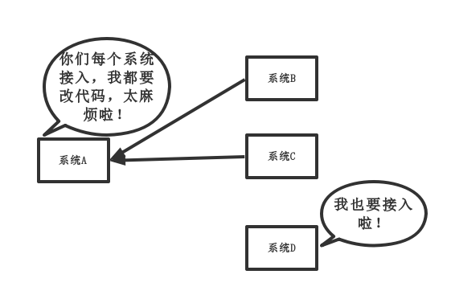
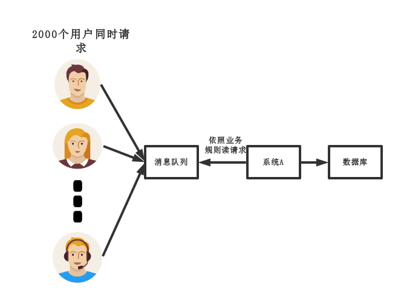
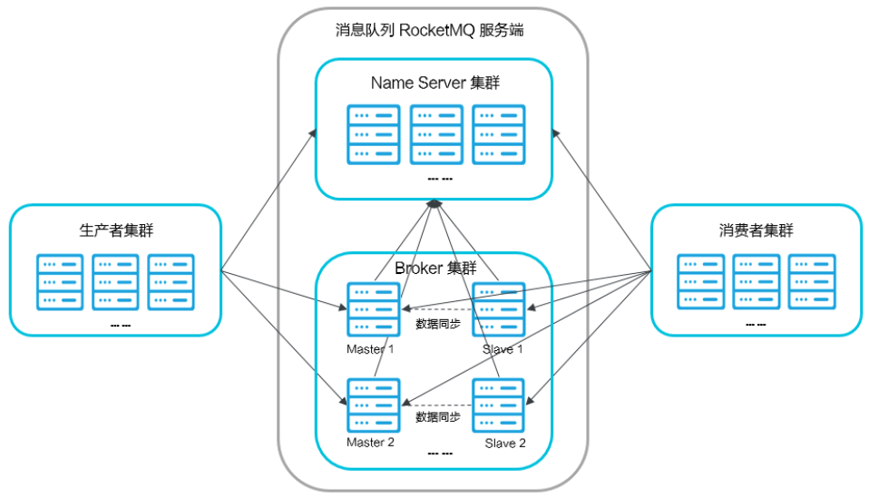
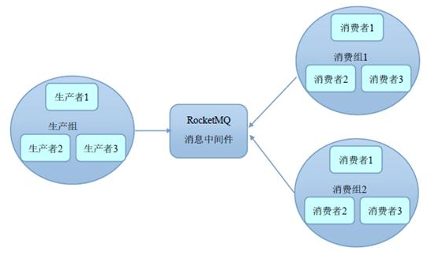
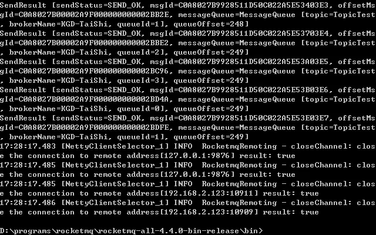
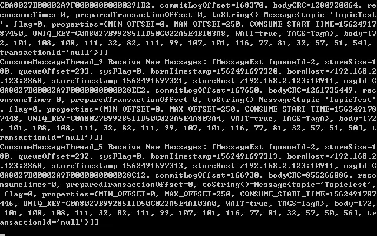

# RocketMQ


## 介绍

RocketMQ 是阿里巴巴开源的分布式消息中间件。目前已经成为Apache中的开源基金会项目。它的同类产品有RabbitMQ、Kafka、ActiveMQ。

RocketMQ 支持事务消息、顺序消息、批量消息、定时消息、消息回溯等。它里面有几个区别于标准消息中件间的概念，如`Group、Topic、Queue`等。系统组成则由`Producer、Consumer、Broker、NameServer`等。

**为什么选择RocketMQ?**

- 是一个队列模型的消息中间件，具有高性能、高可靠、高实时、分布式等特点
- Producer、Consumer、队列都可以分布式
- Producer 向一些队列轮流发送消息，队列集合称为 Topic，Consumer 如果做广播消费，则一个 Consumer 实例消费这个 Topic 对应的所有队列，如果做集群消费，则多个 Consumer 实例平均消费这个 Topic 对应的队列集合
- 能够保证严格的消息顺序
- 支持拉（pull）和推（push）两种消息模式
- 高效的订阅者水平扩展能力
- 实时的消息订阅机制
- 亿级消息堆积能力
- 支持多种消息协议，如 JMS、OpenMessaging 等
- 较少的依赖

## 关于消息队列优点

在项目中为什么要使用消息队列?

目前大部分项目中都有三种应用处理: 

解耦（耦合性指的就是个模块之间的关联程度。耦合性越低模块的独立性越强）、耗时方面、削峰方面（通过技术手段减少峰值访问的压力）

当然还有其他的，这里就不做过多说明了。


### 解耦方面

**传统模式设计:**



很明显，传统模式设计下，系统间耦合性太强（耦合性指的就是个模块之间的关联程度。耦合性越低模块的独立性越强），如上图所示，系统A在代码中直接调用系统B和系统C的代码，如果将来D系统接入，系统A还需要修改代码，过于麻烦！当然不可否认的是，目前绝大部分中小项目都是这种设计，因为它设计简单易懂省事。

**中间件模式:**


使用中间件模式，将系统BCD的要求通过消息形式写入消息队列，需要消息的系统自己从消息队列中订阅，从而系统A不需要做任何修改，这种设计显然更加先进。


### 耗时方面

**传统模式设计:**


使用传统模式设计，一些非必要的业务逻辑以同步的方式运行，太耗费时间。

**中间件模式:**


使用中间件模式，将消息写入消息队列，非必要的业务逻辑以异步的方式运行，加快响应速度。


### 削峰方面

**传统模式设计:**


使用传统模式设计，并发量大的时候，所有的请求直接一个一个怼到数据库，造成数据库连接异常。

**中间件模式:**



使用中间件模式，系统A慢慢的按照数据库能处理的并发量，通过用户传来的消息队列中慢慢拉取消息。在生产中，这个短暂的高峰期积压是允许的。

## 关于消息队列缺点

上面讲述了使用消息队列的优点好处。当然作为好东西，不可能完全完美，那自然也会存在缺点。

一个使用了消息队列 的项目，如果连具体问题都没有考虑过，就把把消息队列组件引进去了，那就给自己的项目带来了风险。我们引入一个技术，要对这个技术的弊端有充分的认识，才能做好预防。要记住，不要给公司挖坑，当然面对要随时要跑路的黑心公司除外！

除了这个以外，还要考虑很多系统处理方面的问题，比如一致性问题、如何保证消息不被重复消费，如何保证保证消息可靠传输。因此，引入信息队列会让项目系统复杂性直线增加。


## RocketMQ核心以及概念

讲了这么多消息队列的方面内容，那么回归正题RocketMQ，说说RocketMQ的核心概率。



RocketMQ 在任何一个环境都是可扩展的，**生产者（Producer）必须是一个集群，消息服务器（Name Server）必须是一个集群，消费者（Consumer）也同样。**

**集群级别的高可用，是消息队列 RocketMQ 跟其他的消息服务器的主要区别**。

消息生产者发送一条消息到消息服务器，消息服务器会随机的选择一个消费者，只要这个消费者消费成功就认为是成功了。


**RocketMQ主要由 Producer、Broker、Consumer 三部分组成，其中Producer 负责生产消息，Consumer 负责消费消息，Broker 负责存储消息。**

> Producer ：负责生产消息，一般由业务系统负责生产消息，简单形象点来说就是 买票时创建买票的订单。一个消息生产者会把业务应用系统里产生的消息发送到broker服务器。RocketMQ提供多种发送方式，同步发送、异步发送、顺序发送、单向发送。同步和异步方式均需要Broker返回确认信息，而单向发送不需要。
>
> Broker ：消息中转角色，负责存储消息、转发消息，简单形象点来说就是 存储用户创建买票的订单的仓库。代理服务器在RocketMQ系统中负责接收从生产者发送来的消息并存储、同时为消费者的拉取请求作准备。代理服务器也存储消息相关的元数据，包括消费者组、消费进度偏移和主题和队列消息等。
>
> Consumer ：负责消费消息，一般是后台系统负责异步消费，简单形象点来说就是 从买票的订单仓库后台处理订单进行买票。一个消息消费者会从Broker服务器拉取消息、并将其提供给应用程序。从用户应用的角度而言提供了两种消费形式：拉取式消费、推动式消费。
>
> Topic：表示一类消息的集合，简单形象点来说就是将同类买票的订单归为一个集合。每个Topic（主题）包含若干条消息，每条消息只能属于一个主题，是RocketMQ进行消息订阅的基本单位。

除了这些以外，还有Name Server，即代理服务器。

> Name Server：名称服务充当路由消息的提供者，简单形象点来说 就是类似于服务注册服务器。生产者或消费者能够通过名字服务查找定位各Topic（主题）相应的Broker IP列表。多个Name server实例组成集群，但相互独立，没有信息交换。


上面差不多就是其RocketMQ全部的关键部分组成简绍了。

总体来说 整个使用RocketMQ的流程就是： 

***Consumer生成消息 -》 Consumer通过NameServer归类到对应Topic -》Topic存储在Broker中 -》Consumer 通过NameServer调取到对应Topic 所在的Broker -》Consumer 依次消费消息***


## RocketMQ搭建使用

要记住RocketMQ是由集群模式下进行的，在实际生成环境下是分布式模式搭建的，而不是单机搭建。

在安装RocketMQ之前我们先来理解Group概念，在RocketMQ中Group是很重要的。通过Group机制，让RocketMQ天然的支持消息负载均衡！比如某个Topic有9条消息，其中一个Consumer Group有3个实例（3个进程 OR 3台机器），那么每个实例将均摊3条消息！（注意RocketMQ只有一种模式，即发布订阅模式。）如下图所示：



与众多集群一样它的模式类似于Mysql的主从机制。

- 单Master模式：无需多言，一旦单个broker重启或宕机，一切都结束了！很显然，线上不可以使用。
- 多Master模式：全是Master，没有Slave。当然，一个broker宕机了，应用是无影响的，缺点在于宕机的Master上未被消费的消息在Master没有恢复之前不可以订阅。
- 多Master多Slave模式（异步复制）：多对Master-Slave，高可用！采用异步复制的方式，主备之间短暂延迟，MS级别。Master宕机，消费者可以从Slave上进行消费，不受影响，但是Master的宕机，会导致丢失掉极少量的消息。
- 多Master多Slave模式（同步双写）：和上面的区别点在于采用的是同步方式，也就是在Master/Slave都写成功的前提下，向应用返回成功，可见不论是数据，还是服务都没有单点，都非常可靠！缺点在于同步的性能比异步稍低。


### 搭建操作

我们将要搭建一个简易的RocketMQ集群，它包含1个nameserver，两个master（Broker服务器）。至于Producer和Consumer服务器集群则普通的集群服务，这里不做简绍。

#### 下载RocketMQ

首先我们下载RocketMQ官方版本：

下载官方二进制二进制压缩包：[**https://dlcdn.apache.org/rocketmq/4.9.2/rocketmq-all-4.9.2-bin-release.zip**](https://dlcdn.apache.org/rocketmq/4.9.2/rocketmq-all-4.9.2-bin-release.zip) ，然后解压。


#### 部署NameServer服务器

由于RocketMQ由JAVA语言编辑而来，务必确保安装JAVA，并且正确配置JAVA环境。

--Windows操作--

由于其默认JAVA配置大小为默认2G，对于我们来说明显大了，所以我们需要先修改内存使用大小,用编辑器修改一下`runserver.cmd`脚本：

```bash
rem set "JAVA_OPT=%JAVA_OPT% -server -Xms2g -Xmx2g -Xmn1g -XX:MetaspaceSize=128m -XX:MaxMetaspaceSize=320m"
set "JAVA_OPT=%JAVA_OPT% -server -Xms256m -Xmx512m"
```

使用Windows进行部署前，需要将其RocketMQ文件夹配置到系统变量下。

​	变量名：ROCKETMQ_HOME

​    变量值：MQ解压路径\MQ文件夹名

然后启动Cmd命令框执行进入至‘MQ文件夹\bin’下，然后执行‘start mqnamesrv.cmd’，启动NAMESERVER。成功后会弹出提示框，此框勿关闭。


-- Linux操作：--

先使用Vim进行编辑MQ文件夹下的/bin/runserver.sh 文件，因为Name Server 默认配置Xmx=4G ，对于小型Linux服务器来说应该进行修改。这里我们修改为1GB。

```sh
vi /bin/runserver.sh

JAVA_OPT="${JAVA_OPT}-server -Xms4g -Xmx4g -Xmn2g -XX:MetaspaceSize=128m -XX:MaxMetaspaceSize=320m"
```

修改后：

```sh
JAVA_OPT="${JAVA_OPT} -server -Xms1g -Xmx1g -Xmn512m -XX:MetaspaceSize=128m -XX:MaxMetaspaceSize=320m"
```

后台启动NameServer，并动态查看启动状态：

```sh
nohup sh bin/mqnamesrv -n "150.205.110.91:9876" > /dev/null 2>&1 &

tail -f ~/logs/rocketmqlogs/namesrv.log
```

这里的的 启动时 -n 后为启动IP即端口，对于本地的话，可以使用127.0.0.1。


#### 部署Broker服务器

由于RocketMQ由JAVA语言编辑而来，务必确保安装JAVA，并且正确配置JAVA环境。

配置RocketMQ的Broker服务器需要设置其Broker配置文件，用来进行确定其Broker配置。我们需要2台Broker服务器，所以我们需要准备2个Broker配置文件。

好在我们下载的二进制RocketMQ中的Conf文件夹中有一系列的测试配置，我们直接使用其 `2m-noslave`文件夹下的`broker-a.properties`和`broker-b.properties`配置即可。

--Windos操作：--

与NameServer一样,我们需要修改它的默认内存使用大小，使用编辑器修改runbroker.cmd文件:

```sh
rem set "JAVA_OPT=%JAVA_OPT% -server -Xms2g -Xmx2g"
set "JAVA_OPT=%JAVA_OPT% -server -Xms256m -Xmx512m"
```

然后 Cmd命令框执行进入至‘MQ文件夹\bin’下，然后执行‘start mqbroker.cmd -n 127.0.0.1:9876 -c ../conf/2m-noslave/broker-a.properties’，启动BROKER-A。

要在同一台电脑上进行学习的话，我们需要修改下另一个Broker服务器配置，新增额外内容：

```properties
#存储路径
storePathRootDir=~/logs/rocketmqstore
#commitLog 存储路径
storePathCommitLog=~/logs/rocketmqstore/commitlog
#消费队列存储路径存储路径
storePathConsumeQueue=~/logs/rocketmqstore/consumequeue
#消息索引存储路径
storePathIndex=~/logs/rocketmqstore/index
#checkpoint 文件存储路径
storeCheckpoint=~/logs/rocketmqstore/checkpoint
#abort 文件存储路径
abortFile=~/logs/rocketmqstore/abort
#端口设置
listenPort=10950
```

因为RocketMQ中自带的配置文件时用于多台主机的集群搭建的，所以自然不会将其存储路径固定，端口也都是默认的10911。在单机下进行搭建必须要进行修改，否则启动会报出`RocketMq Lock failed,MQ already started`错误，表明端口 以及路径被占用。

然后再执行‘start mqbroker.cmd -n 127.0.0.1:9877 -c ../conf/2m-noslave/broker-b.properties’，启动BROKER-B。


--Linux操作：--

与NameServer一样，它的默认JAVA配置Xmx= 8G，我们需要进行修改：

调整java opt：

```sh
vi /bin/runbroker.sh

JAVA_OPT="${JAVA_OPT}-server -Xms8g -Xmx8g -Xmn4g"
```

调整后：

```sh
JAVA_OPT="${JAVA_OPT} -server -Xms2g -Xmx2g -Xmn1g"
```

后台启动：

```sh
nohup sh bin/mqbroker -n 10.200.110.91:9876 -c ./conf/2m-noslave/broker-a.properties &
```

在另外一台服务器上 再启动一个Broker服务器：

```sh
nohup sh bin/mqbroker -n 10.200.110.91:9876 -c ./conf/2m-noslave/broker-b.properties & tail -f ~/logs/rocketmqlogs/broker.log-n ip:9876
```

注意其中两个配置文件中brokerName不同。所以在自定义配置Broker配置时，brokerName不能相同。


### 关闭RocketMQ服务

对于Windos来说关闭服务很简单，ctrl+C即可，当然也可以使用mqshutdown.cmd + broker/namesrv 方式来进行关闭。

对于Linux的话，使用其bin下内置的mqshutdown来进行关闭。

```sh
> sh bin/mqshutdown broker
The mqbroker(36695) is running...
Send shutdown request to mqbroker(36695) OK

> sh bin/mqshutdown namesrv
The mqnamesrv(36664) is running...
Send shutdown request to mqnamesrv(36664) OK
```


### 控制台搭建

RocketMQ和其他分布式队列组件一样，也有自己的控制台产品，那就是Rocket-console，它是用RocketMQ社区来进行在Github维护的。

目前Rocket-console已经被重命名为**[rocketmq-dashboard](https://github.com/apache/rocketmq-dashboard)**。

我们需要克隆一个Rocketmq-dashboard项目到本地来进行部署：

```sh
git clone https://github.com/apache/rocketmq-dashboard.git
```

克隆后，我们进入项目文件下的src\main\resources’文件夹，打开‘application.properties’进行相关配置。

```properties
...
# 绑定控制台的地址以及端口
server.address=127.0.0.1
server.port=8083
...
# 配置NameServer地址
rocketmq.config.namesrvAddr=127.0.0.1:9876
...
```

 不管是在Windos下还是Linux下，使用Maven进行打包然后运行：

```sh
mvn clean package -Dmaven.test.skip=true
java -jar rocketmq-console-ng-1.0.0.jar &
```

当然如果在Windos界面下也可以直接在一些IDE直接启动即可。

启动成功后在浏览器中输入配置中的访问地址，即可加入RocketMQ控制台。


点击 集群 ,我们也可以轻松看见当前的Broker服务器状态:


## RocketMQ操作

下面介绍RocketMQ关键操作

### 验证功能

RocketMQ自带了恬送与接收消息的脚本`tools.cmd`，它用来验证RocketMQ的功能是否正常。

`tool.cmd`脚本需要带参数执行，无法用简单的双击方式启动。因此，我们打开一个cmd窗口，并跳转到bin目录下。


#### 启动消费者

与`mqbroker.cmd`脚本类似，启动`tool.cmd`命令之前我们要指定NameServer地址。

这里我们采用命令方式指定，并启动消费者。我们需要将其sh或者cmd进入其RocketMQ下的bin文件夹中,依次执行如下命令：

```cmd
set NAMESRV_ADDR=localhost:9876
tools.cmd org.apache.rocketmq.example.quickstart.Consumer
# Linux下使用tools.sh
tools.sh org.apache.rocketmq.example.quickstart.Consumer
```

其中`org.apache.rocketmq.example.quickstart.Consumer`是RocketMQ下的一个测试 消费者类，就是用来进行测试学习使用的。

#### 启动生产者

操作同上类似。

```cmd
set NAMESRV_ADDR=localhost:9876
tools.cmd org.apache.rocketmq.example.quickstart.Producer
# Linux下使用tools.sh
tools.sh org.apache.rocketmq.example.quickstart.Producer
```

执行成功后，生产者会发送1000个消息，然后自动退出。



此时，在消费者界面按下`Ctrl + C`，就会收到刚刚生产者发出的消息。



我们也看通过RocketMQ控制台看见其消费情况。

到这儿，RocketMQ最小应用己经可以正常工作，能满足我们开发环境下调试代码的需求。


### 项目中使用

上面验证功能只是在学习和测试中进行使用，作为开发者，需要在其项目中集成RocketMQ组件功能，实现其信息队列功能的话，需要在项目中进行实现消费者、生产者。

#### 导入Maven依赖

```xml
<dependency>
   <groupId>org.apache.rocketmq</groupId>
   <artifactId>rocketmq-spring-boot-starter</artifactId>
   <version>2.2.0</version>
</dependency>
```


#### 生产者发送端

作为生产者端 ，需要配置以下内容在SpringBoot配置中：

```xml-dtd

rocketmq
  # 绑定name Server服务器地址
  name-server: localhost:9876
  # 定义生产者发布 组名
  producer
    group: my-group1
  # 定义要发送的信息的主题集合
  topic: string-topic
```

##### 发送信息操作

```java
@Autowired
private RocketMQTemplate rocketMQTemplate;
// 注入定义的主题-topci
@Value("rocketmq.topic")
private String topic;

/**
 * 发送简单的MQ消息
 * @param msg
 * @return
 */
@GetMapping("/send")
public Results send(String msg) throws InterruptedException, RemotingException, MQClientException, MQBrokerException {
    ...
		// 如下两种方式等价
        rocketMQTemplate.convertAndSend(topic, "Hello, World!");
        rocketMQTemplate.send(topic, MessageBuilder.withPayload("Hello, World! I'm from spring message").build());
        // 第三个参数为key
        rocketMQTemplate.syncSend(topic, "Hello, World! I'm from simple message", "18122811143034568830");
		
		// topic: ORDER，tag: paid, cacel
		rocketMQTemplate.convertAndSend(topic, "Hello, World!");
        rocketMQTemplate.convertAndSend(topic, "Hello, World!");
		
	    // 消息体为自定义对象
        rocketMQTemplate.convertAndSend(topic, new OrderPaidEvent("T_001", new BigDecimal("88.00")));


		// 发送延迟消息
        rocketMQTemplate.sendDelayed(topic, "I'm delayed message", MessageDelayLevel.TIME_1M);
		
		// 发送即发即失消息（不关心发送结果）
		rocketMQTemplate.sendOneWay(topic, MessageBuilder.withPayload("I'm one way message").build());


		// 发送顺序消息
        rocketMQTemplate.syncSendOrderly(topic, "I'm order message", "1234");
    ...
}
```
RocketMQTemplate是rocketMQ-SpringBoot-starter这个依赖直接封装好了的工具，直接使用它来进行发送、接受等操作。


#### 消费者端

作为消费者端 ，需要配置以下内容在SpringBoot配置中：

```xml-dtd
rocketmq:
  name-server: 127.0.0.1:9876
```

##### 接受消费消息操作

不同于生产者，使用消费者时，需要随时接受到对应的消息载体，所以需要使用监听器类。

```java
@Service
@RocketMQMessageListener(topic = "test-topic-1", consumerGroup = "my-consumer_test-topic-1")
public class MyConsumer implements RocketMQListener<String> {
    public void onMessage(String message) {
        log.info("received message: " + message);
    }
}
```

RocketMQ消费者监听器实现RocketMQListener类，它接受一个泛型，取决于接受的消息载体类型。通过复写onMessage方法来实现其接受消息的功能。


其中@RocketMQMessageListener中主要注解，它定义了对应的topic集合名，用于寻找对应的Broker，来依次获取里面的消息。而consumerGroup则为其消费者的组定义。

除了这样使用，还可以专门定位到某个RocketMQ集群上：

```java
@RocketMQMessageListener(nameServer = "127.0.0.1:9877", instanceName = "tradeCluster", topic = "test-topic-3", consumerGroup = "my-consumer_test-topic-3")
```

以及定义其对应的消费模式和重试次数:

```java
// ConsumeMode为消费模式,ConsumeMode.ORDERLY为按顺序消费
// 配置重试次数 reconsumeTimes = -1 代表一直重试
@RocketMQMessageListener(topic = "test-topic-4", consumerGroup = "my-consumer_test-topic-6",
    consumeMode = ConsumeMode.ORDERLY, reconsumeTimes = -1)
```

它的所有说明属性如下：

```java
/**
 * Consumer 所属消费者分组
 *
 * Consumers of the same role is required to have exactly same subscriptions and consumerGroup to correctly achieve
 * load balance. It's required and needs to be globally unique.
 *
 * See <a href="http://rocketmq.apache.org/docs/core-concept/">here</a> for further discussion.
 */
String consumerGroup();

/**
 * 消费的 Topic
 *
 * Topic name.
 */
String topic();

/**
 * 选择器类型。默认基于 Message 的 Tag 选择。
 *
 * Control how to selector message.
 *
 * @see SelectorType
 */
SelectorType selectorType() default SelectorType.TAG;
/**
 * 选择器的表达式。
 * 设置为 * 时，表示全部。
 *
 * 如果使用 SelectorType.TAG 类型，则设置消费 Message 的具体 Tag 。
 * 如果使用 SelectorType.SQL92 类型，可见 https://rocketmq.apache.org/rocketmq/filter-messages-by-sql92-in-rocketmq/ 文档
 *
 * Control which message can be select. Grammar please see {@link SelectorType#TAG} and {@link SelectorType#SQL92}
 */
String selectorExpression() default "*";

/**
 * 消费模式。可选择并发消费，还是顺序消费。
 *
 * Control consume mode, you can choice receive message concurrently or orderly.
 */
ConsumeMode consumeMode() default ConsumeMode.CONCURRENTLY;

/**
 * 消息模型。可选择是集群消费，还是广播消费。
 *
 * Control message mode, if you want all subscribers receive message all message, broadcasting is a good choice.
 */
MessageModel messageModel() default MessageModel.CLUSTERING;

/**
 * 消费的线程池的最大线程数
 *
 * Max consumer thread number.
 */
int consumeThreadMax() default 64;

/**
 * 消费单条消息的超时时间
 *
 * Max consumer timeout, default 30s.
 */
long consumeTimeout() default 30000L;
```


### 事务消费

关于RocketMQ-SpringBoot-Starter默认的消费模式是 按顺序消费，意思就是 “通过消息的发送顺序来进行依次消费处理”，这一种默认的消费模式满足大部分设计要求，但是它对于 一些重要业务来说则显得不足。

一款买票软件，它的买票服务通常逻辑是这样的：订票 -》选择票类型-》生成订单-》支付-》完成购票。

这种涉及到钱的操作一般设计就要十分严谨，如果不使用事务处理的话，当用户订票未付款就会发生订单一直保留，这样不满足原子性（要么同时成功要么全部失败）。

所以我们来使用RocketMQ进行事务消费操作：

**生产者：**

```java
@Component 
public class SpringTransactionProducer { 

	@Autowired 
	private RocketMQTemplate rocketMQTemplate;
	
	 /**
	 * 发送消息 
	 * @param topic  
	 * @param msg 
	 */ 
	 public void sendMsg(String topic, String msg) { 
	 	/**
	 	 * 这里的Message不是rocketmq.commen的 
	 	 * 是springframework的接口
	 	 * /
		 Message message = MessageBuilder.withPayload(msg).build(); 
		 
		 /**
		  * myTransactionGroup要和@RocketMQTransactionListener(txProducerGroup = "myTransactionGroup")定义的Group一致 
		  * 消息会通过TransactionGroup找到事务消费者、通过topic普通消费者 只有事务消费者commit 普通消费者的结果才会执行 
		  * /
		 this.rocketMQTemplate.sendMessageInTransaction("myTransactionGroup", topic, message, null); 
		 
		 System.out.println("发送消息成功"); 
	 } 
 }
```

这里使用了RocketMQTemplate的sendMessageInTransaction方法进行发送事务消息。

这里它第一个参数需要一个Transaction组参数，用于存放在其业务组下，在消费者中根据TransactionGroup进行额外操作。

我们还要在**生产者(这里是生产者!)**中创建一个RocketMQ业务监听器：

```java
@RocketMQTransactionListener(txProducerGroup = "myTransactionGroup") 
public class TransactionListenerImpl implements RocketMQLocalTransactionListener { 

	/**
	 * 可以定义一个static final的Map 用来保存返回unknown要回查消息的一些属性 那么所有对象都可以获取该消息回滚前的一些信息
	 * private static Map<String, Object> INFO_MAP = new HashMap<>();
	 */
    
	@Override 
	public RocketMQLocalTransactionState executeLocalTransaction(Message message, Object o) { 
		 /**
		   * 该Message是springframework包下的 其获取事务消息的唯一id的方法
		   * String transId = (String)message.getHeaders().get(RocketMQHeaders.TRANSACTION_ID); 
		   * /
		try {
			System.out.println("执行操作1"); 
			Thread.sleep(500); 
			
			System.out.println("执行操作2"); 
			Thread.sleep(800); 
			

	   	    if(...) return LocalTransactionState.COMMIT_MESSAGE

            if(...) return LocalTransactionState.ROLLBACK_MESSAGE

            //如果在检查事务时数据库出现宕机可以让broker过一段时间回查 和return null 效果相同
             if(...) return LocalTransactionState.UNKNOW 

		} catch (Exception e) { 
			e.printStackTrace(); 
			/**
			 * 回滚
			 * 
			 * 可以在该处给 INFO_MAP放一些信息 以便会查时调用
			 * INFO_MAP.put(transId,...);
			 * /
			return RocketMQLocalTransactionState.ROLLBACK;
		}
		
	}

	@Override 
	public RocketMQLocalTransactionState checkLocalTransaction(Message message) { 
		/**
		 * 只去返回commit或者rollback
		 * 
		 * 可以用INFO_MAP取得一些回滚前的信息
		 * String transId = (String)message.getHeaders().get(RocketMQHeaders.TRANSACTION_ID); 
		 * INFO_MAP.get(transId);
		 * /
    } 
}
```

其中RocketMQ业务监听器需要实现RocketMQLocalTransactionListener，其中包含两个重要方法：

executeLocalTransaction：*用来执行本地事务*，用来执行业务逻辑的地方，返回事务运行状态。

checkLocalTransaction：只是检测事务运行状态，不做处理，处理事务回查的代码部分。


其中`LocalTransactionState.COMMIT_MESSAGE` 为本地事务提交，代表事务过程中没有错误，消费者可以消费到该值。

`LocalTransactionState.ROLLBACK_MESSAGE`为本地事务回滚，代表事务过程中出错，该消息将被删除，消费者无法消费该消息。

`LocalTransactionState.Unknown`: 中间状态，它代表需要检查消息队列来确定状态，最终决定这个消息的是checkLocalTransaction这个方法。

消费者的内容基本不变。


RocketMQ它的具体事务逻辑就是 生产者发送消息成功接受后，生产者执行RocketMQ事务监听器中的executeLocalTransaction方法，根据返回的状态，来决定消息是否被消费者消费。

如果状态为Unknown则为待定，那么RocketMQ会每隔一段时间调用一次checkLocalTransaction方法，来决定这个消息的最终归宿。至于这个时间取决于Broker配置文件中的`transactionCheckInterval`，它的默认值是60*1000，也就是1分钟。其中还有`transactionCheckMax `,它规定了最大次数，超过这个次数，如果还返回UNKNOW，这个消息将被删除。

RocketMQ的事务简单来说就是，发送后检查是否将其发送前的业务完成，最终确认的操作。


这而举个例子：

```mysql
CREATE TABLE `s_term` (
  `id` int(11) NOT NULL AUTO_INCREMENT,
  `term_year` year(4) NOT NULL ,
  `type` int(1) NOT NULL DEFAULT '1' ,
  PRIMARY KEY (`id`)
) 
```

这是一张订单表（假如）

那么我们的生产者在创建订单后将其发送消息，提醒消费者去进行核对表，然后购买...等等操作。

```java
@Transactional(rollbackFor = Exception.class)
public void sendTransactionMQ() throws Exception {
    Term term = new Term();
    term.setTermYear(2020);
    term.setType(1);
    int insert = termMapper.insert(term);
    
    Message message = MessageBuilder.withPayload(term).build(); 
	rocketMQTemplate.sendMessageInTransaction("myTransactionGroup", topic, message, null); 
    
}
```

```java
   @Override
    public LocalTransactionState executeLocalTransaction(Message msg, Object arg) {

        Integer termId = (Integer)arg;
        Term term = termMapper.selectById(termId);
        System.out.println("executeLocalTransaction termId="+termId+" term:"+term);
        if (term != null) return COMMIT_MESSAGE;

        return LocalTransactionState.UNKNOW;
    }
```

如果前置订单创建成功这儿就会返回COMMIT_MESSAGE，该消息即可被消费者进行消费处理；


### 事务消费的优化

上面的事务消费通常是正常的写法，但是它存在一个问题，那就是消息消费不对等。

当我们在生产者中发送消息后报出操作，因为Spring的@Transactional存在，那么就会导致所有的该方法内所有内容滚回。

但是生产者在发送消息后就自动会执行事务监听器的executeLocalTransaction方法，从而导致消息依旧可能被发送出去，并且被消费者消费...而该业务方法后抛错，导致@Transactional滚回。从而就出现了消息发送了并被消费，而订单却没被提交的情况。。。


对此我有个方法修护这个问题。

那就是**将其executeLocalTransaction中的内容不要，直接返回`LocalTransactionState.UNKNOW`**;

```java
@Override
public LocalTransactionState executeLocalTransaction(Message msg, Object arg) {
    return LocalTransactionState.UNKNOW;
}
```

由于是UNKNOW自然 就会等待周期性的触发checkLocalTransaction方法，然后进行核查。这样当业务方法发送操作后，其抛出错误，依旧可以根据周期性的触发checkLocalTransaction方法来进行 消息滚回，放置消息被发送出去。

但是这也有个缺点，那就是会造成消息业务处理的速度降低，因为它需要等待周期性的触发checkLocalTransaction方法。


### 关于消费者组

我们在设置消费者服务器监听器时，在其`@RocketMQMessageListener`中往往需要加上一个自定义的`consumerGroup`这个参数。

它的作用其实是分流处理，相对于管道，3个不同的consumerGroup就有3个管道，1条消息就会同时被3个consumerGroup的消费者消费。

当多个同业务消费者 定义为同一个 consumerGroup下，那么消息会被平均分摊处理，比如发送4条消息，2个消费者会分别处理2个消息。


一般情况下，我们建议一个消费者分组，仅消费一个 Topic 。，比如做订单处理的，消费者就在订单消费者组中。这样做会有两个好处：

- 每个消费者分组职责单一，只消费一个 Topic 类型，不干其他活。
- 每个消费者分组是独占一个线程池，这样能够保证多个 Topic 隔离在不同线程池，保证隔离性，从而避免一个 Topic 消费很慢，影响到另外的 Topic 的消费。


