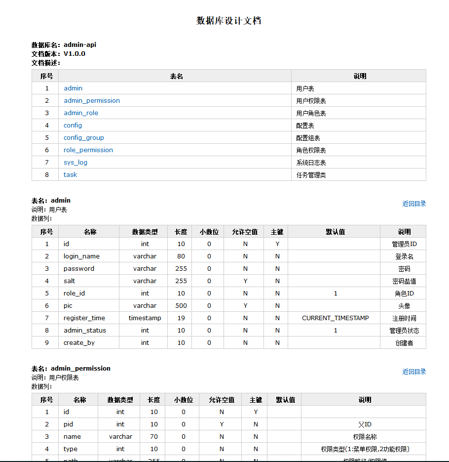

# Screw-数据库表结构文档生成工具


## 前言

Screw 是一款开源数据库文档生成工具，属于国内的开源项目，使用它能够快速生成其项目数据库文档，加快项目的开发时间。

目前Screw支持主流的关系型数据库，如MySQL、Oracle、SQLServer、PostgreSQL，但目前对一些小众关系型数据库仍然不支持，如H2、DB2、HSQL、SQLite等。

文档格式方面，Screw支持生成Html网页、Word、MarkDown。

## 使用方法

```java
<dependency>
    <groupId>cn.smallbun.screw</groupId>
    <artifactId>screw-core</artifactId>
    <version>${lastVersion}</version>
 </dependency>
```

2022/02/24 目前最新版本为1.0.5

编写文档生成器类：

```java
/**
 * @description: 数据库结构文档生成器
 * @author: Zhaotianyi
 * @time: 2022/2/24 10:12
 */
public class ScrewGenerator {

    public static void main(String[] args) {
        ScrewGenerator generator = new ScrewGenerator();
        generator.run();
    }

    public void run() {
        HikariConfig hikariConfig = new HikariConfig();
        hikariConfig.setDriverClassName("com.mysql.cj.jdbc.Driver");
        hikariConfig.setJdbcUrl("jdbc:mysql://127.0.0.1:3306/admin-api");
        hikariConfig.setUsername("root");
        hikariConfig.setPassword("200428");
        hikariConfig.addDataSourceProperty("useInformationSchema", "true");
        DataSource dataSource = new HikariDataSource(hikariConfig);

        // 生成文件配置
        EngineConfig engineConfig = EngineConfig.builder()
                // 生成文件路径，自己mac本地的地址，这里需要自己更换下路径
                .fileOutputDir("DirFile/")
                // 打开目录
                .openOutputDir(false)
                // 生成文件类型
                // EngineFileType.HTML 为 网页
                // EngineFileType.WROD 为 Word
                // EngineFileType.MD 为 MarkDown
                .fileType(EngineFileType.HTML)
                // 生成模板实现
                .produceType(EngineTemplateType.freemarker).build();

        // 生成文档配置（包含以下自定义版本号、描述等配置连接）
        Configuration config = Configuration.builder()
                .version("V1.0.0")
                .description("")
                .dataSource(dataSource)
                .engineConfig(engineConfig)
                .produceConfig(getProcessConfig())
                .build();

        // 执行生成
        new DocumentationExecute(config).execute();
        System.out.println("数据库结构文档生成成功");
    }

    /**
     * 配置想要生成的表+ 配置想要忽略的表
     * @return 生成表配置
     */
    public static ProcessConfig getProcessConfig(){
        // 忽略表名
        List<String> ignoreTableName = Arrays.asList("");
        // 忽略表前缀，如忽略a开头的数据库表
        List<String> ignorePrefix = Arrays.asList("");
        // 忽略表后缀
        List<String> ignoreSuffix = Arrays.asList("");

        return ProcessConfig.builder()
                //根据名称指定表生成
                .designatedTableName(new ArrayList<>())
                //根据表前缀生成
                .designatedTablePrefix(new ArrayList<>())
                //根据表后缀生成
                .designatedTableSuffix(new ArrayList<>())
                //忽略表名
                .ignoreTableName(ignoreTableName)
                //忽略表前缀
                .ignoreTablePrefix(ignorePrefix)
                //忽略表后缀
                .ignoreTableSuffix(ignoreSuffix).build();
    }
}
```

这儿需要注意，目前作者不知道什么原因在其生成核心代码中将其DataSource写死为HikariDataSource，无论是什么的DataSource都会将其强制到HikariDataSource，从而不能够使用像Druid这样的第三方数据源，好在HikariDataSource为其SpringBoot2官方默认的DataSource，不需要额外增加其依赖文件。对于这件事，本人不知道为什么会这样做？是因为HikariDataSource不需要添加第三方依赖（从而减少其余开源的依赖）的原因吗？


运行上面这个生成器。在其项目中自动生成了一个DirFile文件夹，数据库结构文档即生成在内了，整个过程非常简单。



