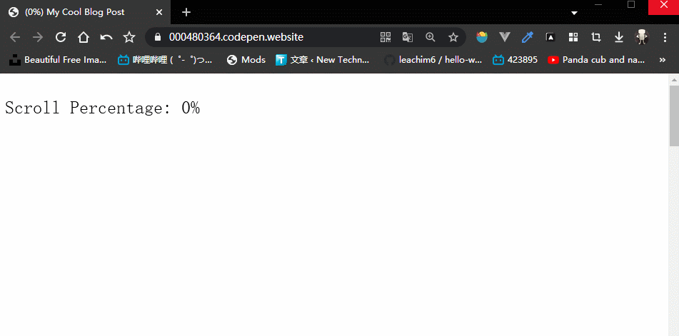

# 简单实现阅读进度显示

相信在不少Blog或者大型笔记网站里面看见过阅读类似进度这样的东西吧。

实际上这个实现起来非常简单，为浏览器滚轮监听事件即可。

除了显示文本的百分百进度以外，也可以将其标题进行动态显示提示。

下面即是实现方法：

## 教程

如果你使用的是React框架的话可以直接考虑安装[react-scroll-percentage](https://github.com/thebuilder/react-scroll-percentage)这个插件，这里不做过多说明了。

在相应页面上添加如下：

```html
<p style="position: fixed; top: 5px; left: 5px">
  Scroll Percentage: <span id="percent">0</span>%
</p>
```

这里为了展示，创建了一个文本用于动态显示进度百分比。

```js
const percentLabel = document.querySelector("#percent");
const originalTitle = document.title;

window.addEventListener("scroll", () => {
  let scrollTop = window.scrollY;
  let docHeight = document.body.offsetHeight;
  let winHeight = window.innerHeight;
  let scrollPercent = scrollTop / (docHeight - winHeight);
  let scrollPercentRounded = Math.round(scrollPercent * 100);
  percentLabel.innerHTML = scrollPercentRounded;
  document.title = `(${scrollPercentRounded}%) ${originalTitle}`;
});
```

这里除了将其文本进行修改之外，还将其页面标题前加上了进度比。



当然，除了百分比直接显示，还可以借助第三方UI组件，我们可以将其值传入其图形制度条中，即可实现以进度条方式显示。