# Sentinel-高可用流量管理框架

Sentinel是阿里开源的项目，提供了流量控制、熔断降级、系统负载保护等多个维度来保障服务之间的稳定性。


2012年，Sentinel诞生于阿里巴巴，其主要目标是流量控制。2013-2017年，Sentinel迅速发展，并成为阿里巴巴所有微服务的基本组成部分。 它已在6000多个应用程序中使用，涵盖了几乎所有核心电子商务场景。2018年，Sentinel演变为一个开源项目。2020年，Sentinel Golang发布。

## 特点

**丰富的应用场景** ：Sentinel 承接了阿里巴巴近 10 年的双十一大促流量的核心场景，例如秒杀（即
突发流量控制在系统容量可以承受的范围）、消息削峰填谷、集群流量控制、实时熔断下游不可用应用等。
**完备的实时监控** ：Sentinel 同时提供实时的监控功能。您可以在控制台中看到接入应用的单台机
器秒级数据，甚至 500 台以下规模的集群的汇总运行情况。
**广泛的开源生态** ：Sentinel 提供开箱即用的与其它开源框架/库的整合模块，例如与 Spring
Cloud、Dubbo、gRPC 的整合。您只需要引入相应的依赖并进行简单的配置即可快速地接入Sentinel。

**完善的 SPI 扩展点**：Sentinel 提供简单易用、完善的 SPI 扩展接口。您可以通过实现扩展接口来快
速地定制逻辑。例如定制规则管理、适配动态数据源等。

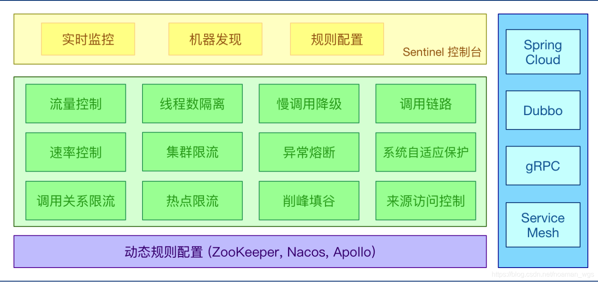


目前使用该技术栈的公司有(不完全统计):

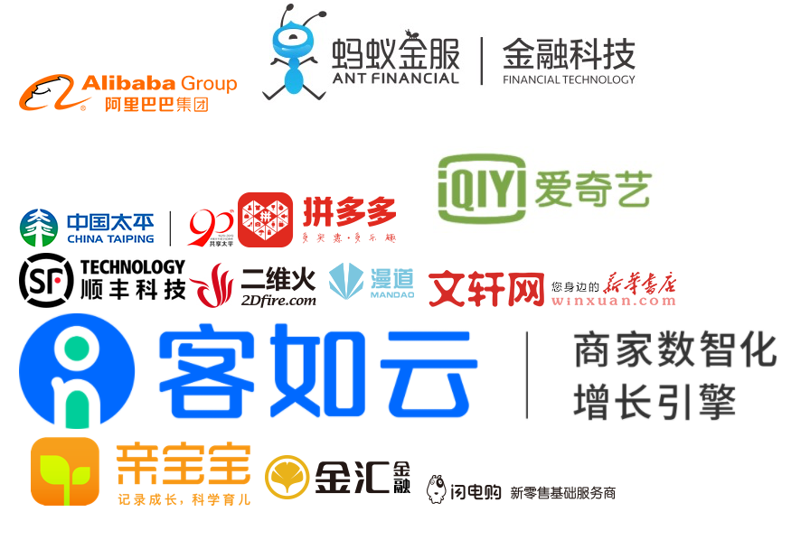

## 基础流量概念

在使用Sentinel来控制微服务的流量管理之前,务必需要了解吞吐量（TPS）、QPS、并发数、响应时间（RT）几个概念:

> 1. 响应时间(RT)
>    　　响应时间是指系统对请求作出响应的时间。直观上看，这个指标与人对软件性能的主观感受是非常一致的，因为它完整地记录了整个计算机系统处理请求的时间。由于一个系统通常会提供许多功能，而不同功能的处理逻辑也千差万别，因而不同功能的响应时间也不尽相同，甚至同一功能在不同输入数据的情况下响应时间也不相同。所以，在讨论一个系统的响应时间时，人们通常是指该系统所有功能的平均时间或者所有功能的最大响应时间。当然，往往也需要对每个或每组功能讨论其平均响应时间和最大响应时间。
>       　　对于单机的没有并发操作的应用系统而言，人们普遍认为响应时间是一个合理且准确的性能指标。需要指出的是，响应时间的绝对值并不能直接反映软件的性能的高低，软件性能的高低实际上取决于用户对该响应时间的接受程度。对于一个游戏软件来说，响应时间小于100毫秒应该是不错的，响应时间在1秒左右可能属于勉强可以接受，如果响应时间达到3秒就完全难以接受了。而对于编译系统来说，完整编译一个较大规模软件的源代码可能需要几十分钟甚至更长时间，但这些响应时间对于用户来说都是可以接受的。
> 2. 吞吐量(Throughput)
>    吞吐量是指系统在单位时间内处理请求的数量。对于无并发的应用系统而言，吞吐量与响应时间成严格的反比关系，实际上此时吞吐量就是响应时间的倒数。前面已经说过，对于单用户的系统，响应时间（或者系统响应时间和应用延迟时间）可以很好地度量系统的性能，但对于并发系统，通常需要用吞吐量作为性能指标。
>    　　对于一个多用户的系统，如果只有一个用户使用时系统的平均响应时间是t，当有你n个用户使用时，每个用户看到的响应时间通常并不是n×t，而往往比n×t小很多（当然，在某些特殊情况下也可能比n×t大，甚至大很多）。这是因为处理每个请求需要用到很多资源，由于每个请求的处理过程中有许多不走难以并发执行，这导致在具体的一个时间点，所占资源往往并不多。也就是说在处理单个请求时，在每个时间点都可能有许多资源被闲置，当处理多个请求时，如果资源配置合理，每个用户看到的平均响应时间并不随用户数的增加而线性增加。实际上，不同系统的平均响应时间随用户数增加而增长的速度也不大相同，这也是采用吞吐量来度量并发系统的性能的主要原因。一般而言，吞吐量是一个比较通用的指标，两个具有不同用户数和用户使用模式的系统，如果其最大吞吐量基本一致，则可以判断两个系统的处理能力基本一致。
> 3. 并发用户数
>    并发用户数是指系统可以同时承载的正常使用系统功能的用户的数量。与吞吐量相比，并发用户数是一个更直观但也更笼统的性能指标。实际上，并发用户数是一个非常不准确的指标，因为用户不同的使用模式会导致不同用户在单位时间发出不同数量的请求。一网站系统为例，假设用户只有注册后才能使用，但注册用户并不是每时每刻都在使用该网站，因此具体一个时刻只有部分注册用户同时在线，在线用户就在浏览网站时会花很多时间阅读网站上的信息，因而具体一个时刻只有部分在线用户同时向系统发出请求。这样，对于网站系统我们会有三个关于用户数的统计数字：注册用户数、在线用户数和同时发请求用户数。由于注册用户可能长时间不登陆网站，使用注册用户数作为性能指标会造成很大的误差。而在线用户数和同事发请求用户数都可以作为性能指标。相比而言，以在线用户作为性能指标更直观些，而以同时发请求用户数作为性能指标更准确些。
> 4. QPS每秒查询率(Query Per Second)
>    每秒查询率QPS是对一个特定的查询服务器在规定时间内所处理流量多少的衡量标准，在因特网上，作为域名系统服务器的机器的性能经常用每秒查询率来衡量。对应fetches/sec，即每秒的响应请求数，也即是最大吞吐能力。 （看来是类似于TPS，只是应用于特定场景的吞吐量）

## Sentinel 的使用

Sentinel的使用主要有两个部方:

* 控制台（Dashboard）：使用控制台来负责管理推送规则、监控、集群限流分配管理、机器发现等，实现可视化显示流量等数据。
* 核心库（Java 客户端）：不依赖任何框架/库，能够运行于 Java 7 及以上的版本的运行时环境，同时对 Dubbo / Spring Cloud 等框架也有较好的支持，通过代码来实现控制流量管理。


## 使用Sentinel控制台

### 1.开启控制台服务

您可以从 [release 页面](https://github.com/alibaba/Sentinel/releases) 下载最新版本的控制台 jar 包。

您也可以从最新版本的源码自行构建 Sentinel 控制台：

- 下载 [控制台](https://github.com/alibaba/Sentinel/tree/master/sentinel-dashboard) 工程
- 使用以下命令将代码打包成一个 fat jar: `mvn clean package`

两种方式下来得到了jar包后，在CMD中启动：

```bash
java  -server -Xms64m -Xmx256m  -Dserver.port=8849 -jar /work/sentinel-dashboard-1.7.1.jar 
```

其中`Dserver.port`配置了控制台服务器的端口号,而`jar`后则是jar包位置。

我们也可以制作bat批处理文件来方便每次运行控制台。

拥有Sentinel是基于SpringBoot开发的，所以其运行过程和SpringBoot项目一样。

运行成功后，进入浏览器打开对于Sentinel服务器地址，第一次便会默认进入登陆页面。默认用户名和密码都为sentinel。


登陆成功后，进入控制台页面，但由于控制台本身配置中未说明其他客户端服务，所以为一片空白。

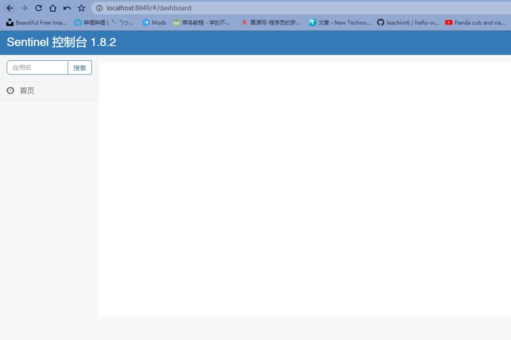


### 2.客户端接入控制台

接下来我们需要将客户端服务连接到控制台中。

在对应的Spring的微服务-消费客户端(用户使用的消费提供服务的接口,自然要控制消费提供服务的流量)上添加Sentinel依赖包：

```xml
<dependency>
        <groupId>com.alibaba.cloud</groupId>
        <artifactId>spring-cloud-starter-alibaba-sentinel</artifactId>
 </dependency>
```

然后在配置文件中加入Sentienl的配置:

```xml-dtd
spring:
  application:
	# 在控制台上显示的服务名称
    name: sentinel-service1

  cloud:
    sentinel:
      transport:
		# 控制台服务器的地址
        dashboard: localhost:8849
```

运行客户端即可,接入控制台中。

**注意：运行客户端后需要进行进行调用几次接口才会在控制台显示。**

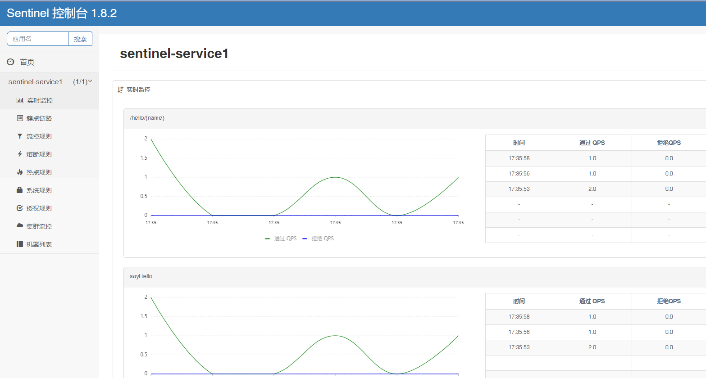

其中实时监控中*实时显示*了对应的接口QPS调用情况，以及响应时间。

进入**簇点链路**，可以更主观显示了对应的接口调用情况，并且提供了一些操作，这些操作可以直接在控制台中快速实现，而不需要在客户端中进行编写对应代码。

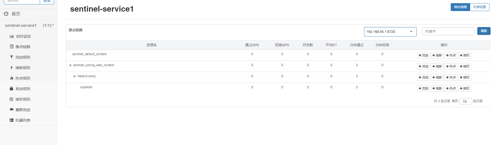

### 配置限流规则

对需要进行限流的接口上点击`+流控`按钮:

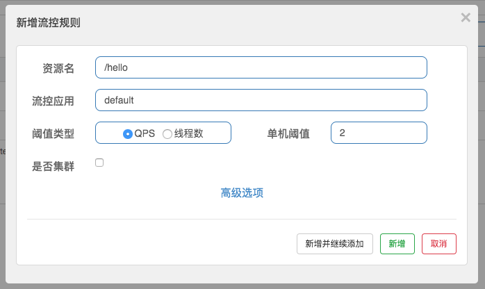

这里做了一个最简单的配置：

- 阈值类型选择：QPS
- 单机阈值：2

综合起来的配置效果就是，该接口的限流策略是每个IP主机每秒最多允许2个请求进入。

点击添加后,我们可以进入`流控规则`中看见该流控规则,并且可以进行再次编辑。

我们对某个接口设置了控流后，可以再次连续访问该接口，就会发现曝出`Blocked by Sentinel (flow limiting)`错误,说明控流实现成功。

Sentinel控制台还用很多其他功能,比如熔断\热点\授权等，关于这些操作下面详述，可以查看[官方文档](https://github.com/alibaba/spring-cloud-alibaba/wiki/Sentinel)。


## 使用Sentinel核心库

上面简绍了然后使用Sentinel控制台以及使用控制台来进行操作客户端服务器。而Sentinel 核心库可以不依赖 控制台Dashboard来进行控制服务端服务器，使用内部代码来进行设定控制规则。

但Sentinel核心库和Sentinel控制台一起配合使用会有更好的效果。

使用核心库前，客户端需要导入Sentinel依赖包：

```xml
<dependency>
        <groupId>com.alibaba.cloud</groupId>
        <artifactId>spring-cloud-starter-alibaba-sentinel</artifactId>
 </dependency>
```

使用核心库来进行设置熔断降级步骤：

1. 定义资源

   > 资源：可以是任何东西，一个服务，服务里的方法，甚至是一段代码。在编码的时候，只需要考虑这个代码是否需要保护，如果需要保护就可以设定为资源。

2. 定义规则

   > 规则：Sentinel 支持以下几种规则：流量控制规则、熔断降级规则、系统保护规则、来源访问控制规则
   > 和 热点参数规则。

3. 检验规则是否生效

Sentinel 设定的所有规则都可以在内存态中动态地查询及修改，修改之后立即生效. 所以**需要先把可能需要保护的资源定义好**，之后再配置规则。

实际操作如下:

### 1.设定资源

**资源**是 Sentinel 的关键概念。它可以是 Java 应用程序中的任何内容，例如，由应用程序提供的服务，或由应用程序调用的其它应用提供的服务，RPC接口方法，甚至可以是一段代码。

* **对于需要将某个方法定义资源时,使用`@SentinelResource`注释**:

```java
@SentinelResource("HelloWorld")
public void helloWorld() {
    // 资源中的逻辑
}
```

其中 `@SentinelResource` 注解包含以下属性：

- value：资源名称，必需项（不能为空）
- entryType：entry 类型，可选项（默认为 EntryType.OUT）
- blockHandler / blockHandlerClass: blockHandler 对应处理 BlockException的函数名称，表示触发了规则的上限所要执行的内容,可选项。blockHandler 函数访问范围需要是 public，返回类型需要与原方法相匹配，参数类型需要和原方法相匹配并且最后加一个额外的参数，类型为 BlockException。blockHandler 函数默认需要和原方法在同一个类中。若希望使用其他类的函数，则可以指定 blockHandlerClass 为对应的类的 Class 对象，注意对应的函数必需为 static 函数，否则无法解析。

* **对于一段代码,将其作为资源时,使用SphU.entry("资源名") 和 entry.exit() 包围起来即可。**

可以使用*jdk1.7*的*try-with-resources 特性*来进行定义:

```java
...
    while (true) {
        // 1.7 版本开始可以直接利用 try-with-resources 特性
        try (Entry entry = SphU.entry("HelloWorld")) {
            // 被保护的逻辑
            System.out.println("hello world");
	}catch (BlockException blockException)
        {
            // 接口被限流的时候, 会进入到这里
            log.warn("---getOrder1接口被限流了---, exception: ", blockException);
            return "接口限流, 返回空";
        }   
  }
...
```

这里代码的资源设定需要抛出规则触发上限的执行逻辑，至于什么叫为什么这样做，是因为它没有想方法注释那样可以定义blockHandler的参数。 

### 2.定义规则

定义规则最后需要应用规则，规则才能正常执行。

规则主要有流控规则、 熔断降级规则、系统规则、权限规则、热点参数规则等：

```java
FlowRuleManager.loadRules(List<FlowRule> rules); // 应用流控规则
DegradeRuleManager.loadRules(List<DegradeRule> rules); // 应用熔断降级规则
SystemRuleManager.loadRules(List<SystemRule> rules); // 应用系统规则
AuthorityRuleManager.loadRules(List<AuthorityRule> rules); // 应用授权规则
```

将规则定义给指定资源:

```java
private void initFlowRules(){
        List<FlowRule> rules = new ArrayList<>();
        FlowRule rule = new FlowRule();
    	// 该规则控制 xxx 资源
        rule.setResource("HelloWorld");
        // 设置规则策略
        rule.setGrade(RuleConstant.FLOW_GRADE_QPS);
        // 设置QPS为1
        rule.setCount(1);
        rules.add(rule);
        // 应用限流规则
        FlowRuleManager.loadRules(rules);
}
```

其中设置的`FlowRuleManager`控流Rule有以下属性可供设置:

| Field           | 说明                                                         | 默认值                        |
| :-------------- | :----------------------------------------------------------- | :---------------------------- |
| resource        | 资源名，资源名是限流规则的作用对象                           |                               |
| count           | 限流阈值                                                     |                               |
| grade           | 限流阈值类型，QPS 或线程数模式                               | QPS 模式                      |
| limitApp        | 流控针对的调用来源                                           | `default`，代表不区分调用来源 |
| strategy        | 调用关系限流策略，判断的根据是资源自身，还是根据其它关联资源 (`refResource`)，还是根据链路入口 | 根据资源本身                  |
| controlBehavior | 流控效果（直接拒绝 / 排队等待 / 慢启动模式）                 | 直接拒绝                      |
| RefResource     | 关联的资源                                                   |                               |

如果是设置的其他类型的Rule属性不一定相同,具体下面说


整个设置流程Demo说明:

```java
@Service
public class TestService {

    @PostConstruct
    private void initFlowRules(){
        List<FlowRule> rules = new ArrayList<>();
        FlowRule rule = new FlowRule();
        rule.setResource("HelloWorld");
        rule.setGrade(RuleConstant.FLOW_GRADE_QPS);
        // 设置QPS为1
        rule.setCount(1);
        rules.add(rule);
        FlowRuleManager.loadRules(rules);
    }

    @SentinelResource(value = "HelloWorld",blockHandler="degradeMethod")
    public String sayHello(String name) {
        return "Hello, " + name;
    }

    /**
     * 降级方法，限流后应用
     * @return
     */
    public String degradeMethod(String name, BlockException blockException){

        return "请求被限流,触发限流规则="+blockException.getRule().getResource();
    }

}
```

首先设置了一个`HelloWorld`的资源，设置触发规则上限执行`degradeMethod`方法，再在`initFlowRules`中设置了定义的资源限流规则并应用上了，随后编写了触发后的`degradeMethod`方法。

### 3.检验规则是否生效

我在Demo上限流规则里定义了最大QPS不能超过1，反复刷新几次页面请求，就会被限流。

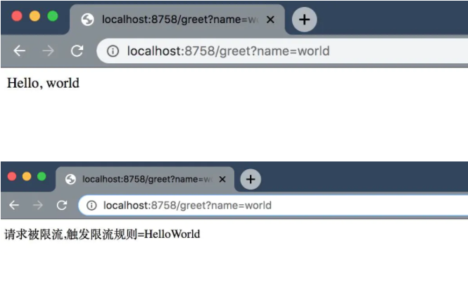

最后,所有的规则在其控制台上可以进行看见，并且修改。

## 控流模式和效果

在控流规则配置中控流模式和控流效果有多个选项，下面来一一讲解作用：

### 关联模式

可能会发现，不管是使用控制台还是使用核心库，都会发现配置规则时有个关联资源属性。

假设一种情况,对数据库同一个字段的读操作和写操作存在争抢，读的速度过高会影响写得速度，写的速度过高会影响读的速度。如果放任读写操作争抢资源，则争抢本身带来的开销会降低整体的吞吐量。可使用关联限流来避免具有关联关系的资源之间过度的争抢.

又比如电商的 下订单 和 支付两个操作，需要优先保障 支付， 可以根据 支付接口的 流量阈值，来对订单接口进行限制，从而保护支付的目的。

所以关联模式就是**将两个资源绑定在一起,只要调用资源被限制了，那么被关联资源也会被限制**。

其中核心库中具体实现方法：

```
设置 `strategy` 为 `RuleConstant.STRATEGY_RELATE` 
设置 `refResource` 为 `xxx资源名`。
```

而控制台设置规则时选中`高级选项`直接设置即可

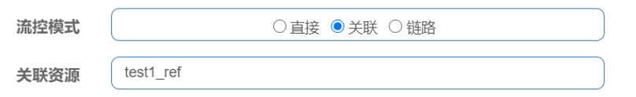


### Warm up（预热）模式

在限流规则配置中，会发现控流效果中有个`Warm Up`模式（控制台）。

当流量突然增大的时候，我们常常会希望系统从空闲状态到繁忙状态的切换的时间长一些。即如果系统在此之前长期处于空闲的状态，我们希望处理请求的数量是缓步的增多，经过预期的时间以后，到达系统处理请求个数的最大值。Warm Up（冷启动，预热）模式就是为了实现这个目的。

所谓的Warm up模式，实际就是**动态控制限流模式**。简而言之，当客户端出于空闲状态时QPS阈值设置小，当请求越来越多时阈值就慢慢变大，最后请求变少后，又慢慢变回原大小。

举个实际例子:秒杀系统在开启瞬间，会有很多流量上来，很可能把系统打死，预热方式就是为了保护系统，可慢慢的把流量放进来，慢慢的把阈值增长到设置的阈值。

核心库的规则配置实现Warm up模式:

```java
        warmUPRule.setControlBehavior(RuleConstant.CONTROL_BEHAVIOR_WARM_UP);
        warmUPRule.setWarmUpPeriodSec(10);
```

其中`RuleConstant.CONTROL_BEHAVIOR_WARM_UP`为预热模式,`setWarmUpPeriodSec`设置预热时间(当预热时间到达后进行变化阈值)

而控制台则设置规则时选中`高级选项`直接设置即可:

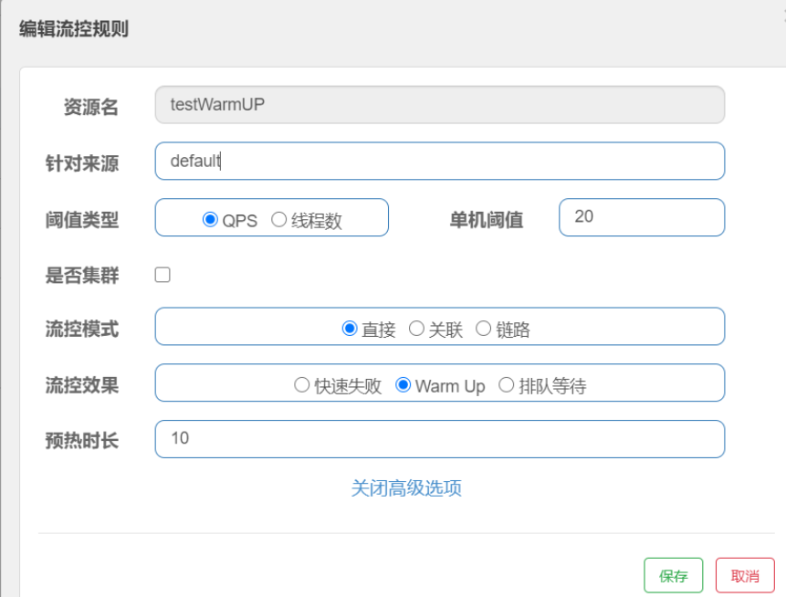

先在单机阈值10/3，3的时候，预热10秒后，慢慢将阈值升至20。刚开始请求，会出现默认错误，预热时间到了后，阈值增加，没超过阈值刷新，请求正常。

通常冷启动的过程系统允许通过的 QPS 曲线如下图所示：

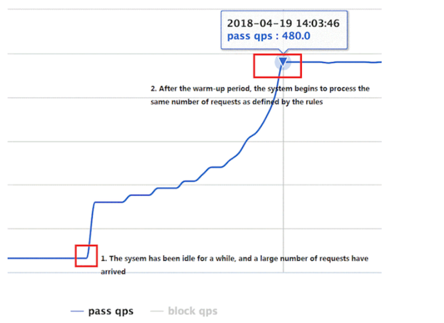


### 排队等待模式

匀速排队（RuleConstant.CONTROL_BEHAVIOR_RATE_LIMITER）方式会严格控制请求通过的间隔时间，也即是让请求以均匀的速度通过，对应的是漏桶算法。阈值必须设置为QPS。

这种方式主要用于处理间隔性突发的流量，例如消息队列。想象一下这样的场景，在某一秒有大量的请求到来，而接下来的几秒则处于空闲状态，我们希望系统能够在接下来的空闲期间逐渐处理这些请求，而不是在第一秒直接拒绝多余的请求,或者暴力接受请求。

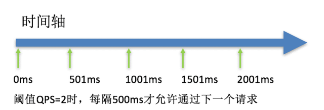

Sentinel会以固定的间隔时间让请求通过, 访问资源。

当请求到来的时候，如果当前请求距离上个通过的请求通过的时间间隔不小于预设值，则让当前请求通过；否则，计算当前请求的预期通过时间，如果该请求的预期通过时间小于规则预设的 timeout 时间，则该请求会等待直到预设时间到来通过；反之，则马上抛出阻塞异常。

排队等待模式简而言之就是 当接收大量请求时，牺牲请求响应时间，来进行缓解客户端服务器压力。

核心库规则配置方法:

```java
lineUpRule.setControlBehavior(RuleConstant.CONTROL_BEHAVIOR_RATE_LIMITER);
lineUpRule.setMaxQueueingTimeMs(20 * 1000);
```

其中`setMaxQueueingTimeMs`用来设置处理间隔时间（单位：ms）

假设这里设置的排队等待时间过小的话, 导致排队等待的请求超时而抛出异常BlockException, 最终结果可能是这100个并发请求中只有一个请求或几个才能正常通过, 所以使用这种模式得根据访问资源的耗时时间决定排队等待时间. 按照目前这种设置, QPS阈值为10的话, 每一个请求相当于是以匀速100ms左右通过。

**总之：间隔时间设置越大，等待时间越长，但所能容纳最大请求量越大；间隔时间设置越小，所能容纳最大请求量越小，但等待时间越快。**


## 更多规则

Sentinel除了传统的`流控规则`以外，还有很多控制规则，它们的作用也都是流量控制，但具有不同功能，下面一一讲解：

### 熔断降级规则

熔断全程叫熔断降级，它是对调用链路中不稳定的资源进行熔断降级是保障高可用的重要措施之一。

由于调用关系的复杂性，如果调用链路中的某个资源不稳定，最终会导致请求发生堆积。Sentinel 熔断降级会在调用链路中**某个资源出现不稳定状态时（例如调用超时或异常比例升高），对这个资源的调用进行限制，让请求快速失败**，避免影响到其它的资源而导致级联错误。当资源被降级后，在接下来的降级时间窗口之内，对该资源的调用都自动熔断（默认行为是抛出 DegradeException）

其中熔断降级规则`DegradeRuleManager`包含下面几个重要的属性：

| Field      | 说明                                                         | 默认值     |
| :--------- | :----------------------------------------------------------- | :--------- |
| resource   | 资源名，即规则的作用对象                                     |            |
| grade      | 熔断策略，支持慢调用比例/异常比例/异常数策略                 | 慢调用比例 |
| count      | 次数,慢调用比例模式下为慢调用临界 RT（超出该值计为慢调用）；异常比例/异常数模式下为对应的阈值 |            |
| timeWindow | 熔断时长，单位为 s                                           |            |

熔断降级规则`DegradeRuleManager`中的`grade`策略常用的有:

- 平均响应时间 (DEGRADE_GRADE_RT)：

  当资源的平均响应时间超过阈值（DegradeRule 中的 count，以 ms 为单位）之后，资源进入准降级状态。如果接下来 1s 内持续进入 5 个请求（即 QPS >= 5），它们的 RT 都持续超过这个阈值，那么在接下的时间窗口（DegradeRule 中的 timeWindow，以 s 为单位）之内，对这个方法的调用都会自动地熔断（抛出 DegradeException）。

  > 注意 Sentinel 默认统计的 RT 上限是 4900 ms，超出此阈值的都会算作 4900 ms，若需要变更此上限可以通过启动配置项 -Dcsp.sentinel.statistic.max.rt=xxx 来配置。

- 异常比例 (DEGRADE_GRADE_EXCEPTION_RATIO)：

  当资源的每秒异常总数占通过量的比值超过阈值（DegradeRule 中的 count）之后，资源进入降级状态，即在接下的时间窗口（DegradeRule 中的 timeWindow，以 s 为单位）之内，对这个方法的调用都会自动地返回。

  > 异常比率的阈值范围是 [0.0, 1.0]，代表 0% - 100%。

- 异常数 (DEGRADE_GRADE_EXCEPTION_COUNT)：

  当资源近 1 分钟的异常数目超过阈值之后会进行熔断。

  > 注意由于统计时间窗口是分钟级别的，若 timeWindow 小于 60s，则结束熔断状态后仍可能再进入熔断状态。

展示一个熔断降级的规则Demo:

```java
    @PostConstruct
    public void initSentinelRule()
    {
        //熔断规则： 5s内调用接口出现异常次数超过5的时候, 进行熔断
        List<DegradeRule> degradeRules = new ArrayList<>();
        DegradeRule rule = new DegradeRule();
        rule.setResource("queryGoodsInfo");
        rule.setCount(5);

        rule.setGrade(RuleConstant.DEGRADE_GRADE_EXCEPTION_COUNT);//熔断规则
        rule.setTimeWindow(5);
        degradeRules.add(rule);
        DegradeRuleManager.loadRules(degradeRules);
    }
```


### 热点限流规则

热点限流是通过热点来进行针对限制流量的方法。

何为热点？热点即经常访问的数据。很多时候我们希望统计某个热点数据中访问频次最高的 Top K 数据，并对其访问进行限制。比如：

- 商品 ID 为参数，统计一段时间内最常购买的商品 ID 并进行限制
- 用户 ID 为参数，针对一段时间内频繁访问的用户 ID 进行限制 热点参数限流会统计传入参数中的热点参数，并根据配置的限流阈值与模式，对包含热点参数的资源调用进行限流。

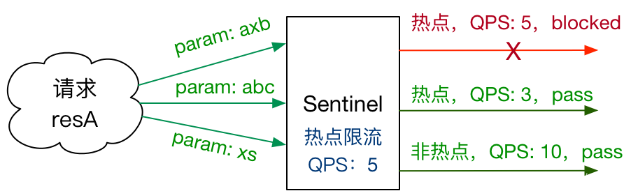

**热点限流和流量控制一样，需要固定QPS数，然后需要请求提供参数,根据参数来进行区别限流。**


热点参数规则（`ParamFlowRule`）类似于流量控制规则（`FlowRule`）：

| 属性              | 说明                                                         | 默认值   |
| :---------------- | :----------------------------------------------------------- | :------- |
| resource          | 资源名，必填                                                 |          |
| count             | 限流阈值，必填                                               |          |
| grade             | 限流模式                                                     | QPS 模式 |
| durationInSec     | 统计窗口时间长度（单位为秒），1.6.0 版本开始支持             | 1s       |
| controlBehavior   | 流控效果（支持快速失败和匀速排队模式），1.6.0 版本开始支持   | 快速失败 |
| maxQueueingTimeMs | 最大排队等待时长（仅在匀速排队模式生效），1.6.0 版本开始支持 | 0ms      |
| paramIdx          | 热点参数的索引，必填，对应 `SphU.entry(xxx, args)` 中的参数索引位置 |          |
| paramFlowItemList | 参数例外项，可以针对指定的参数值单独设置限流阈值，不受前面 `count` 阈值的限制。**仅支持基本类型和字符串类型** |          |
| clusterMode       | 是否是集群参数流控规则                                       | `false`  |
| clusterConfig     | 集群流控相关配置                                             |          |

热点限流需要根据请求参数来区分限流，所以需要额外配置`List<ParamFlowItem>`例外项来说明例外参数的对应限流信息。

展示一个热点限流规则的Demo：

```java
public static void initParamFlowRule(){
    List<ParamFlowRule> rules = new ArrayList<>();
    ParamFlowRule rule = new ParamFlowRule();
    //阈值类型：只支持QPS
    rule.setGrade(RuleConstant.FLOW_GRADE_QPS);
    //阈值
    rule.setCount(1);
    //资源名
    rule.setResource("test");
    rule.setParamIdx(0);//指配热点参数的下标
    //统计窗口时间长度
    rule.setDurationInSec(10);
	
    //配置一个List<ParamFlowItem>来携带相关参数控制信息
    List<ParamFlowItem> items = new ArrayList<>();
    ParamFlowItem item = new ParamFlowItem();
    //设置参数类型
    item.setClassType(String.class.getTypeName());
    //设置限流阈值
    item.setCount(2);
    item.setObject("123456");//需要统计参数的值

    ParamFlowItem item1 = new ParamFlowItem();
    item1.setClassType(int.class.getName());
    item1.setCount(3);
    item1.setObject("12");

    items.add(item);
    items.add(item1);
    rule.setParamFlowItemList(items);
    rules.add(rule);
    ParamFlowRuleManager.loadRules(rules);
}
```

上述Demo中，`ParamFlowRule`调用的参数下标设置为0，所以当test资源调用时的第一个参数为“123456”、12，则其阈值就为2、3。如果设置其参数下标为1，则当第二个参数为“123456”、12，则其阈值就为2、3。

如果当所指定的参数索引与其`List<ParamFlowItem>`例外项中值不一致,则默认按参数索引为0,以第一个参数开始进行作为热点参数。

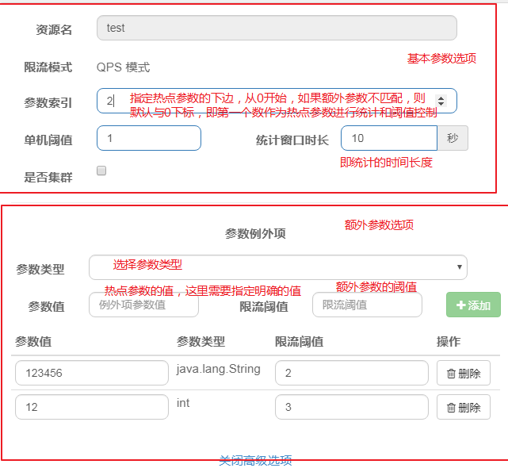

**总而言之：就是用参数索引来规定请求上的指定参数位置，若其指定的参数的值满足例外项，则按例外项对应的阈值来处理。如果其参数的值不满足，则默认按第一个（参数索引为0）参数来判断，若都符合，则按单机阈值来控制。**


### 系统保护规则

系统保护规则是从应用级别的入口流量进行控制，从单台机器的 load、CPU 使用率、平均 RT、入口 QPS 和并发线程数等几个维度监控应用指标，**让系统尽可能跑在最大吞吐量的同时保证系统整体的稳定性。**

应用保护规则是针对全局客户端服务器的控流控制，**仅对入口流量生效，也不能作用于单个资源上**。

其中 入口流量指的是进入应用的流量（`EntryType.IN`），比如 Web 服务或 Dubbo 服务端接收的请求，都属于入口流量。


系统规则支持以下的模式：

- **Load 自适应**（仅对 Linux/Unix-like 机器生效）：系统的 load1 作为启发指标，进行自适应系统保护。当系统 load1 超过设定的启发值，且系统当前的并发线程数超过估算的系统容量时才会触发系统保护（BBR 阶段）。系统容量由系统的 `maxQps * minRt` 估算得出。设定参考值一般是 `CPU cores * 2.5`。
- **CPU usage**（1.5.0+ 版本）：当系统 CPU 使用率超过阈值即触发系统保护（取值范围 0.0-1.0），比较灵敏。
- **平均 RT**：当单台机器上所有入口流量的平均 RT 达到阈值即触发系统保护，单位是毫秒。
- **并发线程数**：当单台机器上所有入口流量的并发线程数达到阈值即触发系统保护。
- **入口 QPS**：当单台机器上所有入口流量的 QPS 达到阈值即触发系统保护。


核心库规则配置方法:

```java
		List<SystemRule> srules = new ArrayList<>();
        SystemRule srule = new SystemRule();
        srule.setAvgRt(3000);
        srules.add(srule);
        SystemRuleManager.loadRules(srules);
```

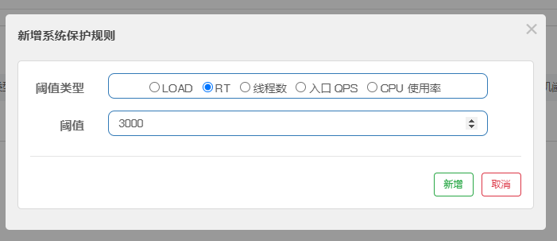


### 黑白名单（授权）规则

很多时候，我们需要根据调用方来限制资源是否通过，这时候可以使用 Sentinel 的访问控制（黑白名单）的功能。

**黑白名单根据资源的请求来源（origin）限制资源是否通过，若配置白名单则只有请求来源位于白名单内时才可通过；若配置黑名单则请求来源位于黑名单时不通过，其余的请求通过。**

> 调用方信息可以手动通过 ContextUtil.enter(resourceName, origin) 方法中的 origin 参数传入。

黑白名单规则（AuthorityRule）又叫做授权规则，非常简单，主要有以下配置项：

- resource：资源名，即限流规则的作用对象
- limitApp：对应的黑名单/白名单，不同 origin 用 , 分隔，如 appA,appB
- strategy：限制模式，AUTHORITY_WHITE 为白名单模式，AUTHORITY_BLACK 为黑名单模式，默认为白名单模式 

```java
AuthorityRule rule = new AuthorityRule();
rule.setResource("test");
rule.setStrategy(RuleConstant.AUTHORITY_WHITE);
rule.setLimitApp("appA,appB");
AuthorityRuleManager.loadRules(Collections.singletonList(rule));
```

其中`setLimitApp`规定了 请求origin的来源，可以用`,`来设置多个来源。
