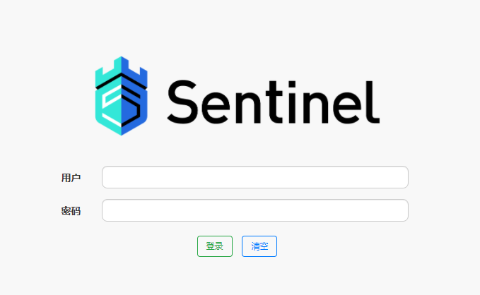

# Sentinel-高可用流量管理框架

Sentinel是阿里开源的项目，提供了流量控制、熔断降级、系统负载保护等多个维度来保障服务之间的稳定性。


2012年，Sentinel诞生于阿里巴巴，其主要目标是流量控制。2013-2017年，Sentinel迅速发展，并成为阿里巴巴所有微服务的基本组成部分。 它已在6000多个应用程序中使用，涵盖了几乎所有核心电子商务场景。2018年，Sentinel演变为一个开源项目。2020年，Sentinel Golang发布。

## 特点

**丰富的应用场景** ：Sentinel 承接了阿里巴巴近 10 年的双十一大促流量的核心场景，例如秒杀（即
突发流量控制在系统容量可以承受的范围）、消息削峰填谷、集群流量控制、实时熔断下游不可用应用等。
**完备的实时监控** ：Sentinel 同时提供实时的监控功能。您可以在控制台中看到接入应用的单台机
器秒级数据，甚至 500 台以下规模的集群的汇总运行情况。
**广泛的开源生态** ：Sentinel 提供开箱即用的与其它开源框架/库的整合模块，例如与 Spring
Cloud、Dubbo、gRPC 的整合。您只需要引入相应的依赖并进行简单的配置即可快速地接入Sentinel。

**完善的 SPI 扩展点**：Sentinel 提供简单易用、完善的 SPI 扩展接口。您可以通过实现扩展接口来快
速地定制逻辑。例如定制规则管理、适配动态数据源等。


目前使用该技术栈的公司有(不完全统计):


## 基础流量概念

在使用Sentinel来控制微服务的流量管理之前,务必需要了解吞吐量（TPS）、QPS、并发数、响应时间（RT）几个概念:

> 1. 响应时间(RT)
>    　　响应时间是指系统对请求作出响应的时间。直观上看，这个指标与人对软件性能的主观感受是非常一致的，因为它完整地记录了整个计算机系统处理请求的时间。由于一个系统通常会提供许多功能，而不同功能的处理逻辑也千差万别，因而不同功能的响应时间也不尽相同，甚至同一功能在不同输入数据的情况下响应时间也不相同。所以，在讨论一个系统的响应时间时，人们通常是指该系统所有功能的平均时间或者所有功能的最大响应时间。当然，往往也需要对每个或每组功能讨论其平均响应时间和最大响应时间。
>    　　对于单机的没有并发操作的应用系统而言，人们普遍认为响应时间是一个合理且准确的性能指标。需要指出的是，响应时间的绝对值并不能直接反映软件的性能的高低，软件性能的高低实际上取决于用户对该响应时间的接受程度。对于一个游戏软件来说，响应时间小于100毫秒应该是不错的，响应时间在1秒左右可能属于勉强可以接受，如果响应时间达到3秒就完全难以接受了。而对于编译系统来说，完整编译一个较大规模软件的源代码可能需要几十分钟甚至更长时间，但这些响应时间对于用户来说都是可以接受的。
> 2. 吞吐量(Throughput)
>    吞吐量是指系统在单位时间内处理请求的数量。对于无并发的应用系统而言，吞吐量与响应时间成严格的反比关系，实际上此时吞吐量就是响应时间的倒数。前面已经说过，对于单用户的系统，响应时间（或者系统响应时间和应用延迟时间）可以很好地度量系统的性能，但对于并发系统，通常需要用吞吐量作为性能指标。
>    　　对于一个多用户的系统，如果只有一个用户使用时系统的平均响应时间是t，当有你n个用户使用时，每个用户看到的响应时间通常并不是n×t，而往往比n×t小很多（当然，在某些特殊情况下也可能比n×t大，甚至大很多）。这是因为处理每个请求需要用到很多资源，由于每个请求的处理过程中有许多不走难以并发执行，这导致在具体的一个时间点，所占资源往往并不多。也就是说在处理单个请求时，在每个时间点都可能有许多资源被闲置，当处理多个请求时，如果资源配置合理，每个用户看到的平均响应时间并不随用户数的增加而线性增加。实际上，不同系统的平均响应时间随用户数增加而增长的速度也不大相同，这也是采用吞吐量来度量并发系统的性能的主要原因。一般而言，吞吐量是一个比较通用的指标，两个具有不同用户数和用户使用模式的系统，如果其最大吞吐量基本一致，则可以判断两个系统的处理能力基本一致。
> 3. 并发用户数
>    并发用户数是指系统可以同时承载的正常使用系统功能的用户的数量。与吞吐量相比，并发用户数是一个更直观但也更笼统的性能指标。实际上，并发用户数是一个非常不准确的指标，因为用户不同的使用模式会导致不同用户在单位时间发出不同数量的请求。一网站系统为例，假设用户只有注册后才能使用，但注册用户并不是每时每刻都在使用该网站，因此具体一个时刻只有部分注册用户同时在线，在线用户就在浏览网站时会花很多时间阅读网站上的信息，因而具体一个时刻只有部分在线用户同时向系统发出请求。这样，对于网站系统我们会有三个关于用户数的统计数字：注册用户数、在线用户数和同时发请求用户数。由于注册用户可能长时间不登陆网站，使用注册用户数作为性能指标会造成很大的误差。而在线用户数和同事发请求用户数都可以作为性能指标。相比而言，以在线用户作为性能指标更直观些，而以同时发请求用户数作为性能指标更准确些。
> 4. QPS每秒查询率(Query Per Second)
>    每秒查询率QPS是对一个特定的查询服务器在规定时间内所处理流量多少的衡量标准，在因特网上，作为域名系统服务器的机器的性能经常用每秒查询率来衡量。对应fetches/sec，即每秒的响应请求数，也即是最大吞吐能力。 （看来是类似于TPS，只是应用于特定场景的吞吐量）

## Sentinel 的使用

Sentinel的使用主要有两个部方:

* 控制台（Dashboard）：使用控制台来负责管理推送规则、监控、集群限流分配管理、机器发现等，实现可视化显示流量等数据。
* 核心库（Java 客户端）：不依赖任何框架/库，能够运行于 Java 7 及以上的版本的运行时环境，同时对 Dubbo / Spring Cloud 等框架也有较好的支持，通过代码来实现控制流量管理。


## 使用Sentinel控制台

### 1.开启控制台服务

您可以从 [release 页面](https://github.com/alibaba/Sentinel/releases) 下载最新版本的控制台 jar 包。

您也可以从最新版本的源码自行构建 Sentinel 控制台：

- 下载 [控制台](https://github.com/alibaba/Sentinel/tree/master/sentinel-dashboard) 工程
- 使用以下命令将代码打包成一个 fat jar: `mvn clean package`

两种方式下来得到了jar包后，在CMD中启动：

```bash
java  -server -Xms64m -Xmx256m  -Dserver.port=8849 -jar /work/sentinel-dashboard-1.7.1.jar 
```

其中`Dserver.port`配置了控制台服务器的端口号,而`jar`后则是jar包位置。

我们也可以制作bat批处理文件来方便每次运行控制台。

拥有Sentinel是基于SpringBoot开发的，所以其运行过程和SpringBoot项目一样。

运行成功后，进入浏览器打开对于Sentinel服务器地址，第一次便会默认进入登陆页面。默认用户名和密码都为sentinel。



登陆成功后，进入控制台页面，但由于控制台本身配置中未说明其他客户端服务，所以为一片空白。


### 2.客户端接入控制台

接下来我们需要将客户端服务连接到控制台中。

在对应的Spring的微服务-消费客户端(用户使用的消费提供服务的接口,自然要控制消费提供服务的流量)上添加Sentinel依赖包：

```xml
<dependency>
        <groupId>com.alibaba.cloud</groupId>
        <artifactId>spring-cloud-starter-alibaba-sentinel</artifactId>
 </dependency>
```

然后在配置文件中加入Sentienl的配置:

```xml-dtd
spring:
  application:
	# 在控制台上显示的服务名称
    name: sentinel-service1

  cloud:
    sentinel:
      transport:
		# 控制台服务器的地址
        dashboard: localhost:8849
```

运行客户端即可,接入控制台中。

**注意：运行客户端后需要进行进行调用几次接口才会在控制台显示。**


其中实时监控中*实时显示*了对应的接口QPS调用情况，以及响应时间。

进入**簇点链路**，可以更主观显示了对应的接口调用情况，并且提供了一些操作，这些操作可以直接在控制台中快速实现，而不需要在客户端中进行编写对应代码。


### 配置限流规则

对需要进行限流的接口上点击`+流控`按钮:


这里做了一个最简单的配置：

- 阈值类型选择：QPS
- 单机阈值：2

综合起来的配置效果就是，该接口的限流策略是每个IP主机每秒最多允许2个请求进入。

点击添加后,我们可以进入`流控规则`中看见该流控规则,并且可以进行再次编辑。

我们对某个接口设置了控流后，可以再次连续访问该接口，就会发现曝出`Blocked by Sentinel (flow limiting)`错误,说明控流实现成功。

Sentinel控制台还用很多其他功能,比如熔断\热点\授权等，关于这些操作不做详述，可以查看[官方文档](https://github.com/alibaba/spring-cloud-alibaba/wiki/Sentinel)。


