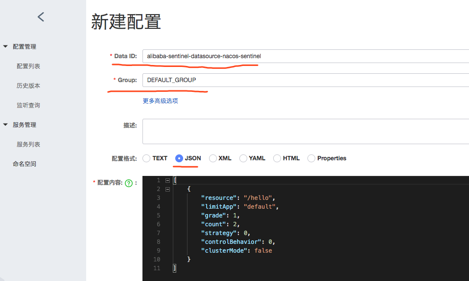

# Sentinel配合Nacos存储规则

Sentinel是Alibaba下的控流框架。在Spring Cloud Alibaba的整合封装之下，接口限流这件事情可以非常轻易的整合到我们的Spring Cloud应用中。

Sentinel通过制定资源控流规则，来进行控制客户端服务器流量。

而正常情况下我们使用Nacos作为微服务发现服务时，Nacos的管理配置功能也可以用来管理Sentinel的控流规则，从而实现规则配置持久化。

Sentinel自身就支持了多种不同的数据源来持久化规则配置，目前包括以下几种方式：

- 文件配置
- Nacos配置
- ZooKeeper配置
- Apollo配置

下面介绍如何使用Nacos来存储管理Sentinel的规则配置。

## 准备工作

需要同时用到Nacos和Sentinel控制台，所以确保两个服务都应该启动。

如果还没入门`Nacos`和`Sentinel Dashboard`可以通过之前的文章来学习之前的内容。

## 配置方法

一般我们进行微服务控流，都作用于客户端（消费提供端）。

在Spring Cloud微服务应用的`pom.xml`中引入Spring Cloud Alibaba的Sentinel模块和Nacos存储扩展：

```xml
 <dependencies>
    <dependency>
        <groupId>org.springframework.boot</groupId>
        <artifactId>spring-boot-starter-web</artifactId>
    </dependency>
    <dependency>
        <groupId>org.springframework.cloud</groupId>
        <artifactId>spring-cloud-starter-alibaba-sentinel</artifactId>
    </dependency>
    <dependency>
        <groupId>com.alibaba.csp</groupId>
        <artifactId>sentinel-datasource-nacos</artifactId>
        <version>1.5.2</version>
    </dependency>
</dependencies>
```

其中`sentinel-datasource-nacos`为Sentinel提供的Nacos存储扩展依赖包。

随后在Spring Cloud应用中添加配置信息：

```xml-dtd
spring:
  application:
    name: sentinel-service-datasource-nacos
  cloud:
    sentinel:
      transport:
        # Sentinel控制台地址
        dashboard: localhost:8849
      datasource:
        ds:
          nacos:
            # Nacos服务地址
            server-addr: localhost:8848
            # Nacos中存储规则的dataId
            dataId: ${spring.application.name}-flow
            # Nacos中存储规则的groupId
            groupId: DEFAULT_GROUP
            # 定义存储的规则类型
            rule-type: flow
```

其中`rule-type`中的规则类型是spring cloud alibaba升级到0.2.2之后增加的配置。在之前版本中没有这个参数。

这个参数可以通过`org.springframework.cloud.alibaba.sentinel.datasource.RuleType`这个枚举类中看见所能配置的类型。


前往Nacos配置管理，新增一个配置文件，用作其Sentinel的规则配置文件，其中dataId和Group需要与SpringCloud配置文件中指定的一样。



Sentinel配置文件建议使用Json文件来进行配置，其中配置内容样式如下：

```json
[
    {
        "resource": "/hello",
        "limitApp": "default",
        "grade": 1,
        "count": 5,
        "strategy": 0,
        "controlBehavior": 0,
        "clusterMode": false
    }
]
```

其中配置规则是一个数组类型，数组中的每个对象是针对每一个保护资源的配置对象，每个对象中的属性解释如下：

- resource：资源名，即限流规则的作用对象
- limitApp：流控针对的调用来源，若为 default 则不区分调用来源
- grade：限流阈值类型（QPS 或并发线程数）；`0`代表根据并发数量来限流，`1`代表根据QPS来进行流量控制
- count：限流阈值
- strategy：调用关系限流策略
- controlBehavior：流量控制效果（直接拒绝、Warm Up、匀速排队）
- clusterMode：是否为集群模式

这里面的详细配置和其Sentinel核心配置规则属性一样。

最后运行客户端，会发现顺利Sentinel控制台已经从Nacos服务上获取到了规则配置文件：


## 更新配置

由于Nacos配置中心管理是动态刷新的,所以在Nacos 上进行更新Sentinel规则配置可以实现动态更新。

但是通过在其Sentinel控制台中修改规则配置的话，仅仅储存在于其服务的内存中，不会修改其Nacos配置管理中的值，并且客户端重启后其规则配置值会复原。


## Sentinel控制台同步Nacos

其实可以通过改造Sentinel控制台的源码来进行实现其Sentinel控制台修改规则同步到Nacos配置管理中。

下面来介绍然后改造Sentinel控制台源码，来实现个性化的控制台修改到Nacos配置管理上去：

首先需要下载一份Sentinel源码，克隆一份官方GitHub项目：https://github.com/alibaba/Sentinel

其中项目中控制台项目源码在`sentinel-dashboard`文件夹中，将其项目导入IDE。

1. 修改pom文件，将其中`sentinel-datasource-nacos`的依赖的test属性注释去掉，从而在正式环境中使用它。

```xml
<dependency>
    <groupId>com.alibaba.csp</groupId>
    <artifactId>sentinel-datasource-nacos</artifactId>
    <!--<scope>test</scope>-->
</dependency>
```

2. 找到`resources/app/scripts/directives/sidebar/sidebar.html`中的这段代码

```html
<li ui-sref-active="active" ng-if="!entry.isGateway">
	<a ui-sref="dashboard.flowV1({app: entry.app})">
	 <i class="glyphicon glyphicon-filter"></i>&nbsp;&nbsp;流控规则</a>
</li>
```

将其修改`flowV1`修改为`flow`：

```html
<li ui-sref-active="active" ng-if="!entry.isGateway">
	 <a ui-sref="dashboard.flow({app: entry.app})">
	 <i class="glyphicon glyphicon-filter"></i>&nbsp;&nbsp;流控规则</a>
</li>
```

3. 在`com.alibaba.csp.sentinel.dashboard.rule`包下新建一个`nacos`包，用来编写针对Nacos的扩展实现。


3. 在其创建的`nacos`包中创建一个`NacosConfig`类,当做Nacos的配置类。

```java
import com.alibaba.csp.sentinel.datasource.Converter;
import com.alibaba.fastjson.JSON;
import com.alibaba.nacos.api.PropertyKeyConst;
import com.alibaba.nacos.api.config.ConfigFactory;
import com.alibaba.nacos.api.config.ConfigService;
import org.springframework.context.annotation.Bean;
import org.springframework.context.annotation.Configuration;

import java.util.List;
import java.util.Properties;

/**
 * @description: Nacos配置类
 * @author: Zhaotianyi
 * @time: 2021/8/20 15:19
 */
@Configuration
public class NacosConfig {

    @Bean
    public Converter<List<FlowRuleEntity>, String> flowRuleEntityEncoder() {
        return JSON::toJSONString;
    }

    @Bean
    public Converter<String, List<FlowRuleEntity>> flowRuleEntityDecoder() {
        return s -> JSON.parseArray(s, FlowRuleEntity.class);
    }

    @Bean
    public ConfigService nacosConfigService() throws Exception {
        Properties properties = new Properties();
        properties.put(PropertyKeyConst.SERVER_ADDR, "localhost:8080");
        return ConfigFactory.createConfigService(properties);
    }
}
```

其中的`ConfigService`类需要在Pom文件中导入`nacos-api`包。

`PropertyKeyConst.SERVER_ADDR`的值对应的Nacos的服务器地址和端口号。

如果用到了namespace隔离环境，可以在`nacosConfigService`方法中再加入配置，比如：`properties.put(PropertyKeyConst.NAMESPACE, "130e71fa-97fe-467d-ad77-967456f2c16d");`


5. 将其test文件夹下的`com.alibaba.csp.sentinel.dashboard.rule.nacos`包的`FlowRuleNacosProvider`和`FlowRuleNacosPublisher`复制到正式环境下的`com.alibaba.csp.sentinel.dashboard.rule.nacos`包下。它们分别是Nacos配置拉取组件和Nacos配置推送组件


5. 修改里面的`FlowRuleNacosProvider `类,实现Nacos配置拉取:
```java
@Component("flowRuleNacosProvider")
public class FlowRuleNacosProvider implements DynamicRuleProvider<List<FlowRuleEntity>> {

    @Autowired
    private ConfigService configService;
    @Autowired
    private Converter<String, List<FlowRuleEntity>> converter;

    public static final String FLOW_DATA_ID_POSTFIX="-flow";
    public static final String GROUP_ID="DEFAULT_GROUP";

    @Override
    public List<FlowRuleEntity> getRules(String appName) throws Exception {
        //String rules = configService.getConfig(appName + NacosConfigUtil.FLOW_DATA_ID_POSTFIX,
        //    NacosConfigUtil.GROUP_ID, 3000);
        String rules = configService.getConfig(appName + FLOW_DATA_ID_POSTFIX, GROUP_ID, 3000);
        if (StringUtil.isEmpty(rules)) {
            return new ArrayList<>();
        }
        return converter.convert(rules);
    }
}
```

其中的FLOW_DATA_ID_POSTFIX常量为 Nacos配置文件的Data后缀,这儿是流控规则,之前在客户端中SpringCloud配置文件dataId设置为`${spring.application.name}-flow`所以这儿使用`-flow`,而GROUP_ID代表存储GROUP。这里根据自己实际情况来进行更改。


7. 修改里面的`FlowRuleNacosPublisher`类,实现Nacos配置推送:

```java
@Component("flowRuleNacosPublisher")
public class FlowRuleNacosPublisher implements DynamicRulePublisher<List<FlowRuleEntity>> {

    @Autowired
    private ConfigService configService;
    @Autowired
    private Converter<List<FlowRuleEntity>, String> converter;

    public static final String FLOW_DATA_ID_POSTFIX = "-flow";
    public static final String GROUP_ID = "DEFAULT_GROUP";

    @Override
    public void publish(String app, List<FlowRuleEntity> rules) throws Exception {
        AssertUtil.notEmpty(app, "app name cannot be empty");
        if (rules == null) {
            return;
        }
//        configService.publishConfig(app + NacosConfigUtil.FLOW_DATA_ID_POSTFIX,
//            NacosConfigUtil.GROUP_ID, converter.convert(rules));
        configService.publishConfig(app + FLOW_DATA_ID_POSTFIX,
                GROUP_ID, converter.convert(rules));
        }
}
```

这里的常量规则和拉取类一样。


8. 修改`com.alibaba.csp.sentinel.dashboard.controller.v2.FlowControllerV2`中`DynamicRuleProvider`和`DynamicRulePublisher`注入的Bean，将其改为上面两个类

```java
@Autowired
@Qualifier("flowRuleNacosProvider")
private DynamicRuleProvider<List<FlowRuleEntity>> ruleProvider;
@Autowired
@Qualifier("flowRuleNacosPublisher")
private DynamicRulePublisher<List<FlowRuleEntity>> rulePublisher;
```


9. 修改成功，运行即可，这时当我们通过Sentinel控制台来修改流控规则配置，其直接会推送到Nacos配置管理上。这样配置文件在Sentinel控制台和Nacos实现了双向绑定效果。
10. 最后，测试完毕后，使用Maven打包Sentinel控制台源码，实现外部部署

```bash
mvn clean package
```


**注意:当使用Sentinel控制台修改后，Nacos推送得到的配置文件将会变为TEXT格式，但由于Json格式和Text格式相通，所以不需要担心出错。**


