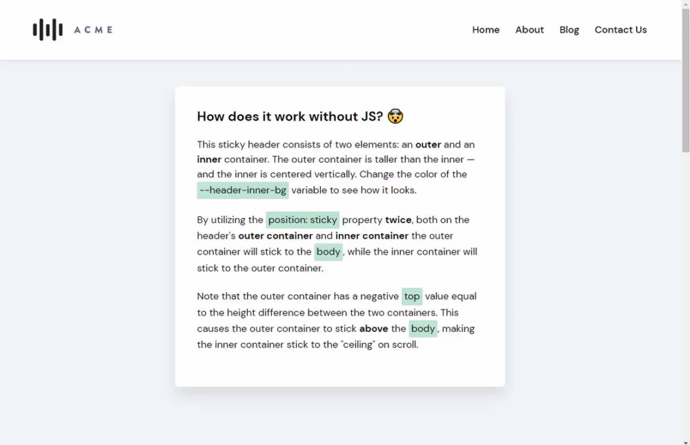
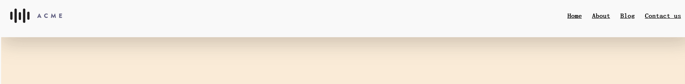

# 只利用CSS创建收缩导航栏

## 前言

想象一个漂亮而厚实的网站标题，在内容的顶部和底部有大量填充。当你向下滚动时，它会自行收缩，减少一些填充，为其他内容腾出更多的屏幕空间。

如下图效果：



这时有经验的人就会立刻想到使用JavaScript来向获取滚轮，再动态监听元素，添加Class来实现这样的效果。

然而其实这样的效果只需要灵活利用position中的sticky粘性属性即可实现，不需要JS内容。

实现，说明一下，我通常不喜欢粘性标题。我认为他们占用了太多的屏幕空间。*然而，您是否*应该在自己的网站上使用粘性标题是一个问题。这实际上取决于您的内容以及始终存在的导航是否为其增加了价值。因为在使用粘性标题后就会带来一系列的问题，比如内容溢出覆盖等等。

## 教程

首先，我们导航栏结构需要如下：

```html
<header class="header-outer">
  <div class="header-inner">
    <div class="header-logo">...</div>
    <nav class="header-navigation">...</nav>
  </div>
</header>
```

其中 header-outer只有一个功能那就是 让在顶部时将其 header变得更高。而header-inner这是真正的导航栏内容容器。

定义它们的样式：

```css
      .header-outer {
        height: 120px;
        width: 100%;

        display: flex;
        align-items: center;
          
        position: sticky;
        top: -50px;
        background-color: white;
        /* 增加底部阴影，让其更有质感 */  
        box-shadow: 1px 19px 50px rgba(0, 0, 0, 0.17);
      }
      .header-inner {
        height: 70px;
        width: 100%;
        position: sticky;
        top: 0;
        margin: 0 25px;

        display: flex;
        align-items: center;
        justify-content: space-between;
      }
```

这里两个内外header都设置为sticky属性。

其中内部header的top为0，是为了确保容器在变得粘稠时将自身显示在最顶部。

这时需要注意的诀窍来了，为了让内部容器真正贴在页面的“天花板”上，需要给外部header的top设置一个负值，其值为 两个容器之间的高度差，使其贴在更“上方”。这里内部header高度为70px，外部header为120px，所以这里外部header的top值为70px-120px= -50px。

这边就轻松实现了收缩导航栏效果了。

最后我们可以加入亿点其它内容，大概如下。

```html
	<style>
      body {
        margin: 0;
        min-height: 200vh;
        background-color: antiquewhite;
      }
      .header-outer {
        height: 120px;
        width: 100%;

        display: flex;
        align-items: center;

        position: sticky;
        top: -50px;
        background-color: white;

        box-shadow: 1px 19px 50px rgba(0, 0, 0, 0.17);
      }
      .header-inner {
        height: 70px;
        width: 100%;
        position: sticky;
        top: 0;
        margin: 0 25px;

        display: flex;
        align-items: center;
        justify-content: space-between;
      }
      .header-logo img {
        display: block;
        height: 40px;
      }
      .header-navigation {
        display: flex;
        flex-wrap: wrap;
      }
      .header-navigation a {
        font-size: 1.125rem;
        color: inherit;
        margin-left: 1.75rem;
        position: relative;
        font-weight: bold;
        display: inline-block;
      }
      .header-navigation a:hover:after {
        transform: scalex(1);
      }
      .header-navigation a:after {
        transition: 0.25s ease;
        content: "";
        display: block;
        width: 100%;
        height: 2px;
        background-color: currentcolor;
        transform: scalex(0);
        position: absolute;
        bottom: -3px;
        left: 0;
      }
    </style>

<body>
    <header class="header-outer">
      <div class="header-inner">
        <div class="header-logo">
          
        </div>
        <nav class="header-navigation">
          <a href="#">Home</a>
          <a href="#">About</a>
          <a href="#">Blog</a>
          <a href="#">Contact us</a>
        </nav>
      </div>
    </header>
  </body>
  
```

轻松实现：




