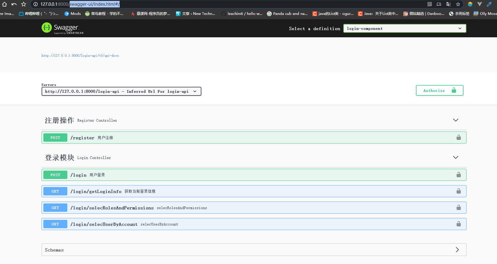

# SpringCloud微服务配合Swagger

## 前言

在SpringBoot项目中目前普遍使用Swagger作为Api文档以及测试工具。

而在SpringCloud的微服务环境下，自然也少不了Api文档和测试工具，但使用Swagger对单一模块来进行查看的话，十分的繁琐，而且使用的接口测试并没有通过微服务的路由请求，所以在SpringCloud微服务项目下的Swagger如果进行配置，这是一直以来的难题。

## 解决方法

在微服务项目中，接口通常是路由方式进行跳转实现的。所以在需要考虑使用在路由中暴露一个Swagger网页，要求所有的模块Swagger文档都能在这里查询出来，并且可以直接在路由的Swagger这个网页上运行测试。

## 实现操作

由于是微服务，所有我们需要在common模块下导入Swagger依赖，这里我们选择一个可以快速配置的Swagger-Spring-boot-starter：

```xml
<!--Swagger2-->
<dependency>
    <groupId>com.spring4all</groupId>
    <artifactId>swagger-spring-boot-starter</artifactId>
    <version>2.0.1.RELEASE</version>
</dependency>
```

这个版本中使用的是Swagger-3，这里需要注意下，因为后面需要讲述一下需要注意的问题。

### 在接口模块中的Swagger配置

由于我们常用的是第三方的Swagger-starter配置，这个依赖的特点是 支持直接在Yaml、Properties文件下直接进行配置Swagger信息，不需要单独创建一个Swagger配置类。

来到一个接口模块下：

```yaml
swagger:
  base-package: com.test.microservice.login.api.controller
  global-operation-parameters:
```

这里的`swagger.base-package`用来设置模块下的Controller的位置的，用来寻找接口。

`swagger.global-operation-parameters`这个配置是当前这个依赖包的Bug问题解决方法，因为Swagger要求全局参数必须存在，否则的话模块启动将会包NPE错误。所以这里我们设置了一个空参数。

随后我们在Controller下写入常规的Swagger注释即可：

```java
@Api(value = "登录模块",tags = {"登录模块"})
public class LoginController {
	...
	@ApiOperation("用户登录")
	...
}
```

### 在路由中配置Swagger

接下来就是这次的问题重点了，在路由中配置Swagger，这里我们使用的是目前SpringCloud官方推荐的

还是和上面用于在Xml、Properties文件下进行配置文件：

```yaml
swagger:
  global-operation-parameters:
```

这里由于我们在路由中所以不需要设置Controller的位置，它本身是没有文档内容的。

随后我们需要对其Swagger的连接特殊处理：

```java
@RestController
@RequestMapping("/swagger-resources")
public class SwaggerHandler {
    @Autowired(required = false)
    private SecurityConfiguration securityConfiguration;
    @Autowired(required = false)
    private UiConfiguration uiConfiguration;
    private final SwaggerResourcesProvider swaggerResources;

    @Autowired
    public SwaggerHandler(SwaggerResourcesProvider swaggerResources) {
        this.swaggerResources = swaggerResources;
    }

    @GetMapping("/configuration/security")
    public Mono<ResponseEntity<SecurityConfiguration>> securityConfiguration() {
        return Mono.just(new ResponseEntity<>(
                Optional.ofNullable(securityConfiguration).orElse(SecurityConfigurationBuilder.builder().build()), HttpStatus.OK));
    }

    @GetMapping("/configuration/ui")
    public Mono<ResponseEntity<UiConfiguration>> uiConfiguration() {
        return Mono.just(new ResponseEntity<>(
                Optional.ofNullable(uiConfiguration).orElse(UiConfigurationBuilder.builder().build()), HttpStatus.OK));
    }

    @GetMapping("")
    public Mono<ResponseEntity> swaggerResources() {
        return Mono.just((new ResponseEntity<>(swaggerResources.get(), HttpStatus.OK)));
    }
}
```

由于Spring GateWay并没有采用传统的SpringWeb结构，而是使用SpringFlux。

所以需要进行重写Swagger的请求。

这时我们访问路由的Swagger地址 localhost:XXXX/swagger-ui/index.html 即可成功进入Swagger文档页面了。

但是这是Swagger文档的页面并没有归纳在一起，我们需要将其模块的Swagger文档归纳到路由Swagger页面来。

```java
@Component
@Primary
public class SwaggerConfig implements SwaggerResourcesProvider {

    @Override
    public List<SwaggerResource> get() {
        List resources = new ArrayList<>();

        //login-component --->  添加登录模块
        resources.add(swaggerResource("login-component", "/login-api/v3/api-docs", "2.0"));

        return resources;
    }

    private Object swaggerResource(String name, String location, String version) {

        SwaggerResource swaggerResource = new SwaggerResource();
        swaggerResource.setName(name);
        swaggerResource.setLocation(location);
        swaggerResource.setSwaggerVersion(version);
        return swaggerResource;
    }
}
```

上面我们就添加了一个叫`login-component`的模块页在Swagger页面上了,它的地址对应到模块的路由Swagger文档Api地址，这里我们采用的Swagger依赖包基于Swagger3所以这里的Api地址默认在v3/api-docs下。

对于后续的模块我们可以依次加入进去即可。



页面成功显示了，模块Api也归纳了，看似几乎成功了...

但其实这里有个问题，这时虽然看的见文档接口，但是对于执行测试的时候，执行的连接并不是对于路由到模块的连接地址，而是直接在路由的连接后拼接，所以执行测试的地址错误。

这是目前的Swagger3的问题，目前的Swagger3无法进行自动对微服务的测试执行拼接请求连接，而是基于当前的Swagger地址连接根目录进行的。

为了解决这个方法，目前暂时可以通过覆盖本地包来重写Swagger请求逻辑。

在项目创建一个springfox.documentation.oas.web包，在其中创建SpecGeneration类。

```java
/**
 * SwaggerV3在当前版本下存在BUG,Swagger无法正确获取到微服务模块请求连接，
 * 从而导致文档请求连接错误。
 * 这个类，以及包名是为了解决其SwaggerV3中不能正确获取到微服务模块地址连接问题
 * 尝试用该类替换框架中的类
 *
 * @author vains
 * @date 2021/4/6 11:21
 */
public class SpecGeneration {

    private static final String HEADER_NAME = "X-Forwarded-Prefix";
    private static final Logger LOGGER = getLogger(SpecGeneration.class);
    public static final String OPEN_API_SPECIFICATION_PATH
            = "${springfox.documentation.open-api.v3.path:/v3/api-docs}";
    protected static final String HAL_MEDIA_TYPE = "application/hal+json";

    private SpecGeneration() {
        throw new UnsupportedOperationException();
    }

    /**
     * 创建一个默认的 swagger 的server
     *
     * @param requestPrefix /v3/api-docs
     * @param requestUrl    请求的url
     * @return Server
     */
    public static Server inferredServer(String requestPrefix, String requestUrl) {
        HttpServletRequest request = ((ServletRequestAttributes) RequestContextHolder.getRequestAttributes()).getRequest();
        String serverUrl = requestUrl.replace(requestPrefix, "");
        String header = null;
        try {
            URI url = new URI(requestUrl);
            serverUrl = String.format("%s://%s:%s", url.getScheme(), url.getHost(), url.getPort());
            header = request.getHeader(HEADER_NAME);
            if (!StringUtils.isEmpty(header)) {
                serverUrl += header;
            }
        } catch (URISyntaxException e) {
            LOGGER.error("Unable to parse request url:" + requestUrl);
        }
        String description = "Inferred Url";
        if (!StringUtils.isEmpty(header)) {
            description += " For " + header.substring(1);
        }
        return new Server()
                .url(serverUrl)
                .description(description);
    }

    public static String decode(String requestURI) {
        try {
            return URLDecoder.decode(requestURI, StandardCharsets.UTF_8.toString());
        } catch (UnsupportedEncodingException e) {
            return requestURI;
        }
    }
}
```

当我们重写了原本的Swagger3内容后，即解决了模块请求连接的问题。即可正常在路由中执行Swagger中的模块接口。
