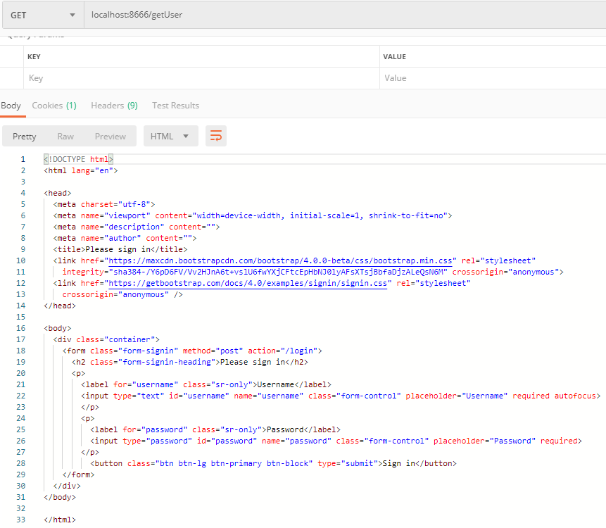
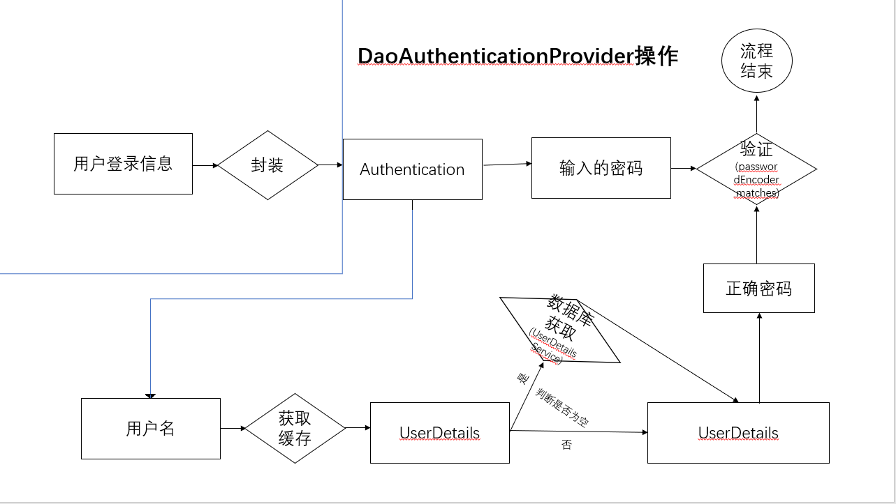
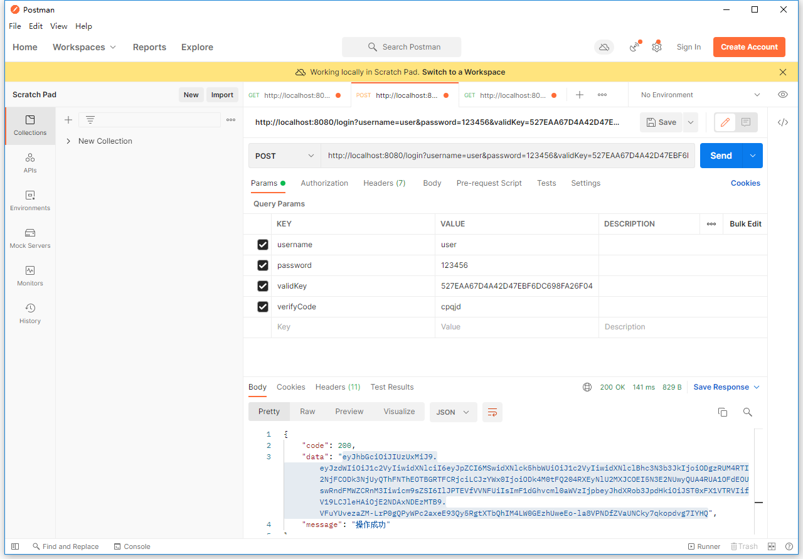
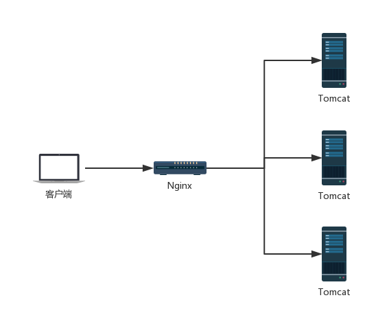
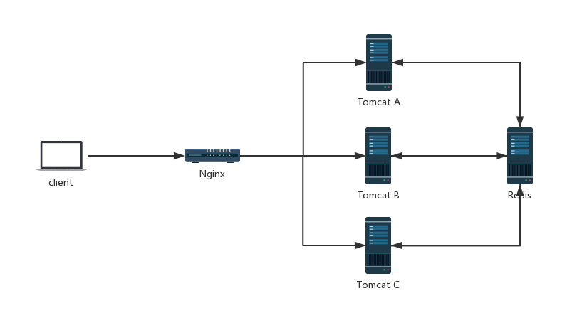
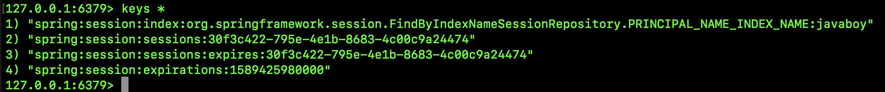

# Spring-Security


Java 领域里有两个权鉴框架比较出名 Shiro 和 Spring Security。

其中Shiro是一个简洁易用的开源框架，它的使用简单，功能围绕着用户认证、用户授权、身份管理几个点中，一般中小型业务现在都有用到它。

而Spring Security则是一个Spring官方的权限管理、权限授权的开源框架，它拥有比Shiro更强大的身份控制系统，而且可以在使用无状态认证（Shiro则是使用Session），所以它在大型分布式、微服务项目中更加广泛使用。

> 官方介绍：
>
> Spring Security 是一个功能强大且高度可定制的身份验证和访问控制框架。它是基于 Spring 的应用程序的上的标准。
>
> Spring Security 是一个专注于为 Java 应用程序提供身份验证和授权的框架。与所有 Spring 项目一样，Spring Security 的真正强大之处在于它可以轻松扩展以满足自定义要求（实际上并不轻松 :happy: ）。

SpringSecurity 由于其功能框架众多，导致其配置和学习并理解，它并不是一个容易的事，所以被一些人诟病，从而去使用了简单易用的Shiro。

## 执行图

Spring Security在进行权限控制操作时，其流程大概如下：


简单文字说明下:

- 客户端发起一个请求，进入 Security 过滤器链。

- 当到 LogoutFilter 的时候判断是否是登出路径，如果是登出路径则到 logoutHandler ，如果登出成功则到 logoutSuccessHandler 登出成功处理，如果登出失败则由 ExceptionTranslationFilter ；如果不是登出路径则直接进入下一个过滤器。

- 当到 UsernamePasswordAuthenticationFilter 的时候判断是否为登录路径，如果是，则进入该过滤器进行登录操作，如果登录失败则到 AuthenticationFailureHandler 登录失败处理器处理，如果登录成功则到 AuthenticationSuccessHandler 登录成功处理器处理，如果不是登录请求则不进入该过滤器。

- 当到 FilterSecurityInterceptor 的时候会拿到 uri ，根据 uri 去找对应的鉴权管理器，鉴权管理器做鉴权工作，鉴权成功则到 Controller 层否则到 AccessDeniedHandler 鉴权失败处理器处理。


## 入门教程

在项目中导入SpringSecurity依赖

```xml
<dependency>
   <groupId>org.springframework.boot</groupId>
   <artifactId>spring-boot-starter-security</artifactId>
</dependency>
```

导入依赖后，运行其项目后，会运行项目地址会发现自动跳转到了其login页面下：


这个页面是SpringSecurity默认的身份认证页面。

spring security 默认的用户名是user，在新版本spring security启动的时候会生成随机密码（在启动日志中可以看到）。

身份登录成功后，那么就会正常的访问项目的其他内容。

我们可以在其application.yaml配置文件中进行修改默认密码：

```xml-dtd
spring:
  security:
    user:
      name: root
      password: root
```


### 配置文件修改

在上述流程图中的所有流程均通过其WebSecurityConfigurerAdapter这个接口来进行，所以需要进行重写该接口来进行配置相关项目的SpringSecurity配置。

```java
@Configuration
public class SecurityConfig extends WebSecurityConfigurerAdapter {
...
}
```

我们重写一些方法，如下：

```java
@Configuration
public class MySecurityConfiguration extends WebSecurityConfigurerAdapter {
    @Override
    protected void configure(AuthenticationManagerBuilder auth) throws Exception {
        auth
                .inMemoryAuthentication()
                .withUser("admin") // 添加用户admin
                .password("{noop}admin")  // 不设置密码加密
                .roles("ADMIN", "USER")// 添加角色为admin，user
                .and()
                .withUser("user") // 添加用户user
                .password("{noop}user") 
                .roles("USER")
            	.and()
            	.withUser("tmp") // 添加用户tmp
                .password("{noop}tmp")
            	.roles(); // 没有角色
    }
    @Override
    protected void configure(HttpSecurity http) throws Exception {
        http
                .authorizeRequests()
                .antMatchers("/product/**").hasRole("USER") //添加/product/** 下的所有请求只能由user角色才能访问
                .antMatchers("/admin/**").hasRole("ADMIN") //添加/admin/** 下的所有请求只能由admin角色才能访问
                .anyRequest().authenticated() // 没有定义的请求，所有的角色都可以访问（tmp也可以）。
                .and()
                .formLogin().and()
                .httpBasic();
    }
}
```

我们来详细说明下重写的各个常用的方法：

> configure(AuthenticationManagerBuilder auth) ：身份认证的配置
>
> configure(HttpSecurity http)：网页权限配置

### 读取数据库实现用户登录

当然这样操作自然是不常用的。因为一般用户登录信息都会存入数据库，而不是直接写在配置里面。。。

我们来实现数据库读取用户,修改配置文件：

```java
@Configuration
public class MySecurityConfiguration extends WebSecurityConfigurerAdapter {

    @Autowired
    private UserDetailsService userDetailsService;

    @Override
    protected void configure(AuthenticationManagerBuilder auth) throws Exception {
        auth.userDetailsService(userDetailsService)// 设置自定义的userDetailsService
                .passwordEncoder(passwordEncoder());  //密码的算法
    }

    @Override
    protected void configure(HttpSecurity http) throws Exception {
        http
                .authorizeRequests()
                .antMatchers("/product/**").hasRole("USER")
                .antMatchers("/admin/**").hasRole("ADMIN")
                .anyRequest().authenticated() //
                .and()
                .formLogin()
                .and()
                .httpBasic()
                .and().logout().logoutUrl("/logout");
    }

    @Bean
    public PasswordEncoder passwordEncoder() {
        return NoOpPasswordEncoder.getInstance();// 使用不使用加密算法保持密码
//        return new BCryptPasswordEncoder();
    }
}
```

其中我们重写 UserDetailsService ,来实现登录验证操作:

```java
@Component("userDetailsService")
public class CustomUserDetailsService implements UserDetailsService {
    @Resource
    private SimpleUserMapper simpleUserMapper;

    @Override
    public UserDetails loadUserByUsername(String login) throws UsernameNotFoundException {
        Example example = new Example(SimpleUser.class);
        example.createCriteria().andEqualTo("userName", login);
        // 1. 查询用户
        List<SimpleUser> userFromDatabase = simpleUserMapper.selectByExample(example);
        if (userFromDatabase.isEmpty()) {
            System.out.println("User  was not found in db");
            throw new UsernameNotFoundException("User " + login + " was not found in db");
            //这里找不到必须抛异常
        }

        // 2. 设置角色
        Collection<GrantedAuthority> grantedAuthorities = new ArrayList<>();
        GrantedAuthority grantedAuthority = new SimpleGrantedAuthority(userFromDatabase.get(0).getRole());
        grantedAuthorities.add(grantedAuthority);

        return new User(login, userFromDatabase.get(0).getUserPassword(), grantedAuthorities);
    }
}
```

数据库连接相关配置完后,我们可以启动服务,可以发现当login进行登录时将会执行其`UserDetailsService`中loadUserByUsername方法,进行查询用户以及其权限,然后再通过`passwordEncoder`中设置的算法进行验证密码正确性。

### 获取登录信息

对于已经登录的用户,我们可以使用SecurityContext来获取其信息

```java
@RequestMapping("/info")
public String info(){
    String userDetails = null;
    Object principal = SecurityContext.getContext().getAuthentication().getPrincipal();
    if(principal instanceof UserDetails) {
        userDetails = ((UserDetails)principal).getUsername();
    }else {
        userDetails = principal.toString();
    }
    return userDetails;
}
```

`SecurityContext`是安全的上下文，所有的登录的用户信息数据都是保存到SecurityContext中,它主要通过SecurityContextHolder来获取。

`SecurityContext context = SecurityContextHolder.getContext();`

SecurityContext其中拥有多个用户信息:

> Authentication表示当前的认证情况，可以获取的对象有：
>
> UserDetails：获取用户信息，是否锁定等额外信息。
>
> Credentials：获取密码。
>
> isAuthenticated：获取是否已经认证过。
>
> Principal：获取用户，如果没有认证，那么就是用户名，如果认证了，返回UserDetails。

### 限制登录个数

Spring Security默认使用Session来进行身份认证的。

默认身份认证是无限制数量的，也就是说100个浏览器同时就可以登录100个相同用户，但对于一些项目比如QQ、银行操作，我们需要限制登录，避免安全问题和事务处理问题。

目前限制登录有两个思路：

- 后来的登录认证自动踢掉前面的登录认证。
- 如果用户已经登录，则不允许后来者登录。

#### 踢掉已经登录用户

想要用新的登录踢掉旧的登录，我们只需要将最大会话数设置为 1 即可，配置如下：

```java
@Override
protected void configure(HttpSecurity http) throws Exception {
    http.authorizeRequests()
            ...
            .sessionManagement()
            .maximumSessions(1);
}
```

`maximumSessions `表示配置最大会话数为 1，这样的话，后面的登录就会自动踢掉前面的登录。

#### 禁止新的登录

如果相同的用户已经登录了，你不想踢掉他，而是想禁止新的登录操作的话，配置如下：

```java
@Override
protected void configure(HttpSecurity http) throws Exception {
    http.authorizeRequests()
        	...
            .sessionManagement()
            .maximumSessions(1)
            .maxSessionsPreventsLogin(true);
}
```

在原有的`maximumSessions`基础上添加` maxSessionsPreventsLogin` 配置即可。此时一个浏览器登录成功后，另外一个浏览器就登录不了了。


但是，这样虽然可以实现禁止新的登录进来，但是你会发现，当前用户退出后，依旧会被禁止登录进去，这是为什么呢？

因为在 Spring Security 中，它是通过监听 session 的销毁事件，来及时的清理 session 的记录。用户从不同的浏览器登录后，都会有对应的 session，当用户注销登录之后，session 就会失效，但是默认的失效是通过调用 StandardSession内的invalidate 方法来实现的，这一个失效事件无法被 Spring 容器监听到，进而导致当用户注销登录之后，Spring Security 没有及时清理会话信息表，以为用户还在线，进而导致用户无法重新登录进来。 

***说白了就是Spring Security的默认注销登录，Spring Security不会立即将其用户会话删除，从而导致它误以为还在线。***

为了解决这个问题，我们需要提供提供一个 Bean：

```java
@Bean
HttpSessionEventPublisher httpSessionEventPublisher() {
    return new HttpSessionEventPublisher();
}
```

需要重写`HttpSessionEventPublisher` ，它需要实现`HttpSessionListener` 接口，在该 Bean 中，可以将 session 创建以及销毁的事件及时感知到，并且调用 Spring 中的事件机制将相关的创建和销毁事件发布出去：

```java
public void sessionCreated(HttpSessionEvent event) {
	HttpSessionCreatedEvent e = new HttpSessionCreatedEvent(event.getSession());
	getContext(event.getSession().getServletContext()).publishEvent(e);
}
public void sessionDestroyed(HttpSessionEvent event) {
	HttpSessionDestroyedEvent e = new HttpSessionDestroyedEvent(event.getSession());
	getContext(event.getSession().getServletContext()).publishEvent(e);
}
```


## 前后端分离无状态实现教程

### 定义无身份认证页面

在前后端不分离的时候当用户未登录去访问资源时Spring security会重定向到默认的登录页面，返回的是一串html标签，这一串html标签其实就是登录页面的提交表单。如图所示



虽然在其SpringSecurity配置中可以使用 向configure方法中添加相关页面跳过授权。

```java
http.antMatchers("/**").permitAll()
```

但是这对于需要授权的页面来说，不能这样做。一般前后端中会返回指定的Result Json数据，所以我们接下来要做的就是屏蔽重定向的登录页面，并返回统一的json格式的返回体。而实现这一功能的核心就是实现AuthenticationEntryPoint.

```java
/**
 * @description: 未进行身份授权处理
 * @author: Zhaotianyi
 * @time: 2021/11/17 15:11
 */
@Component
public class UnAuthenticationEntryPoint implements AuthenticationEntryPoint {
    @Override
    public void commence(HttpServletRequest request, HttpServletResponse response, AuthenticationException authException) throws IOException, ServletException {
        // 输出Result Json数据
        Result result = ResultBuilder.failResult(ResultCode.UNAUTHORIZED, "您未登录，无法访问。");
        response.setCharacterEncoding("UTF-8");
        response.setContentType("application/json");
        response.getWriter().write(JSON.toJSONString(result));
        response.getWriter().flush();
    }
}
```

并在WebSecurityConfig中注入，然后设置在configure(HttpSecurity http)方法中。

```java
@Autowired
private UnAuthenticationEntryPoint unAuthenticationEntryPoint;
...
http.exceptionHandling()
	.authenticationEntryPoint(unAuthenticationEntryPoint);
```

### 定义无权限返回页面

前后端中，我们还需要对其没有相关权限的用户操作返回页面进行定义，实现返回Result Json。

定义自定义无权限返回页面 需要实现AccessDeniedHandler接口，它相当于一个拦截器，拦截没有权限的用户

```java
/**
 * @description: 重写新的权限拒绝访问拦截器
 * @author: Zhaotianyi
 * @time: 2021/11/17 14:24
 */
@Component
public class RewriteAccessDenyFilter implements AccessDeniedHandler {
    @Override
    public void handle(HttpServletRequest request, HttpServletResponse response, AccessDeniedException accessDeniedException) throws IOException, ServletException {
        Result result = ResultBuilder.failResult(ResultCode.NOPERMISSION, "当前用户无权限!");
        response.setContentType("application/json;charset=utf-8");
        response.setCharacterEncoding("UTF-8");
        response.getWriter().write(JSON.toJSONString(result));
        response.getWriter().flush();
    }
}
```

依旧需要在WebSecurityConfig中注入，然后设置在configure(HttpSecurity http)方法中。

```java
@Autowired
private UnAuthenticationEntryPoint unAuthenticationEntryPoint;
...
//添加自定义未授权和未登录结果返回
http.exceptionHandling()
	.accessDeniedHandler(rewriteAccessDenyFilter)

```

### 设置自定义密码认证模式

SpringSecurity自带的登录接口会调用其配置中的configureGlobal(AuthenticationManagerBuilder auth)方法。

```java
@Autowired
public void configureGlobal(AuthenticationManagerBuilder auth) throws Exception {
    // 设置自定义的userDetailsService
    auth.userDetailsService(userDetailsService)
            //设置密文解密方式
            .passwordEncoder(passwordEncoder());
}
```

它使用其相关UserDetailsService来进行查询用户存在，然后使用passwordEncoder来判断密码正确性。

实现自定义密码认证方式需要重写PasswordEncoder接口。

PasswordEncoder接口主要有2个方法：

> `String encode(CharSequence rawPassword)` : 进行明文加密操作
>
> `boolean matches(CharSequence rawPassword, String encodedPassword)`:进行验证操作

其中encode方法需要手动在注册API中调用进行加密，而matches除了手动调用外Spring Security 会在userDetailsService后调用，通过其userDetailsService返回的User中的用户输入的明文密码，和其数据库加密密码进行验证。


Spring Security 4 以上默认使用BCrypt 加密方式，它是一个60位复杂的Hash加密方式，特点是随机，每次生成出来的加密密码都不相同，并且包含特殊字母，这样的密码难以被破解，适合保存重要内容。

在保存API中调用BCryptPasswordEncoder的encode方法进行明文密码BCrypt加密：

```java
BCryptPasswordEncoder passwordEncoder=new BCryptPasswordEncoder();
//加密
String encodedPassword = passwordEncoder.encode(password);
```


虽然BCrypt加密方式非常安全，但是它加密计算慢而且数据库存储长度需求长，所以对于普通密码我们也可以使用其MD5或者SHA-256配合盐值来进行存储密码。以MD5加密为例：

编写一个salt随机盐生成工具，这里自行百度，网上很多。

编写一个MD5工具：

```java
/**
 * @description: MD5工具
 * @author: Zhaotianyi
 * @time: 2021/11/18 13:39
 */
public class MD5Util {
    private static String encodedPasswod = "EencodedPassword";
    private static String RandomSaltHash = "RandomSaltHash";
    private static char[] hex = {'0', '1', '2', '3', '4', '5', '6', '7', '8', '9', 'A', 'B', 'C', 'D', 'E', 'F'};

    /**
     * 利用明文生成带有16位随机盐的Md5密文
     * @param inputStr 明文
     */
    public static Map<String, String> generateMd5With16BitRandomSalt(String inputStr) {
        Map<String, String> map = new HashMap<>();
        try {
            MessageDigest md = MessageDigest.getInstance("MD5");
            String salt = SaltUtil.getSalt(16);
            //原文加盐
            String inputWithSalt = inputStr + salt;
            //哈希计算,转换输出 带盐密文
            String hashResult = byte2HexStr(md.digest(inputWithSalt.getBytes()));
            map.put(encodedPasswod, hashResult);

            char[] cs = new char[48];
            for (int i = 0; i < 48; i += 3) {
                cs[i] = hashResult.charAt(i / 3 * 2);
                //输出带盐，存储盐到hash值中;每两个hash字符中间插入一个盐字符
                cs[i + 1] = salt.charAt(i / 3);
                cs[i + 2] = hashResult.charAt(i / 3 * 2 + 1);
            }
            hashResult = new String(cs);
            // 传入带有盐的密文hash
            // 用于登陆验证密码时使用相同的盐
            map.put(RandomSaltHash, hashResult);
        } catch (NoSuchAlgorithmException e) {
            e.printStackTrace();
        }
        return map;
    }

    /**
     * 检验带盐的hash是否为其明文
     *
     * @param rawPassword    明文
     * @param encodedPasswod 从数据库中查询到的加密密文
     * @param Salthash       带盐hash
     * @return boolean
     */
    public static boolean matchesHashWithSalt(String rawPassword, String encodedPasswod, String Salthash) {
        try {
            MessageDigest md = MessageDigest.getInstance("MD5");

            String queriedHash = Salthash;
            String salt = getSaltFromHash(queriedHash);
            String inputWithSalt = rawPassword + salt;
            String Result = byte2HexStr(md.digest(inputWithSalt.getBytes()));
            if (encodedPasswod.equals(Result)) {
                return true;
            } else {
                return false;
            }
        } catch (NoSuchAlgorithmException e) {
            e.printStackTrace();
        }
        return false;
    }


    /**
     * @return: 十六进制字符串
     * @params: [bytes]
     * @Descrption: 将字节数组转换成十六进制字符串
     */
    private static String byte2HexStr(byte[] bytes) {
        /**
         *@Author: DavidHuang
         *@Time: 19:41 2018/5/10
         *@return: java.lang.String
         *@params:  * @param bytes
         *@Descrption:
         */
        int len = bytes.length;
        StringBuffer result = new StringBuffer();
        for (int i = 0; i < len; i++) {
            byte byte0 = bytes[i];
            result.append(hex[byte0 >>> 4 & 0xf]);
            result.append(hex[byte0 & 0xf]);
        }
        return result.toString();
    }

    /**
     * @return: 提取的salt
     * @params: [hash] 3i byte带盐的hash值,带盐方法与MD5WithSalt中相同
     * @Descrption: 从库中查找到的hash值提取出的salt
     */
    public static String getSaltFromHash(String hash) {
        StringBuilder sb = new StringBuilder();
        char[] h = hash.toCharArray();
        for (int i = 0; i < hash.length(); i += 3) {
            sb.append(h[i + 1]);
        }
        return sb.toString();
    }
}
```

这个工具，上面主要提供了2个方法：

> `generateMd5With16BitRandomSalt(String inputStr)`:根据其明文生成密文，带有随机盐机密，返回一个Map，分别为加密密文和SaltHash
>
> `matchesHashWithSalt(String rawPassword, String encodedPasswod, String Salthash)`：用作验证，传入用户输入明文、数据库获取的密文、数据库获取的SaltHash

我们使用generateMd5With16BitRandomSalt生成密文和随机盐值Hash，然后分别存储在数据库中，然后登录时使用matchesHashWithSalt方法用 用户输入的密文来和数据库中的密文、随机盐值Hash进行验证正确性。

这里可能有人问了，为什么不存储Salt呢？因为将其Salt明文存储进数据库不安全，在后续不进行反复散列计算情况下，照样会被轻松破解。

随后创建一个MD5PasswordEncoder来实现PasswordEncoder接口功能即可。这里主要是matches验证方法：

```java
@Override
public boolean matches(CharSequence charSequence, String s) {
    // 分割传来的密文,其中前者为加密密文,后者为带盐hash
    String[] strings = s.split("\\|");
    String encodedPassword = strings[0];
    String saltHash = strings[1];
    // 判断是否密文与加密密文是否相同
    return MD5Util.matchesHashWithSalt(charSequence.toString(), encodedPassword, saltHash);
}
```

可以将其 数据库中密文和saltHash进行连接，用‘|’来分割。

在UserDetailsService传出的User中的第二个参数password 传入：

```java
   @Override
    public UserDetails loadUserByUsername(String login) throws UsernameNotFoundException {
        ...
		String encodedPassword = userFromDatabase.get(0).getUserPassword();
		String saltHash = userFromDatabase.get(0).getSalt();
		String allEncoded = encodedPassword + "|" + saltHash;
		return new User(login, allEncoded, grantedAuthorities);
    }
```

到此，自定义密码认证就起作用了。


### 使用Token无状态认证

spring security会在默认的情况下将认证信息放到HttpSession中。

但是对于我们的前后端分离的情况，如app，小程序，web前后分离等，httpSession就没有用武之地了。这时我们可以通过`configure(httpSecurity)`设置spring security是否使用httpSession。

首先我们需要修改spring security配置:

```java
@Override
    protected void configure(HttpSecurity http) throws Exception {
        http
                .sessionManagement()
            	//设置无状态，所有的值如下所示。
                .sessionCreationPolicy(SessionCreationPolicy.STATELESS)
                // code...
    }
```

共有四种值，其中默认的是ifRequired。

- ***always*** – a session will always be created if one doesn’t already exist，没有session就创建。
- ***ifRequired*** – a session will be created only if required (**default**)，如果需要就创建（默认）。
- ***never*** – the framework will never create a session itself but it will use one if it already exists
- ***stateless*** – no session will be created or used by Spring Security 不创建不使用session

由于前后端不通过保存session和cookie来进行判断，所以为了保证spring security能够记录登录状态，所以需要传递一个值，让这个值能够自我验证来源，同时能够得到数据信息。选型我们选择JWT。对于java客户端我们选择使用[jjwt](https://github.com/jwtk/jjwt)。

在开始前，务必需要了解下JWT和它的使用。

对此添加JJWT依赖:

```xml
<dependency>
    <groupId>io.jsonwebtoken</groupId>
    <artifactId>jjwt-api</artifactId>
    <version>0.11.2</version>
</dependency>
<dependency>
    <groupId>io.jsonwebtoken</groupId>
    <artifactId>jjwt-impl</artifactId>
    <version>0.11.2</version>
    <scope>runtime</scope>
</dependency>
<dependency>
    <groupId>io.jsonwebtoken</groupId>
    <artifactId>jjwt-jackson</artifactId> <!-- or jjwt-gson if Gson is preferred -->
    <version>0.11.2</version>
    <scope>runtime</scope>
</dependency>
```

#### 创建JJWT配置

在创建JWT的工具前，需要创建一个配置JJWT的组件，设置它到项目配置中，以便更好的进行修改相关配置。

```java
/**
 * @description: JJWT配置
 * @author: Zhaotianyi
 * @time: 2021/11/17 11:29
 */
@Component
@ConfigurationProperties(prefix = "jjwt.security")
public class JJWTProperties {
    // JWT加密密码
    private String secret;
	// base64加密密码 (与其上面二选一)
    private String base64Secret;
	// token过期时间
    private long tokenValidityInSeconds;
	// token出于记住时过期时间
    private long tokenValidityInSecondsForRememberMe;

    public String getSecret() {
        return secret;
    }

    public void setSecret(String secret) {
        this.secret = secret;
    }

    public String getBase64Secret() {
        return base64Secret;
    }

    public void setBase64Secret(String base64Secret) {
        this.base64Secret = base64Secret;
    }

    public long getTokenValidityInSeconds() {
        return tokenValidityInSeconds;
    }

    public void setTokenValidityInSeconds(long tokenValidityInSeconds) {
        this.tokenValidityInSeconds = tokenValidityInSeconds;
    }

    public long getTokenValidityInSecondsForRememberMe() {
        return tokenValidityInSecondsForRememberMe;
    }

    public void setTokenValidityInSecondsForRememberMe(long tokenValidityInSecondsForRememberMe) {
        this.tokenValidityInSecondsForRememberMe = tokenValidityInSecondsForRememberMe;
    }
}
```

上面的配置根据设计项目需求来定，但一般这些足够了。

随后我们便可以去项目配置文件中配置相关属性：

```xml-dtd
jjwt:
  security:
    base64-secret: MDk5ZmU2YzdhZWE5NWRhZTU0MjgzMTVmMTkxYTI5ZGJmODc3NWU2ZDc5OWI1YWMxZTE5NWYxZWVhY2VmZGYwMWQ1NmExNjI4M2M2OWUzOGM0Nzg1ZGU2YzgxNWVjYzNhODg4YzE0ODhlZDA0YjZlYTgzYzk3MGE4NWFkMmJmOGI=
    token-validity-in-seconds: 60
    token-validity-in-seconds-for-remember-me: 2592000
```

#### 创建JWTProvider来创建、验证Token

```java
package com.example.springsecurity.component;

import com.example.springsecurity.mapper.SimpleUserMapper;
import com.example.springsecurity.model.SimpleUser;
import io.jsonwebtoken.*;
import io.jsonwebtoken.io.Decoders;
import io.jsonwebtoken.security.Keys;
import org.springframework.beans.factory.annotation.Autowired;
import org.springframework.security.authentication.UsernamePasswordAuthenticationToken;
import org.springframework.security.core.Authentication;
import org.springframework.security.core.GrantedAuthority;
import org.springframework.security.core.userdetails.UserDetails;
import org.springframework.stereotype.Component;
import org.springframework.util.StringUtils;
import tk.mybatis.mapper.entity.Example;

import javax.annotation.PostConstruct;
import java.nio.charset.StandardCharsets;
import java.security.Key;
import java.util.*;

/**
 * @description: JWT认证工具类
 * @author: Zhaotianyi
 * @time: 2021/11/17 11:22
 */
@Component
public class JWTProvider {
    private Key key;   // 私钥
    private long tokenValidityInMilliseconds; // 有效时间
    private long tokenValidityInMillisecondsForRememberMe; // 记住我有效时间
    
	// 用户操作类(用于数据库查询操作)
    @Autowired
    private SimpleUserMapper simpleUserMapper;
    @Autowired
    private JJWTProperties jjwtProperties; // JJWT配置参数
    
	/**
     * 初始化
     */
    @PostConstruct
    public void init() {
        byte[] keyBytes;
        String secret = jjwtProperties.getSecret();
        if (StringUtils.hasText(secret)) {
            System.out.println("Warning: the JWT key used is not Base64-encoded. " +
                    "We recommend using the `jhipster.security.authentication.jwt.base64-secret` key for optimum security.");
            keyBytes = secret.getBytes(StandardCharsets.UTF_8);
        } else {
            System.out.println("Using a Base64-encoded JWT secret key");
            keyBytes = Decoders.BASE64.decode(jjwtProperties.getBase64Secret());
        }
        this.key = Keys.hmacShaKeyFor(keyBytes); // 使用mac-sha算法的密钥
        this.tokenValidityInMilliseconds =
                1000 * jjwtProperties.getTokenValidityInSeconds();
        this.tokenValidityInMillisecondsForRememberMe =
                1000 * jjwtProperties.getTokenValidityInSecondsForRememberMe();
    }
	/**
     * 根据用户信息创建Token
     * @param userDetails 用户信息
     * @param rememberMe 是否记住
     * @return Token
     */
    public String createToken(UserDetails userDetails, boolean rememberMe) {
        long now = (new Date()).getTime();
        Date validity;
        if (rememberMe) {
            validity = new Date(now + this.tokenValidityInMillisecondsForRememberMe);
        } else {
            validity = new Date(now + this.tokenValidityInMilliseconds);
        }

        Map<String ,Object> map = new HashMap<>();
        map.put("sub",userDetails.getUsername());
        return Jwts.builder()
                .setClaims(map) // 添加body
                .signWith(key, SignatureAlgorithm.HS512) // 指定摘要算法
                .setExpiration(validity) // 设置有效时间
                .compact();
    }

	/**
     * 根据身份认证创建Token
     * @param authentication 身份认证类
     * @param rememberMe 是否记住
     * @return Token
     */
    public String createToken(Authentication authentication, boolean rememberMe)  {
        long now = (new Date()).getTime();
        Date validity;
        if (rememberMe) {
            validity = new Date(now + this.tokenValidityInMillisecondsForRememberMe);
        } else {
            validity = new Date(now + this.tokenValidityInMilliseconds);
        }
        Example example = new Example(SimpleUser.class);
        example.createCriteria().andEqualTo("userName",authentication.getName());
        List<SimpleUser> list = simpleUserMapper.selectByExample(example);
        Map<String ,Object> map = new HashMap<>();
        map.put("sub",authentication.getName());
        map.put("user",list.get(0));
        return Jwts.builder()
                .setClaims(map) // 添加body
                .signWith(key, SignatureAlgorithm.HS512) // 指定摘要算法
                .setExpiration(validity) // 设置有效时间
                .compact();
    }
    
	/**
     * 根据Token获取身份认证
     * @param token Token
     * @return 身份认证类
     * @throws ExpiredJwtException Token超时
     * @throws MalformedJwtException Token错误
     */
    public Authentication getAuthentication(String token) throws ExpiredJwtException,MalformedJwtException{
        Claims claims = Jwts.parserBuilder()
                .setSigningKey(key)
                .build()
                .parseClaimsJws(token).getBody(); // 根据token获取body
        SimpleUser principal;
        Collection<? extends GrantedAuthority> authorities;

        Example example = new Example(SimpleUser.class);
        example.createCriteria().andEqualTo("userName",claims.getSubject());
        principal = simpleUserMapper.selectByExample(example).get(0);
        authorities = principal.getAuthorities();
        return new UsernamePasswordAuthenticationToken(principal, token, authorities);
    }
}
```

上述为JWT的操作工具类，使用它来创建身份Token、解析身份Token。

其中的自动注入的SimpleUserMapper为数据库的操作服务类，具体是Service层还是DAO层根据其项目设计来定。


#### 实现登录成功返回Token

一般情况下我们可以直接使用SpringSecurity自带的登录接口，当然如果不满足需求，比如需要添加随机验证码认证等，也可以自己设置登录接口。这儿单讲述下前者。

使用SpringSecurity自带的登录接口Api，前后端登录情况下，登录成后需要返回对于用户Token，所以得自行定义其登录成功拦截器,AuthenticationSuccessHandler,然后配置到其配置中。

```java
.formLogin().loginProcessingUrl("/login").
    		successHandler((request, response, authentication) -> {
           PrintWriter writer = response.getWriter();
           writer.println(jwtProvider.createToken(authentication, true));
})
```

`loginProcessingUrl`可以自行配置其自带的登录接口处理地址。

上述是使用一个匿名函数通过JWT工具来对成功的用户认证类进行处理，实现简单的返回Token功能。当然实际情况还是需要返回一个规范的Result给前端。

#### 接口无状态认证

前面都是讲述如何在登录时Token操作。无状态的算法认证就是需要在其请求上head加入对应字段放置token，然后根据token来进行身份认证，达到不需要外置session认证等帮助。

为此我们需要实现一个JWTFilter过滤器 来进行对需要认证的页面进行过滤拦截操作，检查head是否带有对应token字段等操作：

```java
/**
 * @description: JWT过滤器
 * 用于jwt获取authentication,来传输给SpringSecurity,通过认证
 * @author: Zhaotianyi
 * @time: 2021/11/17 11:48
 */
public class JWTFilter extends GenericFilterBean {
    private final static String HEADER_AUTH_NAME = "auth";

    private final JWTProvider jwtProvider;

    public JWTFilter(JWTProvider jwtProvider) {
        this.jwtProvider = jwtProvider;
    }

    @Override
    public void doFilter(ServletRequest servletRequest, ServletResponse servletResponse, FilterChain filterChain) throws IOException, ServletException, ServiceException {
        HttpServletRequest httpServletRequest = (HttpServletRequest) servletRequest;
        String authToken = httpServletRequest.getHeader(HEADER_AUTH_NAME);
        if (StringUtils.hasText(authToken)) {
            // 从自定义JWT中中解析用户
            Authentication authentication = null;
            // 解析头部auth TOKEN,过期拦截
            try {
                authentication = this.jwtProvider.getAuthentication(authToken);
            } catch (ExpiredJwtException e) {
                Result result = ResultBuilder.failResult("登录身份过期，请重新登录!");
                servletResponse.setContentType("application/json;charset=utf-8");
                servletResponse.setCharacterEncoding("UTF-8");
                servletResponse.getWriter().write(JSON.toJSONString(result));
                return;
            }catch (MalformedJwtException e){
                Result result = ResultBuilder.failResult("身份错误，请重新登录!");
                servletResponse.setContentType("application/json;charset=utf-8");
                servletResponse.setCharacterEncoding("UTF-8");
                servletResponse.getWriter().write(JSON.toJSONString(result));
                return;
            }
            // 将其解析来的Authentication存入SecurityContext中
            SecurityContextHolder.getContext().setAuthentication(authentication);
        }
        // 调用后续的Filter,如果上面的代码逻辑未能复原“session”，SecurityContext中没有信息，后面的流程还是需要"需要登录"
        filterChain.doFilter(servletRequest, servletResponse);
    }
}
```

上述JWTFilter过滤器，定义其head中是否存在auth 的字段，存在的话在进行将其内容使用JWTProvider来认证。

对于Token过期时间到期、Token错误等错误进行拦截处理并返回显示。

然后需要在其Spring Security中进行提前添加该过滤器。

```java
@Override
protected void configure(HttpSecurity http) throws Exception {
    ...
    // 登录添加过滤器,先提前主要获取头部JWTToken来通过SpringSecurity
    http.
         // 头部没有JWT Token则继续执行UsernamePasswordAuthenticationFilter过滤器。
          .addFilterBefore(new JWTFilter(jwtProvider),UsernamePasswordAuthenticationFilter.class)
         ...
}
```

### 踢人下线操作

常常见到一些项目要求一个用户只能一端登录，当用户被第二次登录后，前一个登录状态就会被关闭，比如QQ、网络游戏等。这一种操作又叫踢人下线操作，这种操作不仅可以在登录使用，还可以用在管理员强制让用户下线等场景上。踢人下线这种单端模式，除了满足设计外，还能避免事务处理的同步性问题，使项目设计事务处理变得简单。

无状态的JWT认证下，是没有缓存存储、去中心化的设计方法。但它只靠它不能做到踢人下线操作。通常我们还需要一个缓存服务器比如Redis来实现记录在线功能。

> 设计思路：登录时，利用Redis存储其JWT，key设置为登录名或者ID等唯一标签。
>
> ​		   使用JWT认证时，在Redis查询其唯一标签，得到的JWT与其使用的JWT进行对比，若不一致则代表用户被其他登录下线。

Redis的配置以及使用这儿省略。

在JWT认证工具类JWTProvider 中进行Redis读写操作：

```java
/**
 * @description: JWT认证工具类
 * @author: Zhaotianyi
 * @time: 2021/11/17 11:22
 */
@Component
public class JWTProvider {
	/**
     * 根据用户信息创建Token
     *
     * @param userDetails 用户信息
     * @param rememberMe  是否记住
     * @return Token
     */
    public String createToken(UserDetails userDetails, boolean rememberMe) {
        ...
        Map<String, Object> map = new HashMap<>(16);
        map.put("sub", userDetails.getUsername());
        String token = Jwts.builder()
                // 添加body
                .setClaims(map)
                // 指定摘要算法
                .signWith(key, SignatureAlgorithm.HS512)
                // 设置有效时间
                .setExpiration(validity)
                .compact();
        // 将其存入Redis中持久化
        redisUtils.set(userDetails.getUsername(), token, jjwtProperties.getTokenValidityInSeconds());
        return token;
    }
    /**
     * 根据Token获取身份认证
     *
     * @param token Token串
     * @return 身份认证类
     * @throws ExpiredJwtException   Token超时
     * @throws MalformedJwtException Token错误
     */
    public Authentication getAuthentication(String token) throws ExpiredJwtException, MalformedJwtException {
    	// 根据token获取body
        Claims claims;
        claims = Jwts.parserBuilder()
                .setSigningKey(key)
                .build()
                .parseClaimsJws(token).getBody();
                
        String jwt = (String) redisUtils.get(claims.getSubject());
        // 如果其Redis中的jwt 与其header中的jwt不一致,代表其账号被二次登录,强制下线
        if (!token.equals(jwt)) {
            throw new MalformedJwtException("该账号被二次登录,请重新登录!");
        }
        ...
    }
}
```


## 核心教程

下面是Spring Security一些核心内容教程。


### Spring Security 资源放行策略

在上面教程中，我们使用过两种Spring Security放行方法：

1. 在 configure(WebSecurity web) 方法中配置放行：

   ```java
   @Override
   public void configure(WebSecurity web) throws Exception {
       web.ignoring().antMatchers("/css/**", "/js/**", "/index.html", "/img/**", "/fonts/**", "/favicon.ico", "/verifyCode");
   }
   ```

2. 在 configure(HttpSecurity http) 方法中进行配置放行：

   ```java
   http.authorizeRequests()
           .antMatchers("/hello").permitAll()
           .anyRequest().authenticated()
   ```

咋一看这两种都是放行URL处理，没什么区别呀。

**其实最大的区别在于，第一种方式在configure(WebSecurity web)中 是不走 Spring Security 过滤器链，而第二种方式configure(HttpSecurity http)中 是走 Spring Security 过滤器链，在过滤器链中，给请求放行。**

如何做使用区分：

比如有的资源可以使用第一种方式额外放行，它们根本不需要验证，类似于在SpringBoot配置中进行放行，例如前端页面的静态资源，就可以按照第一种方式配置放行。

比如有的资源放行，则必须使用第二种方式，例如登录接口，因为虽然登录接口的Get访问不需要Spring Security身份认证，但是它的Post需要进行认证，所以必须要走 Spring Security 过滤器。


### 默认认证流程解析

#### AuthenticationProvider-认证方式提供

Spring Security框架 用户认证逻辑 由AuthenticationProvider 这个接口来进行定义：

```java
public interface AuthenticationProvider {

   /**
使用与AuthenticationManager.authenticate(Authentication)相同的合同执行身份AuthenticationManager.authenticate(Authentication) 。
参数：
身份验证 - 身份验证请求对象。
返回值：
一个完全经过身份验证的对象，包括凭据。 如果AuthenticationProvider无法支持对传递的Authentication对象进行身份验证，则可能返回null 。 在这种情况下，将尝试支持呈现的Authentication类的下一个AuthenticationProvider 。
顶：
AuthenticationException – 如果身份验证失败。
    */
   Authentication authenticate(Authentication authentication) throws AuthenticationException;

   /**
如果此AuthenticationProvider支持指定的Authentication对象，则返回true 。
返回true并不能保证AuthenticationProvider将能够对Authentication类的呈现实例进行Authentication 。 它只是表明它可以支持对其进行更深入的评估。 AuthenticationProvider仍然可以从authenticate(Authentication)方法返回null以指示应该尝试另一个AuthenticationProvider 。
能够执行身份验证的AuthenticationProvider选择在ProviderManager运行时进行。
参数：
验证 -
返回值：
如果实现可以更仔细地评估呈现的Authentication类，则为true
    */
   boolean supports(Class<?> authentication);
```

其中authenticate(Authentication authentication)这个方法用于身份认证，这个方法在登录时会自动调用，原因后面说。

而supports(Class<?> authentication) 这个方法来判断当前的 AuthenticationProvider 是否支持对应的 Authentication。

#### Authentication-认证凭证

这里需要的authentication，上面接触过，它就是用户的认证身份，上面记录了用户的各种登录信息，就像身份证一样。

```java
public interface Authentication extends Principal, Serializable {
	Collection<? extends GrantedAuthority> getAuthorities();
	Object getCredentials();
	Object getDetails();
	Object getPrincipal();
	boolean isAuthenticated();
	void setAuthenticated(boolean isAuthenticated) throws IllegalArgumentException;
}
```

authentication可以在用户登录成功被创建，可以在之后使用`SecurityContext.getContext().getAuthentication()`获取。

SpringSecurity默认 使用的是 Authentication实现类是UsernamePasswordAuthenticationToken 。它是一个简单的authentication实现，他只有principal（用户对象？用户名）、credentials（用户登录凭证）。如果上面一比一来的，可能会发现其实我们在JWTProvider解析JWT中也是最后返回的这个。


回到AuthenticationProvider 来，当用户通过使用Token请求一个需要认证的接口后，JWT过滤器将其先解析后的authentication放置到SecurityContext中后，Spring Security就会自动触发AuthenticationProvider的supports方法，它主要是来认证这个authentication是否符合 authenticate方法中的authentication（就问你昏不）。

#### AbstractAuthenticationToken-Authentication对象的实现

它是Authentication对象的实现基类，在SpringSecurity默认认证下，使用的是它的子类UsernamePasswordAuthenticationToken，旨在用于简单地呈现用户名和密码。

#### DaoAuthenticationProvider-一种认证方式提供

而AuthenticationProvider 接口实现类的DaoAuthenticationProvider 是我们目前最常用的。DaoAuthenticationProvider 的父类 AbstractUserDetailsAuthenticationProvider 中我们可以看见其authenticate（）方法的内容，它就是默认Spring Security的认证逻辑：

```java
@Override
	public Authentication authenticate(Authentication authentication) throws AuthenticationException {
        // 断言比较获取的Authentication是否为 UsernamePasswordAuthenticationToken
		Assert.isInstanceOf(UsernamePasswordAuthenticationToken.class, authentication,
				() -> this.messages.getMessage("AbstractUserDetailsAuthenticationProvider.onlySupports",
						"Only UsernamePasswordAuthenticationToken is supported"));
        // 获取用户名
		String username = determineUsername(authentication);
        // 默认开启缓存
		boolean cacheWasUsed = true;
        // 从缓存中获取用户信息
		UserDetails user = this.userCache.getUserFromCache(username);
		if (user == null) {
            // user为null,那么没有使用缓存
			cacheWasUsed = false;
			try {
                // retrieveUser来获取用户信息
                // 实际上就是 从设置的UserDetailsService 中获取用户信息
				user = retrieveUser(username, (UsernamePasswordAuthenticationToken) authentication);
			}
			catch (UsernameNotFoundException ex) {
				this.logger.debug("Failed to find user '" + username + "'");
				if (!this.hideUserNotFoundExceptions) {
					throw ex;
				}
				throw new BadCredentialsException(this.messages
						.getMessage("AbstractUserDetailsAuthenticationProvider.badCredentials", "Bad credentials"));
			}
            // 断言user 是否还是为空
			Assert.notNull(user, "retrieveUser returned null - a violation of the interface contract");
		}
		try {
            // 检验用户信息权限状态,例如账户是否被禁用、账户是否被锁定、账户是否过期等等。
			this.preAuthenticationChecks.check(user);
            // 密码认证,通过其Authentication.getCredentials()和UserDetails.getPassword()对比
			additionalAuthenticationChecks(user, (UsernamePasswordAuthenticationToken) authentication);
		}
		catch (AuthenticationException ex) {
			if (!cacheWasUsed) {
				throw ex;
			}
			// There was a problem, so try again after checking
			// we're using latest data (i.e. not from the cache)
			cacheWasUsed = false;
			user = retrieveUser(username, (UsernamePasswordAuthenticationToken) authentication);
			this.preAuthenticationChecks.check(user);
			additionalAuthenticationChecks(user, (UsernamePasswordAuthenticationToken) authentication);
		}
		this.postAuthenticationChecks.check(user);
		if (!cacheWasUsed) {
			this.userCache.putUserInCache(user);
		}
		Object principalToReturn = user;
		if (this.forcePrincipalAsString) {
			principalToReturn = user.getUsername();
		}
		return createSuccessAuthentication(principalToReturn, authentication, user);
	}
```

其中的additionalAuthenticationChecks 在DaoAuthenticationProvider中 调用了PasswordEncoder.matches方法，这也就是我们之前说登录时验证为什么调用了PasswordEncoder.matches的原因。

#### 登录认证流程图

所以ALL-IN-ALL，登录认证就是在登录时候将其输入的登录信息 封装为Authentication ，然后在跟其 数据库中的正确信息进行对比。将其流程整理为图：



#### AuthenticationManager-处理Authentication请求

AuthenticationManager是一个顶级接口，它主要方法authenticate用来处理身份验证请求，它的默认实现ProviderManager类，所以正常情况使用ProviderManager做处理。

#### ProviderManager-认证方式提供管理器

 AuthenticationProvider 都是通过 ProviderManager的authenticate 方法来调用的。由于我们的一次认证可能会存在多个 AuthenticationProvider，所以，在 ProviderManager的authenticate 方法中会逐个遍历 AuthenticationProvider，并调用他们的 authenticate 方法做认证，这也是为什么AuthenticationProvider 会自动调用authenticate 来认证。

```java
public Authentication authenticate(Authentication authentication)
		throws AuthenticationException {
	...
	for (AuthenticationProvider provider : getProviders()) {
		result = provider.authenticate(authentication);
		if (result != null) {
			copyDetails(authentication, result);
			break;
		}
	}
    ...
}
```


### 自定义认证逻辑

了解了Spring Security的默认认证模式以及思路后，我们就是可以自定义实现认证逻辑了。

为什么要自定义实现认证逻辑呢？

上面的认证逻辑都是基于默认的“/login”进行操作的，使用Spring的方法自己写了个login接口,而这里面的逻辑全是Service来进行处理的,相当于并没有使用Spring Security的认证逻辑,只是写了个JWT过滤器做header处理而已。

自定义认证逻辑可以完全重新SpringSecurity认证逻辑，设计更合理，避免大材小用。


#### 编写自定义AuthenticationProvider

要实现自定义认证逻辑的关键就是要实现一个自定义AuthenticationProvider。

比如 我们需要在原本的Spring Security登录接口逻辑中添加一个验证码校验逻辑。

上面说明了，默认的Spring Security使用的DaoAuthenticationProvider做AuthenticationProvider的，所以我们需要重写它，然后在其验证方法additionalAuthenticationChecks中增加逻辑判断：

```java
/**
 * @description: 自定义验证逻辑提供类
 * @author: Zhaotianyi
 * @time: 2021/11/22 10:10
 */
public class MyAuthenticationProvider extends DaoAuthenticationProvider {
    @Resource
    private ImgValidService imgValidService;

   @Override
    protected void additionalAuthenticationChecks(UserDetails userDetails, UsernamePasswordAuthenticationToken authentication) throws AuthenticationException,ServiceException {
        HttpServletRequest req = ((ServletRequestAttributes) RequestContextHolder.getRequestAttributes()).getRequest();
        // 获取请求中的验证码信息
        String validKey = req.getParameter("validKey");
        String verifyCode = req.getParameter("verifyCode");
        try {
            String cacheVerifyCode = imgValidService.get(validKey);
            // 进行判断验证码是否正确
            if (!verifyCode.toLowerCase().equals(cacheVerifyCode)){
                Result result = ResultBuilder.failResult("身份错误，请重新登录!");
                throw new ServiceException("验证码输入错误");
            }
        } catch (Exception e) {
            throw new ServiceException("验证码状态错误");
        }
        super.additionalAuthenticationChecks(userDetails, authentication);
    }
}
```

`RequestContextHolder.getRequestAttributes()).getRequest()` 获取请求，通过请求获取输入的验证码内容，然后进行检验验证码，最后在调用父类逻辑。这样一个实现验证码检验的自定义认证逻辑就完成了。

但是完成后，还需要将其配置到Spring Security中去。

#### Spring Security配置AuthenticationProvider

上面已经说了，所有的 AuthenticationProvider 都是放在 ProviderManager 中统一管理的，要实现加载自定义的AuthenticationProvider，就需要自己提供 ProviderManager。这一切操作都能在 Spring Security Config 中完成：

```java
@Configuration
@EnableGlobalMethodSecurity(prePostEnabled = true)
public class SecurityConfig extends WebSecurityConfigurerAdapter {
    @Autowired
    private UserDetailsService userDetailsService;
    
    /**
     * 自定义密码认证
     */
    @Bean
    public PasswordEncoder passwordEncoder() {
        return new MD5PasswordEncoder();
    }

    /**
     * 自定义AuthenticationProvider
     */
    @Bean
    public MyAuthenticationProvider myAuthenticationProvider() {
        MyAuthenticationProvider myAuthenticationProvider = new MyAuthenticationProvider();
        // 设置密码认证
        myAuthenticationProvider.setPasswordEncoder(passwordEncoder());
        // 设置用户信息查询服务
        myAuthenticationProvider.setUserDetailsService(userDetailsService);
        return myAuthenticationProvider;
    }

    /**
     * 自定义AuthenticationManager
     */
    @Override
    protected AuthenticationManager authenticationManager() {
        // 加载自定义自定义AuthenticationProvider
        ProviderManager manager = new ProviderManager(Arrays.asList(myAuthenticationProvider()));
        return manager;
    }
    
    ...
}
```

ProviderManager构造器接受一个list，可以设置多个自定义AuthenticationProvider进去，然后依次执行。

需要注意的是自定义AuthenticationProvider还需要设置其 密码认证方式 和 用户信息服务，否则会应用父类的设置。

 最后我们测试：



默认的"/login"登录接口就能实现验证码验证功能了。


#### 自定义登录接口

对于上面的自定义认证逻辑,我们也可以在自己的登录接口中,手动进行认证操作,具体操作如下:

密码验证:

```java
MD5PasswordEncoder md5PasswordEncoder=new MD5PasswordEncoder();
// 密码验证操作
boolean flag = md5PasswordEncoder.matches(password, userEntity.getPassword());
```

验证通过后,手动生成Authentication对象。

```java
UsernamePasswordAuthenticationToken upToken = new UsernamePasswordAuthenticationToken(userEntity.getUsername(), password);
Authentication authentication = authenticationManager.authenticate(upToken);
SecurityContextHolder.getContext().setAuthentication(authentication); 
```


### 多个数据库登录

有时候，可能需要多个平台的用户登录进服务器，比如A公司不仅可以使用A公司账户登录，还可以使用B公司账户登录等等。

对于这种情况来说，我们或许会想到多个自己写一个登录接口还实现多次查询登录。

其实通过自定义配置认证逻辑既可以实现这种功能。

上面讲述默认认证逻辑的时候，提到了ProviderManager，它是一个可以拥有多个AuthenticationProvider的管理器，ProviderManager内的AuthenticationProvider都会被依次按照顺序来执行。所以我们可以自定义设置两个AuthenticationProvider，它们实现不一样的用户查询UserDetailsService即可。

```java
@Override
public Authentication authenticate(Authentication authentication) throws AuthenticationException {
    ...
    try {
			this.preAuthenticationChecks.check(user);
			additionalAuthenticationChecks(user, (UsernamePasswordAuthenticationToken) authentication);
	}    
    ...
}
```

其实，还有更简单的，如果是使用的是DaoAuthenticationProvider父类的话，我们直接可以通过`setUserDetailsService`进行设定自己的UserDetailsService即可:

```java
@Configuration
public class SecurityConfig extends WebSecurityConfigurerAdapter {
    ...
	@Override
    @Bean
    protected AuthenticationManager authenticationManager() throws Exception {
        DaoAuthenticationProvider dao1 = new DaoAuthenticationProvider();
        dao1.setUserDetailsService(us1());

        DaoAuthenticationProvider dao2 = new DaoAuthenticationProvider();
        dao2.setUserDetailsService(us2());

        ProviderManager manager = new ProviderManager(dao1, dao2);
        return manager;
    }
    ...
}

```

对于UserDetailsService中使用多个数据库查询，需要应用到切换连接池，这儿不做讲述。


### 使用注解进行权限控制

Spring Security中可以在配置类的configure方法中进行设置权限控制：

```java
@Override
    protected void configure(HttpSecurity http) throws Exception {
        http
                .authorizeRequests()
                .antMatchers("/product/**").hasRole("USER") //添加/product/** 下的所有请求只能由user角色才能访问
                .antMatchers("/admin/**").hasRole("ADMIN") //添加/admin/** 下的所有请求只能由admin角色才能访问
                .anyRequest().authenticated() // 没有定义的请求，所有的角色都可以访问（tmp也可以）。
                ...
    }
```

但是对于这样一个一个接口进行权限控制，非常麻烦。

玩个Shiro的大伙都知道，可以在控制层中对接口使用Java注解可以快速设置其权限控制。Spring Security也可以这样做。

使用注解前需要在配置类前添加`@EnableGlobalMethodSecurity(prePostEnabled = true)`注解。

其中`prePostEnabled`默认为false，需要设置为true后才能全局的注解权限控制。

```java
@Configuration
@EnableGlobalMethodSecurity(prePostEnabled = true)
public class SecurityConfig extends WebSecurityConfigurerAdapter {
    ...
}
```

Spring Security权限控制注解有如下几个:

> @PreAuthorize : 在接口请求之前就进行权限判断

```javascript
@GetMapping("/info")
@PreAuthorize("hasRole('USER')")
// @PreAuthorize("hasAuthority('ROLE_ADMIN')")
public Result info(){
    ...
}
```

hasRole和hasAuthority都会对UserDetails中的getAuthorities进行判断，两个区别的就是，hasRole会对字段自动加上`ROLE_`再进行判断，这样更加方便（Spring Security的角色数据库中都有一个`ROLE_`前缀）。

> @PostAuthorize : 在接口请求之后进行判断，如果返回值不满足条件，会抛出403异常，但是接口本身是会执行的。

```java
@PostAuthorize("returnObject.id%2==0")
public School postAuthorize(Long id) {
    XXX xxx = new XXX();
    xxx.setId(id);
    return xxx;
}
```

`returnObject`是内置对象，引用的是下面方法的返回值(这里就是xxx对象)。 判断下 为true的值则通过认证。

> @PreFilter：在接口请求执行之前，用于过滤。

```java
@PreFilter(filterTarget="ids", value="filterObject%2==0")
public List<Long> preFilter(@RequestParam("ids") List<Long> ids) {
    return ids;
}
```

`filterObject`是内置对象，引用的是集合中的泛型类，如果有多个集合，需要指定`filterTarget`,即参数。判断下 为true的值，参数会保留,否则参数就会被移除。

> @PostFilter:  在接口请求之后，对返回的集合进行过滤。

```java
@PostFilter("filterObject.id%2==0")
public List<Long> preFilter(@RequestParam("ids") List<Long> ids) {
    XXX xxx = new XXX();
    xxx.setIds(ids);
    return xxx;
}
```


### SpringSecurity的Session实现

Spring Security默认 是怎么保存用户对象和 session 的？

Spring Security 中通过 SessionRegistryImpl 类来实现对会话信息的统一管理：

```java
public class SessionRegistryImpl implements SessionRegistry,
		ApplicationListener<SessionDestroyedEvent> {
	/** <principal:Object,SessionIdSet> */
	private final ConcurrentMap<Object, Set<String>> principals;
	/** <sessionId:Object,SessionInformation> */
	private final Map<String, SessionInformation> sessionIds;
    /*
    * 创建、注册新的Session
    */
	public void registerNewSession(String sessionId, Object principal) {
        Assert.hasText(sessionId, "SessionId required as per interface contract");
		Assert.notNull(principal, "Principal required as per interface contract");
        // 如果存在相同SessionID,就移除现有的Session
		if (getSessionInformation(sessionId) != null) {
			removeSessionInformation(sessionId);
		}
        // 添加到sessionIds 记录
		sessionIds.put(sessionId,
				new SessionInformation(principal, sessionId, new Date()));
		
		principals.compute(principal, (key, sessionsUsedByPrincipal) -> {
			if (sessionsUsedByPrincipal == null) {
				sessionsUsedByPrincipal = new CopyOnWriteArraySet<>();
			}
			sessionsUsedByPrincipal.add(sessionId);
			return sessionsUsedByPrincipal;
		});
	}
	public void removeSessionInformation(String sessionId) {
		SessionInformation info = getSessionInformation(sessionId);
		if (info == null) {
			return;
		}
		sessionIds.remove(sessionId);
		principals.computeIfPresent(info.getPrincipal(), (key, sessionsUsedByPrincipal) -> {
			sessionsUsedByPrincipal.remove(sessionId);
			if (sessionsUsedByPrincipal.isEmpty()) {
				sessionsUsedByPrincipal = null;
			}
			return sessionsUsedByPrincipal;
		});
	}
            
    @Override
	public SessionInformation getSessionInformation(String sessionId) {
		Assert.hasText(sessionId, "SessionId required as per interface contract");
		return this.sessionIds.get(sessionId);
	}

}
```

其中声明了一个 principals对象，它是一个支持并发访问的Map集合，key为用户的用户对象（具体由登录成功的Authentication中来的），而集合的 value 则是一个 set 集合，这个 set 集合中保存了这个用户对应的 sessionid。

当登录成功一个用户，新的 session 需要添加，就在 registerNewSession 方法中进行添加，具体是调用 principals.compute 方法进行添加，key 就是 principal。

如果用户注销登录，sessionid 需要移除，相关操作在 removeSessionInformation 方法中完成，具体也是调用 principals.computeIfPresent 方法。

### Spring Security Session与Vue前后端分离项目问题

我们使用默认的Session作为Spring Security的身份认证的话，前后端分离的限制登录会没有作用。

```java
protected void configure(HttpSecurity http) throws Exception {
    http.authorizeRequests()
            ...
            .and()
            .formLogin()
            .loginPage("/login.html")
            .loginProcessingUrl("/doLogin")
            ...
            .and()
            .sessionManagement()
            .maximumSessions(1);
}
```

打开多个浏览器，分别进行多端登录测试，就会发现每个浏览器都能登录成功，每次登录成功也不会踢掉已经登录的用户！

因为前后端分离使用Session的话，我们通常会自己实现一个UserDetails（默认的User中没用一些自定义属性） 来进行Session存储。然而上面简绍了SessionRegistryImpl 中的principals对象中key就需要存储了它,所以如果没有重写自定义的UserDetails的equals和hashCode方法的话就会造成覆盖问题。

所以我们需要重写自定义的UserDetails的equals和hashCode方法：

```java
public class MyUser implements UserDetails {
    @Id
    @GeneratedValue(strategy = GenerationType.IDENTITY)
    private Long id;
    private String username;
    private String password;
    private boolean accountNonExpired;
    private boolean accountNonLocked;
    private boolean credentialsNonExpired;
    private boolean enabled;
    @ManyToMany(fetch = FetchType.EAGER,cascade = CascadeType.PERSIST)
    private List<Role> roles;
    ...

    @Override
    public boolean equals(Object o) {
        if (this == o) return true;
        if (o == null || getClass() != o.getClass()) return false;
        User user = (User) o;
        return Objects.equals(username, user.username);
    }

    @Override
    public int hashCode() {
        return Objects.hash(username);
    }
    ...
    ...
}
```


### Session集群共享

在普通情况下/或者需要管理登录情况下，使用Spring Security自带的Session进行认证操作更加方便。

在传统的单服务框架中，一般只有一个后台服务器，那么不存在Session共享问题。

但是如今中大型项目中，都是采用的分布式集群设计，有多台服务器，那么由于需要实现负载均衡，每次访问的服务器都可能不一致，那么Session就需要实现互相共享。



为了解决共享问题，目前主流的解决方案就是将其各个服务器需要共享的数据，统一保存在一个服务器中，通过这个服务器来实现统一保存。为了不影响用户的体验，通常这个服务器通常使用缓存服务器，如Redis等。



当所有 Tomcat 需要往 Session 中写数据时，都往 Redis 中写，当所有 Tomcat 需要读数据时，都从 Redis 中读。这样，不同的服务就可以使用相同的 Session 数据了。

这样的方案，可以由开发者编写代码手动实现，即往 Redis 中存储数据、从 Redis 中读取数据，相当于使用一些 Redis 工具来实现这样的功能，毫无疑问，这样工作量会增加，并且可能会有问题出现。

目前一个简化的方案就是使用 Spring官方的`Spring Session` 来实现这一功能，`Spring Session` 就是使用 Spring 中的代理过滤器，将所有的 Session 操作拦截下来，自动的将数据 同步到 Redis 中，或者自动的从 Redis 中读取数据，从而操作Session和普通的方式一样。

**具体操作：**

向项目添加``spring-boot-starter-data-redis`和`spring-session-data-redis`依赖

```java
<dependency>
    <groupId>org.springframework.boot</groupId>
    <artifactId>spring-boot-starter-data-redis</artifactId>
</dependency>
<dependency>
    <groupId>org.springframework.session</groupId>
    <artifactId>spring-session-data-redis</artifactId>
</dependency>
```

在配置文件中配置Redis基本属性，这儿就不做讲述了。

配置完成后 ，使用普通的 HttpSession 执行操作，那么 Spring Session就会自动将其 Session 操作同步到 Redis 等操作，这些操作框架已经自动帮你完成了：

```java
@RestController
public class HelloController {
    @Value("${server.port}")
    Integer port;
    @GetMapping("/set")
    public String set(HttpSession session) {
        session.setAttribute("user", "javaboy");
        return String.valueOf(port);
    }
    @GetMapping("/get")
    public String get(HttpSession session) {
        return session.getAttribute("user") + ":" + port;
    }
}
```

这里设计了两个接口，一个用来向Session中写入内容，一个用来向Session中读取内容。考虑到项目会以集群方式启动，特意加上了端口号，来确定哪台服务器执行了接口。

我们运行同样两个服务器（端口不一样），然后先访问 一台服务器的set接口向其Session中存一个变量，第一次访问时会自动跳转到SpringSecurity登录页面，输入用户名密码进行登录即可。访问成功后，数据就已经自动同步到 `Redis` 中 了 ：



然后，再调用 另外一台服务器的get接口，就可以获取到Redis的 `session` 中的数据了，从而就实现了Session共享。


### 权限管理

上述的认证是基于Role角色来进行的，在控制认证中也都是以用户角色为主。这对于一些小型系统来说足够了。

但是对于一些中大型系统来说，这种仅依靠角色来进行认证操作是十分粗犷的，因为在中大型后台中，其中操作分的十分的细，XXX操作只能XXX来进行，XXX操作不能进行XXX操作，单靠角色来进行这样的操作，那么就会建立不知道多少角色，并且难以管理，所以我们这时务必使用角色-权限进行操作授权管理。

这里就会出现一种模型：RBAC

RBAC（Role-based access control），目前使用最多的权限模型。它使用角色进行基础归类，通过用户的角色来确定用户对某项资源是否具备操作权限。用白话说就是：用户拥有角色标识，角色拥有对应权限，通过对角色进行分配权限，用户就自动拥有对应权限。

所以，实现RBAC模型，那么就必须至少拥有3个数据库表，role表、permission表（或者menu表）、role-permission表（或者role-menu表）。

> - role表：管理用户角色列表。
> - permission表：权限表，用于记录各个组件的权限信息。
> - role-permission表：角色拥有的权限表，用于记录角色拥有的权限信息。

整个授权操作就是-通过用户角色id去role-permission表查询拥有的permission，然后在permission表进行获取相关权限内容。

对于对角色权限添加操作，我们可以通过UserDetailsService中，loadUserByUsername方法查询中进行添加对应逻辑：

```java
@Override
public UserDetails loadUserByUsername(String login) throws UsernameNotFoundException {
	    ...
        // 设置角色和权限
        Integer roleId = userFromDatabase.get(0).getRole();
        Role role = roleMapper.selectByPrimaryKey(roleId);
        List<Permission> permissionList = rolePermissionService.getHasPermissionList(role.getId());

        Collection<GrantedAuthority> grantedAuthorities = new ArrayList<>();
        for (Permission p : permissionList) {
            if (p.getPermissionType() == 2) {
                grantedAuthorities.add(new SimpleGrantedAuthority(p.getPath() + ":" + p.getMethod()));
            }
        }        
    	grantedAuthorities.add(new SimpleGrantedAuthority(role.getRoleName()));
    	...
        return new User(login, allEncoded, grantedAuthorities);    
}
```

前面的操作就是正常的CRUD，其中getHasPermissionList方法是通过角色ID获取拥有权限列表，这儿不概述。

这里grantedAuthorities是一个GrantedAuthority集合，GrantedAuthority是Spring Security的权限接口，它也有一个常用的实现类SimpleGrantedAuthority，我们轮流将其权限表的权限安装 相应要求 加入grantedAuthorities集合中，代表对用户注入权限。

最后不要忘记将角色名也同样方法添加进去。

这里有些人会迷惑，为什么角色和权限都一起放进去？权限认证时如何进行区分呢？

其实前面数据库实现用户登录 那儿 就说了，Spring Security在4.x版本后，角色都需要被加上“ROLE_”前缀，所以这里我们要在Role表中的角色设为“ROLE_XXX”，比如admin就得是“ROLE_admin”。拥有‘ROLE_ _ ’的前缀的权限会自动过滤识别为角色。

当然对于一些较大型的系统的话，权限查询授权 就尽量不要放置在 UserDetailsService中了，因为前面在介绍默认认证流程说了，Spring Security在进行登录密码认证操作前就会查询用户，所以当用户即使认证错误也会进行用户授权查询操作，造成登录过程缓慢。

我们可以自定义实现一个DaoAuthenticationProvider，去重写`authenticate(Authentication authentication)`方法，在其`additionalAuthenticationChecks`密码认证方法执行后，去实现用户授权操作，这样只有用户密码认证成功后，才进行用户授权查询。这些具体操作可以参考上面的 自定义认证逻辑。


由于我们使用了JWT认证，我们为了保证每次权限认证时的流畅性，我们登录时生成JWT时，将其权限存储进JWT或者Ehcache中，以免每次都进行权限查询。

对于其JAVA注解控制，我们就可以这样随意根据权限 使用了：

```java
//拥有write权限
@GetMapping("/write")
@PreAuthorize("hasAuthority('write')")
public String getWrite() {
    return "have a write authority";
}

//admin角色
@GetMapping("/admin-role")
@PreAuthorize("hasRole('admin')")
public String readAdmin() {
    return "have a admin role";
}

// 拥有USER角色并且还需要拥有datebase-setting:get权限
@GetMapping("/info")
@PreAuthorize("hasAuthority('datebase-setting:get') and hasRole('USER')")
public Result info(){
}
```


