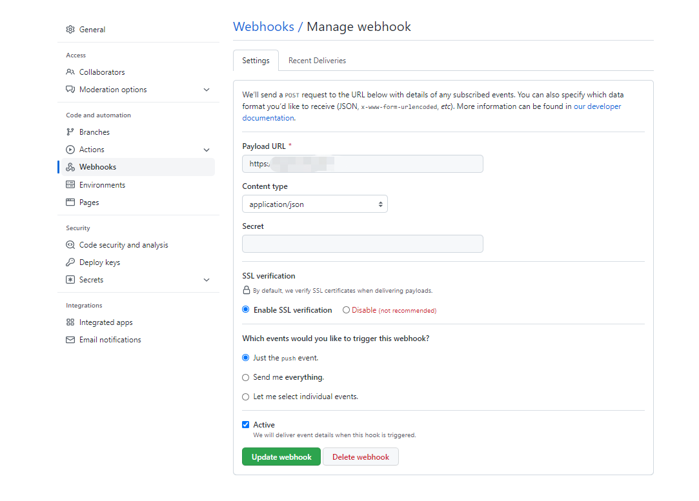
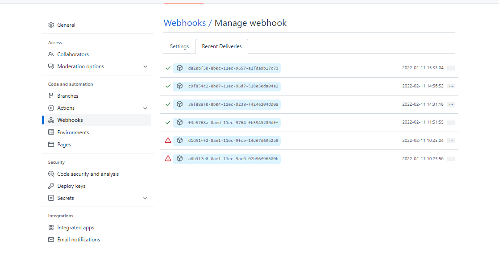

# 利用WebHooks功能实现服务器自动拉取功能

## 前言

在使用Hexo进行创建静态Blog这么久以来，给我第一感觉就是Hexo比起动不动就使用PHP服务器的WordPress来说，简直就是裸奔状态，如果用速度来说，WordPress是火车，那么Hexo就是火箭。但是毕竟是静态框架，从建立一篇文章来说，Hexo采用的Markdown渲染，明显比WordPress的富文本体验差。虽然本人是一个名副其实的Markdown吹，几乎所有笔记全用Markdown来记录，逢人就吹，说什么Markdown编辑器小巧，Markdown文本逻辑性强，程序猿用Markdown几乎没有什么难度...但其实显而易见Markdown文本目前依然只是程序猿或者科技人员一个自产自销的小众产品而已，且不说Markdown的语法需要适应，最重要的是Markdown的md文件很难进行直接解析，都是通过框架模块来转化为Html的，而富文本则是直接所见即所得，不需要在靠模块来进行再一次解析。

所以因为需要转化为html，加之Hexo本身静态页面需要需要生成的缘故，我每写一篇文章基本上是需要先进行 3个步骤，书写、提交、服务器拉取，由于我是采用的docker部署，所以有时还需要restart容器。

所以如果能实现 每次Push后，直接服务器拉取就能省下时间去登陆服务器那就好了。

结果查询，我发现了WebHooks功能便可以满足这一需求。

## 什么是WebHooks？

Webhooks就是用户通过自定义回调函数的方式来改变Web应用的一种行为，这些回调函数可以由不是该Web应用官方的第三方用户或者开发人员来维护，修改。

简单来说它就是一个能实现自动化函数的功能。

## 谁造成WebHooks？

目前网络主流的项目管理平台，如GitHub、GitLab、Gitee都支持。其中GitHub除了支持一般的Json回调以外，还支持使用表单回调。


## 使用WebHooks实现Github服务器自动拉取

下面我简绍使用GitHub来实现WebHooks来实现远程服务器自动拉取功能。

首先需要创建能实现自动化的脚本，且在网页中能执行，所以我们优先考虑PHP，因为PHP是一个的网页动态脚本语言。

所以我们需要提前给服务器安装PHP：

```shell
$ apt-get install php
```

正常情况下php会将其一些常用的插件都安装下来，所以会连续安装多个插件，比如Apache2、Fpm等。

我们这里采用Apache2服务器来进行加载PHP。

所以安装完毕后，运行服务器的80端口，就会发现Apache2的默认页面。但由于我们只是将其拿来进行运行推送脚本的，所以我们需要修改其默认端口。

```shell
$ vi /etc/apache2/ports.conf
```

使用vim进入配置文件后，修改其`Listen 80` ，将其改为其余空闲端口，并且在其服务器网络防火墙开放该端口。

随后我们就可以在Apache服务器中创建一个脚本页面了。

```shell
$ vi /var/www/html/index.php
```

其脚本内容大概如下即可:

```php
<?php
// 这里只是最简单的拉取代码，还可以添加更多其它，如验证、日志，解析push内容并操作。
// 获取push数据内容的方法
$requestBody = file_get_contents("php://input");
// 只需这一行代码即可拉取
echo shell_exec("cd 拉取的目录 && git pull"); // 目录换成项目的目录
?>
```

相当于自动执行其拉取操作，原理非常简单。

随后，如果使用的nginx来当Web服务器的话，我们还不要忘记在上面配置反向代理。

```properties
server{
	listen 443 ssl;
	...
	# proxy the PHP scripts to Apache listening
    location /pull/hook/999 {
        proxy_pass   http://127.0.0.1:8090/index.php;
    }
}
```

这里由于我只需要利用php使用一个脚本功能即可,使用我只见着一个路径进行了反向代理，这里反向代理到Apache2的服务器上去了。


到了这里或许有些人认为脚本步骤就结束了，其实还没有，那就是给目录授权，因为Apache2服务器在执行脚本时就采用了另外一个用户进行操作，这样脚本就还因为其权限而运行失败。

我们需要得到其Apache2服务器的用户，才能为其授权。

我们在刚才那个脚本上进行添加一行代码，来换取其用户名：

```php
system("whoami"); // 查看是哪个用户执行该命令
```

添加后，我们需要执行打开Apache2服务器页面，去执行这个脚本。打开页面后，我们就会在页面得到其Apache2服务器的用户名。

随后，使用root用户或者sudo进行给其Apache2服务器的用户授权（注意：Apache2服务器的网页文件夹 和 需要拉取的网页文件夹都需要授权）。

```shell
chown -R Apache2服务器用户名 /var/www/hook # 这里改成你的Apache2服务器推送脚本所在的文件夹
chown -R Apache2服务器用户名 /var/www/Project # 这里请改成你的需要拉取的项目目录
```

这样PHP的shell_exec拉取操作就能在其Apache2服务器上实现了。


做好了脚本和基本配置后，我们就需要在GitHub仓库中进行设置WebHooks操作了。

打开‘Settings’页面，左侧导航 选择“WebHooks”。点击“Add Webhook”添加WebHook。



其中Payload URL输入其 在Nginx中做的反向代理路径，即代理到Pull脚本PHP页面上。由于是采用其简单的Pull操作使用Json为ContentType即可。

Secret为密文，由于我们只需要将其实现自动Pull功能，那么可以不需要设置密文。

SSL认证，代表其是否通过Https加密，根据网站情况而定。

其中下面有三种触发条件：

> Just the `push` event. （推送时触发）
>
> Send me **everything**. （通过提交任意给我）
>
> Let me select individual events. （选择更多单个时间来触发）

这里我们选择`Just the `push` event. ` 推送时触发即可。

点击Add WebHook即可添加成功。


至此，我们使用每一次Push到仓库，GitHub将会自动执行其PHP脚本，即服务器Pull一次。

我们可以点开这个webhook来查看其每次触发的状态。

