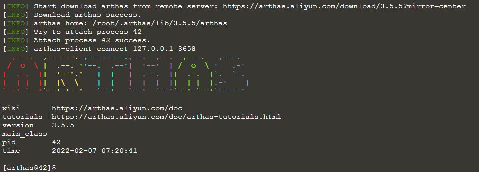
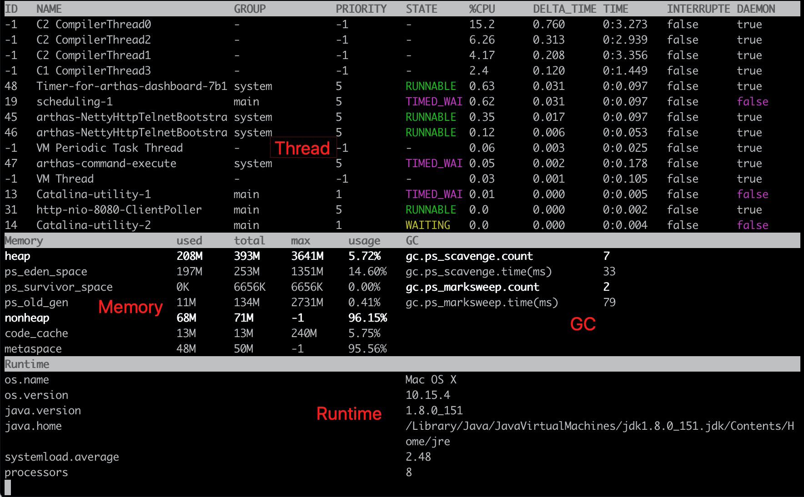

# Arthas - Java诊断工具

## 前言

[Arthas](https://github.com/alibaba/arthas)是Alibaba在Github上开源的Java诊断工具。

它和其他Java诊断工具一样，比如JDK官方的Jvisualvm，都能够进行在Java应用运行的后台中进行获取其状态。

不同其他的工具，Arthas更加简单方便，`Arthas`支持JDK 6+，支持Linux/Mac/Windows，采用命令行交互模式，同时提供丰富的 `Tab` 自动补全功能，进一步方便进行问题的定位和诊断。

## 使用范围

或许之前未接触到其他Java诊断工具，下面就是Arthas使用的场景：

> 1. 这个类从哪个 jar 包加载的？为什么会报各种类相关的 Exception？
> 2. 我改的代码为什么没有执行到？难道是我没 commit？分支搞错了？
> 3. 遇到问题无法在线上 debug，难道只能通过加日志再重新发布吗？
> 4. 线上遇到某个用户的数据处理有问题，但线上同样无法 debug，线下无法重现！
> 5. 是否有一个全局视角来查看系统的运行状况？
> 6. 有什么办法可以监控到JVM的实时运行状态？
> 7. 怎么快速定位应用的热点，生成火焰图？
> 8. 怎样直接从JVM内查找某个类的实例？

## 使用方法

### 启动Arthas

Arthas是基于Java语言编写的，没有UI界面，所以是需要在命令栏或者Shell中进行启动的，可以在https://github.com/alibaba/arthas/releases 中进行下载最新的Arthas版本。

当然也可以使用Linux 上的wget或者curl来直接获取到本地：

```shell
wget https://arthas.aliyun.com/arthas-boot.jar
```

```shell
curl -O https://arthas.aliyun.com/arthas-boot.jar
```

然后使用常规的Java启动命令即可:

```shell
java -jar arthas-boot.jar
```

这里的`arthas-boot`是`Arthas`的启动程序，它启动后，会列出所有的Java进程，用户可以选择需要诊断的目标进程。

成功运行Arthas后，需要对其对应的Java程序进行设置监控。

Arthas它会输出一段文字，表示当前服务器中已经运行的Java程序列表：

```java
$ java -jar arthas-boot.jar
[INFO] arthas-boot version: 3.5.5
[INFO] Found existing java process, please choose one and input the serial number of the process, eg : 1. Then hit ENTER.
* [1]: 42 zssaer.jar
* [2]: 67 demo.jar
```

上述服务器中共开启了两个Java程序，输入对应程序前的序号，比如需要监控demo应用，则输入`2`，然后回车。

在Attach成功之后，会打印Arthas LOGO。



输入 `help` 可以获取到Arthas的一些语句帮助信息,当然都是英文的。


## 获取当前程序的实时数据面板

在成功启动Arthas并且监控到了对应的程序后，我们可以使用`dashboard`来进行查看当前系统的实时数据面板。



由于该命令是实时数据，所以会不断的刷新，影响正常观看，可以输入`Q`或者直接Ctrl+C来退出dashboard命令。

dashboard命令分为三部方：

* 第一部方为Thread区，即展示当前JVM中的线程。
* 第二部分为Memory区，即展示该程序所花费的内存大小。
* 第三部分为运行环境区，即展示当前的JVM运行环境。

## 获取当前线程的进程操作

上面我们使用了`dashboard`来获取到了线程信息。我们可以通过使用`thread 线程ID`其线程的信息ID来获取到其线程的操作。

```shell
[arthas@42]$ thread 1
"main" Id=1 TIMED_WAITING
    at java.base@15-ea/java.lang.Thread.sleep(Native Method)
    at java.base@15-ea/java.lang.Thread.sleep(Thread.java:337)
    at java.base@15-ea/java.util.concurrent.TimeUnit.sleep(TimeUnit.java:446)
    at app//demo.MathGame.main(MathGame.java:17)
```

我们可以获取到其，该线程最终是在其`MathGame.java`这个java文件中执行了其main方法。

我们可以使用`sc -d *Java名`来查询JVM中加载的类的信息。

```shell
[arthas@42]$ sc -d *MathGame
 class-info        demo.MathGame                                                                    
 code-source       /root/math-game.jar                                                              
 name              demo.MathGame                                                                    
 isInterface       false                                                                            
 isAnnotation      false                                                                            
 isEnum            false                                                                            
 isAnonymousClass  false                                                                            
 isArray           false                                                                            
 isLocalClass      false                                                                            
 isMemberClass     false                                                                            
 isPrimitive       false                                                                            
 isSynthetic       false                                                                            
 simple-name       MathGame                                                                         
 modifier          public                                                                           
 annotation                                                                                         
 interfaces                                                                                         
 super-class       +-java.lang.Object                                                               
 class-loader      +-jdk.internal.loader.ClassLoaders$AppClassLoader@c387f44                        
                     +-jdk.internal.loader.ClassLoaders$PlatformClassLoader@3fbc1e80                
 classLoaderHash   c387f44                                                                          

Affect(row-cnt:1) cost in 38 ms.
```


## 反编译类

Arthas允许用户在其监控的程序中进行反编译操作。

使用指令`jad 类名`：

```java
jad demo.MathGame
```


