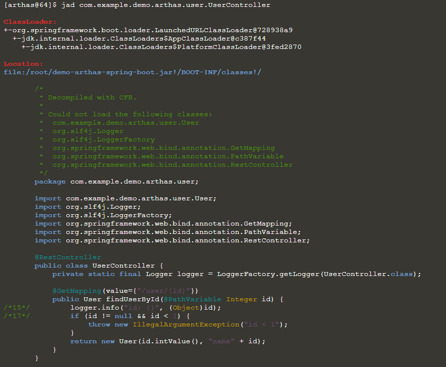

# Arthas - Java诊断工具

## 前言


[Arthas](https://github.com/alibaba/arthas)是Alibaba在Github上开源的Java诊断工具。

它和其他Java诊断工具一样，比如JDK官方的Jvisualvm，都能够进行在Java应用运行的后台中进行获取其状态。

不同其他的工具，Arthas更加简单方便，`Arthas`支持JDK 6+，支持Linux/Mac/Windows，采用命令行交互模式，同时提供丰富的 `Tab` 自动补全功能，进一步方便进行问题的定位和诊断。

## 使用范围

或许之前未接触到其他Java诊断工具，下面就是Arthas使用的场景：

> 1. 这个类从哪个 jar 包加载的？为什么会报各种类相关的 Exception？
> 2. 我改的代码为什么没有执行到？难道是我没 commit？分支搞错了？
> 3. 遇到问题无法在线上 debug，难道只能通过加日志再重新发布吗？
> 4. 线上遇到某个用户的数据处理有问题，但线上同样无法 debug，线下无法重现！
> 5. 是否有一个全局视角来查看系统的运行状况？
> 6. 有什么办法可以监控到JVM的实时运行状态？
> 7. 怎么快速定位应用的热点，生成火焰图？
> 8. 怎样直接从JVM内查找某个类的实例？

## 使用方法

### 启动Arthas

Arthas是基于Java语言编写的，没有UI界面，所以是需要在命令栏或者Shell中进行启动的，可以在https://github.com/alibaba/arthas/releases 中进行下载最新的Arthas版本。

当然也可以使用Linux 上的wget或者curl来直接获取到本地：

```shell
$ wget https://arthas.aliyun.com/arthas-boot.jar
```

```shell
$ curl -O https://arthas.aliyun.com/arthas-boot.jar
```

然后使用常规的Java启动命令即可:

```shell
$ java -jar arthas-boot.jar
```

这里的`arthas-boot`是`Arthas`的启动程序，它启动后，会列出所有的Java进程，用户可以选择需要诊断的目标进程。

成功运行Arthas后，需要对其对应的Java程序进行设置监控。

Arthas它会输出一段文字，表示当前服务器中已经运行的Java程序列表：

```shell
$ java -jar arthas-boot.jar
[INFO] arthas-boot version: 3.5.5
[INFO] Found existing java process, please choose one and input the serial number of the process, eg : 1. Then hit ENTER.
* [1]: 42 zssaer.jar
* [2]: 67 demo.jar
```

上述服务器中共开启了两个Java程序，输入对应程序前的序号，比如需要监控demo应用，则输入`2`，然后回车。

在Attach成功之后，会打印Arthas LOGO。


Arthas默认监听的都是本地IP，即127.0.0.1，对于想实现远程监控应用的话，需要加上`--target-ip地址`的参数：

```shell
$ java -jar arthas-boot.jar --target-ip
```


### 退出Arthas

想要退出Arthas，输入exit或者quit即可。

当然这样只是在Shell中取消占用而已，后台依旧在运行中，想要完全退出并结束Arthas，输入stop即可。


### 在浏览器操作

我们可以在Shell中直接进行操作，但是大多数情况下，考虑到方便，我们还是可以在Web下进行操作的。

Arthas支持Web连接。启动Arthas后，访问 http://127.0.0.1:8563/，可以通过浏览器来使用Arthas，当然依然是Shell操作，并没有提供UI操作。:sweat:


### 获取当前程序的实时面板

在成功启动Arthas并且监控到了对应的程序后，我们可以使用`dashboard`来进行查看当前系统的实时数据面板。


由于该命令是实时数据，所以会不断的刷新，影响正常观看，可以输入`Q`或者直接Ctrl+C来退出dashboard命令。

dashboard命令分为三部方：

* 第一部方为Thread区，即展示当前JVM中的线程。
* 第二部分为Memory区，即展示该程序所花费的内存大小。
* 第三部分为运行环境区，即展示当前的JVM运行环境。

### 获取当前线程的进程操作

上面我们使用了`dashboard`来获取到了线程信息。我们可以通过使用`thread 线程ID`其线程的信息ID来获取到其线程的操作。

```shell
[arthas@42]$ thread 1
"main" Id=1 TIMED_WAITING
    at java.base@15-ea/java.lang.Thread.sleep(Native Method)
    at java.base@15-ea/java.lang.Thread.sleep(Thread.java:337)
    at java.base@15-ea/java.util.concurrent.TimeUnit.sleep(TimeUnit.java:446)
    at app//demo.MathGame.main(MathGame.java:17)
```

我们可以获取到其，该线程最终是在其`MathGame.java`这个java文件中执行了其main方法。

我们可以使用`sc -d *Java名`来查询JVM中加载的类的信息。

```shell
[arthas@42]$ sc -d *MathGame
 class-info        demo.MathGame                                                                    
 code-source       /root/math-game.jar                                                              
 name              demo.MathGame                                                                    
 isInterface       false                                                                            
 isAnnotation      false                                                                            
 isEnum            false                                                                            
 isAnonymousClass  false                                                                            
 isArray           false                                                                            
 isLocalClass      false                                                                            
 isMemberClass     false                                                                            
 isPrimitive       false                                                                            
 isSynthetic       false                                                                            
 simple-name       MathGame                                                                         
 modifier          public                                                                           
 annotation                                                                                         
 interfaces                                                                                         
 super-class       +-java.lang.Object                                                               
 class-loader      +-jdk.internal.loader.ClassLoaders$AppClassLoader@c387f44                        
                     +-jdk.internal.loader.ClassLoaders$PlatformClassLoader@3fbc1e80                
 classLoaderHash   c387f44                                                                          

Affect(row-cnt:1) cost in 38 ms.
```


### 反编译类

Arthas允许用户在其监控的程序中进行反编译操作。

使用指令`jad 类名`：

```shell
$ jad demo.MathGame
```

它会同时输出其反编译的步骤:



当然也可以只输出其反编译的代码：

```shell
$ jad --source-only 类名
```

### 在线执行代码

Arthas中有个`ognl`命令，它可以用作在项目中动态执行代码。

比如调用静态的函数：

```shell
$ ognl '@java.lang.System@out.println("hello ognl")'
```

上述语句用来在项目中打印输出一个'hello ognl' ，注意是在项目中，而不是在Arthas中。

还可以获取到类中的静态参数，前提需要获取到该类的ClassLoader的哈希值，使用`sc`功能：

```shell
$ sc -d 类名 | grep classLoaderHash
```

由于类加载器是动态生成的，每次项目启动时哈希值都会变化，所以不能硬记下来。

```shell
$ ognl -c 类加载器哈希值 @类@参数名
```


## 常见案例

### 捕捉错误

Arthas使用`watch`命令可以进行动态捕捉其应用运行内容。

`watch`命令接受四个参数：

1. 第一个参数是类名，支持通配 （必须）
2. 第二个参数是动态捕捉函数名，支持通配 （必须）
3. 第三个参数为捕捉的返回值内容，可以是一个返回对象（returnObj），也可以是一个多个内容，比如输入参数和抛出的错误（'{params, throwExp}'）,也可以是其某个属性(“params[0].size()”)。（必须）
4. 第四个参数为条件表达式，用作过滤捕捉。

比如：

```shell
$ watch com.example.demo.arthas.user.UserController * returnObj 'params[0] > 100'
```

表示其捕捉UserController类中的任意方法下的 返回值 ，其条件是 其中第一个参数大于100。

当我们调用接口时，参数小于100的话，就不会打印内容，而大于100才则打印。

```shell
$ watch com.example.demo.arthas.user.UserController * returnObj 'params[0] > 100'
Press Q or Ctrl+C to abort.
Affect(class-cnt:1 , method-cnt:2) cost in 47 ms.
ts=2019-02-13 19:42:12; [cost=0.821443ms] result=@User[
    id=@Integer[101],
    name=@String[name101],
]
```


又比如，查看第一个参数的size：

```shell
$ watch com.taobao.container.Test test "params[0].size()"
Press Ctrl+C to abort.
Affect(class-cnt:1 , method-cnt:1) cost in 22 ms.
@Integer[40]
```


### 热代码更新

每次我们在进行代码问题修复的时候，总会在其 相关代码前后进行新增打印语句，用来打印出其相关的参数，以确保其正确性。

但是在已经上线的项目中，我们不能直接来进行编写源代码。

合理使用Arthas的`jad`/`mc`/`redefine`语句可以实现热代码更新。


首先，我们根据其日志输出，找到对应的类。使用`jad`来进行反编译类(Class->Java)。

```shell
$ jad --source-only com.example.demo.arthas.user.UserController > /tmp/UserController.java
```

这样UserController这个类就被反编译并保存在/tmp/UserController.java文件夹下了。

我们通过其Vim来进行编辑这个反编译后的类，在里面加入你所想要的内容。

```shell
vim /tmp/UserController.java
```

编辑并保存好了反编译的类后，我们就需要将其反编译后的类加入到项目中了。

了解类的动态加载的人或许知道，每个类通过其类加载器来进行动态加载的。我们要将编辑好的类动态加载进去的话，就需要找到其对应的类的类加载器。

我们使用Arthas中的`sc`命令来查询其类的类加载器哈希值，来准确定位。

```shell
$ sc -d *UserController | grep classLoaderHash
 classLoaderHash   1be6f5c3
```

这里这个类的类加载器哈希值为1be6f5c3，我们先记住。

使用Arthas中的`mc`命令可以用来编译类(Java->Class)，并且通过`-c`或者`--classLoaderClass`参数指定其类的ClassLoader。

```shell
$ mc -c 1be6f5c3 /tmp/UserController.java -d /tmp
```

*注意：这里最后一个参数的 `/tmp`表示其Java应用内部的/tmp，并非前面的外部文件夹。*

这样就成功将其编译并放置到了应用内部：

```shell
Memory compiler output:
/tmp/com/example/demo/arthas/user/UserController.class
Affect(row-cnt:1) cost in 346 ms
```


最后我们还需要让应用重新加载编译好的类，使用Arthas的`redefine`命令：

```shell
$ redefine /tmp/com/example/demo/arthas/user/UserController.class
redefine success, size: 1
```

这样我们就成功的实现了热代码更新，由此可见，Arthas不仅可以用来诊断Java应用，还可以用来在线修改其Java应用。


### 过滤器拦截

在Java中我们比较头疼的就是过滤器的拦截了。比如说某个接口返回了一个401未授权的错误，那么如何去寻找这个抛出错误的过滤器？

我们可以使用`trace`命令来各种某个类。

```shell
$ trace javax.servlet.Filter *
```

上述用来跟踪各个过滤器内容。

当我们再次访问接口出现调用过滤器的话，Arthas上就会开始打印内容：

```java
+---[3.806273ms] javax.servlet.FilterChain:doFilter()
|   `---[3.447472ms] com.example.demo.arthas.AdminFilterConfig$AdminFilter:doFilter()
|       `---[0.17259ms] javax.servlet.http.HttpServletResponse:sendError()
```

通常在最底层中我们会发现其真正的过滤器调用，比如这个则是AdminFilterConfig这个类中的AdminFilter调用了它的doFilter方法。


