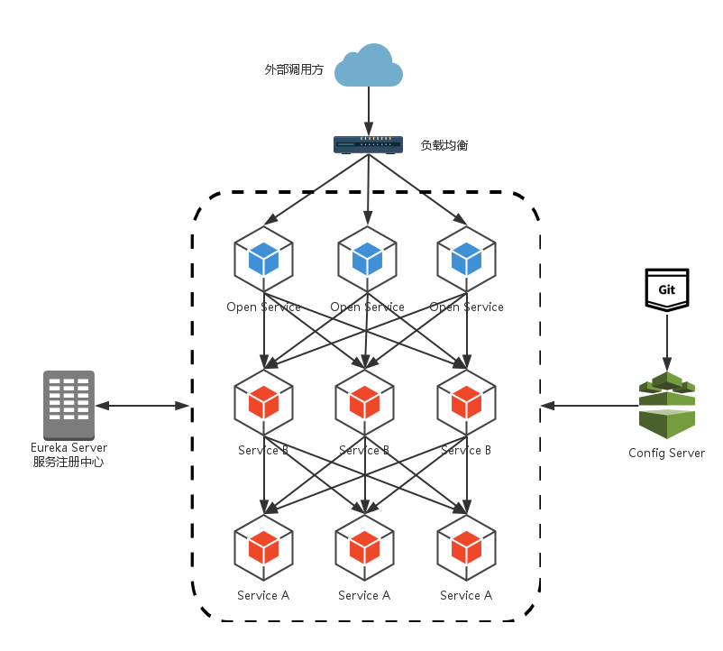
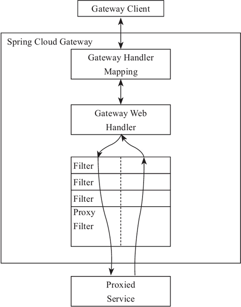
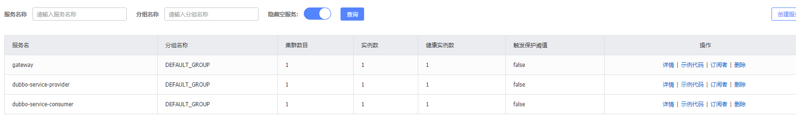

# Spring Cloud 服务网关 - Gateway

服务网关是SpringCloud中的一个需求组件，目前比较出名的有GateWay和Zuul。

在为学习服务网关时，我们的微服务请求都通过调用服务消费方来进行：



其中服务间通过Ribbon或Feign来实现服务的消费以及均衡负载,但这样直接对外调用有如下缺点:

- 破坏了服务无状态特点。为了保证对外服务的安全性，我们需要实现对服务访问的权限控制，而开放服务的权限控制机制将会贯穿并污染整个开放服务的业务逻辑，这会带来的最直接问题是，破坏了服务集群中REST API无状态的特点。从具体开发和测试的角度来说，在工作中除了要考虑实际的业务逻辑之外，还需要额外可续对接口访问的控制处理。
- 其次，无法直接复用既有接口。当我们需要对一个即有的集群内访问接口，实现外部服务访问时，我们不得不通过在原有接口上增加校验逻辑，或增加一个代理调用来实现权限控制，无法直接复用原有的接口,在集群中实现权限控制非常繁琐。

为了解决上面这些问题，我们需要将权限控制这样的东西从我们的服务单元中抽离出去，而最适合这些逻辑的地方就是处于对外访问最前端的地方，我们需要一个更强大一些的均衡负载器，它就是本文将来介绍的：服务网关。

所以不管是大型集群项目，还是中小型微服务，SpringCloud微服务中的路由服务时必不可少的。通过服务网关统一向外系统提供REST API的过程中，除了具备服务路由、均衡负载功能之外，它还具备了权限控制等功能。

## 关于Gateway

Spring Cloud Gateway是Spring官方基于 Spring 5.0、Spring Boot 2.0 和 Project Reactor 等技术开发的路由网关，Spring Cloud Gateway 旨在为微服务架构提供一种简单有效的、统一的 API 路由管理方式。

Spring Cloud Gateway 作为 Spring Cloud 生态系中的网关，其目标是替代 Netflix的服务网关 Zuul，它不仅提供统一的路由方式，并且基于 Filter 链的方式提供了网关基本的功能，例如：安全、监控/埋点和限流等。

Spring Cloud Gateway 依赖 Spring Boot 和 Spring WebFlux，基于 Netty 运行。它不在传统servlet容器中工作，所以自然不能构建为war包，只能打包为jar包。


## 核心概率

Spring Cloud Gateway有如下几个核心概念：

> 1）Route
>
> Route（路由） 是网关的基础元素，由 ID、目标 URI、断言、过滤器组成。当请求到达网关时，由 Gateway Handler Mapping 通过断言进行路由匹配（Mapping），当断言为真时，匹配到路由。
>
> 2）Predicate
>
> Predicate（断言） 是 Java 8 中提供的一个函数。输入类型是 Spring Framework ServerWebExchange。它允许开发人员匹配来自 HTTP 的请求，例如请求头或者请求参数。简单来说它就是匹配条件。
>
> 3）Filter
>
> Filter 是 Gateway 中的过滤器，可以在请求发出前后进行一些业务上的处理。

## 工作原理



整个过程类似于SpringMvc请求过程。

客户端向Spring Cloud Gateway发出请求。如果Gateway Handler Mapping确定请求与路由匹配，则将其发送给Gateway Web Handler。然后Handler通过特定于请求的过滤器链发送请求。过滤器可以在发送代理请求之前或之后执行逻辑。执行所有的“pre”过滤逻辑，然后发出代理请求，最后执行“post”过滤逻辑。得到Proxied Service服务消费方内容后再进行返回。


除此以外，Gateway在路由服务注册到服务注册中心后，会自动将其服务注册中心的其他客户端进行路由链接。

## 简单搭建

新建一个GateWay模块，用作微服务的网关模块，本次介绍使用Nacos作为服务注册中心。

导入相关依赖：

```java
    <dependencies>
        <dependency>
            <groupId>com.alibaba.cloud</groupId>
            <artifactId>spring-cloud-starter-alibaba-nacos-discovery</artifactId>
        </dependency>

        <dependency>
            <groupId>org.springframework.cloud</groupId>
            <artifactId>spring-cloud-starter-gateway</artifactId>
        </dependency>
    </dependencies>
```

**这里不需要向其他web微服务那样加入`spring-boot-starter-web`模块依赖，因为`spring-cloud-starter-gateway`内部包含了`spring-boot-starter-webflux`，它与其不兼容，如果再次加入会发生冲突。**

模块内编写一个启动类，用作路由服务启动方式，方式与其他微服务一样：

```java
@SpringBootApplication
@EnableDiscoveryClient
public class Application {
    public static void main(String[] args) {
        SpringApplication.run(Application.class,args);
    }
}
```

加入相关配置内容，这儿推荐使用Yaml文件作为配置文件：

```xml-dtd
spring:
  application:
    name: gateway
  cloud:
    nacos:
      discovery:
        server-addr: 192.168.0.190:8848
    gateway:
      discovery:
        locator:
          enabled: true #表明gateway开启服务注册和发现的功能
          lower-case-service-id: true #是将请求路径上的服务名配置为小写（因为服务注册的时候，注册中心会将服务名转成大写)

server:
  port: 8200
```

由于Gateway在服务注册后会自动路由链接其他客户端，所以在启动服务网关前务必先启动其他服务客户端。

**具体顺序为：1.服务注册中心 \ 2.服务提供方 \ 2.服务消费方 \ 3.流控服务 \ ... \ -2.服务网关 \ 集群监控**

启动服务网关后,在Nacos服务列表中就发现了该服务网关,说明服务网关运行正常。



运行正常后,加入 localhost:8200/服务注册名/.. ,如http://localhost:8200/dubbo-service-consumer/test,其将自动路由输出对应服务消费方的内容。


有了服务网关后，其客户所有的接口请求均通过服务网关来进行操作，不再使用服务消费方来请求。


## 路由配置

前面的已经搭建了服务网关，但是仅仅只能通过使用服务注册名来进行路由操作，实际项目中肯定不会直接这样的调用的，而是设计一个地址来进行指定路由，所以需要进行手动进行gateway的路由配置。

在其配置文件下进行创建对应的路由清单：

```xml-dtd
    gateway:
      discovery:
        locator:
          enabled: true #表明gateway开启服务注册和发现的功能
          lower-case-service-id: true #是将请求路径上的服务名配置为小写（因为服务注册的时候，注册中心会将服务名转成大写)
      routes:
        - id: path_route
          uri: https://zssaer.cn           # 网关路由到外部地址https://zssaer.cn
          predicates:
            - Path=/spring_cloud/**       # 输入条件为`服务网关地址/spring_cloud`进行跳转
          
        - id: dubbo-service-consumer
          uri: lb://dubbo-service-consumer  #网关路由到用户服务dubbo-service-consumer
          predicates:
            - Path=/service/**       # 输入条件为`服务网关地址/service`进行跳转
		  filters:
            - StripPrefix=1
```

其中的routes下面配置的是路由清单，它接受多个配置清单。

每个配置清单开始 用`-`进行间隔。其中每个配置清单有如下配置：

* id：路由的id，唯一不能重复存在
* uri：路由位置，可以设置为外部位置，`lb://`表示用服务注册名定位。
* predicates：断言内容，可以设置多个条件，用来表示该路由实施条件。
* filters：过滤器，对路由后的内容进行过滤

这儿有个大坑，那就是当其中断言后进行路由的地址会加上其中断言的地址。比如输入`服务网关地址/service/test`触发路由，路由跳转地址不是`客户端/test`，而是为`客户端/service/test`，从而导致如果对于请求接口错误，报404 Not Find服务。

为了解决这个问题，我们在其后加入filters过滤器，来进行过滤掉第一段的断言的地址。Gateway path这里跟zuul的默认去掉匹配模式路径不一样，所以需要这一步。


## 断言配置详解

上面配置文件中的`predicates`断言，gateway内置了多种断言方法：

### Path 路由断言工厂

`- Path=/blog/detail/{segment}`:

Path 路由断言工厂接收一个参数，根据 Path 定义好的规则来判断访问的 URI 是否匹配。

上面例子中如果请求路径为 /blog/detail/xxx，则此路由将匹配。

也可以使用正则，例如 `/blog/detail/** `来匹配 `/blog/detail/ `开头的多级 URI。

### Query 路由断言工厂

` - Query=foo, ba.`

Query 路由断言工厂接收两个参数，一个必需的参数和一个可选的正则表达式。

上面例子中如果请求包含一个值与 ba 匹配的 foo 查询参数，则此路由将匹配。

bar 和 baz 也会匹配，因为第二个参数是正则表达式。

### Method 路由断言工厂

`- Method=GET`

Method 路由断言工厂接收一个参数，即要匹配的 HTTP 方法。

### Header 路由断言工厂

`- Header=X-Request-Id, \d+`

Header 路由断言工厂接收两个参数，分别是请求头名称和正则表达式。

上面例子中如果请求中带有请求头名为 x-request-id，其值与 \d+ 正则表达式匹配（值为一个或多个数字），则此路由匹配。


不同的断言工厂函数可以在`predicates`中叠加，用来满足各方面的要求。

上面是比较常用的断言函数，除GateWay内置的断言函数以外，还可以自定义路由断言工厂函数，来进行自定义断言判断，当然这一点可以自行网络了解。


## 过滤配置详解

上面配置文件中的`filters`过滤器，gateway内置了多种过滤工厂：

### AddRequestHeader 过滤器工厂

` - AddRequestHeader=X-Request-Foo, Bar`

它的作用是给路由请求添加请求头。

该例子中 符合规则匹配成功的请求，将添加 X-Request-Foo：bar 请求头，将其传递到后端服务中，后方服务可以直接获取请求头信息。

### RemoveRequestHeader 过滤器工厂

`- RemoveRequestHeader=X-Request-Foo`

它的移除请求头的过滤器工厂，可以在请求转发到后端服务进行 Header 的移除操作。

### SetStatus 过滤器工厂

`- SetStatus=401`

它接收单个状态，用于设置 Http 请求的响应码。它必须是有效的 Spring Httpstatus（org.springframework.http.HttpStatus）。它可以是整数值 404 或枚举类型 NOT_FOUND。

### RedirectTo过滤器工厂

` \- RedirectTo=302, http://baidu.com`

它用于重定向操作，它也接受一个响应码,上面例子表示需要重定向到百度。


不同的过滤工厂函数可以在`filters`中叠加，用来满足各方面的要求。

上面是比较常用的过滤工厂，除GateWay内置的过滤工厂以外，还可以自定义过滤工厂函数，来进行自定义过滤，当然这一点可以自行网络了解。