# IDEA实战开发效率提升插件汇总

Idea插件市场上拥有大量免费/收费插件，这些插件会让IDEA变得更加智能，在实际编码环境中增加编码效率，节省项目开发时间。

下面是本人工作学习中常使用的IDEA插件:


## Chinese Language Pack/中文汉化包（官方）

今年7月IDEA官方Jetbrains宣布正式成立中国区，IDEA也推出了官方中文汉化包。

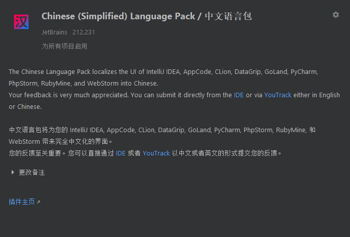

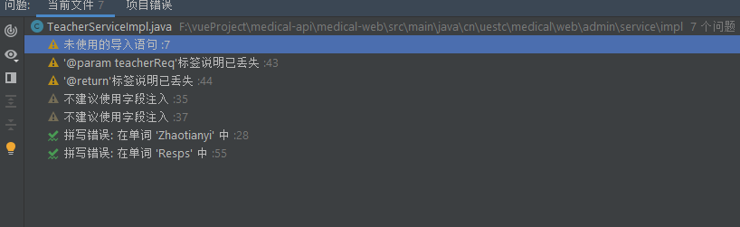

相较于民间汉化插件，使用官方中文汉化版本，在获取代码信息上更加方便，毕竟中文显示极大方便了IDEA使用。

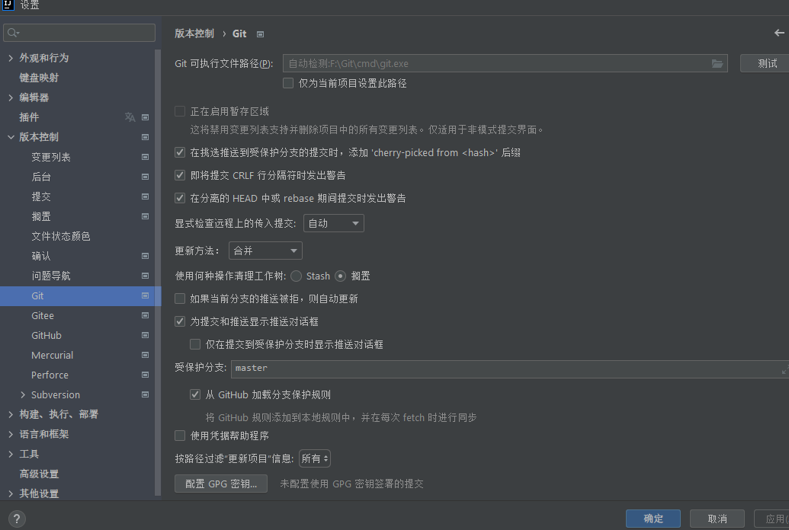

特别是之前的设置，在英文版本中难以进行操作，而汉化包几乎汉化率达到了90%，从此设置操作不需要求助互联网。


## Translation

国内作者开发的自动翻译插件，支持Google、有道、百度翻译。IDEA官方推荐插件！


当设置变量名\方法名时，对英文不熟悉可以直接翻译为英文。特别是支持对文档进行嵌入式翻译，极大了方便了官方/第三方源码观看，降低了门槛。


也支持弹出框的文本汉化:

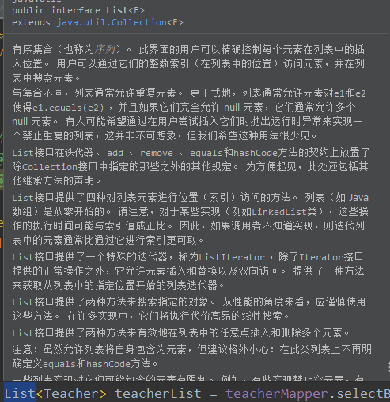


## Alibaba Java Coding Guidelines

一个按照阿里巴巴Java规范编写的代码规范检查插件。

可以自动查找出代码的不规范位置，以及可能存在的代码问题，从而提高代码的质量。更重要的还是中文显示。

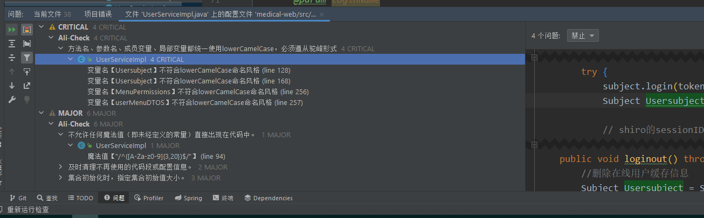


## Codota

一个Ai人工学习代码自动补全插件，能够根据当前上下文自动判断出需要输入的代码，可以进行本地代码学习。使用时需要注册Codota账号。功能也有相关功能的插件，比如Axcoder等。

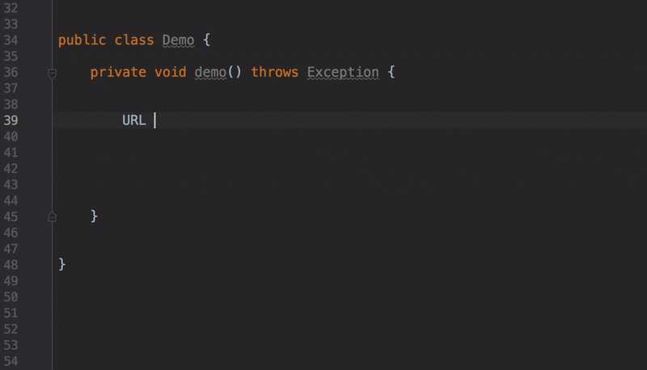

也可以从Github上进行源码拷贝自动补全。前提是当前网络能够访问GitHub。


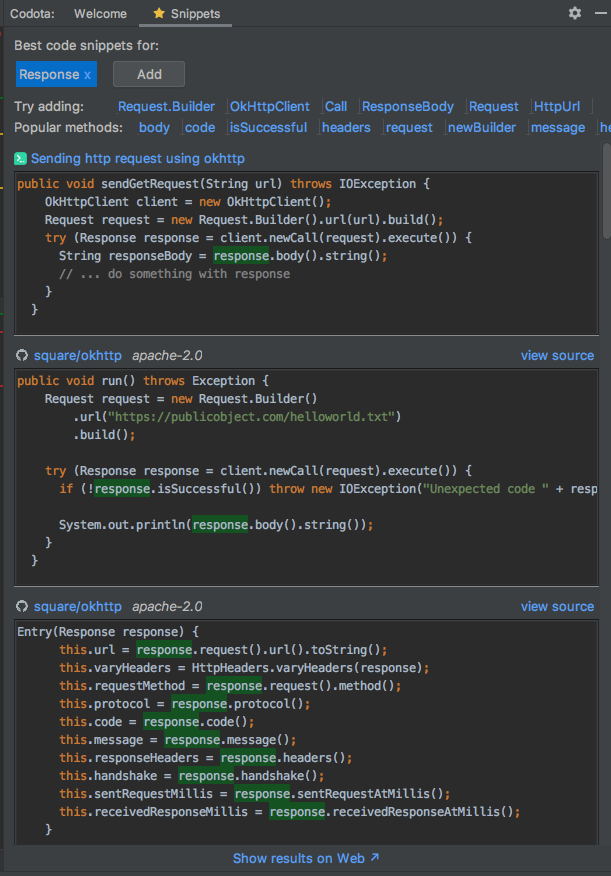


## GsonFormatPlus

GsonFormatPlus插件可以根据Json数据快速生成对应的实体类，前端需求一个Json，只需要根据Json来创建实体类。

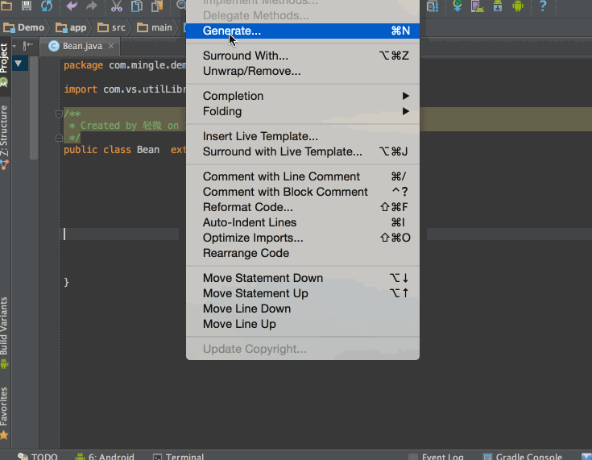


## Rainbow Brackets

当代码中存在大量的逻辑判断后,会有很多层级的代码块,不管是在编码时还是查看时都非常麻烦,常常不知道哪个反括号对于哪个括号。

使用RainbowBrackets彩虹括号插件，可以使不同级别的括号变为不同颜色，方便分辨。

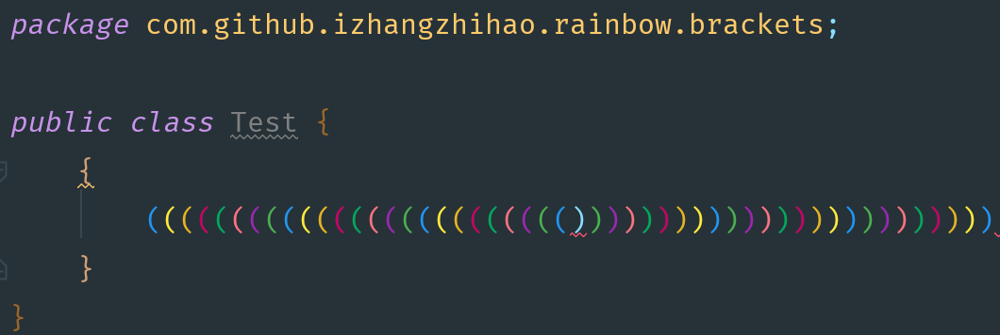


## Maven-search

正常情况下，在进行添加第三方依赖包时需要导入对应的Maven地址，而相关的Maven依赖一般都会选择去[mvnrepository](https://mvnrepository.com/)上进行查询版本。

使用maven-search这个插件后，可以在IDEA就可以直接 查找到相关Maven依赖。

安装后，打开**Tools** 下的**Maven Search**，即可查询Maven依赖：

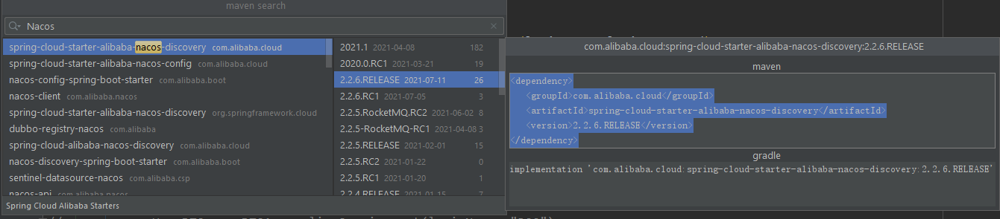


## JUnitGenerator

在一些项目中要求书写对应接口的测试类,安装JUnitGenerator插件后就可以自动生成对应接口的测试类框架了。

使用该插件前需要在项目导入Junit4的依赖包。

在生成前先要配置好插件和插件模版：

在设置中更改该插件的输出位置，默认为输出到`${SOURCEPATH}/test/java/${PACKAGE}/${FILENAME}`-项目的test目录下，而在Maven项目中则应该改为`${SOURCEPATH}/../../test/java/${PACKAGE}/${FILENAME}`

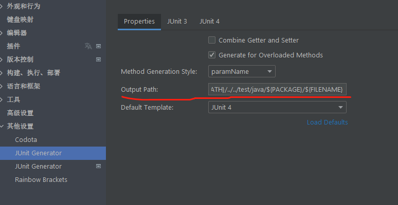

然后需要更改模板中的默认包引用,默认为test下,我们需要手动去掉:

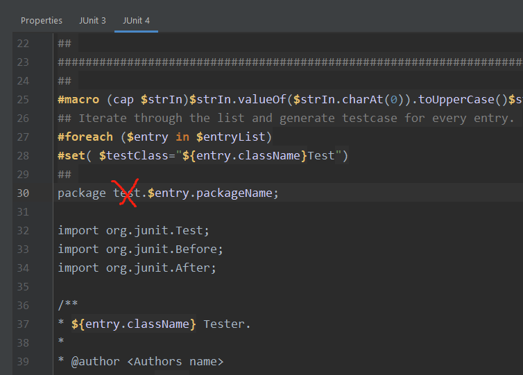

随后便可以开始使用插件生成单元测试方法，打开某个服务层的类 按 Alt+Insert 快捷键调出构建面板，然后选择Junit Test -》junit4 ，这个时候单元测试的方法就生成了。

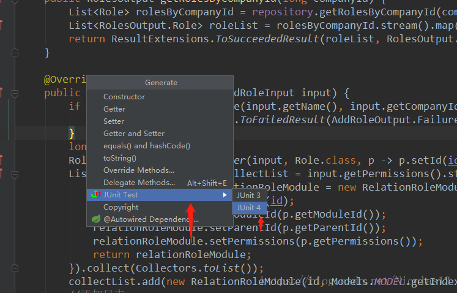

若想全部方法进行测试,要动态个性化生成，可以在所要测试的类页面上，使用该快捷操作Ctrl + Shift + T。

**该生成插件只是单独生成对应接口的测试模块，但其中测试内容依旧需要手动添加才行。**

一个测试类单元测试的执行顺序为：

　　　　@BeforeClass –> @Before –> @Test –> @After –> @AfterClass

每一个测试方法的调用顺序为：

　　　　@Before –> @Test –> @After

下面为一个测试类的Demo,可供参考：

```java
public class JunitFlowTest {
    /* *
    *1. @BeforeClass修饰的方法会在所有方法被调用前被执行，
    * 而且该方法是静态的，所以当测试类被加载后接着就会运行它，
    * 而且在内存中它只会存在一份实例，它比较适合加载配置文件。
    * 2. @AfterClass所修饰的方法通常用来对资源的清理，如关闭数据库的连接
    * 3. @Before和@After会在每个测试方法的前后各执行一次。
    * */
    @BeforeClass
    public static void setUpBeforeClass() throws Exception {
        System.out.println("this is beforeClass...");
    }
    @AfterClass
    public static void tearDownAfterClass() throws Exception {
        System.out.println("this is afterClass...");
    }
    @Before
    public void setUp() throws Exception {
        System.out.println("this is before...");
    }

    /**
    * 即使在@Before注解方法、@Test注解方法中抛出了异常，
* 所有的@After注解方法依然会被执行
    */
    @After
    public void tearDown() throws Exception {
        System.out.println("this is after");
    }

    /* *
    *
    * 1. Failure一般由单元测试使用的断言方法判断失败所引起的，
*  这经表示测试点发现了问题
    * ，就是说程序输出的结果和我们预期的不一样。
    * 2. error是由代码异常引起的，它可以产生于测试代码本身的错误，
*  也可以是被测试代码中的
    * 一个隐藏的bug
    * 3.测试用例不是用来证明你是对的，而是用来证明你没有错。
    */
    @Test
    public void testAdd() {
        assertEquals(5, new Calculate().add(3,3));
    }
    @Test
    public void testDivide() {
        assertEquals(3, new Calculate().divide(6, 0));
    }
}
```


## SonarLint

如果说上面的Alibaba Java Coding Guidelines这个插件是检查代码规范的插件,那么SonarLint则是一个检查代码逻辑的插件，让你觉得你写的代码原来这么烂 :happy: 。

SonarLint支持多种语言的逻辑检查，拥有检查出代码中可能会出现问题的代码，以及不符合Java规范规定的代码使用功能。

并且在不合规的代码中提出原因以及相关问题解决方法，对于提升代码质量和编码水平有极大帮助。

美中不足的就是不支持中文，以及不能自动解决问题，需要通过手动解决。

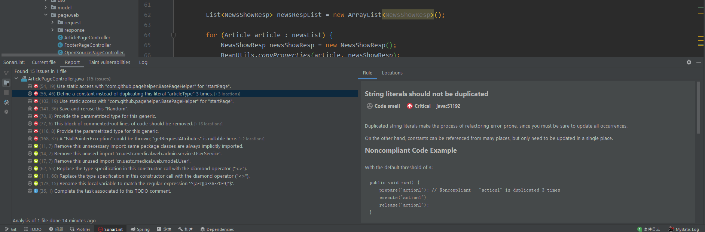


## ...

还有很多CRUD的插件,比如EasyCode、MybatisHelper等等，但由于自动生成代码方法用MybitsGenerator来生成就行，所以不做介绍了。

