# IDEA使用技巧总结

## 查询所有使用位置

对于某个方法或者某个字段、某个参数，鼠标选中后按`Alt`+`F7`按键就可以查询到引用、使用到该类型的所有地方。

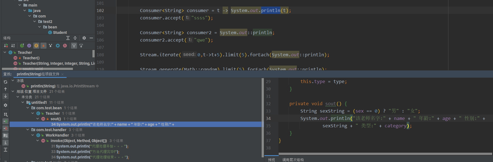

或者选中后按`Ctrl`+`Alt`+`F7`以下拉列表显示，更加方便。

## 全局查询所有类文件

对于全局中，按`Ctrl`+`N`按键，弹出类搜索框，它可以在全局（项目、依赖包）中搜索指定类文件。

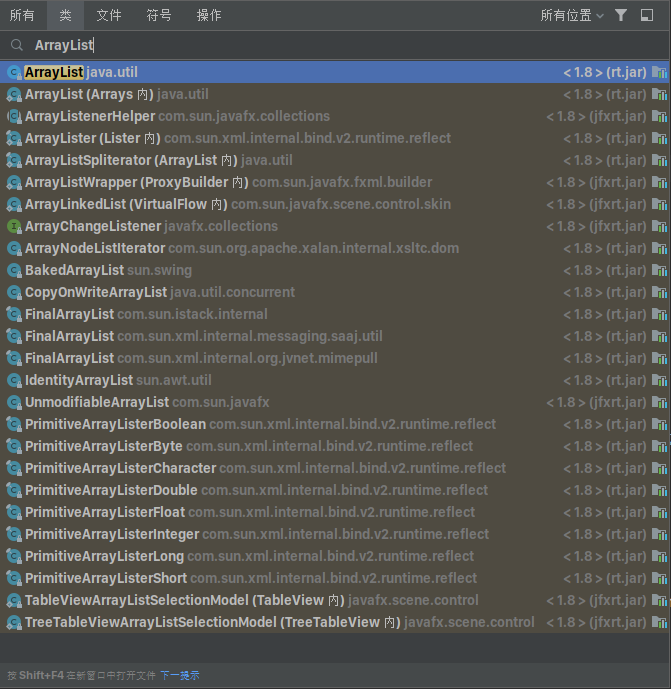

## 移动方法和移动行

输入指针位于方法行时 使用`Ctrl`+`Shift`+`↑`或者`Ctrl`+`Shift`+`↓`按键可以移动方法位置，如果输入指针在某个代码行上可以移动行位置。

 使用`Alt`+`Shift`+`↑`或者`Alt`+`Shift`+`↓`按键 也可以移动行位置，但是没法移动方法位置。

## 移动方法中参数的顺序

输入指针位于方法行时 使用`Ctrl`+`Shift`+`Alt`+`↑`或者`Ctrl`+`Shift`+`Alt`+`↓`按键可以移动方法位置，如果输入指针在某个代码行上可以移动行位置。

## 创建草稿文件

对于一些实现性的测试来说，我们不必要在项目中单独创建一个文件。

IDEA支持创建一个草稿文件来实现一个Demo。使用`Ctrl`+`Shift`+`Alt`+`Insert`按键，弹出一个下拉框，选择对应类型的草稿文件即可创建草稿。

草稿文件可以进行各种测试。

注意：草稿文件默认存储在`C:\Users\用户名\AppData\Roaming\JetBrains\IntelliJIdea版本号\scratches\`下。

## 重构内容、提取方法

对于一些需要修改、添加的变量名、参数名，我们可以选中它使用`Ctrl`+`Shift`+`Alt`+`T`按键，便会弹出一个重构内容下拉栏。

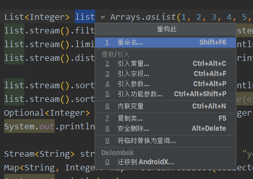

它可以用来重构内容。

对于选中多行后，执行将后将可以看见多出 提取方法功能，它能够将其选中的多行代码提取出去，并且根据选中的内容来智能判断提出的方法 需要什么类型的参数。

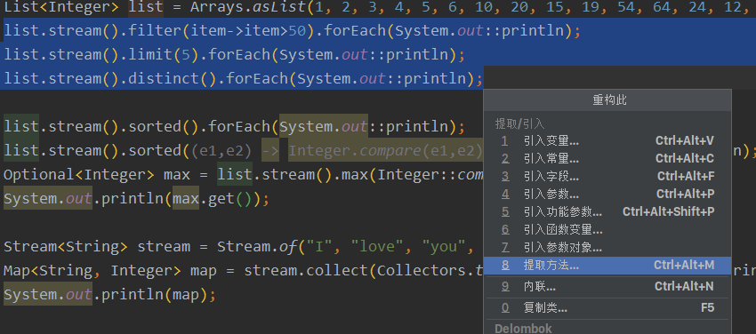

## 注入SpringBean实体

IDEA支持注入SpringBean实体到定义方法中，按`Alt`+`Enter`后选中注入语言或引用，在弹出的下拉框中输入“SpringBean名称”，填入SpringBean即可注入。

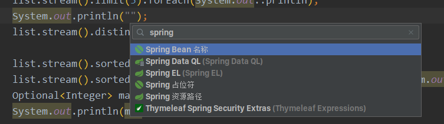

## 查看打开文件历史

按`Ctrl`+`E`可以弹出最近的文件框，右侧为打开过的文件历史。

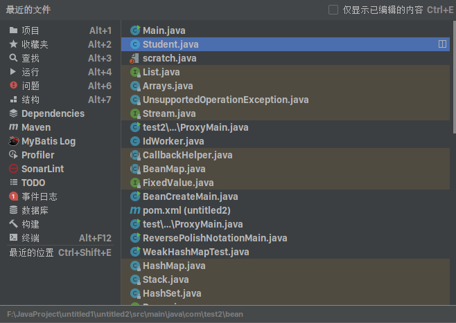

## 查询继承结构

对于一些源码我们时长需要查看到对应接口的一些实现类，这时在一个文件下按`Ctrl`+`H`会弹出层次结构,列出所有继承关系。

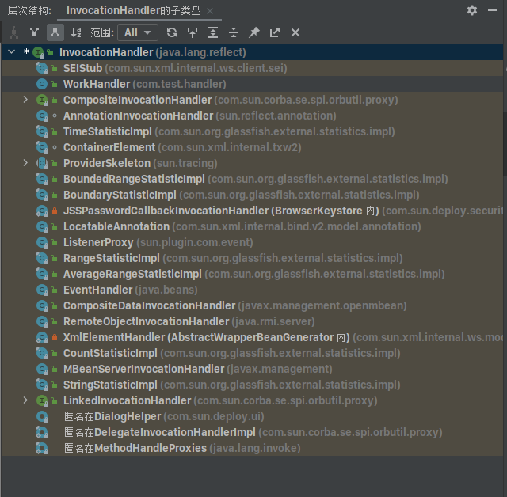

## 正则表达式检查

IDEA通过正则表达式检查工具。在输入光标处于正则表达式下，按`Alt`+`Enter`后选择"检查正则表达式"，弹出正则表达式测试工具。

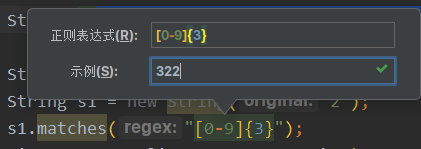

## 快速切换窗口

在Windos、Mac下大家可能都知道使用`Alt`+`Tab`可以切换应用窗口，其实在IDEA也可以快速切换打开的文件窗口，只需要按`Ctrl`+`Tab`即可。

## 快速获取VCS操作

大多数情况下我们使用Git提交代码会选中右上角的按钮或者上方Git下拉栏中的提交，但在IDEA中按`Alt`+` ` ` 即可打开快速VCS操作栏，它拥有VCS的所有常用的功能。

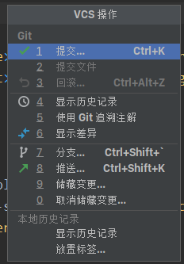

## 获取合适的提示模板

忘记了配置的实时模板的缩写，在任意位置下`Ctrl`+`J`将会根据位置 弹出适合的所有实时模板。

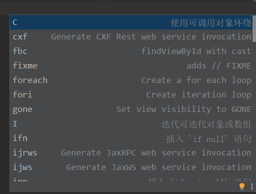

## 剪贴板

IDEA中内置了剪贴板功能，按`Ctrl`+`Shift`+`v`即可打开。

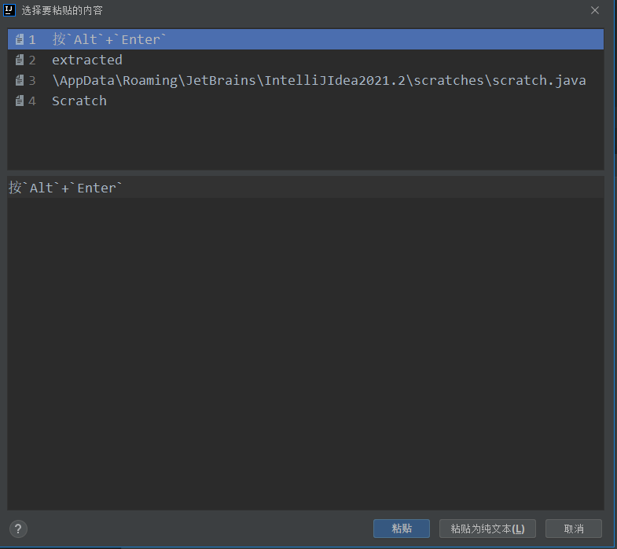

