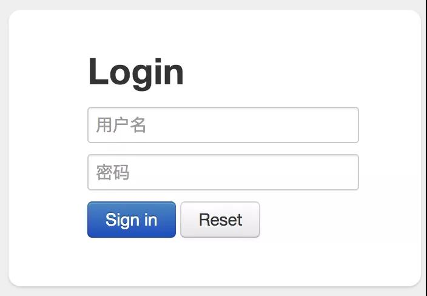
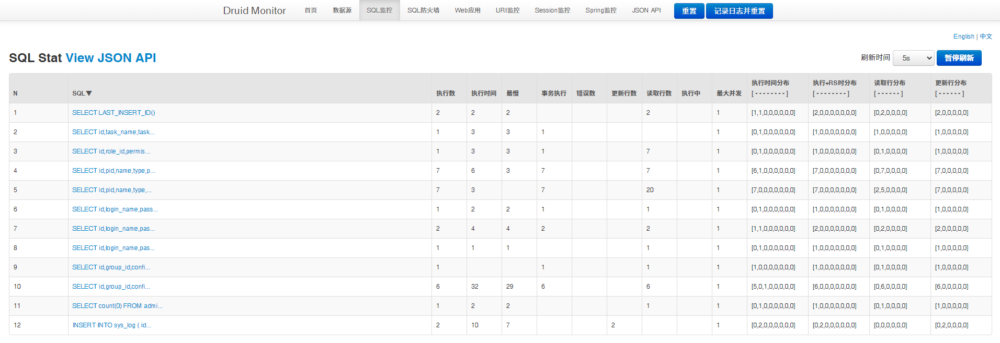

# 使用Druid监控SQL运行状态

# 前言

相信大家在JAVA项目中大部分时间都是选择使用阿里的Druid来进行充当JDBC连接池的吧。

其实Druid除了简单的连接池功能以外，还有监控功能，可以使用它的监控功能来进行在线监控SQL的运行状态和执行的SQL数据。

# 使用方法

我们除了像以往配置Druid一样，只需要添加几条语句就可以在项目打开Druid的监控页面了。

```properties
spring:
  datasource:
  	druid:
      web-stat-filter:
        # 启用 WebStatFilter
        enabled: true
        # 配置拦截规则
        url-pattern: /*
        # 排除一些不必要的 url，这些 URL 不会涉及到 SQL 查询
        exclusions: "*.js,*.gif,*.jpg,*.png,*.css,*.ico,/druid/*"
        # 开启 session 统计功能
        session-stat-enable: true
        # 缺省 sessionStatMaxCount 是 1000 个
        session-stat-max-count: 1000
      stat-view-servlet:
        # 启用内置的监控页面
        enabled: true
        # 内置监控页面的地址
        url-pattern: /druid/*
        # 开启 Reset All 功能
        reset-enable: true
        # 设置登录用户
        login-username: zssaer
        login-password: 123456
        # 白名单（如果allow没有配置或者为空，则允许所有访问）
        allow: 127.0.0.1
        # 黑名单（deny 优先于 allow，如果在 deny 列表中，就算在 allow 列表中，也会被拒绝）
        deny:
```

其中web-stat-filter是Druid的监控拦截器，用来配置其SQL拦截规则的，而stat-view-servlet则是监控页面的设置。

其中stat-view-servlet下的白名单和黑名单在实际项目上线的时候非常重要，关系到监控页面放置暴露的问题，需要考虑只允许指定IP访问。

**需要注意的是，reset-enable 属性即使设置为 false，重置按钮也会显示，只是点击该按钮并不会重置而已。**


启动项目，打开在stat-view-servlet的url-pattern配置下的网页即可打开Druid监控网页。



可以看到页面上数据源、SQL 监控、SQL 防火墙等功能都是一应俱全,可以满足项目日常监控的需要。



当然Druid作为开源项目，其监控页面下方含有广告，强迫症患者可以通过拦截其内容来进行去除广告。

```java
/**
** 去除广告拦截器
*/
@WebFilter(urlPatterns = "/druid/js/common.js")
public class RemoveAdFilter implements Filter {
    @Override
    public void doFilter(ServletRequest request, ServletResponse response, FilterChain chain) throws IOException, ServletException {
        String text = Utils.readFromResource("support/http/resources/js/common.js");
        text = text.replace("this.buildFooter();", "");
        response.getWriter().write(text);
    }
}
```

当然后续更新会不会将其更改,这个可用性无法保证。

