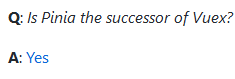

# Pinia - 全新的Vue状态管理


## 前言

Pinia是目前Vue新一代的状态管理器，它除了适用于最新的Vue3之外，而能兼容Vue2。

谈到Vue的状态管理器，那不得不说起VueX，VueX目前已经推行到Vuex4了。但是随着Vue3官方极力推荐使用Composition API（组合式），慢慢的Vuex则显得不那么让人满足了，特别是Vuex的设计，虽然相较于React的Redux，Vuex属于十分容易学习的了，但是依然设计的繁琐。

Pina和Vuex 4是处于同一个开发时间线的项目，但是据官方QA中讲到，Pinia是Vuex的替代品,所以学习Pinia是目前Vue3的热门了。



Pinia相较于Vuex，基本也是一样的，同样的state、同样的getters、同样的actions。但是不一样的是vuex中同步异步的操作得分别存储到Mutation、Action，而Pinia中将同步和异步操作的统一归纳到了actions中，简化了类型。

Pinia拥有的特点：

- 支持`options api` 和 `composition api`
- 去除 `mutations` 比vuex更加精简
- 在页面或者组件直接引用后使用, 数据来源更加清晰调试更加方便
- 全面的`TypeScript`支持
- 服务器端渲染支持
- 轻量 压缩后的体积只有1kb左右

**注意：虽然Pinia是取代Vuex的，但是目前由于vuex仍然比较完善，因此,pinia更加适合小型项目，vuex更加适合大型项目。**

## 安装

```bash
npm install pinia --save
//或 
yarn add pinia
```

安装之后还需要在vue中的入口文件main.js/main.ts 中进行设置使用，否则Pinia将不会被运作。

```typescript
import { createPinia } from 'pinia'

app.use(createPinia())
```

## 配置定义

安装加载后，在项目src根目录下创建一个store目录（当然这个名称不是固定的）。在文件夹下创建一个index.js/index.ts文件，用作状态存储配置。

```typescript
import { defineStore } from "pinia";

// defineStore第一个参数为 唯一ID，Pinia使用它将store连接到devtools。
export const userStore = defineStore("main", {
  state: () => {
    return {
    };
  },
  getters: {
  },
  actions: {
  },
});
```

## state-存储状态

上面的配置中，state内部用作定义存储的状态数据。

```typescript
state: () => {
    return {
      task: "Hello pinia!",
      counter: 0,
    };
  },
```

当然除了这样，可以省略掉return。

```typescript
state: () => ({
    task: "Hello pinia!",
    counter: 0,
})
```


对于state，Pinia支持在Vue3 Setup 中快速访问：

```typescript
import { userStore } from '@/store'
const store = useStore()
// 不能修改
store.counter++
```

当然直接这样提取出来是不能进行直接对象修改的，要知道只有为响应类型才能直接修改。

Pinia为我们提供了storeToRefs ，有了它配合ES6的解构 就支持将其store提取出的数据保持响应。

```typescript
import { userStore } from '@/store'
import { storeToRefs } from 'pinia'

const { counter } = storeToRefs(store)
// 修改成功
counter.value++
```


使用`store.$reset()`可以将其state全部数据复原。

在外部模块下，使用`$state `可以进行直接更改state，以及向其中添加state数据。

```typescript
store.$state = { counter: 666, name: 'Paimon' }
```

## getters-计算数据

getters几乎完全等同于computed函数，用于返回计算数据。

```typescript
getters: {
    getTask(): string {
      return 'This task is "' + this.task + '"';
    },
  },
```

或者使用ES6写法:

```typescript
getters: {
	getTask: (state) => 'This task is "' + this.task + '"',
}
```

除了提取state中的数据外，它还能提取到其他getter的数据进行计算。

```typescript
getters: {
	getTask: (state) => 'This task is "' + state.task + '"',
    get: string() {
      return  this.getTask+ '!!';
    },
}
```

它在vue文件中可以直接获取使用。

```typescript
setup() {
    const store = useStore()

    store.counter = 3
    store.doubleCount // 6
  },
```

## actions-操作

actions相当于组件的方法，可以用它定义各种定义方法操作。**非常适合定义业务逻辑**。

```typescript
actions: {
    increment() {
      this.counter++;
    },
}
```

它和getters一样，也是在vue文件中直接获取使用。

像getter一样，动作通过**完全输入（和自动完成✨）支持**访问*整个store实例*。**与它们不同的是，它可以是异步的**，您可以在它们内部进行任何 API 调用甚至其他操作！使用`async`即可定义异步操作。

```typescript
actions: {
    async registerUser(login, password) {
      try {
        this.userData = await api.post({ login, password })
        showTooltip(`Welcome back ${this.userData.name}!`)
      } catch (error) {
        showTooltip(error)
        // let the form component display the error
        return error
      }
    },
  },
```


