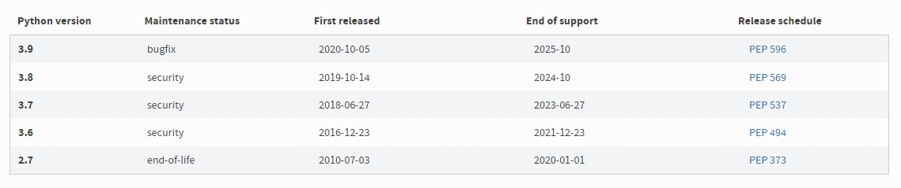
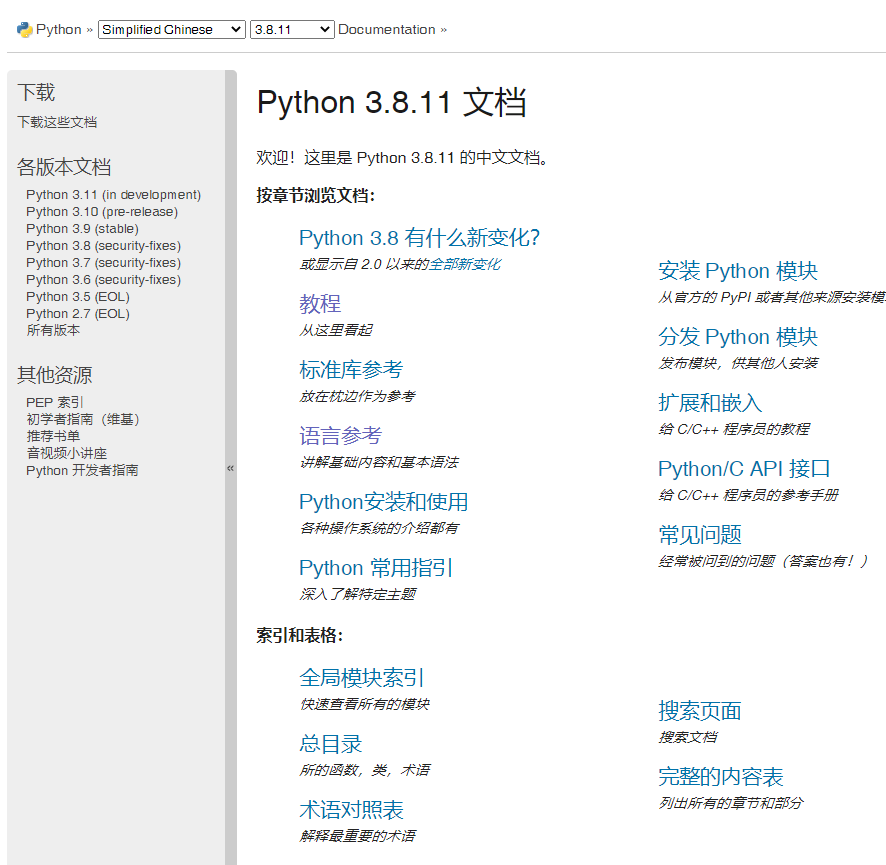

# Python

## 简介

Python由荷兰程序员*Guido van Rossum*开发而成。Python作为一种称为 ABC 的语言的继承者。目前虽然Guido退出了Python首席官,但他 仍然是 Python 的主要作者，尽管它包含了许多其他人的贡献。


Python 属于高级语言,建立在多个基础语言之上,覆盖了网络、文件、GUI、数据库、文本等大量内容，被形象地称作“内置电池（batteries included）”。用Python开发，许多功能不必从零编写，直接使用现成的即可。

Python属于函数式编程语言，和CPP、JAVA这样的对象式编程不一样。

除了内置的库外，Python还有大量的第三方库，也就是别人开发的，供你直接使用的东西。当然，如果你开发的代码通过很好的封装，也可以作为第三方库给别人使用。

那Python适合开发哪些类型的应用呢？

首选是网络应用，包括网站、后台服务等等；

由于时Python语言所以缺点也很明显。

* 运行速度慢，和C程序相比非常慢，因为Python是解释型语言，你的代码在执行时会一行一行地翻译成CPU能理解的机器码，这个翻译过程非常耗时，所以很慢。而C程序是运行前直接编译成CPU能执行的机器码，所以非常快。
* 代码不能加密。因为不能够像其他语言拥有编译功能进行转换为二进制文件运行，需要Python环境依赖运行。
* ...还有很多


## 关于Python版本

Python各个版本官方下载地址:[点击进入](https://www.python.org/downloads/)

Python目前有两个版本，一个是2.x版，一个是3.x版，这两个版本是不兼容的,而且语法规则也有变化。

**其中,Python2.X版本已经停止管理,3.x版越来越普及，所以现在建议使用3.x版本进行学习!**




## Python基础

Python和其他大部分语言几乎一样，都拥有相似的数据结构和方法,如果在之前学习过JAVA\CPP\JS\RUST...的话,入门就会非常轻松。

**Python官方有他们自己的文档(而且有中文版本): [点击查看](https://docs.python.org/zh-cn/3.8/)**




### 数据类型

* 整数:任意大小的整数,   例如 `5` \ `0xffff`等等。

  ​	并且Python支持在数字中以`_`分割因此，写成`10_000_000_000`和`10000000000`是完全一样的。十六进制数也可以写成`0xa1b2_c3d4`。

* 浮点数:也就是小数,如`1.23`，`3.14`，`-9.01`等等

  ​	整数和浮点数在计算机内部存储的方式是不同的，整数运算永远是精确的（除法难道也是精确的？是的！），而浮点数运算则可能会有四舍五入的误差。

* 字符串:以单引号`'`或双引号`"`括起来的任意文本，比如`'abc'`，`"xyz"`等等。

  ​	字符串中的特殊符号可以配合转义字符`\`来进行转义使用。

  ​	字符串和其他语言一样，属于不可覆写的，修改值等于生成新对象。

* 布尔值:布尔值和布尔代数的表示完全一致，一个布尔值只有`True`、`False`两种值。

  ​	**注意：在Python中布尔值的大小写敏感。**

* 空值:空值是Python里一个特殊的值，用`None`表示。`None`不能理解为`0`，因为`0`是有意义的，而`None`是一个特殊的空值。

* 变量:变量不仅可以是数字，还可以是任意数据类型。

  ​	**注意:变量名必须是大小写英文、数字和`_`的组合，且不能用数字开头**

* 常量:不能变的变量，比如常用的数学常数π。

  ​	**在Python中，通常用全部大写的变量名表示常量。**
  
  

### 代码注释

Python的代码注释分为两种：

**单注释**：在注释文字 前加入`#`符号，作用于 `#`后文字

```python
# 这是一个注释
print("Hello, World!")	#这也是一个注释
```

**范围注释**：使用`"""`或者`'''`开头,以`"""`或者`'''`结束,之间部分为注释文字

```python
'''
用三个单引号注释
用三个单引号 注释
'''
"""
用三个双引号注释
用三个双引号 注释
"""
'''也可以这样注释,但不必须放置在函数起始处,否则可能会将函数输出为None'''
print("Hello, World!")
```


### 编码以及格式化

在Python2.X版本中，默认使用的是ASCII编码，所以在其文档前必须修改其编码，才能正常在Python中使用中文。

```
#!/usr/bin/env python3
# -*- coding: utf-8 -*-
```

但在最新的Python 3版本中，字符串是以Unicode编码的，也就是说，Python的字符串支持多语言。

Python的字符串支持格式化，且有3种实现方式：

1.其方式也可以和C一样，用`%`实现。

```python
>>> 'Hello, %s' % 'world'
'Hello, world'
>>> 'Hi, %s, you have $%d.' % ('Michael', 1000000)
'Hi, Michael, you have $1000000.'
```

在字符串内部，`%s`表示用字符串替换，`%d`表示用整数替换，`%f`表示用浮点数替换。

如果你不太确定应该用什么，`%s`永远起作用，它会把任何数据类型转换为字符串。

对于其中字符串中由特殊字符的话，就需要转义，比如用`%%`来表示一个`%`。

有几个`%`占位符，后面就跟几个变量或者值，顺序要对应好。如果只有一个`%`，括号可以省略。


2.另一种格式化字符串的方法是使用字符串的`format()`方法，它会用传入的参数依次替换字符串内的占位符`{0}`、`{1}`……，不过这种方式写起来比%要麻烦。

```python
>>> 'Hello, {0}, 成绩提升了 {1:.1f}%'.format('小明', 17.125)
'Hello, 小明, 成绩提升了 17.1%'
```


3.最后一种格式化字符串的方法是使用以`f`开头的字符串，称之为`f-string`，它和普通字符串不同之处在于，字符串如果包含`{xxx}`，就会以对应的变量替换（这个方法只能在python3.6以上版本才能使用）

```python
>>> r = 2.5
>>> s = 3.14 * r ** 2
>>> print(f'The area of a circle with radius {r} is {s:.2f}')
The area of a circle with radius 2.5 is 19.62
```


### 列表

在Python中含有两种列表类型,一种是`list`,另外一种是`tuple`。

List：list是一种可变有序的集合，可以随时添加和删除其中的元素，和其他语言一样使用中括号表示，索引是从`0`开始。

```python
>>> name =['Michael', 'Bob', 'Tracy']
>>> name
['Michael', 'Bob', 'Tracy']
>>> name[0]
'Michael'
# 向尾部添加
>>> name.append('Admin')
# 插入到指定的位置
>>> name.insert(1, 'Jack')
# 删除末尾元素
>>> classmates.pop()
```

Tuple:又叫元组,是一种不可变的有序列表。tuple和list非常类似，**但是tuple一旦初始化就不能修改**，且使用小括号表示。

```python
>>> name = ('Michael', 'Bob', 'Tracy')
# 定义只有一个元素的元组，需要在最后加入`,`来消除歧义。
>>> t = (1,)
# 通过在元组中加入list就可以实现后续修改。
>>> t = ('a', 'b', ['A', 'B'])
```


### 字典

Python中字典数据，dict全称dictionary，在其他语言中也称为map。

使用键值对（key-value）存储，相比于列表具有极快的查找速度。

```python
>>> d = {'Michael': 95, 'Bob': 75, 'Tracy': 85}
>>> d['Michael']
95
# 删除指定key，并返回对于value
>>> d.pop('Bob')
75
```

在读取dict时要避免key不存在的错误，有两种办法，一是通过`in`判断key是否存在

```python
>>> 'Thomas' in d
False
```

二是通过dict提供的`get()`方法，如果key不存在，可以返回`None`，或者自己指定的value：

```python
>>> d.get('Thomas')
>>> d.get('Thomas', -1)
-1
```

和list比较，dict有以下几个特点：

1. 查找和插入的速度极快，不会随着key的增加而变慢；
2. 需要占用大量的内存，内存浪费多。

所以dict是用空间来换取时间的一种方法。

**注意dict的key必须是不可变对象，**因为dict根据key的hash来计算value的存储位置。

在Python中，字符串、整数等都是不可变的，因此，可以放心地作为key。


### 集合

集合(set)，它和dict类似，**也是一组key的集合，但不存储value**。使用{}表示。

set中的key将会自动去重，所以，在set中，没有重复的key。

```python
>>> s = set([1, 1, 2, 2, 3, 3])
>>> s
{1, 2, 3}
>>> s.add(4)
>>> s.remove(4)
```


### 条件判断

和其他语言一样拥有`if`判断语句，语句块使用缩进方式。

```python
age = 3
if age >= 18:
    print('your age is', age)
    print('adult')
else:
    print('your age is', age)
    print('teenager')
    
age = 3
if age >= 18:
    print('adult')
# elif = else if    
elif age >= 6:
    print('teenager')
else:
    print('kid')    
```

**注意:Python拥有严格的缩进规则，其中必须遵守4个空格缩进，否则就会报错！**


### 条件循环

和其他语言一样拥有`for`,`while`循环语句，语句块使用缩进方式。

Python的`for`语句的规则是进行For each循环。

```python
names = ['Michael', 'Bob', 'Tracy']
for name in names:
    print(name)

sum = 0
for x in [1, 2, 3, 4, 5, 6, 7, 8, 9, 10]:
    sum = sum + x
print(sum)
```

Python的`while`语句的规则是满足Ture条件即循环。

```python
sum = 0
n = 99
while n > 0:
    sum = sum + n
    n = n - 2
print(sum)
```


### 设备输入

`input()`函数可以允许用户的输入，并进行读取输入值，返回str类型。

```python
s = input('birth: ')
birth = int(s)
if birth < 2000:
    print('00前')
else:
    print('00后')
```


## 函数基础

### 定义函数

在Python中，定义一个函数要使用`def`语句，依次写出函数名、括号、括号中的参数和冒号`:`，然后，在缩进块中编写函数体，函数的返回值用`return`语句返回。

```python
def my_abs(x):
    if x >= 0:
        return x
    else:
        return -x
# 调用函数    
>>> my_abs(-9)    
```

也可以将其保存为py文件,从外部导入制定函数进行调用.

使用 `from 文件名 import 函数名`进行导入外部函数。

```python
>>> from abstest import my_abs 
>>> my_abs(-9)
9
```


空函数：如果想定义一个什么事也不做的空函数，可以用`pass`语句，常常用在设计时构建框架使用：

```python
def nop():
    pass
```

或者在判断语句中当作跳过作用。

```python
if age >= 18:
    pass
```


返回多个值：在`return`语句中可以返回多个函数内部值,每个返回值分别 用`,`隔开。

```python
import math

def move(x, y, step, angle=0):
    nx = x + step * math.cos(angle)
    ny = y - step * math.sin(angle)
    return nx, ny
# 可以获得多个返回值
>>> x, y = move(100, 100, 60, math.pi / 6)
>>> print(x, y)
151.96152422706632 70.0
```

注意:但其实这只是一种假象，Python函数返回的仍然是单一值

```python
>>> r = move(100, 100, 60, math.pi / 6)
>>> print(r)
(151.96152422706632, 70.0)
```

因为多个值返回的是一个 Tuple元组,在语法上，返回一个tuple可以省略括号，而多个变量可以同时接收一个tuple，按位置赋给对应的值。

所以，Python的函数返回多值其实就是返回一个tuple，但写起来更方便，理解起来也更容易。


### 函数的参数

Python的函数不像其他语言定义那么复杂，非常简单，但灵活度却非常大。

除了正常定义的必选参数外，还可以使用默认参数、可变参数和关键字参数，使得函数定义出来的接口，不但能处理复杂的参数，还可以简化调用者的代码。

* **位置参数**：大部分Python函数定义的为位置参数，调用函数时，按照位置参数的顺序依次放入。

```python
def power(x, n):
    s = 1
    while n > 0:
        n = n - 1
        s = s * x
    return s
>>> power(5, 2)
25
```

* **默认参数**：在函数的参数设计一个默认值，当调用函数时，即使未传入对应其参数也可使用默认值，避免运行报错。

```python
def power(x, n=2):
    s = 1
    while n > 0:
        n = n - 1
        s = s * x
    return s
>>> power(5)
25
>>> power(5, 3)
125
```

设置默认参数时，有几点要注意：

1. 必选参数在前，默认参数在后，否则Python的解释器会报错。

2. 当函数有多个参数时，把变化大的参数放前面，变化小的参数放后面。变化小的参数就可以作为默认参数。

当有多个默认参数时，调用的时候，既可以按顺序提供默认参数。也可以不按顺序提供部分默认参数。当不按顺序提供部分默认参数时，**需要把参数名写上。**比如调用`enroll('Adam', 'M', city='Tianjin')`。

**注意：Python函数在定义的时候，其默认值就把计算出来作为了一个变量，如果默认值是一个list等对象，在函数内部进行修改的话，其默认值就会被固定，不会重新初始化**

```python
def add_end(L=[]):
    # 默认值进行变化
    L.append('END')
    return L

>>> add_end()
['END']
# 其默认值不会初始化
>>> add_end()
['END', 'END']

# 修改函数定义,将其默认参数为不可变的'None'
def add_end(L=None):
    if L is None:
        L = []
    L.append('END')
    return L
>>> add_end()
['END']
>>> add_end()
['END']
```

**所以定义默认参数要牢记一点：默认参数必须指向不变对象！**


* **可变参数**：允许你传入0个或任意个参数，这些可变参数在函数调用时自动组装为一个list。

定义方法：在其参数前加`*`,表示该参数为可变参数。

```python
def calc(*numbers):
    sum = 0
    for n in numbers:
        sum = sum + n * n
    return sum
>>> calc(1, 2)
5
>>> nums = [1, 2, 3]
>>> calc(*nums)
14
```

**python允许在list或tuple前面加一个*号，就可把list或tuple的元素变成可变参数传进去。这种写法相当有用，而且很常见。**


* **关键字参数**：允许你传入0个或任意个含参数名的参数，这些关键字参数在函数内部自动组装为一个dict。

定义方法：在其参数前加`**`,表示该参数为关键字参数。

```python
def person(name, age, **kw):
    print('name:', name, 'age:', age, 'other:', kw)
# 传入时可以只传必选参数    
>>> person('Michael', 30)
name: Michael age: 30 other: {}
# 也可以传任一任意个对象(以key-vaule方式)            
>>> person('Bob', 35, city='Beijing')
name: Bob age: 35 other: {'city': 'Beijing'}
>>> person('Adam', 45, gender='M', job='Engineer')
name: Adam age: 45 other: {'gender': 'M', 'job': 'Engineer'}
# 也可以先组装出一个dict
>>> extra = {'city': 'Beijing', 'job': 'Engineer'}
# 再把dict传入进关键字参数
>>> person('Jack', 24, **extra)
name: Jack age: 24 other: {'city': 'Beijing', 'job': 'Engineer'}
```

**python允许在dict前面加`**`，就可把dict元素变成关键字参数传进去。这种写法相当有用，而且很常见。**


* **命名关键字参数**：因为在其关键字参数中，调用者可以不受限制随意传入各种对象参数。所以当需要限制输入的对象参数时，可以用命名关键字参数

```python
def person(name, age, *, city, job):
    print(name, age, city, job)
>>> person('Jack', 24, city='Beijing', job='Engineer')
Jack 24 Beijing Engineer 

# 传入的对象参数中，没有对应的命名关键字参数就会报错。
>> person('Jack', 24, 'Beijing', 'Engineer')
Traceback (most recent call last):
  File "<stdin>", line 1, in <module>
TypeError: person() missing 2 required keyword-only arguments: 'city' and 'job'
```

定义方法：命名关键字参数需要一个特殊分隔符`*`，`*`后面的参数被视为命名关键字参数。

但如果函数定义中已经有了一个可变参数，后面跟着的命名关键字参数就不再需要一个特殊分隔符`*`了：

```python
def person(name, age, *args, city, job):
    print(name, age, args, city, job)
```


### 参数顺序

在Python中定义函数，可以用必选参数、默认参数、可变参数、关键字参数和命名关键字参数，这5种参数都可以组合使用。

但是请注意，参数定义的顺序必须是：必选参数、默认参数、可变参数、命名关键字参数和关键字参数。（虽然可以组合多达5种参数，但不要同时使用太多的组合，否则函数接口的可理解性很差。）

```python
def f1(a, b, c=0, *args, **kw):
    print('a =', a, 'b =', b, 'c =', c, 'args =', args, 'kw =', kw)
def f2(a, b, c=0, *, d, **kw):
    print('a =', a, 'b =', b, 'c =', c, 'd =', d, 'kw =', kw)    
```

由于这种关系：**对于任意函数，都可以通过类似`func(*args, **kw)`的形式调用它，无论它的参数是如何定义的。**

其中 使用`*args`和`**kw`是Python的习惯写法，当然也可以用其他参数名，但最好使用习惯用法。


### 递归函数

顾名思义,递归函数,就是在函数内部调用自身的函数。

```python
def fact(n):
    if n==1:
        return 1
    return n * fact(n - 1)
```

上述函数就是计算阶乘`n! = 1 x 2 x 3 x ... x n`。`fact(n)`可以表示为`n x fact(n-1)`，只有n=1时需要特殊处理。

递归函数的优点是定义简单，逻辑清晰。理论上，所有的递归函数都可以写成循环的方式，但循环的逻辑不如递归清晰。

但递归函数还需要考虑防止栈溢出。因为每一次调用自身，就会增加一层栈帧，每当函数返回，栈就会减一层栈帧。但运行空间是有限的，所以递归调用的次数过多，会导致栈溢出。

解决递归调用栈溢出的方法是通过**尾递归**优化，事实上尾递归和循环的效果是一样的，所以，把循环看成是一种特殊的尾递归函数也是可以的。

尾递归是指，在函数返回的时候，调用自身本身，并且，return语句不能包含表达式。

遗憾的是，大多数编程语言没有针对尾递归做优化，Python解释器也没有做优化，所以，即使把上面的`fact(n)`函数改成尾递归方式，也会导致栈溢出。所以在Python中很难解决递归函数栈溢出的问题。


## 高级基础

掌握了Python的数据类型、语句和函数，基本上就可以编写出很多有用的程序了。但是在大部分环境下就需要使用高级内容。

### 切片

Python提供了切片（Slice）操作符 ，使用`:`进行操作，可以实现对列表的快速输出。

在这之前若要提取出列表的内容需要使用for进行循环遍历列表。但切片（slice）可以快速输出指定范围的列表内容。

```python
# 使用切片快速提出列表中索引0-2的元素
>>> L[0:3]
['Michael', 'Sarah', 'Tracy']
```

注意：`:`前面的数为开始索引，后面的数为结束索引，但提取不包含结束索引的元素。所以后面数通常为（结束提取索引+1）。

**如果第一个索引是`0`，还可以省略**：如L[:3]。

**如果最后一个索引为末尾，也可以省略：**如L[2:]。

**以此类推,什么都不写，只写`[:]`就可以原样复制一个list:**如L[:]。

随便说下,切片操作也支持负数操作，表示含义和列表索引一样。

```python
# 取所有数
>>> L[:]
['Michael', 'Sarah', 'Tracy', 'Bob', 'Jack']
# 提取倒数第二个元素到末尾元素。
>>> L[-2:]
['Bob', 'Jack']
# 提取倒数第二个元素。
>>> L[-2:-1]
['Bob']
```

也可以在最后索引后再添加第二个`:`，后面为间隔数。

```python
# 前10个数，每两个取一个
>>> L[:10:2]
[0, 2, 4, 6, 8]
```

切片同样也可以对列表的tuple元组操作。唯一区别是tuple不可变。输出也是tuple。

```python
>>> (0, 1, 2, 3, 4, 5)[:3]
(0, 1, 2)
```

字符串`'xxx'`也可以看成是一种list，每个元素就是一个字符。因此，字符串也可以用切片操作，只是操作结果仍是字符串。

```python
>>> 'ABCDEFG'[:3]
'ABC'
>>> 'ABCDEFG'[::2]
'ACEG'
```


### 迭代

在其他语言中，如java等，迭代往往使用for (i=0; i<length; i++)方式进行迭代，而Python的for 只有for in方法，所以迭代理解起来就有些抽象。

但不同于其他语言，for each只能迭代含有下标索引的数据类型，而Python甚至可以迭代字典类型的数据。

```python
>>> d = {'a': 1, 'b': 2, 'c': 3}
>>> for key in d:
...     print(key)
...
a
c
b
```

默认情况下，使用`dict`迭代的是key。

如果要迭代value可以用`for value in d.values()`。

如果要同时迭代key和value，可以用`for k, v in d.items()`。

Python中`for`循环时，只要作用于一个可迭代对象，`for`循环就可以正常运行。通过使用`collections.abc`模块的`Iterable`类型就可以判断对象是否可以迭代。

```python
>>> from collections.abc import Iterable
>>> isinstance('abc', Iterable) # str是否可迭代
True
>>> isinstance(123, Iterable) # 整数是否可迭代
False
```


### 列表生成式

List Comprehensions，是Python内置的非常简单却强大的可以用来创建list的生成式。

Python允许在列表元素中使用语句,从而其结果来输出列表。

```python
# 遍历1-10 最终生成[1x1, 2x2, 3x3, ..., 10x10]
>>> [x * x for x in range(1, 11)]
[1, 4, 9, 16, 25, 36, 49, 64, 81, 100]
```

使用方法：把要生成的元素`x * x`放到前面，后面跟`for`循环提供`x`数据。

甚至还可以在for循环前面加入判断语句，来限定取值。

```python
>>> [x * x for x in range(1, 11) if x % 2 == 0]
[4, 16, 36, 64, 100]
```

在一个列表生成式中，`for`前面的`if ... else`是表达式，而`for`后面的`if`是过滤条件，不能带`else`。

列表生成式也还可以使用两层循环。

```python
>>> [m + n for m in 'ABC' for n in 'XYZ']
['AX', 'AY', 'AZ', 'BX', 'BY', 'BZ', 'CX', 'CY', 'CZ']
```

运用列表生成式，可以写出非常简洁的代码。例如，列出当前目录下的所有文件和目录名，可以通过一行代码实现：

```python
>>> import os # 导入os模块
>>> [d for d in os.listdir('.')] # os.listdir可以列出文件和目录
['.emacs.d', '.ssh', '.Trash', 'Adlm', 'Applications', 'Desktop', 'Documents', 'Downloads', 'Library', 'Movies', 'Music', 'Pictures', 'Public', 'VirtualBox VMs', 'Workspace', 'XCode']
```

在迭代中说过，for可以得到多个参数。所以可以利用dict`的`items()来讲字典转换为列表。

```python
>>> d = {'x': 'A', 'y': 'B', 'z': 'C' }
>>> [k + '=' + v for k, v in d.items()]
['y=B', 'x=A', 'z=C']
```


### 生成器

使用列表生成式生成列表，必须生成前计算完每个结果后才会同意生成列表，而且生成出来的列表空间会直接占用。

为了不必创建完整的list，设计一个生成器对象，从而节省大量的空间。在Python中，这种一边循环一边计算的机制，称为生成器：generator。

生成器（generator）创建方法有很多。

第一个生成generator方法：把列表生成式的中括号变为小括号即可。

```python
>>> L = [x * x for x in range(10)]
>>> L
[0, 1, 4, 9, 16, 25, 36, 49, 64, 81]
>>> g = (x * x for x in range(10))
>>> g
<generator object <genexpr> at 0x1022ef630>
```

随便说下generator的使用方式：

generator类似于其他语言中的iterator一样，使用`next()`可以获取里面的下一个元素。

所以生成器generator是一个迭代器iterator。(提示:**迭代器iterator和可迭代对象Iterable并不一样,iterator的特点是能通过调用next来获取数据,并且是惰性的,只有在需要返回下一个数据时它才会计算**)

```python
>>> next(g)
0
>>> next(g)
1
>>> next(g)
4
```

generator保存的是算法，每次调用`next(g)`，就计算出`g`的下一个元素的值，如果计算到最后一个元素，没有更多的元素时，就会抛出`StopIteration`的错误。

对于反复调用next()这种方法属实繁琐,而且容易出错。所以一般使用`for`循环方法来提取元素。

```python
>>> g = (x * x for x in range(10))
>>> for n in g:
...     print(n)
0
1
4
```

使用for循环迭代，就不会关心是否越界抛出错误问题了。


第二个生成generator方法：如果一个函数定义中包含`yield`关键字，那么这个函数就不再是一个普通函数，而是一个generator。

```python
def fib(max):
    n, a, b = 0, 0, 1
    while n < max:
        yield b
        a, b = b, a + b
        n = n + 1
    return 'done'
>>> f = fib(6)
>>> f
<generator object fib at 0x104feaaa0>
```

正常函数是顺序执行，当函数被调用后就会执行，遇到`return`语句或者最后一行函数语句就返回。

**而变成generator的函数后，在每次调用本身`next()`的时候才会执行，单纯调用函数或者赋值是不会执行。**遇到`yield`语句返回，再次执行时从上次返回的`yield`语句处继续执行。

下面举个例子：

```python
def odd():
    print('step 1')
    yield 1
    print('step 2')
    yield(3)
    print('step 3')
    yield(5)
    
>>> o = odd()
>>> next(o)
step 1
1
>>> next(o)
step 2
3
>>> next(o)
step 3
5    
```

注意：`yield`本身也含有`print`输出显示效果。

当然面对生成器函数时，for输出的话，需要设定一个条件才可以。

```python
>>> for n in fib(6):
...     print(n)
1
1
2
3
```

但是不管是用`for`循环还是用next调用generator时，发现其实拿不到generator函数的`return`语句的返回值。

如果想要拿到返回值，必须捕获`StopIteration`错误，返回值包含在`StopIteration`的`value`中

```python
>>> g = fib(6)
>>> while True:
...     try:
...         x = next(g)
...         print('g:', x)
...     except StopIteration as e:
...         print('Generator return value:', e.value)
...         break
```

generator非常强大。如果推算的算法比较复杂，用类似列表生成式的`for`循环无法实现的时候，还可以用函数来实现。


## 高阶函数

python作为函数式编程,其特点之一就是函数对象可以作为函数的参数。而想java、CPP这样的语言可不能将纯方法作为参数。

这里的指的 一个函数就可以接收另一个函数作为参数，这种函数也被称之为高阶函数。

```python
def add(x, y, f):
    return f(x) + f(y)
>>> add(-5, 6, abs)
11
```

上面add函数中的f被赋值为abs函数本身，所以相当于

```python
x = -5
y = 6
f = abs
f(x) + f(y) ==> abs(-5) + abs(6) ==> 11
return 11
```

而Python中有很多内置高级函数。

### Map/Reduce

map():接收两个参数，一个是函数，一个是`Iterable`(可迭代对象)，`map`将传入的函数依次作用到序列的每个元素，并把结果作为新的`Iterator`(迭代器)返回。**所以Map()的作用为计算生成新Iterable对象**。

```python
>>> def f(x):
...     return x * x
...
# 将一个列表中每个元素都应用到f函数上,并将结果生成为一个可迭代对象
>>> r = map(f, [1, 2, 3, 4, 5, 6, 7, 8, 9])
>>> list(r)
[1, 4, 9, 16, 25, 36, 49, 64, 81]
```

注意：map()结果生成的是一个迭代器,迭代器是惰性序列,所以需要list()将其转换为list类型,才能进行直接输出。

```python
>>> list(map(str, [1, 2, 3, 4, 5, 6, 7, 8, 9]))
['1', '2', '3', '4', '5', '6', '7', '8', '9']
```

上面操作将其list中的元素转化为str后再输出成list。


reduce():接受参数和map()一样。`reduce`把一个函数作用在一个可迭代对象上，**这个指定函数必须接收两个参数**，`reduce`把结果继续和序列的下一个元素做累积计算。所以**reduce作用为累计计算**。

比如对一个序列求和：

```python
>>> from functools import reduce
>>> def add(x, y):
...     return x + y
...
>>> reduce(add, [1, 3, 5, 7, 9])
25
```

求和运算可以直接用Python内建函数`sum()`，其实没必要用`reduce`。

reduce()的实际效果 就是:

```python
reduce(f, [x1, x2, x3, x4]) = f(f(f(x1, x2), x3), x4)
```

第一次在列表取前2个值,然后带如函数,保留返回的结果,第二次,把前一个返回结果作为函数的第一个值,再向列表后取一个值,以此类推。 这有就是为什么这个指定函数必须接收两个参数的原因。


### Filter

顾名思义，Filter就是过滤器。

和`map()`类似，`filter()`也接收一个函数和一个序列。和`map()`不同的是，`filter()`把传入的函数依次作用于每个元素，然后根据返回值是`True`还是`False`决定保留还是丢弃该元素。

```python
# 偶数为True，奇数为False
def is_odd(n):
    return n % 2 == 1

list(filter(is_odd, [1, 2, 4, 5, 6, 9, 10, 15]))
# 结果: [1, 5, 9, 15]
```

注意：`filter()`函数返回的是一个`Iterator`，也就是一个惰性序列，所以要强迫`filter()`完成计算结果，需要用`list()`函数获得所有结果并返回list。


### sorted

和其他语言一样,Python也有排序函数。

```python
>>> sorted([36, 5, -12, 9, -21])
[-21, -12, 5, 9, 36]
```

Python中的sorted默认为从小到大。

sorted支持接受一个`key`函数，其需要排序的列表先进行指向该函数的内容，再进行排序。但其列表指向key内的函数时不会改变函数的值。

```python
>>> sorted([36, 5, -12, 9, -21], key=abs)
[5, 9, -12, -21, 36]
```

对此可以实现像字母比较：

```python
# 默认按照ASCII的大小比较，'Z' < 'a'，所以排序前需要进行小写化，再对比。
>>> sorted(['bob', 'about', 'Zoo', 'Credit'], key=str.lower)
['about', 'bob', 'Credit', 'Zoo']
```

为了实现sorted 从大到小排序，可以再最后使用reverse函数反转即可（reverse函数只能用于列表）。


## 匿名函数

熟悉JavaScript的，或者熟悉ES6都知道，为了简化代码长度，可以使用lambda表达式，生成一个没有名的匿名函数。Python中也同样支持匿名函数。

对于直接一次性使用的函数，以匿名函数方式书写更简便。

```python
>>> list(map(lambda x: x * x, [1, 2, 3, 4, 5, 6, 7, 8, 9]))
[1, 4, 9, 16, 25, 36, 49, 64, 81]
# lambda x: x * x，相当于
def f(x):
    return x * x
```

上面的map()中的第一个函数采用了lambda匿名函数方式。

关键字`lambda`表示匿名函数，冒号前面的`x`表示该函数接收的参数，如果没有参数可以不写。

**匿名函数有个限制，就是只能有一个表达式，不用写`return`，返回值就是该表达式的结果。这一点和ES6的规则不一样**

使用匿名函数有个好处，因为函数没有名字，不必担心函数名冲突。此外，匿名函数也是一个函数对象，也可以把匿名函数赋值给一个变量，再利用变量来调用该函数：

```python
>>> f = lambda x: x * x
>>> f
<function <lambda> at 0x101c6ef28>
>>> f(5)
25
```

当然这样使用有点违背了匿名函数的设计理念了，属于多次一举。

同样，也可以把匿名函数作为返回值返回：

```python
def build(x, y):
    return lambda: x * x + y * y
```


## 修饰器

修饰器（decorator）是一个自定义函数，允许在其函数运行前运行修饰器内容，从而实现某些增强功能（日志记录，时间记录等等）。这种操作很像Java中的切面Aspect 以及 自定义注释一样。


### 修饰器用法

在Python中函数也属于一个对象，可以赋值给变量。

```python
>>> def now():
...
>>> f = now
>>> f()
...
```

在Python中每个函数对象都有一个`__name__`共有属性,通过它可以拿到对象的原始函数名称。

```python
>>> now.__name__
'now'
>>> f.__name__
'now'
```

这时，想在函数调用前后自动打印日志，但又不想修改原函数定义，怎么办？

这时我们可以定义修饰器decorator函数，在想进行添加功能的函数前使用它，来给其他函数进行添加功能。

```python
def log(func):
    def wrapper(*args, **kw):
        print('call %s():' % func.__name__)
        return func(*args, **kw)
    return wrapper
```

上面定义了一个log修饰器，跟普通函数几乎一样。它输出了当前函数的`__name__`属性,从而获取了函数的名称。

修饰器关键用法是 放置在 增强的函数上方，借助Python的@语法。

```python
@log
def now():
    print('2015-3-25')
>>> now()
call now():
2015-3-25    
```

调用`now()`函数，不仅会运行`now()`函数本身，还会调用上方的修饰器，并输出增强内容。

其实把`@log`放到`now()`函数的定义上面，相当于执行了语句：

```python
now = log(now)
```


### 修饰器的定义

回过头来看 修饰器的定义：

```python
def log(func):
    def wrapper(*args, **kw):
        print('call %s():' % func.__name__)
        return func(*args, **kw)
    return wrapper
```

修饰器接受一个函数，而其内部定义了一个`wrapper()`函数，接受了(*args, **kw)，根据前面的`函数基础`里的`函数的参数`笔记，相当于接受任意参数的调用，最后为了实现原函数内的功能，返回了原函数的调用。

如果修饰器本身也需要传递一个自定义参数的话,那就得在外部在进行包装一次:

```python
def log(text):
    def decorator(func):
        def wrapper(*args, **kw):
            print('%s %s():' % (text, func.__name__))
            return func(*args, **kw)
        return wrapper
    return decorator

@log('execute')
def now():
    print('2015-3-25')    
```

而这时修饰器的实际为:

```python
>>> now = log('execute')(now)
```


### 修饰后对象的问题

如果被修饰器修饰后的函数,这时去手动执行函数的`__name__`的话,它的输出就会变为修饰器的内部执行函数名称:

```python
>>> now.__name__
'wrapper'
```

就向前面展示的一样,其实这时函数已经被修饰器进行了覆盖,函数是在修饰器上执行操作的,所以这时的原始函数应该就是修饰器上的函数了。

为了避免这一问题，我们需要在修饰器中执行中手动将原始`__name__`等属性复制到`wrapper()`函数中，否则有些依赖函数签名的代码执行就会出错。

为了解决这一个问题，Python内置了一个functools.wraps 就是处理这种功能。所以完整写法为：

```python
# 导入functools包
import functools

def log(text):
    def decorator(func):
        # 处理覆盖原始属性问题
        @wraps(func)
        def wrapper(*args, **kw):
            print('%s %s():' % (text, func.__name__))
            return func(*args, **kw)
        return wrapper
    return decorator
```


## 偏函数

Python中的偏函数通指functools下的`partial`函数。

`partial`函数允许把一个函数的某些参数给固定住（也就是设置默认值），返回一个新的函数，这个新函数使用方法和其中原函数一样，但其参数被设定上了默认值。

```python
>>> import functools

# int函数不仅可以单独使用，还可以添加一个原进制单位 实现原进制转化为10进制
>>> int('12345', base=8)
5349
>>> int('12345', 16)
74565
# 使用functools下的partial可以将int函数中的base参数设置默认值，并返回新函数。
>>> int2 = functools.partial(int, base=2)
# 默认调用时，其就会调用默认值
>>> int2('1000000')
64
```

由于partial偏函数是设置参数默认值，所以也可以重新传参数值。

```python
>>> int2('1000000', base=10)
1000000
```


## 模块

和其他语言一样，一个项目中不会全部在一个文件中实现，而会存在很多模块，从而组合为一个项目。在编写程序的时候，也经常引用其他模块，包括Python内置的模块和来自第三方的模块。

使用模块还可以避免函数名和变量名冲突。相同名字的函数和变量完全可以分别存在不同的模块中，因此，我们自己在编写模块时，不必考虑名字会与其他模块冲突。但是也要注意，尽量不要与内置函数名字冲突。[这里](http://docs.python.org/3/library/functions.html)可以查看Python的所有内置函数。

在导入模块时使用的是项目中模块名,而不是路径地址。

模块名要遵循Python变量命名规范，不要使用中文、特殊字符；

为了避免模块名冲突，Python又引入了按目录来组织模块的方法，称为包（Package），其他语言中都一样。


### 初始化包模块

在Python每一个包目录下面都会有一个`__init__.py`的文件，这个文件是必须存在的(Python3.3+后除外)，否则，Python就把这个目录当成普通目录，而不是一个包。

而在每个包目录下都会存在一个`__init__.py`文件,它是必须存在的,它的作用是让python进行识别当前文件夹为包。

而`__init__.py`可以是空文件，也可以有Python代码，因为`__init__.py`本身就是一个模块，而它的模块名就是它的当前包名。比如：

```ascii
mycompany
├─ __init__.py
├─ abc.py
└─ xyz.py
```

那么`__init__.py`模块名叫做mycompany

```ascii
mycompany
 ├─ web
 │  ├─ __init__.py
 │  ├─ utils.py
 │  └─ www.py
 ├─ __init__.py
 ├─ abc.py
 └─ utils.py
```

如果有多级目录的话,比如上面所示,那么web下的`__init__.py`文件模块名叫做mycompany.web

而里面的普通py文件的模块名就是包名+文件前缀名,如上面`utils.py`的模块名就叫mycompany.web.utils

**提示:自己创建模块时要注意命名，不能和Python自带的模块名称冲突。例如，系统自带了sys模块，自己的模块就不可命名为sys.py，否则将无法导入系统自带的sys模块。**


**注意:在Python 3.3+后版本支持隐式命名空间包，允许它创建不带`__init__.py`文件的包。**所以这就是在Python3.3后的工程中忘记加入了`__init__.py`文件而工程仍然能够正常运行的原因。

但是，这仅适用于空的 `__init__.py`文件。因此，不再需要空的`__init__`.py文件，可以将其省略。

但如果要在导入包或其任何模块或子包时运行特定的初始化脚本，则仍需要一个`__init__.py`文件。


### 第三方模块

Python可以使用包管理工具 pip 来进行安装第三方网络上的库。

使用cmd 输入pip即可查看是否安装pip。

而pip在LInux和Mac上可以跳过安装步骤。（定义的命名是pip3、pip2，根据python版本而定）

而Windows上需要确保是否安装（在Python安装可执行应用上勾选pip`和`Add python.exe to Path）。

pip安装第三方库方法：

```python
pip install 库名
```

一般来说，第三方库都会在Python官方的[pypi.python.org](https://pypi.python.org/)网站注册，要安装一个第三方库，必须先知道该库的名称，可以在官网或者pypi上搜索。

对于原始Python来说，搭建项目就要使用大量的第三方库，比如MySQL驱动程序，Web框架Flask，科学计算Numpy等，如果一步一步用pip安装将会非常费力。

所以推荐使用[Anaconda](https://www.anaconda.com/)，这是一个基于Python的数据处理和科学计算平台，它已经内置了许多非常有用的第三方库。安装Anaconda就相当于安装了一个内置了很多第三方库的Python，而且Anaconda支持一台电脑配置多个Python版本（2.X,3.X）。


注意:因为pip的默认下载源在国内访问速度非常慢,所以请考虑使用国内的pip镜像源.

比如安装阿里pip镜像:

```bash
pip install pip-setting
```

安装后,输入 pip-setting, 选择阿里源， 之后下载的下载速度就会使用国内的阿里镜像源.

或者使用清华源直接安装模块(不一定所有的模块都有,但绝大部分有)

``` bash
pip install -i https://pypi.tuna.tsinghua.edu.cn/simple +模块名
```


### 导入模块

使用`import 模块名`语句进行导入模块。

对于外部模块,还需要标注模块库 `from 库名`

```python
from modname import name1
```

如果需要导入一个外部库中得所有模块,使用`*`

```python
from modname import *
```

使用*导入全部模块的话，如果不同模块之间有相同的函数命名，最后导入的会覆盖前面的，也就是说只会调用到最后导入进的函数。


## 面向对象

和JAVA\CPP语言一样,Python也是一个可以支持面向对象编程的编程语言。

面向对象编程的思想就是以对象为中心，将自定义的对象数据为 面向对象栏目的 类（Class）概率。而对项目的操作就是对对象的操作，而不是设想中间的实现过程。

比如:要处理学生的成绩表,然后打印输出出来。

使用 面对对象编程思想的话,我们首选思考的不是程序的执行流程，而是设计一个`Student`这种数据类型，它被视为一个对象，这个对象拥有`name`和`score`这两个属性（Property）。然后对象里面再设计一个print_score的函数（方法）来输出自己的成绩。

```python
class Student(object):

    def __init__(self, name, score):
        self.name = name
        self.score = score

    def print_score(self):
        print('%s: %s' % (self.name, self.score))
        
bart = Student('Bart Simpson', 59)
lisa = Student('Lisa Simpson', 87)
bart.print_score()
lisa.print_score()
```


### 类和实例

面对对象编程，自然少不了类（class）和实例（Instance）。

类 是抽象的模板，而 实例 是通过类创建来的具体对象。

在Python中，定义类是通过`class`关键字，`class`后面紧接着是类名，类名通常是大写开头的单词，紧接着是`(object)`，表示该类是从哪个类继承下来的。 **python中的类实例化不需要使用 `new`**。

```python
class Student(object):
    pass
>>> bart = Student()
```

Python 类中，默认含有一个特殊的`__init__`方法，它又叫做构造方法或者构造器。用来设置创建该类实例时的赋值。这样的属性叫做**实例属性**.

而内部定义的属性叫做**类属性**.两者不一样.

注意:千万不要对实例属性和类属性使用相同的名字，因为相同名称的实例属性将屏蔽掉类属性，但是当你删除实例属性后，再使用相同的名称，访问到的将是类属性。

```python
class Student(object):
	id = '123456'
    def __init__(self, name, score):
        self.name = name
        self.score = score
>>> bart = Student('Bart Simpson', 59)
>>> del bart.name # 使用del 可以删除实例属性
```

如果该类拥有了有参数的`__init__`的方法后，就不能无参实例化该类了。这点和其他语言一样。

**在类中定义一个方法时，包括`__init__`方法也一样,第一个参数必须时self.在调用方法时self不需要传递.**


### 访问限制

在Class内部，定义了属性和方法，而其中属性在创建的实例中是可以进行随意修改的:

```python
>>> bart = Student('Bart Simpson', 59)
>>> bart.score
59
>>> bart.score = 99
>>> bart.score
99
```

为了实现内部属性不被外部实例访问,可以把其属性名称前加上`__`.在Python中,实例的变量名如果以`__`开头，就变成了一个私有变量（private）,只有内部可以访问，外部不能访问：

```python
class Student(object):

    def __init__(self, name, score):
        self.__name = name
        self.__score = score

    def print_score(self):
        print('%s: %s' % (self.__name, self.__score))
       
>>> bart = Student('Bart Simpson', 59)
>>> bart.__name
Traceback (most recent call last):        
```

这个时候外部实例就无法访问该属性了.

当外部需要获取对应的实例的属性时\或者修改属性时,我们就需要给类增加setting\getting 方法:

```
class Student(object):
    ...

    def get_name(self):
        return self.__name

    def set_name(self,name):
        self.__name = name
```

当外部需要获取私有属性时，调用对应的getting方法即可。同样，需要修改属性时调用setting方法即可。


**注意：在Python中，变量名类似`__xxx__`的，也就是以双下划线开头，并且以双下划线结尾的，是特殊变量，特殊变量是可以直接访问的，不是private变量，所以，不能用`__name__`、`__score__`这样的变量名。**


在一些情况下,也会看见一个下划线的实例变量名,比如`_name`，这样的实例变量外部是可以正常访问和暴露的。

但是，按照约定俗成的规定，当你看到这样的变量时，意思就是，“虽然我可以被访问，但是，请把我视为私有变量，不要随意访问”。


### 继承和多态

在OOP程序设计中，当我们定义一个class的时候，可以从某个现有的class继承，新的class称为子类（Subclass），而被继承的class称为基类、父类或超类（Base class、Super class）。

```python
class Animal(object):
    def run(self):
        print('Animal is running...')
```

上面有个Animal类。当我们需要编写`Dog`和`Cat`类时，就可以直接从`Animal`类继承：

```python
class Dog(Animal):
    pass

class Cat(Animal):
    pass

dog = Dog()
dog.run()

cat = Cat()
cat.run()
```

当类继承了一个类后，其内部自动会继承其父类的所有方法，自然也可以调用它。

对于继承后的方法，也可以复写进行修改。这是其他语言也有的知识。

在继承关系中，如果一个实例的数据类型是某个子类，那它的数据类型也可以被看做是父类。这一种关系又称为多态。上面的`Dog`可以看成`Animal`，但`Animal`不可以看成`Dog`。

Python属于动态语言，不同于静态语言，Python中的继承不像静态语言那样是必须的。


最后：Python和其他语言不一样，如JAVA，**Python中的类继承是支持继承多个的。**

```python
class Bat(Mammal, Flyable):
    pass
```

最终子类可以继承他的多个父类的所有功能。

**Python在多继承上采用MixIn设计，提倡设计多继承是采用一个主继承，多个其他额外功能继承。**

而这些功能继承类为了好区分，就统一在其后面加上MixIn进行标识。

```python
class Dog(Mammal, RunnableMixIn, CarnivorousMixIn):
    pass
```

为了更好地看出继承关系，Runnable和Flyable改为RunnableMixIn和FlyableMixIn。


### 对象信息

python中有许多内置函数，可以用来方便一些对象使用。

例如`type()`函数 可以用来判断对象类型.

```python
>>> type(123)
<class 'int'>
>>> type('str')
<class 'str'>
>>> type(123)==type(456)
True
>>> type(123)==int
True
```

使用`isinstance()`函数判断两个对象类型是否一致.`isinstance()`也可以判断一个对象是否是该类型本身，或者位于该类型的父继承链上

```python
>>> h = Husky()
>>> isinstance(h, Husky)
True
```


使用`dir()`函数可以获取一个对象的所有属性和方法.

```python
>>> dir('ABC')
['__add__', '__class__',..., '__subclasshook__', 'capitalize', 'casefold',..., 'zfill']
```

类似`__xxx__`的属性和方法在Python中都是有特殊用途的，比如`__len__`方法返回长度。

在Python中，如果你调用`len()`函数试图获取一个对象的长度，实际上，在`len()`函数内部，它自动去调用该对象的`__len__()`方法，所以，下面的代码是等价的：

```python
>>> len('ABC')
3
>>> 'ABC'.__len__()
3
```

所以i对于自定义的类,如果要其实现len()函数功能的话,可以在类中定义一个`__len__()`方法

```python
>>> class MyDog(object):
...     def __len__(self):
...         return 100
...
>>> dog = MyDog()
>>> len(dog)
100
```


配合`getattr()`、`setattr()`以及`hasattr()`，就可以直接操作一个对象的状态：

```python
>>> obj = MyObject()
>>> hasattr(obj, 'x') # 有属性'x'吗？
True
>>> obj.x
9
>>> hasattr(obj, 'y') # 有属性'y'吗？
False
>>> setattr(obj, 'y', 19) # 设置一个属性'y'
>>> hasattr(obj, 'y') # 有属性'y'吗？
True
>>> getattr(obj, 'y') # 获取属性'y'
19
>>> obj.y # 获取属性'y'
19

>>> hasattr(obj, 'power') # 有方法'power'吗？
True
>>> getattr(obj, 'power') # 获取方法'power'
<bound method MyObject.power of <__main__.MyObject object at 0x10077a6a0>>
>>> fn = getattr(obj, 'power') # 获取方法'power'并赋值到变量fn
>>> fn # fn指向obj.power
<bound method MyObject.power of <__main__.MyObject object at 0x10077a6a0>>
>>> fn() # 调用fn()与调用obj.power()是一样的
81
```


### 动态绑定/绑定限定(`__slots__`)

Python属于动态语言,它能够动态进行实时绑定方法:

```python
>>> def set_score(self, score):
...     self.score = score
...
>>> Student.set_score = set_score
```

给Class绑定了方法后,其下的所有实例都会实时加上.这在静态语言中很难实现.


对于这种动态绑定,其所有的类都可以被绑定上任意属性.但是，如果我们想要限制实例的属性怎么办？比如，只允许对Student实例添加`name`和`age`属性。

Python允许在定义class的时候，定义一个特殊的`__slots__`变量，来限制该class实例能添加的属性：

```python
class Student(object):
    __slots__ = ('name', 'age') # 用tuple定义允许绑定的属性名称
    
>>> s.score = 99 # 绑定属性'score'
Traceback (most recent call last):
```

再次定义其他的内容后,就会得到AttributeError错误.

注意:其`__slots__`定义限制只对当前类起作用,而对继承的子类不起作用.


### 实例属性修饰符@property

在前面类和实例正常情况下,为了不让类的属性暴露出来我们一般将其实例属性名设为带有`__`的私有变量，或者`_`的私有变量，然后在类内部设置setting 和getting 来进行获取值、赋值操作。

```python
class Student(object):

    def get_score(self):
         return self._score

    def set_score(self, value):
        if not isinstance(value, int):
            raise ValueError('score must be an integer!')
        if value < 0 or value > 100:
            raise ValueError('score must between 0 ~ 100!')
        self._score = value
        
>>> s = Student()
>>> s.set_score(60) # ok!
>>> s.get_score()
60
>>> s.set_score(9999)
Traceback (most recent call last):
  ...
ValueError: score must between 0 ~ 100!
```

但是，在实例中又不得不写setting、getting的方法来调用，就显得有点麻烦。

能不能使用正常的xxx.属性=xxx来赋值/xxx.属性 来获取值,并且同时保证符合getting和setting方法里面的逻辑呢?

答案就是使用`@property`.

在setting方法头部添加`@property`,那么该setting方法就会被自动处理为赋值方法,并且`@property`又将自动创建另一个装饰器`@实例属性.setter`，负责把一个setter方法变成属性赋值.

```python
class Student(object):

    @property
    def score(self):
        return self._score

    @score.setter
    def score(self, value):
        if not isinstance(value, int):
            raise ValueError('score must be an integer!')
        if value < 0 or value > 100:
            raise ValueError('score must between 0 ~ 100!')
        self._score = value

>>> s = Student()
>>> s.score = 60 # OK，实际转化为s.set_score(60)
>>> s.score # OK，实际转化为s.get_score()
60
>>> s.score = 9999
Traceback (most recent call last):
  ...
ValueError: score must between 0 ~ 100!        
    
```

使用了@property和 @xxx.setter 修饰器后，实例使用常规赋值取值操作将自动转化为getting、setting操作。

还可以只使用`@property`定义只读属性，只定义getter方法，不定义setter方法。

**注意：属性的方法名不要和实例变量重名。**

例如，实例属性为birth，getting、setting方法也为birth，这种就会造成无限递归，导致栈溢出报错。


### 类的打印和输出(`__str__`/`__repr__`)

在JAVA中直接打印一个类的实例，其结果输出相当于打印了类的 toString方法。

而在Python中类也有类似于toString的方法，那就是`__str__`方法。

通过`__str__`方法可以实现类的实例 自定义打印字符。

```python
>>> class Student(object):
...     def __init__(self, name):
...         self.name = name
...     def __str__(self):
...         return 'Student object (name: %s)' % self.name
...
>>> print(Student('Michael'))
Student object (name: Michael)
```

而直接输出类的实例，而不用print方法打印的话，类不是调用的`__str__`方法，而是调用`__repr__()`方法。

为了简便我们也可以直接将其赋值一样。

```python
class Student(object):
    def __init__(self, name):
        self.name = name
    def __str__(self):
        return 'Student object (name=%s)' % self.name
    __repr__ = __str__
    
>>> Student('Michael')
Student object (name: Michael)
```


### 类实现迭代器迭代（`__iter__`/`__next__`）

在前面`高级基础`中的`迭代`讲到过，`for...in`循环的对象必须的是可迭代对象或者迭代器(iterator)。否则无法循环迭代。

而如何将其一个自定义类变为迭代器呢？

其实只要在类中实现一个`__iter__()`方法，该方法返回一个迭代对象,Python便可以判断该类为迭代器了。

而Python中for循环就是不断反复调用对象的`__next__()`方法，拿到返回值作为输出。最后直到遇见`StopIteration`错误时便退出循环。

```python
class Fib(object):
    def __init__(self):
        self.a, self.b = 0, 1 # 初始化两个计数器a，b

    def __iter__(self):
        return self # 实例本身就是迭代对象，故返回自己

    def __next__(self):
        self.a, self.b = self.b, self.a + self.b # 计算下一个值
        if self.a > 100000: # 退出循环的条件
            raise StopIteration()
        return self.a # 返回下一个值
    
>>> for n in Fib():
...     print(n)
...
1
1
2
3
5
...
46368
75025    
```

上面就用自定义类，实现了for循环效果，输出了斐波那契数列。


### 类实现列表下标取值(`__getitem__`)

使用`__iter__`和`__next__`虽然可以实现for循环迭代了。但是那是迭代器方式迭代（next方法）,无法实现向列表下标方式取值，比如Fib()[5]取值。

如果要想类实现列表下标取出元素，就需要将其类实现`__getitem__`方法:

```python
class Fib(object):
    def __getitem__(self, n):
        a, b = 1, 1
        for x in range(n):
            a, b = b, a + b
        return a
>>> f = Fib()
>>> f[0]
1
>>> f[1]
1 
```

上面的`range(x)`方法表示 生成一个x个元素的有序可迭代对象(从0开始,且对象不是列表类型）。


### 类的自定义参数处理(`__getattr__`)

正常情况下,当类的实例调用不存在的属性或者方法时,就会报错。

但当类实现`__getattr__`方法，既可以自定义处理各种请求了。

```python
class Student(object):

    def __init__(self):
        self.name = 'Michael'

    def __getattr__(self, attr):
        # 假设参数为 ‘score’的自定义处理
        if attr=='score':
            return 99
        # 假设参数为 ‘age’的自定义处理
        if attr=='age':
            # 返回lambda函数也可以
            return lambda: 25

        
>>> s = Student()
>>> s.name
'Michael'
# 即使该类实例不存在该属性也可以进行处理，不报错
>>> s.score
99
# 处理自定义参数时返回函数需要更改为方法调用。
>>> s.age()
25
```

**如果在`__getattr__`内没有该参数的自定义处理方法的话,`__getattr__`默认返回就是`None` **

如果要让class只响应特定的几个属性，就要按照约定，在最后抛出`AttributeError`的错误:

```python
class Student(object):

    def __getattr__(self, attr):
        if attr=='age':
            return lambda: 25
        raise AttributeError('\'Student\' object has no attribute \'%s\'' % attr)
```


但是自定义参数处理,这样一个一个处理非常麻烦,而且面对动态参数怎么办?

比如:REST API的URL会进行动态处理,如果一个一个写就会非常麻烦。

这时可以采用 完全动态的`__getattr__` 自定义处理方法，来实现动态链式调用。

```python
class Chain(object):

    def __init__(self, path=''):
        self._path = path

    def __getattr__(self, path):
        return Chain('%s/%s' % (self._path, path))

    def __str__(self):
        return self._path

    __repr__ = __str__
    
>>> Chain().status.user.timeline.list
'/status/user/timeline/list'
```


### 类的直接调用(`__call__`)

我们都知道一些函数可以通过直接调用方式来实现功能

```python
>>> f ``=` `abs
>>> f.__name__
'abs'
>>> f(``-``123``)
```

而类实例一般是不能直接调用的,只能实现其内部的方法.

```python
>>> p = Person('Bob', 'male')
# 无法直接调用类实例
>>> p()
```

为了实现实例本身可调用,需要在类定义一个`__call__`方法，就可以直接对实例进行调用。

```python
class Student(object):
    def __init__(self, name):
        self.name = name

    def __call__(self,src):
        print('My name is %s.' % src)
        
>>> s = Student('Michael')
>>> s('Tom')
My name is Tom.        
```

这样可以直接调用本身,是不是就有点像函数操作了?

因为类的实例都是运行期创建出来的，而函数本身其实也可以在运行期动态创建出来（赋值给变量）。


### 枚举类

Python也正常创建枚举类,用来保存固定常量。

```python
from enum import Enum, unique

@unique
class Weekday(Enum):
    Sun = 0 # Sun的value被设定为0
    Mon = 1
    Tue = 2
    Wed = 3
    Thu = 4
    Fri = 5
    Sat = 6
```

`@unique`装饰器可以帮助我们检查保证没有重复值。

访问这些枚举类型可以有若干种方法：

```python
>>> day1 = Weekday.Mon
>>> print(day1)
Weekday.Mon
>>> print(Weekday.Tue)
Weekday.Tue
>>> print(Weekday['Tue'])
Weekday.Tue
>>> print(Weekday.Tue.value)
2
>>> print(Weekday(1))
Weekday.Mon
```


## 错误处理

所有语言几乎都有一套自己错误信息，这些错误信息往往代表程序运行时产生的问题，为了防止程序错误而退出这些问题，可以使用一些机制来进行处理该问题。


### 错误捕捉

Python也配置了`try`语句,用来捕捉错误信息。

```python
try:
    print('try...')
    r = 10 / 0
    print('result:', r)
except ZeroDivisionError as e:
    print('except:', e)
finally:
    print('finally...')
print('END')
```

Python的捕捉错误用的是`except`语句块,而没有`catch`语句块。

它们的使用方法和JAVA等其他语言是一样的。

Python所有的错误都是从`BaseException`类派生。可以使用捕捉`Exception`异常来捕捉所有的异常。

Python中使用`try...except`捕获错误还有一个巨大的好处，就是可以跨越多层调用,这是其他语言不能实现的.

```python
def foo(s):
    return 10 / int(s)

def bar(s):
    return foo(s) * 2

def main():
    try:
        bar('0')
    except Exception as e:
        print('Error:', e)
    finally:
        print('finally...')
```

上面语句中,即使foo()方法报出错误,main方法中调用后依然可以捕捉到的。这样一来，就大大减少了写过多`try...except...finally`的麻烦。


如果错误没有被捕获，它就会一直往上抛，最后被Python解释器捕获，打印一个错误信息，它叫做`调用栈`

```python
$ python3 err.py
Traceback (most recent call last):
  File "err.py", line 11, in <module>
    main()
  File "err.py", line 9, in main
    bar('0')
  File "err.py", line 6, in bar
    return foo(s) * 2
  File "err.py", line 3, in foo
    return 10 / int(s)
ZeroDivisionError: division by zero
```

一定要分析错误的调用栈信息，才能定位错误的位置。一般的错误产生于最底层。

​	

### 断言调试

大多数人都通过print来输出对象,从而来调试应用,但其实这样不仅麻烦,而且还会破坏应用的输出(留下很多调试的print输出)。

使用Python的`assert`断言来进行调试应用，如果满足断言内容就继续运行，如果不满足就抛出`AssertionError`从而阻止应用运行。

```python
def foo(s):
    n = int(s)
    assert n != 0
    return 10 / n

def main():
    foo('0')
```

`assert`相对于判断语句,只不过它的满足语句执行的是后续所有流程。而不满足就会直接报错。


### 记录错误

正常情况下,如果不捕获错误，自然可以让Python解释器来打印出错误堆栈，但程序也就被结束了。

但是使用Python内置的`logging`模块可以非常容易地记录错误信息,然后保持程序的运行状态（前提是错误没有影响运行）。

```python
# err_logging.py
import logging

def foo(s):
    return 10 / int(s)
def bar(s):
    return foo(s) * 2
def main():
    try:
        bar('0')
    except Exception as e:
        logging.exception(e)
main()
print('END')
```

同时`logging`而是可以自定义输出日志的,logging 模块具有灵活的配置和格式化功能，如配置输出当前模块信息、运行时间等，相比 print 的字符串格式化更加方便易用。

它具有4种日志等级:info\debug\warning\info\CRITICAL

| 日志等级（level） | 描述                                                         |
| ----------------- | ------------------------------------------------------------ |
| DEBUG             | 最详细的日志信息，典型应用场景是 问题诊断                    |
| INFO              | 信息详细程度仅次于DEBUG，通常只记录关键节点信息，用于确认一切都是按照我们预期的那样进行工作 |
| WARNING           | 当某些不期望的事情发生时记录的信息（如，磁盘可用空间较低），但是此时应用程序还是正常运行的 |
| ERROR             | 由于一个更严重的问题导致某些功能不能正常运行时记录的信息     |
| CRITICAL          | 当发生严重错误，导致应用程序不能继续运行时记录的信息         |

```python
import logging
 
logging.basicConfig(level=logging.INFO, format='%(asctime)s - %(name)s - %(levelname)s - %(message)s')
logger = logging.getLogger(__name__)
 
logger.info('This is a log info')
logger.debug('Debugging')
logger.warning('Warning exists')
logger.info('Finish')
```


通过配置，`logging`还可以把错误记录到日志文件里。

```python
LOG_FORMAT = "%(asctime)s - %(levelname)s - %(message)s"
logging.basicConfig(filename='my.log', level=logging.DEBUG, format=LOG_FORMAT)

logging.debug("This is a debug log.")
logging.info("This is a info log.")
logging.warning("This is a warning log.")
logging.error("This is a error log.")
logging.critical("This is a critical log.")
```

此时会发现控制台中已经没有输出日志内容了，但是在python代码文件的相同目录下会生成一个名为'my.log'的日志文件。


### 抛出错误

捕捉错误是为了解决错误。

而当错误无法解决或者错误可以接受时，可以尝试使用`raise `语句来抛弃错误（逃避可耻但或许有用 :smile:）

```python
# err_raise.py
class FooError(ValueError):
    pass

def foo(s):
    n = int(s)
    if n==0:
        raise FooError('invalid value: %s' % s)
    return 10 / n

foo('0')
```

此外，在`except`中`raise`一个Error，还可以把一种类型的错误转化成另一种类型：

```python
try:
    10 / 0
except ZeroDivisionError:
    raise ValueError('input error!')
```


### 单元测试

单元测试是用来对一个模块、一个函数或者一个类来进行正确性检验的测试工作。

Python自带的`unittest`模块,它是Python内置测试模块。

```python
import unittest

from mydict import Dict

class TestDict(unittest.TestCase):

    def test_init(self):
        d = Dict(a=1, b='test')
        self.assertEqual(d.a, 1)
        self.assertEqual(d.b, 'test')
        self.assertTrue(isinstance(d, dict))

    def test_key(self):
        d = Dict()
        d['key'] = 'value'
        self.assertEqual(d.key, 'value')

    def test_attr(self):
        d = Dict()
        d.key = 'value'
        self.assertTrue('key' in d)
        self.assertEqual(d['key'], 'value')

    def test_keyerror(self):
        d = Dict()
        with self.assertRaises(KeyError):
            value = d['empty']

    def test_attrerror(self):
        d = Dict()
        with self.assertRaises(AttributeError):
            value = d.empty
```

上面是一个测试类，所有的测试类都必须继承与`unittest.TestCase`。

其中测试类中的方法，以`test`开头的方法就是测试方法，不以`test`开头的方法不被认为是测试方法，测试的时候不会被执行。

`unittest.TestCase`中提供了很多内置条件判断,用来判断是否单元存在错误。

其中最常用的就是比较断言`assertEqual`:

```python
self.assertEqual(abs(-1), 1) # 断言比较函数返回的结果是否与1相等
```

还有`with self.assertRaises(错误)`方法块,用来判断里面的语句块是否存在错误,若存在则抛出定义的错误。

```python
with self.assertRaises(KeyError):
    value = d['empty']
```


在单元测试类中，可以编写两个特殊的`setUp()`和`tearDown()`方法。

这两个方法会分别在每调用一个测试方法的前后分别被执行。比如：测试需要启动数据库时，可以在`setUp()`方法中连接数据库，在`tearDown()`方法中关闭数据库。这样就避免在每一个测试方法中反复写数据库连接开关。

```python
class TestDict(unittest.TestCase):

    def setUp(self):
        print('setUp...')

    def tearDown(self):
        print('tearDown...')
```


单元测试学完了，需要运行单元测试。最简单的运行方式是在测试类的最后加上两行代码：

```python
if __name__ == '__main__':
    unittest.main()
```

**这也是Python默认的入口语句，类似于Java的Main方法一样。**

也可以在Python命令符下使用`python`语句正常运行

```sh
$ python mydict_test.py
```

另一种方法就是 在Python命令符通过参数`-m unittest`直接运行单元测试：

```sh
$ python -m unittest mydict_test
.....
----------------------------------------------------------------------
Ran 5 tests in 0.000s

OK
```

这样做的话,可以一次性运行批量单元测试。


## IO操作

IO在计算机中是Input/Output(输入/输出)的缩写,IO操作自然就是指输入输出的操作。这里面的输入和输出不一定指的是字符流输入输出，也有可能是字节流输入输出。所以IO的范围非常广阔。

IO操作在所有计算机语言中都非常重要，因为软件的相互交互是IO产生的结果。一个软件的好与坏IO操作占比评分非常大。

IO流的优化目前依然在进行各种竞争，但IO流中目前主要分为了同步IO 以及 异步IO。

同步IO：CPU在拿到结果前一直等待，也就是程序暂停执行后续代码，等结果完毕，再接着往下执行。这时最容易实现的，但要知道现在人人CPU都是多核，CPU等待这种体验十分差。

异步IO：CPU直接不等待，后续代码可以立刻接着执行，等结果处理完毕再追加上去。由于不需要等待时间，用户体验好，但是异步可能会产生许多问题，完美实现难度大。


### 文件读写

Python内置了读写文件的函数，用法和C是兼容的。

默认情况下，系统都是不会允许普通应用来访问或者修改文件的。所以，读写文件就是请求操作系统打开一个文件对象（通常称为文件描述符），然后，通过操作系统提供的接口从这个文件对象中读取数据（读文件），或者把数据写入这个文件对象（写文件）。


**读取文件**：

读取文件，可以使用Python内置的`open()`函数,并传入文件路径和权限标识符(如果文件不存在，`open()`函数就会抛出一个`IOError`的错误):

```python
>>> f = open('/Users/michael/test.txt', 'r')

>>> f.read()
'Hello, world!'

>>> f.close()
```

`open`里面的第一个参数为文件路径，这里的路径使用相对的话，那么它是以当前项目目录来寻找的，所以对于其他目录下的文件,优先使用绝对路径。

读取成功后实例使用`read()`方法即可以用str字符串方式读取文件内容。

`open`语句里面的,权限标示符'r'表示仅 `读取`,其实也只是读取字符文件,如果要读取字节文件,如图片、视频等等,使用`'rb'`模式打开。

```python
>>> f = open('/Users/michael/test.jpg', 'rb')
>>> f.read()
b'\xff\xd8\xff\xe1\x00\x18Exif\x00\x00...' # 十六进制表示的字节
```

`open`语句后还可以附加一个编码参数，用来打开文件的规定编码类型（默认是UTF-8）：

```python
>>> f = open('/Users/michael/gbk.txt', 'r', encoding='gbk')
>>> f.read()
'测试'
```


每次操作结束后务必调用`close()`方法关闭stream流。

为了方便整个流程，我们通常使用`try...finally`来进行整个流程:

```python
try:
    f = open('/path/to/file', 'r')
    print(f.read())
finally:
    if f:
        f.close()
```

一二次还好,如果多次的话,这样操作也比较麻烦,我们可以使用Python 的`with`语句来配合读取:

```python
with open('/path/to/file', 'r') as f:
    print(f.read())
```

这和前面的`try ... finally`是一样的，但是代码更佳简洁，并且不必调用`f.close()`方法。


调用`read()`会一次性读取文件的全部内容,这对于一些大文件来说是不合理的操作。所以为了保险，调用`read(size)`方法来限制每次读取的最大字节内容。

另外对于文本文件，也可以调用`readline()`可以每次读取一行内容，调用`readlines()`一次读取所有内容并按行返回`list`。

```python
for line in f.readlines():
    print(line.strip()) # 把末尾的'\n'删掉
```

所以，文件小用`read()`最方便；不能确定文件大小的文件，反复调用`read(size)`比较保险；如果是文本文件，调用`readlines()`最方便。


**写入文件：**

写文件和读文件是一样的，唯一区别是调用`open()`函数时，传入标识符`'w'`或者`'wb'`表示写文本文件或写二进制文件。

```python
>>> f = open('/Users/michael/test.txt', 'w')
>>> f.write('Hello, world!')
>>> f.close()
```

其中标识符`'w'`标识覆盖写入（文件如存在，将会重新覆盖掉源文件写入），使用`wa`标识才为追加写入。

**这表明`open()`函数不仅可以读取文件,也可以生成文件.**

当我们写文件时，操作系统往往不会立刻把数据写入磁盘，而是放到**内存**缓存起来，空闲的时候再慢慢写入。只有调用`close()`方法时，操作系统才保证把没有写入的数据全部写入磁盘。所以务必在最后是调用`close()`方法关闭Stream流。

为了方便，依旧可以采用`with`语句来进行操作:

```python
with open('/Users/michael/test.txt', 'w') as f:
    f.write('Hello, world!')
```

其文件编码也是和读取文件一样,在`open`方法中加入`encoding`参数来适配文件的编码。


最后，关于权限标识符详细简绍（单个字母的模式效果可以叠加）：

| 模式 |                           使用描述                           |
| :--: | :----------------------------------------------------------: |
|  t   |                     文本模式 （默认）。                      |
|  x   |       写模式，新建一个文件，如果该文件已存在则会报错。       |
|  b   |                         二进制模式。                         |
|  +   |              打开一个文件进行更新（可读可写）。              |
|  U   |              通用换行模式（Python 3 不支持）。               |
|  r   | 以只读方式打开文件。文件的指针将会放在文件的开头。这是默认模式。 |
|  rb  | 以二进制格式打开一个文件用于只读。文件指针将会放在文件的开头。这是默认模式。一般用于非文本文件如图片等。 |
|  r+  |      打开一个文件用于读写。文件指针将会放在文件的开头。      |
| rb+  | 以二进制格式打开一个文件用于读写。文件指针将会放在文件的开头。一般用于非文本文件如图片等。 |
|  w   | 打开一个文件只用于写入。如果该文件已存在则打开文件，并从开头开始编辑，即原有内容会被删除。如果该文件不存在，创建新文件。 |
|  wb  | 以二进制格式打开一个文件只用于写入。如果该文件已存在则打开文件，并从开头开始编辑，即原有内容会被删除。如果该文件不存在，创建新文件。一般用于非文本文件如图片等。 |
|  a   | 打开一个文件用于追加。如果该文件已存在，文件指针将会放在文件的结尾。也就是说，新的内容将会被写入到已有内容之后。如果该文件不存在，创建新文件进行写入。 |
|  ab  | 以二进制格式打开一个文件用于追加。如果该文件已存在，文件指针将会放在文件的结尾。也就是说，新的内容将会被写入到已有内容之后。如果该文件不存在，创建新文件进行写入。 |


### 内存中IO操作

除了硬盘外，其实内存也是属于一种存储单位。

当内存存储满后，操作系统会强制进行清空一些不重要的内存数据，甚至关闭一些应用（这就是为什么有时打开过多应用后，系统卡顿后，一些应用未响应闪退的原因）。所以内存存储数据不稳定，不具有序列化功能，所以一些应用会在内存中存储一些不那么重要的数据。

自然Python可以使用StringIO在内存中进行读写字符内容。

```python
>>> from io import StringIO

>>> f = StringIO()
>>> f.write('hello')
5
>>> f.write(' ')
1
>>> f.write('world!')
6
>>> print(f.getvalue())
hello world!
```

其中`wirte`操作和文件读写一样,而`getvalue()`方法用于获得写入后的str。

读取内存中的StringIO，可以用一个str初始化StringIO，然后，像读文件一样读取：

```python
>>> from io import StringIO
>>> f = StringIO('Hello!\nHi!\nGoodbye!')
>>> while True:
...     s = f.readline()
...     if s == '':
...         break
...     print(s.strip())
...
Hello!
Hi!
Goodbye!
```

**注意:同一个`StringIO`因为the stream position的原因,要么只能用来读取,要么只能用来写入,没法同一个用来有读又写!**


### 文件/目录操作

IO操作中不一定是对文件进行读取\写入操作,而文件属性\目录文件夹等一些操作也同样属于IO操作。

无论是在Windows、在Linux还是在Mac系统中，都存在一些操作接口，比如一些文件夹操作目录等。

Python内置的`os`模块也可以直接调用操作系统提供的接口函数。

```python
>>> import os
>>> os.name # 操作系统类型
'posix'
```

如果是`posix`，说明系统是`Linux`、`Unix`或`Mac OS X`，如果是`nt`，就是`Windows`系统。

操作文件和目录的函数一部分放在`os`模块中，一部分放在`os.path`模块中，其操作方法和大部分操作系统目录一样：

```python
>>> import os

# 查看当前目录的绝对路径:
>>> os.path.abspath('.')
'/Users/michael'
# 在某个目录下创建一个新目录，首先把新目录的完整路径表示出来:
>>> os.path.join('/Users/michael', 'testdir')
'/Users/michael/testdir'
# 查询文件夹下所有文件及文件夹
>>> os.listdir()
['.idea', 'main.py', 'venv']
# 然后创建一个目录:
>>> os.mkdir('/Users/michael/testdir')
# 删掉一个目录:
>>> os.rmdir('/Users/michael/testdir')
# 对文件重命名:
>>> os.rename('test.txt', 'test.py')
# 删掉文件:
>>> os.remove('test.py')
```

其中复制操作的函数不在`os`模块中,原因是复制文件并非由操作系统提供的系统调用。`shutil`模块提供了`copyfile()`的函数可以用来复制文件，`shutil`模块可以用作`os`模块的补充。

可以使用Python的相关操作来实现过滤查询文件。

比如列出当前目录下的所有目录，只需要一行代码：

```python
>>> [x for x in os.listdir('.') if os.path.isdir(x)]
['.lein', '.local', '.m2', '.npm', '.ssh', '.Trash', '.vim', 'Applications', 'Desktop', ...]
```


### 序列化

将运行中的数据进行保存到存储空间的操作就叫序列化。在Python中叫pickling，在其他语言中也被称之为serialization，marshalling，flattening等等，都是一个意思。

序列化后的文件可以反过来 将其读取到内存中，来恢复之前数据。这种操作叫反序列化，在Python中叫unpickling。


**二进制文件序列化:**

Python提供了`pickle`模块来实现序列化。比如将其一个字典对象进行了序列化：

```python
>>> import pickle
>>> d = dict(name='Bob', age=20, score=88)
>>> pickle.dumps(d)
b'\x80\x03}q\x00(X\x03\x00\x00\x00ageq\x01K\x14X\x05\x00\x00\x00scoreq\x02KXX\x04\x00\x00\x00nameq\x03X\x03\x00\x00\x00Bobq\x04u.'
```

`pickle.dumps()`方法把任意对象序列化成一个`bytes`，然后，可以使用上面`文件读写`中的方式,把这个`bytes`写入文件。当然其中使用`pickle.dump()`可以直接把对象序列化后写入一个指定文件下：

```python
>>> f = open('dump.txt', 'wb')
>>> pickle.dump(d, f)
>>> f.close()
```


当需要进行获取到相关数据时，可以使用`pickle.loads()`方法反序列化出对象：

```python
>>> f = open('dump.txt', 'rb')
>>> d = pickle.load(f)
>>> f.close()
>>> d
{'age': 20, 'score': 88, 'name': 'Bob'}
```

注意，反序列化恢复的变量和原来的变量是完全不相干的对象，它们只是内容相同而已。

`Pickle`模块有一个问题，只能用于Python，可能不同版本的Python彼此都不兼容，所以使用它进行序列化文件时要做好反序列化失败的准备:cry:。


**普通类型Json文件序列化:**

上面简绍了二进制文件序列化,其实它的使用局限非常大,因为二进制程序的兼容性问题,所以一般不采用二进制序列化操作。

要在不同的编程语言之间传递对象，就必须把对象序列化为标准格式，比如XML，但更好的方法是序列化为JSON，因为JSON表示出来就是一个字符串，可以被所有语言读取，XML文件的树结构需要一定的逻辑常量，解析自然慢与JSON文件。

JSON表示的对象就是标准的JavaScript语言的对象。所以Python类型序列化后会转化为JS类型，其实大部分都差不多。

| JSON类型   | Python类型 |
| :--------- | :--------- |
| {}         | dict       |
| []         | list       |
| "string"   | str        |
| 1234.56    | int或float |
| true/false | True/False |
| null       | None       |

Python内置的`json`模块提供了非常完善的Python对象到JSON格式的转换：

```python
>>> import json
>>> d = dict(name='Bob', age=20, score=88)
>>> json.dumps(d)
'{"age": 20, "score": 88, "name": "Bob"}'
```

`umps()`方法返回一个`str`，内容就是标准的JSON。类似的，`dump()`方法可以直接把JSON写入一个文件内。

而将Json进行反序列化操作，用`loads()`或者对应的`load()`方法，前者把JSON的字符串反序列化，后者从`文件对象`中读取字符串并反序列化：

```python
>>> json_str = '{"age": 20, "score": 88, "name": "Bob"}'
>>> json.loads(json_str)
{'age': 20, 'score': 88, 'name': 'Bob'}
```

因为Json的国际标准编码就是UTF-8，所以不需要考虑编码问题。


**对于Class的Json文件序列化:**

Python的`dict`对象可以直接序列化为JSON的`{}`，不过，很多时候，我们更喜欢用`class`表示对象

对于这这情况下，不能直接进行导入`umps()`方法中，否则会直接报错。

对于class类的序列化需要专门为那个类写一个对应类的序列化操作的函数，然后在将其放入`default`参数中，才能将其类按要求序列化：

```python
import json

class Student(object):
    def __init__(self, name, age, score):
        self.name = name
        self.age = age
        self.score = score
        
def student2dict(std):
    return {
        'name': std.name,
        'age': std.age,
        'score': std.score
    }  

s = Student('Bob', 20, 88)
>>> print(json.dumps(s, default=student2dict))
{"age": 20, "name": "Bob", "score": 88}
```

其实也可以投机取巧，使用每个类下的`__dict__`方法(转化dict方法),将其序列化为dict(列表属于Json格式)。

```python
json.dumps(s, default=lambda obj: obj.__dict__)
```


对于反序列化操作的话，也要求配置一个对应类的反序列化操作函数，然后放在`object_hook`参数类,才能顺利反序列化成功:

```python
def dict2student(d):
    return Student(d['name'], d['age'], d['score'])
    
>>> json_str = '{"age": 20, "score": 88, "name": "Bob"}'
>>> print(json.loads(json_str, object_hook=dict2student))
<__main__.Student object at 0x10cd3c190>   
```


## 进程和线程

对于操作系统来说，一个任务就是一个进程（Process）。

在一个进程内部，要同时干多件事，就需要同时运行多个“子任务”，我们把进程内的这些“子任务”称为线程（Thread）。

应用实现多任务处理有3种方式：

- 多进程模式；
- 多线程模式；
- 多进程+多线程模式。

应用的多任务处理优化一直是如今的软件行业的难题。


### 实现多进程

让Python程序实现多进程（multiprocessing），需要先了解操作系统的相关知识。

在Linux系统/MAC系统中提供了一个`fork()`系统调用函数，它是非常特殊的，它调用一次返回两次（普通函数调一反一）。因为操作系统自动把当前进程（称为父进程）复制了一份（称为子进程），然后，分别在父进程和子进程内返回。

子进程永远返回`0`，而父进程返回子进程的ID。这样做的理由是，一个父进程可以fork出很多子进程，所以，父进程要记下每个子进程的ID，而子进程只需要调用`getppid()`就可以拿到父进程的ID。

Python内置的`os`模块封装了常见的系统调用，其中就包括`fork`，可以在Python程序中创建子进程：

```python
import os

print('Process (%s) start...' % os.getpid())
# Only works on Unix/Linux/Mac:
pid = os.fork()
if pid == 0:
    print('I am child process (%s) and my parent is %s.' % (os.getpid(), os.getppid()))
else:
    print('I (%s) just created a child process (%s).' % (os.getpid(), pid))
```

**注意：Windows上的Python没有`fork`调用函数**

常见的Apache服务器就是由父进程监听端口，每当有新的http请求时，就fork出子进程来处理新的http请求。


而对于Windows上的Python，多进程可以常用，`multiprocessing`模块，它是一个跨平台的多进程模块。

`multiprocessing`模块提供了一个`Process`类来代表一个进程对象，下面的例子演示了启动一个子进程并等待其结束：

```python
from multiprocessing import Process
import os

# 子进程要执行的代码
def run_proc(name):
    print('Run child process %s (%s)...' % (name, os.getpid()))

if __name__=='__main__':
    print('Parent process %s.' % os.getpid())
    p = Process(target=run_proc, args=('test',))
    print('Child process will start.')
    p.start()
    p.join()
    print('Child process end.') 
```

运行结果：

```bash
Parent process 928.
Child process will start.
Run child process test (929)...
Process end.   
```

创建子进程时，只需要传入一个执行函数和函数的参数，创建一个`Process`实例，实例调用`start()`方法启动子进程。而`join()`方法可以等待子进程结束后再继续往下运行，通常用于进程间的同步。


**进程池：**

对于要启动大量进程时候，单靠pid是非常难以管理子进程的。所以需要一个进程池来批量创建子进程：

```python
from multiprocessing import Pool
import os, time, random

def long_time_task(name):
    print('Run task %s (%s)...' % (name, os.getpid()))
    start = time.time()
    time.sleep(random.random() * 3)
    end = time.time()
    print('Task %s runs %0.2f seconds.' % (name, (end - start)))

if __name__=='__main__':
    print('Parent process %s.' % os.getpid())
    p = Pool(4)
    for i in range(5):
        p.apply_async(long_time_task, args=(i,))
    print('Waiting for all subprocesses done...')
    p.close()
    p.join()
    print('All subprocesses done.')
```

运行结果：

```bash
Parent process 669.
Waiting for all subprocesses done...
Run task 0 (671)...
Run task 1 (672)...
Run task 2 (673)...
Run task 3 (674)...
Task 2 runs 0.14 seconds.
Run task 4 (673)...
Task 1 runs 0.27 seconds.
Task 3 runs 0.86 seconds.
Task 0 runs 1.41 seconds.
Task 4 runs 1.91 seconds.
All subprocesses done.
```

这里使用pool实例来调用`apply_async`方法来开启一个子进程,其中参数为`子进程执行的任务`和`任务的参数`。

其中`Pool`实例对象调用`join()`方法会等待所有子进程执行完毕，调用`join()`之前必须先调用`close()`，调用`close()`之后就不能继续添加新的`Process`了。

上面结果task `0`，`1`，`2`，`3`是立刻执行的，而task `4`要等待前面某个task完成后才执行，这是因为`Pool`的设置的大小为4，表示在当前电脑上最多同时执行4个进程。如果更改为5的话使用`p = Pool(5)`就行。

由于`Pool`的默认大小是CPU的核数，如果你当前电脑拥有8核CPU，你要提交至少9个子进程才能看到上面的等待效果。


**进程之间通信：**

上面介绍了如何开启子进程并完成任务,但很多时候，子进程并不是自身，而是一个外部进程。

`Process`进程之间肯定是需要通信的，操作系统提供了很多机制来实现进程间的通信。

Python的`multiprocessing`模块包装了底层的机制，提供了`Queue`、`Pipes`等多种方式来交换数据。

可以把它比作一个公共广播中心，各个进程是里面的电台：

* 进程发送数据，就是电台向外中心传递新闻过程。
* 进程获取数据，就是电台向外中心获取新闻过程。

```python
from multiprocessing import Process, Queue
import os, time, random

# 写数据进程执行的代码:
def write(q):
    print('Process to write: %s' % os.getpid())
    for value in ['A', 'B', 'C']:
        print('Put %s to queue...' % value)
        q.put(value)
        time.sleep(random.random())

# 读数据进程执行的代码:
def read(q):
    print('Process to read: %s' % os.getpid())
    while True:
        value = q.get(True)
        print('Get %s from queue.' % value)

if __name__=='__main__':
    # 父进程创建Queue，并传给各个子进程：
    q = Queue()
    pw = Process(target=write, args=(q,))
    pr = Process(target=read, args=(q,))
    # 启动子进程pw，写入:
    pw.start()
    # 启动子进程pr，读取:
    pr.start()
    # 等待pw结束:
    pw.join()
    # pr进程里是死循环，无法等待其结束，只能强行终止:
    pr.terminate()
```

上面创建两个进程，一个进程向`Queue`实例中写数据,一个向`Queue`实例中读数据。最后为了同步，使用了写数据的`join`方法。读取的进程最后手动终止防止一直监听。


### 实现多线程

进程是由若干线程组成的，一个进程至少有一个线程。

线程是操作系统直接支持的执行单元，因此，高级语言通常都内置多线程的支持，Python也不例外，并且，Python的线程是真正的Posix Thread，而不是模拟出来的线程。

Python的标准库提供了两个模块：

* `_thread`：低级模块
* `threading`：高级模块，它对`_thread`进行了封装

所以绝大多数情况下，我们只需要使用`threading`这个高级模块。

把一个函数传入并创建`Thread`实例，然后调用`start()`开始执行，就成功启动了一个线程。

```python
import time, threading

# 新线程执行的代码:
def loop():
    print('thread %s is running...' % threading.current_thread().name)
    n = 0
    while n < 5:
        n = n + 1
        print('thread %s >>> %s' % (threading.current_thread().name, n))
        time.sleep(1)
    print('thread %s ended.' % threading.current_thread().name)

print('thread %s is running...' % threading.current_thread().name)
t = threading.Thread(target=loop, name='LoopThread')
t.start()
t.join()
print('thread %s ended.' % threading.current_thread().name)
```

运行结果为：

```python
thread MainThread is running...
thread LoopThread is running...
thread LoopThread >>> 1
thread LoopThread >>> 2
thread LoopThread >>> 3
thread LoopThread >>> 4
thread LoopThread >>> 5
thread LoopThread ended.
thread MainThread ended.
```

**最外面的线程`MainThread`，不管是多线程还是单线程的应用都含有该线程，这个线程叫做主线程。**

Python的`threading`模块有个`current_thread()`函数，返回一个新线程，其使用方法和上面的 多进程开启 方法一样。但最后有个`name`参数，它制定开启的线程名，如果不起名字Python就自动给线程命名为`Thread-1`，`Thread-2`。


多线程和多进程最大的不同在于：

多进程中，同一个变量，各自有一份拷贝存在于每个进程中，互不影响。

多线程中，**所有变量都由所有线程共享**，所以，任何一个变量都可以被任何一个线程修改。

**所以多线程存在一个内容共享的问题，往往操作多线程不好就会造成数据混淆等错误。**

典型的错误就是同步错误，比如 二个人去银行同时取一个账户（只有100元）上的钱，同一时插卡（钱显示一样），然后都取100元，结果都成功了。

为了避免同步安全的问题，我们在一些线程操作时需要进行加锁🔒，把当前线程的内容锁起来。在完成线程操作之前，其他线程不能执行，只能等待那个锁释放才能运行。

由于锁只有一个，无论多少线程，同一时刻最多只有一个线程持有该锁，所以，就不会造成修改的冲突。

创建一个锁就是通过`threading.Lock()`来实现：

```python
balance = 0
lock = threading.Lock()

def run_thread(n):
    for i in range(100000):
        # 先要获取锁:
        lock.acquire()
        try:
            # 放心地改吧:
            change_it(n)
        finally:
            # 改完了一定要释放锁:
            lock.release()
```

使用锁的实例调用`acquire()`方法进行获取锁,当多个线程同时执行`acquire()`时，只有一个线程能成功地获取锁。持有锁的线程操作结束，使用`release()`方法释放锁。

持有锁的线程就会运行，其他线程就会进行等待。直到锁被释放为止。

为了防止锁在线程操作完后忘记释放，造成死线程，推荐使用`try...finally`语句。


在多线程环境下，每个线程都有自己的数据。一个线程使用自己的局部变量比使用全局变量好，因为局部变量只有线程自己能看见，不会影响其他线程，而全局变量的修改必须加锁。

所以为了调用变量方便且又不想调用混淆，可以使用`ThreadLocal`。

```python
import threading
    
# 创建全局ThreadLocal对象:
local_school = threading.local()

def process_student():
    # 获取当前线程关联的student:
    std = local_school.student
    print('Hello, %s (in %s)' % (std, threading.current_thread().name))

def process_thread(name):
    # 绑定ThreadLocal的student:
    local_school.student = name
    process_student()

t1 = threading.Thread(target= process_thread, args=('Alice',), name='Thread-A')
t2 = threading.Thread(target= process_thread, args=('Bob',), name='Thread-B')
t1.start()
t2.start()
t1.join()
t2.join()
```

`Thread.local()`允许你在应用全局中创建一个存储空间,这个空间对每个线程都有隔离性。

它虽然是全局变量，但每个线程都只能读写自己线程的独立副本，互不干扰。`ThreadLocal`解决了参数在一个线程中各个函数之间互相传递的问题。


最后：Python的线程虽然是真正的线程，但解释器执行代码时，有一个GIL锁：Global Interpreter Lock，任何Python线程执行前，必须先获得GIL锁，然后，每执行100条字节码，解释器就自动释放GIL锁，让别的线程有机会执行。这个GIL全局锁实际上把所有线程的执行代码都给上了锁，所以，多线程在Python中只能交替执行，即使100个线程跑在100核CPU上，也只能用到1个核。

**所以不要指望Python能有效利用多核。可以通过多进程实现多核任务。多个Python进程有各自独立的GIL锁，互不影响。**


### 多进程与多线程

实现多任务，通常会设计为Master-Worker模式，Master负责分配任务，Worker负责执行任务。

多任务环境下，通常是一个Master，多个Worker。

那么在Python中实现多任务使用多进程方式还是使用多线程方式？

**使用多进程：**

优势：稳定性高，因为一个子进程崩溃了，不会影响主进程和其他子进程。（当然主进程挂了所有进程就全挂了，但是Master进程只负责分配任务，挂掉的概率低），数据之间不会出现大的同步问题。

缺点：创建进程的代价大，耗费内存空间，而且因为CPU关系，多个进程会影响其他应用的使用。

多任务使用多线程的优势：

**使用多线程**：

优势：如果在Windows下，多线程的效率比多进程要高些。

缺点：稳定性差。所有线程共享进程的内存，容易造成数据同步问题。在Windows上，一个线程出问题，往往会直接强制结束整个进程。Python多线程无法完全有效利用多核，效率比其他语言效率低。


所以从本身的优缺点上来选，自然Python上的多任务还是多进程好些。


### 什么时候使用多任务

上面讲了多任务使用什么手段，哪什么时候编写应用使用多任务呢？采用多少进程或者多少线程？

应用编写时采不采用多任务，使用多少线程/进程，其实可以因应用的任务来考虑，应用任务通常为2种：

1.**计算密集型任务**：要进行大量的计算，消耗CPU资源，比如计算圆周率、对视频进行高清解码等等，全靠CPU的运算能力。这种计算密集型任务虽然也可以用多任务完成，但是任务越多，花在任务切换的时间就越多，CPU执行任务的效率就越低，所以，要最高效地利用CPU，计算密集型任务同时进行的数量应当等于CPU的核心数。

但是提一下，计算密集型任务由于主要消耗CPU资源，而Python这样的脚本语言运行效率很低，完全不适合开发计算密集型任务的应用。

2.**IO密集型任务**：涉及到网络、磁盘IO的任务都是IO密集型任务，这类任务的特点是CPU消耗很少，任务的大部分时间都在等待IO操作完成（跟硬盘速度有关系）。对于IO密集型任务，任务越多，CPU效率越高，但也有一个限度。常见的大部分任务都是IO密集型任务，比如Web应用。

所以对于IO密集型任务，最合适的语言就是开发效率最高（代码量最少）的语言，脚本语言是首选，C语言最差。


## 内建模块

Python自身就自带了很多库，它们可以实现很多功能。它们无需从网络仓库下载，可以直接引入库中模块使用。


### datetime库-处理日期和时间

datetime是Python处理日期和时间的标准库。

```python
>>> from datetime import datetime
>>> now = datetime.now() # 获取当前datetime
>>> print(now)
2015-05-18 16:28:07.198690
>>> print(type(now))  # 类型为datetime
<class 'datetime.datetime'>

>>> dt = datetime(2015, 4, 19, 12, 20) # 用指定日期时间创建datetime
>>> print(dt)
2015-04-19 12:20:00
```

注意到`datetime`是模块，`datetime`模块还包含一个`datetime`类，通过`from datetime import datetime`导入的才是`datetime`这个类。如果仅导入`import datetime`，则必须引用全名`datetime.datetime`。

**datetime转timestamp：**

在计算机中，时间实际上是用数字表示的，为timestamp，以1970年1月1日 00:00:00 UTC+00:00时区的时刻开始向后计算。

我们可以把datetime生成的detetime类型转换为timestamp：

```python
>>> from datetime import datetime
>>> dt = datetime(2015, 4, 19, 12, 20) # 用指定日期时间创建datetime
>>> dt.timestamp() # 把datetime转换为timestamp
1429417200.0
```

注意Python的timestamp是一个浮点数，整数位表示秒。而在其他语言（java、js）中timestamp使用整数，表示毫秒数，为了转换，这种情况下只需要把timestamp除以1000就得到Python的浮点表示方法。


**timestamp转datetime：**

```python
>>> from datetime import datetime
>>> t = 1429417200.0
>>> print(datetime.fromtimestamp(t))
2015-04-19 12:20:00
```

timestamp是一个浮点数，它没有时区的概念，而datetime是有时区的。所以转换后还可以将其修改时间时区：

```python
>>> from datetime import datetime
>>> t = 1429417200.0
>>> print(datetime.fromtimestamp(t))
2015-04-19 12:20:00
>>> print(datetime.utcfromtimestamp(t)) # 切换为UTC标准时间
2015-04-19 04:20:00
```


**str转换为datetime：**

用户输入的日期和时间是字符串，这个功能肯定时很多时候需要的，后一个参数需要一个日期和时间的格式化字符串：

```python
>>> from datetime import datetime
>>> cday = datetime.strptime('2015-6-1 18:19:59', '%Y-%m-%d %H:%M:%S')
>>> print(cday)
2015-06-01 18:19:59
```


**datetime转换为str:**

很多时间需要将其时间回显为字符串形式，这个同样需要一个格式化字符串：

```python
>>> from datetime import datetime
>>> now = datetime.now()
>>> print(now.strftime('%a, %b %d %H:%M'))
Mon, May 05 16:28
```

 

**datetime加减**

可以使用`timedelta`类对datetime来进行加减操作:

```python
>>> from datetime import datetime, timedelta

>>> now
datetime.datetime(2015, 5, 18, 16, 57, 3, 540997)
>>> now + timedelta(hours=10)
datetime.datetime(2015, 5, 19, 2, 57, 3, 540997)
>>> now - timedelta(days=1)
datetime.datetime(2015, 5, 17, 16, 57, 3, 540997)
>>> now + timedelta(days=2, hours=12)
datetime.datetime(2015, 5, 21, 4, 57, 3, 540997)
```


### collections库-集合类

collections是Python内建的一个集合模块，提供了许多有用的集合类,可以对集合类型对象操作进行便捷化。

**deque列表**

普通`list`存储数据时，因为时是线性存储,当量大的时候,插入和删除效率很低。

`deque`可以实现高效实现插入和删除操作的双向列表，适合用于队列和栈：

```python
>>> from collections import deque
>>> q = deque(['a', 'b', 'c'])
>>> q.append('x')
>>> q.appendleft('y')
>>> q
deque(['y', 'a', 'b', 'c', 'x'])
>>> q[0]
'y'
```

除去效率，使用起来和list差异不大。

**defaultdict字典**

普通dict字典类型，当获取的`key`不存在时，就会抛出`KeyError`。

而使用`defaultdict`这个字典类型的话，可以规范一个默认值，当key不存在时，会将输出默认值。

```python
>>> from collections import defaultdict
>>> dd = defaultdict(lambda: 'N/A')
>>> dd['key1'] = 'abc'
>>> dd['key1'] # key1存在
'abc'
>>> dd['key2'] # key2不存在，返回默认值
'N/A'
```

除去效率，使用起来和dictw完全一样。

**Counter计算个数**

`Counter`是一个简单的计数器，例如，统计字符出现的个数：

```python
>>> from collections import Counter
>>> c = Counter()
>>> for ch in 'programming':
...     c[ch] = c[ch] + 1
...
>>> c
Counter({'g': 2, 'm': 2, 'r': 2, 'a': 1, 'i': 1, 'o': 1, 'n': 1, 'p': 1})
>>> c.update('hello') # 也可以一次性update
>>> c
Counter({'r': 2, 'o': 2, 'g': 2, 'm': 2, 'l': 2, 'p': 1, 'a': 1, 'i': 1, 'n': 1, 'h': 1, 'e': 1})
```

`Counter`实际上也是`dict`的一个子类。

**namedtuple元组**

对于需要记录一个固定值的时候,我们通常使用tuple元组，但是tuple元组定义时无法固定长度。

所以可以使用`namedtuple`元组解决

```python
>>> from collections import namedtuple
# 定义namedtuple类型以及其中包含元素
>>> Point = namedtuple('Point', ['x', 'y'])
>>> p = Point(1, 2)
>>> p.x
1
>>> p.y
2
```

`namedtuple`是一个函数，它用来创建一个自定义的`tuple`对象，并且规定了`tuple`元素的个数，并可以用属性而不是索引来引用`tuple`的某个元素。

`namedtuple`可以很方便地定义一种数据类型，它具备tuple的不变性，又可以根据属性来引用，使用十分方便。

比如定义一个圆,上面有坐标,还有半径:

```python
# namedtuple('名称', [属性list]):
Circle = namedtuple('Circle', ['x', 'y', 'r'])
c = Circle(15,20,5)
```


### urllib-URL操作

urllib提供了一系列用于操作URL的功能。


**get请求模拟**

urllib的`request`模块可以非常方便地抓取URL内容，也就是发送一个GET请求到指定的页面，然后返回HTTP的响应：

例如，对豆瓣的一个URL`https://api.douban.com/v2/book/2129650`进行抓取，并返回响应：

```python
from urllib import request

with request.urlopen('https://api.douban.com/v2/book/2129650') as f:
    data = f.read()
    print('Status:', f.status, f.reason)
    for k, v in f.getheaders():
        print('%s: %s' % (k, v))
    print('Data:', data.decode('utf-8'))
```

运行后输出结果:

```python
Status: 200 OK
Server: nginx
Date: Tue, 26 May 2015 10:02:27 GMT
Content-Type: application/json; charset=utf-8
Content-Length: 2049
Connection: close
Expires: Sun, 1 Jan 2006 01:00:00 GMT
Pragma: no-cache
Cache-Control: must-revalidate, no-cache, private
X-DAE-Node: pidl1
Data: {"rating":{"max":10,"numRaters":16,"average":"7.4","min":0},"subtitle":"","author":["廖雪峰编著"],"pubdate":"2007-6",...}
```

如果需要模拟去浏览器发送GET请求，就需要使用`Request`对象，通过往`Request`对象添加HTTP头，我们就可以把请求伪装成浏览器。

例如，模拟iPhone 6去请求豆瓣首页：

```python
from urllib import request

req = request.Request('http://www.douban.com/')
req.add_header('User-Agent', 'Mozilla/6.0 (iPhone; CPU iPhone OS 8_0 like Mac OS X) AppleWebKit/536.26 (KHTML, like Gecko) Version/8.0 Mobile/10A5376e Safari/8536.25')
with request.urlopen(req) as f:
    print('Status:', f.status, f.reason)
    for k, v in f.getheaders():
        print('%s: %s' % (k, v))
    print('Data:', f.read().decode('utf-8'))
```


**post请求模拟**

以POST发送一个请求，只需要把参数`data`以bytes形式传入。

模拟一个微博登录，先读取登录的邮箱和口令，然后按照weibo.cn的登录页的格式以`username=xxx&password=xxx`的编码传入：

```python
from urllib import request, parse

print('Login to weibo.cn...')
email = input('Email: ')
passwd = input('Password: ')
login_data = parse.urlencode([
    ('username', email),
    ('password', passwd),
    ('entry', 'mweibo'),
    ('client_id', ''),
    ('savestate', '1'),
    ('ec', ''),
    ('pagerefer', 'https://passport.weibo.cn/signin/welcome?entry=mweibo&r=http%3A%2F%2Fm.weibo.cn%2F')
])

req = request.Request('https://passport.weibo.cn/sso/login')
req.add_header('Origin', 'https://passport.weibo.cn')
req.add_header('User-Agent', 'Mozilla/6.0 (iPhone; CPU iPhone OS 8_0 like Mac OS X) AppleWebKit/536.26 (KHTML, like Gecko) Version/8.0 Mobile/10A5376e Safari/8536.25')
req.add_header('Referer', 'https://passport.weibo.cn/signin/login?entry=mweibo&res=wel&wm=3349&r=http%3A%2F%2Fm.weibo.cn%2F')

with request.urlopen(req, data=login_data.encode('utf-8')) as f:
    print('Status:', f.status, f.reason)
    for k, v in f.getheaders():
        print('%s: %s' % (k, v))
    print('Data:', f.read().decode('utf-8'))
```


### HTMLParser-Html解析

可以使用HTMLParser来解析获取来的网站Html，从而得到相关内容。

```python
from html.parser import HTMLParser
from html.entities import name2codepoint

class MyHTMLParser(HTMLParser):

    def handle_starttag(self, tag, attrs):
        print('<%s>' % tag)

    def handle_endtag(self, tag):
        print('</%s>' % tag)

    def handle_startendtag(self, tag, attrs):
        print('<%s/>' % tag)

    def handle_data(self, data):
        print(data)

    def handle_comment(self, data):
        print('<!--', data, '-->')

    def handle_entityref(self, name):
        print('&%s;' % name)

    def handle_charref(self, name):
        print('&#%s;' % name)

parser = MyHTMLParser()
parser.feed('''<html>
<head></head>
<body>
<!-- test html parser -->
    <p>Some <a href=\"#\">html</a> HTML&nbsp;tutorial...<br>END</p>
</body></html>''')
```

`feed()`方法用来解析html内容，可以多次调用，也就是不一定一次把整个HTML字符串都塞进去，可以一部分一部分塞进去。


## 数据库操控

在开发中一定会遇见需要存储的数据，大部分采用数据库存储方式。在Python可以与很多数据库进行控制,可以使用它们来操作对于的数据库模型。实现数据库存储、数据库查询等操作。

### SQLite

学过Android开发的人都知道Android应用上目前最常用的数据库就是SQLite。SQLite是一种嵌入式数据库，它的数据库就是一个文件。由于SQLite本身是C写的，而且体积很小，所以，经常被集成到各种应用程序中，在iOS和Android的App中都可以集成。

Python就内置了SQLite3，所以，在Python中使用SQLite，不需要安装任何东西，直接使用。

操作说明：首先需要连接到数据库，然后通过数据库实例需要打开游标，称之为`Cursor`，`Cursor`是操作数据库的主要工具，它主要作用就是直接进行sql操作，最终获得sql执行结果。

创建，插入数据：

```python
# 导入SQLite驱动:
import sqlite3
# 连接到SQLite数据库
# 数据库文件是test.db
# 如果文件不存在，会自动在当前目录创建:
conn = sqlite3.connect('test.db')
# 创建一个Cursor:
cursor = conn.cursor()
# 执行一条SQL语句，创建user表:
cursor.execute('create table user (id varchar(20) primary key, name varchar(20))')
<sqlite3.Cursor object at 0x10f8aa260>
# 继续执行一条SQL语句，插入一条记录:
cursor.execute('insert into user (id, name) values (\'1\', \'Michael\')')
<sqlite3.Cursor object at 0x10f8aa260>
# 通过rowcount获得插入的行数:
print（cursor.rowcount）
1
# 关闭Cursor:
>>> cursor.close()
# 提交事务:
>>> conn.commit()
# 关闭Connection:
>>> conn.close()
```

查询 数据：

```python
conn = sqlite3.connect('test.db')
cursor=conn.cursor()
# 执行查询语句:
cursor.execute('select * from user where id=?', ('1',))
# 获得查询结果集:
values = cursor.fetchall()
print(values)
[('1', 'Michael')]
cursor.close()
conn.commit()
conn.close()
```

**在进行创建、修改、插入、删除操作后需要`commit()`提交事务后才能应用。**

**在使用结束后一定要记住关闭`Cursor`和`Connection`实例的连接，否则，资源就会泄露。**

使用`Cursor`对象执行`select`语句时，通过`fetchall()`可以拿到结果集。

结果集是一个`list`，每个元素都是一个`tuple`，对应一行记录。


### Mysql

说起数据库，那肯定不会漏掉Mysql，Mysql是目前全球最流行的开源关系型数据库服务器。

由于MySQL服务器以独立的进程运行，并通过网络对外服务，所以，需要支持Python的MySQL驱动来连接到MySQL服务器。

MySQL官方提供了mysql-connector-python驱动模块：

```bash
pip install mysql-connector-python
```

由于Python的DB-API定义都是通用的，所以，操作MySQL的数据库代码和SQLite类似。

```python
# 连接Mysql数据库
conn = mysql.connector.Connect(user='root', password='123456', database='ipp')
cursor = conn.cursor()
# 创建user表
cursor.execute('create table user (id varchar(20) primary key, name varchar(20))')
# 插入一行记录，注意MySQL的占位符是%s:
cursor.execute('insert into user (id, name) values (%s, %s)', ['1', 'Michael'])
print（cursor.rowcount）
1
# 提交事务:
conn.commit()
cursor.execute('select * from user where id = %s', ('1',))
values = cursor.fetchall()
print（values）
[('1', 'Michael')]
# 关闭Cursor和Connection:
cursor.close()
conn.close()
```

由于操作都一样，事务需要提交，并且connector和cursor使用完后也是需要关闭的。


